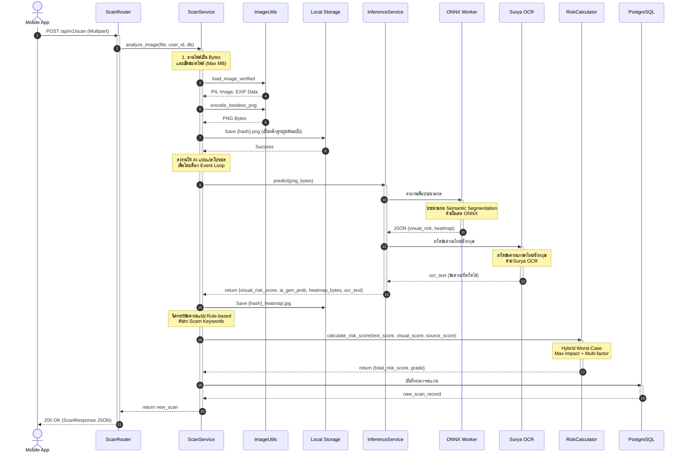

# C4: Code Diagram (Image Scanning Flow)

แผนภาพ C4 นี้แสดงลำดับขั้นตอนการทำงานของกระบวนการวิเคราะห์รูปภาพ (Image Scanning) ภายใน Backend ของระบบ Scam Image Detection ซึ่งครอบคลุมตั้งแต่การรับ Request จากผู้ใช้ ไปจนถึงการจัดเก็บผลลัพธ์ลงฐานข้อมูล

---

## คำอธิบายการทำงาน (Details)

แผนภาพนี้แสดงการทำงานของฟังก์ชันหลัก `analyze_image` ภายใน ScanService ซึ่งแสดงให้เห็นถึงการทำงานแบบ Non-blocking และวิธีการที่ Backend สื่อสารกับ AI

### 1. API Layer (ScanRouter)
**หน้าที่:** ตรวจสอบสิทธิ์ผู้ใช้งาน และรับไฟล์รูปแบบ Multipart Form Data จากนั้นส่งต่อให้ Service ประมวลผล

### 2. Business Logic Layer (ScanService)
**หน้าที่:** 
    1.  ตรวจสอบความปลอดภัยของไฟล์ (ขนาดไฟล์ และการแปลงเป็นภาพ Lossless PNG ป้องกันมัลแวร์แฝง)
    2.  สร้าง Hash จากไฟล์ต้นฉบับเพื่อใช้ตั้งชื่อไฟล์ (Deduplication)
    3.  เรียกงานประมวลผลหนัก (AI และ Image Processing) ใน worker แยก เพื่อไม่ให้ Event Loop ของ API ถูกบล็อก
    4.  วิเคราะห์คำหลอกลวงเบื้องต้นจากผลลัพธ์ OCR ด้วย scam keywords
    5.  บันทึกผลสู่ฐานข้อมูล

### 3. AI Integration Layer (InferenceService)
**หน้าที่:** ทำงานประสาน AI โมเดลทั้ง 2 ตัว
    *   **ONNX Worker (SegFormer):** รันในโปรเซสแยกต่างหาก (AI Workload Isolation) เพื่อแยกการจัดการทรัพยากรและหน่วยความจำของฝั่ง AI ออกจาก Web Server หลัก
    *   **Surya OCR:** โมเดลจะถูกเตรียมพร้อมไว้ในหน่วยความจำหลักตั้งแต่ระบบเริ่มทำงาน เพื่อให้สามารถประมวลผลข้อความจากรูปภาพได้ทันทีโดยไม่ต้องเสียเวลาโหลดโมเดลใหม่ ช่วยลดความหน่วง (Latency) ในการตอบสนอง 

### 4. Utility & Calculation
*   **โมดูล:** RiskCalculator
*   **หน้าที่:** รับค่าตัวเลขคะแนนดิบเข้าไปคำนวณตามสูตร Hybrid max+bonus และส่งค่าความเสี่ยงรวม (Total Risk) กลับมา
