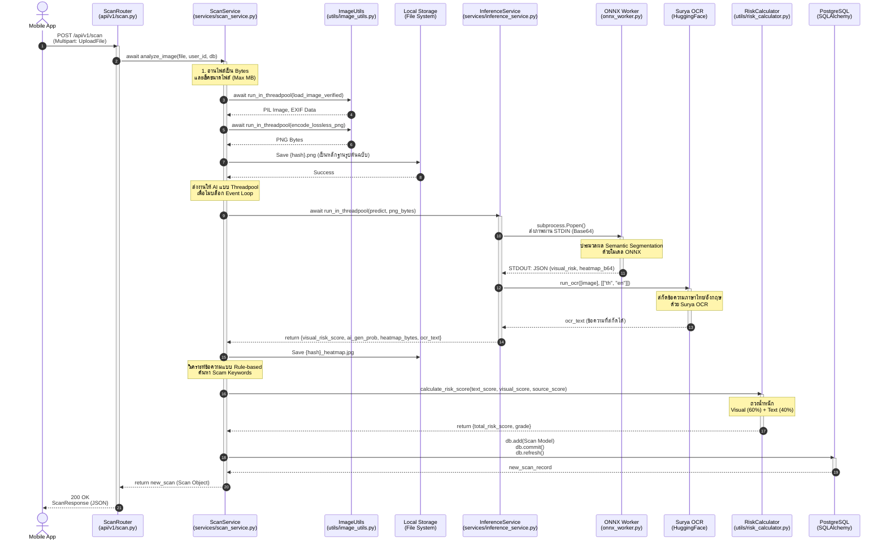

# C4: Code Diagram (Image Scanning Flow)

แผนภาพ C4 (ระดับ Code) นี้แสดงลำดับขั้นตอน (Sequence Diagram) การทำงานเชิงลึกของกระบวนการวิเคราะห์รูปภาพ (Image Scanning) ภายใน Backend ของระบบ Scam Image Detection ซึ่งครอบคลุมตั้งแต่การรับ Request จากผู้ใช้ ไปจนถึงการจัดเก็บผลลัพธ์ลงฐานข้อมูล โดยอ้างอิงจากคลาสและฟังก์ชันจริงในซอร์สโค้ด

---

## คำอธิบายคลาสและฟังก์ชันที่เกี่ยวข้อง (Code-Level Details)

แผนภาพนี้เจาะลึกการทำงานของฟังก์ชันหลัก `analyze_image()` ภายใน `ScanService` ซึ่งแสดงให้เห็นถึงการทำงานแบบ Non-blocking (Asynchronous) และวิธีการที่ Backend สื่อสารกับ AI

### 1. API Layer (`ScanRouter`)
*   **ฟังก์ชัน:** `create_scan(file: UploadFile, db: AsyncSession, current_user: User)`
*   **หน้าที่:** ตรวจสอบสิทธิ์ผู้ใช้งาน (`Depends(get_current_user)`) และรับไฟล์รูปแบบ Multipart Form Data จากนั้นส่งต่อให้ Service ประมวลผล

### 2. Business Logic Layer (`ScanService`)
*   **ฟังก์ชัน:** `analyze_image(file: UploadFile, user_id: int, db: AsyncSession)`
*   **หน้าที่:** 
    1.  ตรวจสอบความปลอดภัยของไฟล์ (ขนาดไฟล์ และการแปลงเป็นภาพ Lossless PNG ป้องกันมัลแวร์แฝง)
    2.  สร้าง Hash จากไฟล์ต้นฉบับเพื่อใช้ตั้งชื่อไฟล์ (Deduplication)
    3.  ครอบการเรียกฟังก์ชันประมวลผลหนักๆ เช่น AI และ Image Processing ด้วย `run_in_threadpool()` เพื่อไม่ให้ Event Loop ของ FastAPI ถูกบล็อก (Block)
    4.  วิเคราะห์คำหลอกลวงเบื้องต้นจากผลลัพธ์ OCR ด้วย `scam_keywords`
    5.  บันทึกออบเจกต์ (Model) สู่ฐานข้อมูลผ่าน `db.commit()`

### 3. AI Integration Layer (`InferenceService`)
*   **ฟังก์ชัน:** `predict(image_bytes: bytes)`
*   **หน้าที่:** ทำงานประสาน AI โมเดลทั้ง 2 ตัว
    *   **ONNX Worker (SegFormer):** ออกแบบให้รันสคริปต์ `onnx_worker.py` ใน **Subprocess** แยกต่างหาก (AI Workload Isolation) โดยส่งรูปผ่าน Pipe (STDIN) รูปแบบ Base64 และรับผลลัพธ์กลับมาทาง STDOUT เพื่อแยกการจัดการทรัพยากรและหน่วยความจำของฝั่ง AI ออกจาก Web Server หลักอย่างเด็ดขาด
    *   **Surya OCR:** โมเดลจะถูกเตรียมพร้อมไว้ในหน่วยความจำหลัก (RAM-resident) ตั้งแต่ระบบเริ่มทำงาน เพื่อให้สามารถประมวลผลข้อความจากรูปภาพได้ทันทีโดยไม่ต้องเสียเวลาโหลดโมเดลใหม่ ช่วยลดความหน่วง (Latency) ในการตอบสนอง 

### 4. Utility & Calculation
*   **คลาส/โมดูล:** `RiskCalculator`
*   **ฟังก์ชัน:** `calculate_risk_score(text, visual, source)`
*   **หน้าที่:** เป็นเพียวฟังก์ชัน (Pure Function) ที่รับค่าตัวเลขคะแนนดิบเข้าไปคำนวณตามสูตรน้ำหนักคณิตศาสตร์ และส่งค่าความเสี่ยงรวม (Total Risk) กลับมา
