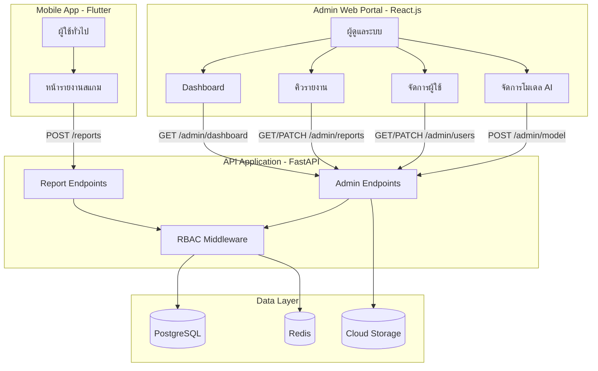
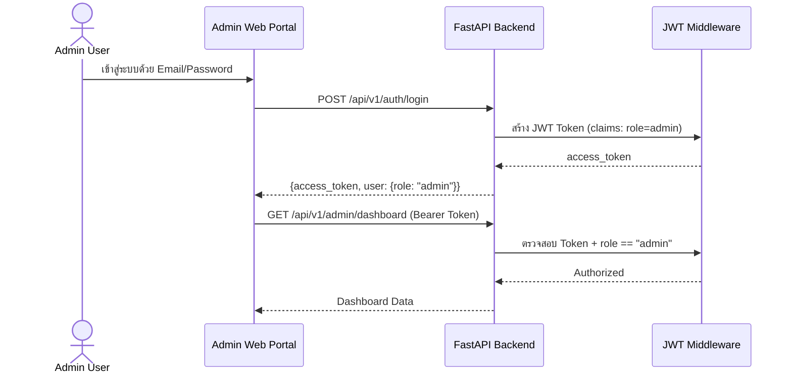
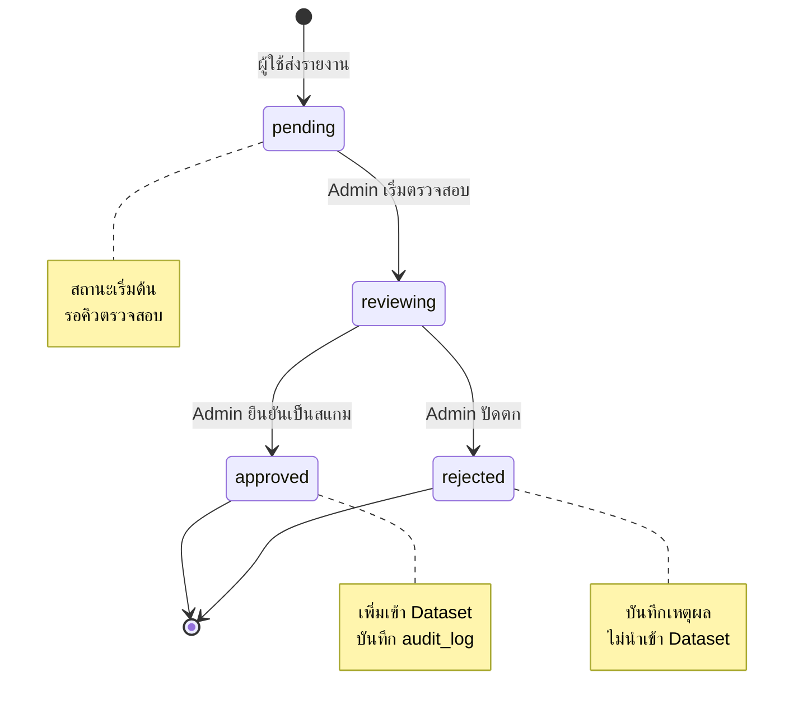
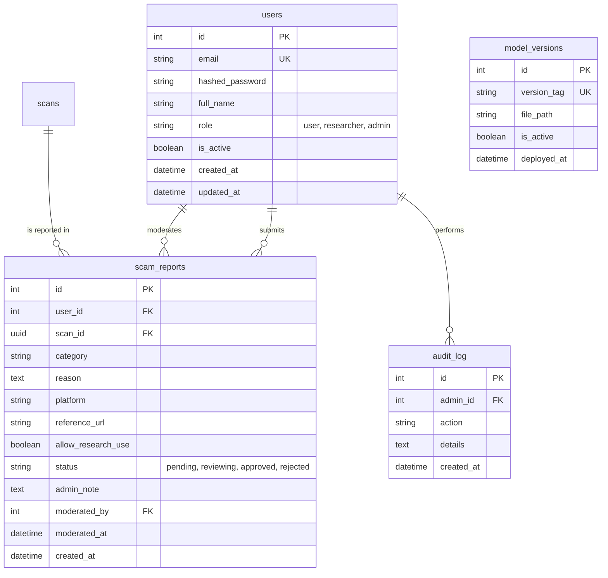

# การออกแบบระบบรายงานสแกมและหน้าผู้ดูแลระบบ (Report & Admin System Design)
## โครงงาน: แอปตรวจสอบรูปภาพตัดต่อที่ถูกนำมาหลอกลวง (Scam Image Detection)

เอกสารฉบับนี้อธิบายรายละเอียดการออกแบบระบบรายงานสแกม (Scam Reporting) และระบบผู้ดูแล (Admin Portal) สำหรับโครงการ Scam Image Detection ครอบคลุมทั้งฝั่ง Mobile App (ผู้ใช้ทั่วไปรายงานสแกม) และฝั่ง Admin Web Portal (ผู้ดูแลระบบตรวจสอบรายงาน จัดการผู้ใช้ อัปเดตโมเดล AI และดูสถิติภาพรวม)

---

## 1. ภาพรวมระบบ (System Overview)

ระบบ Report & Admin ทำหน้าที่เป็นสะพานเชื่อมระหว่างผู้ใช้ทั่วไปที่พบภาพหลอกลวงกับทีมผู้ดูแลระบบที่ต้องการ:

1. รับรายงานภาพต้องสงสัยจากผู้ใช้ (Crowdsourced Scam Reporting)
2. ตรวจสอบและอนุมัติหรือปัดตกรายงาน (Report Moderation)
3. นำภาพที่ยืนยันแล้วไปสร้าง Dataset สำหรับปรับปรุงโมเดล AI
4. อัปเดตน้ำหนักโมเดล AI เวอร์ชันใหม่ (Model Deployment)
5. จัดการบัญชีผู้ใช้งาน (User Management)
6. ดูสถิติภาพรวมการทำงานของระบบ (Dashboard Analytics)



---

## 2. บทบาทและสิทธิ์การเข้าถึง (Roles & Permissions)

ระบบแบ่งสิทธิ์ผู้ใช้ตาม Role-Based Access Control (RBAC) ผ่าน JWT Claims โดยมี 3 ระดับ:

| บทบาท | คำอธิบาย | สิทธิ์การเข้าถึง |
|:---|:---|:---|
| `user` | ผู้ใช้งานทั่วไป | สแกนภาพ, ดูประวัติตนเอง, ส่งรายงานสแกม, จัดการ Consent |
| `researcher` | นักวิจัย/ทีมพัฒนา | สิทธิ์ `user` ทั้งหมด + เข้าถึง Anonymized Dataset สำหรับพัฒนาโมเดล AI |
| `admin` | ผู้ดูแลระบบ | สิทธิ์ทั้งหมด + Dashboard, ตรวจสอบรายงานสแกม, จัดการผู้ใช้, อัปเดตโมเดล AI, Export Dataset |

### 2.1 การตรวจสอบสิทธิ์ (Authorization Flow)



ทุก Admin Endpoint ใช้ FastAPI Dependency Injection เพื่อบังคับตรวจสอบ:

```python
# app/api/deps.py
async def get_current_admin(current_user: User = Depends(get_current_user)) -> User:
    """ตรวจสอบว่าผู้ใช้ปัจจุบันเป็น Admin"""
    if current_user.role != "admin":
        raise HTTPException(status_code=403, detail="Admin access required")
    return current_user
```

---

## 3. ระบบรายงานสแกม (Scam Reporting System)

### 3.1 การรายงานจากผู้ใช้ (User-side Reporting)

ผู้ใช้สามารถรายงานภาพต้องสงสัยได้จากหน้า Analysis Result Screen หลังการสแกนเสร็จสิ้น โดยกรอกข้อมูลเพิ่มเติมดังนี้:

**ข้อมูลที่ส่ง:**

| ฟิลด์ | ชนิด | บังคับ | คำอธิบาย |
|:---|:---|:---:|:---|
| `scan_id` | UUID | ใช่ | รหัสการสแกนที่ต้องการรายงาน |
| `category` | string | ใช่ | ประเภทเหตุการณ์หลอกลวง |
| `description` | string | ใช่ | รายละเอียดเพิ่มเติมจากผู้ใช้ (ขั้นต่ำ 10 ตัวอักษร) |
| `platform` | string | ไม่ | แพลตฟอร์มที่พบ เช่น Facebook, LINE, Instagram |
| `reference_url` | string | ไม่ | ลิงก์อ้างอิงไปยังโพสต์หรือบัญชีที่พบ |
| `allow_research_use` | boolean | ใช่ | ยินยอมให้ใช้ข้อมูลเพื่อปรับปรุงระบบ |

**ประเภทเหตุการณ์ (Report Categories):**

| รหัส | ชื่อ (TH) | ชื่อ (EN) |
|:---|:---|:---|
| `romance_scam` | หลอกลวงความรัก | Romance Scam |
| `online_shopping` | ซื้อขายออนไลน์ | Online Shopping Fraud |
| `fake_slip` | สลิปปลอม | Fake Transfer Slip |
| `investment` | ลงทุนหรือผลตอบแทนสูง | Investment / Ponzi Scheme |
| `identity_theft` | ปลอมแปลงตัวตน | Identity Theft |
| `ai_deepfake` | ภาพ AI หรือ Deepfake | AI-generated / Deepfake |
| `other` | อื่น ๆ | Other |

### 3.2 วงจรชีวิตรายงาน (Report Lifecycle)



### 3.3 ตารางฐานข้อมูล scam_reports (เดิมที่มีอยู่)

```sql
CREATE TABLE scam_reports (
    id SERIAL PRIMARY KEY,
    user_id INTEGER REFERENCES users(id) ON DELETE SET NULL,
    scan_id UUID REFERENCES scans(id) ON DELETE SET NULL,
    category VARCHAR(50) NOT NULL DEFAULT 'other',
    reason TEXT NOT NULL,
    platform VARCHAR(50),
    reference_url VARCHAR(512),
    allow_research_use BOOLEAN NOT NULL DEFAULT FALSE,
    status VARCHAR(20) NOT NULL DEFAULT 'pending',  -- pending, reviewing, approved, rejected
    admin_note TEXT,
    moderated_by INTEGER REFERENCES users(id),
    moderated_at TIMESTAMP WITH TIME ZONE,
    created_at TIMESTAMP WITH TIME ZONE DEFAULT CURRENT_TIMESTAMP
);
CREATE INDEX idx_scam_reports_status ON scam_reports(status);
CREATE INDEX idx_scam_reports_created ON scam_reports(created_at DESC);
```

**หมายเหตุ:** ฟิลด์ที่เพิ่มใหม่เมื่อเทียบกับ Schema เดิมใน `server.md`:
- `category` -- ประเภทเหตุการณ์หลอกลวง
- `platform` -- แพลตฟอร์มที่พบ
- `reference_url` -- ลิงก์อ้างอิง
- `allow_research_use` -- ยินยอมให้ใช้ข้อมูลเพื่อวิจัย
- `admin_note` -- บันทึกเหตุผลจาก Admin เมื่ออนุมัติหรือปัดตก

---

## 4. Report API Endpoints (สำหรับผู้ใช้ทั่วไป)

### 4.1 POST /api/v1/reports -- ส่งรายงานสแกม

สร้างรายงานสแกมใหม่จากผลการสแกนที่มีอยู่ ผู้ใช้ต้องเป็นเจ้าของ Scan นั้น

**Request Body (JSON):**

```json
{
  "scan_id": "8f8b8a5d-4f10-4cd9-bf7b-84a83e05ea01",
  "category": "fake_slip",
  "description": "ได้รับสลิปนี้จากผู้ขายสินค้าใน Facebook Marketplace แต่เมื่อตรวจสอบกับธนาคารพบว่าไม่มีรายการโอนจริง",
  "platform": "Facebook",
  "reference_url": "https://facebook.com/marketplace/item/123456",
  "allow_research_use": true
}
```

**Response (JSON - Status 201):**

```json
{
  "id": 42,
  "scan_id": "8f8b8a5d-4f10-4cd9-bf7b-84a83e05ea01",
  "category": "fake_slip",
  "status": "pending",
  "message": "รายงานถูกส่งเรียบร้อยแล้ว ทีมงานจะตรวจสอบโดยเร็วที่สุด",
  "created_at": "2026-08-06T10:30:00+07:00"
}
```

**Error Cases:**

| Status | กรณี |
|:---|:---|
| 400 | `description` สั้นเกินไป (น้อยกว่า 10 ตัวอักษร) |
| 400 | `category` ไม่อยู่ในรายการที่รองรับ |
| 404 | ไม่พบ `scan_id` ที่ระบุ |
| 403 | ผู้ใช้ไม่ใช่เจ้าของ Scan นั้น |
| 409 | เคยรายงาน Scan นี้ไปแล้ว (ป้องกันส่งซ้ำ) |

### 4.2 GET /api/v1/reports/categories -- ดึงรายการประเภทรายงาน

**Response (JSON - Status 200):**

```json
{
  "categories": [
    {"key": "romance_scam", "label_th": "หลอกลวงความรัก", "label_en": "Romance Scam"},
    {"key": "online_shopping", "label_th": "ซื้อขายออนไลน์", "label_en": "Online Shopping Fraud"},
    {"key": "fake_slip", "label_th": "สลิปปลอม", "label_en": "Fake Transfer Slip"},
    {"key": "investment", "label_th": "ลงทุนหรือผลตอบแทนสูง", "label_en": "Investment / Ponzi Scheme"},
    {"key": "identity_theft", "label_th": "ปลอมแปลงตัวตน", "label_en": "Identity Theft"},
    {"key": "ai_deepfake", "label_th": "ภาพ AI หรือ Deepfake", "label_en": "AI-generated / Deepfake"},
    {"key": "other", "label_th": "อื่น ๆ", "label_en": "Other"}
  ]
}
```

### 4.3 GET /api/v1/reports/my -- ดูรายงานที่ตนเองเคยส่ง

**Query Parameters:**

| พารามิเตอร์ | ชนิด | ค่าเริ่มต้น | คำอธิบาย |
|:---|:---|:---|:---|
| `page` | int | 1 | หน้าที่ต้องการ |
| `limit` | int | 20 | จำนวนรายการต่อหน้า (สูงสุด 50) |
| `status` | string | - | กรองตามสถานะ: `pending`, `reviewing`, `approved`, `rejected` |

**Response (JSON - Status 200):**

```json
{
  "items": [
    {
      "id": 42,
      "scan_id": "8f8b8a5d-4f10-4cd9-bf7b-84a83e05ea01",
      "category": "fake_slip",
      "description": "ได้รับสลิปนี้จากผู้ขายสินค้า...",
      "status": "approved",
      "created_at": "2026-08-06T10:30:00+07:00"
    }
  ],
  "total": 5,
  "page": 1,
  "limit": 20
}
```

---

## 5. Admin API Endpoints (สำหรับผู้ดูแลระบบ)

ทุก Endpoint ในหมวดนี้ต้องมี Bearer Token ที่มี `role = "admin"` ในทุกคำขอ หากไม่ใช่ Admin จะได้ HTTP 403

### 5.1 Dashboard -- สถิติภาพรวมระบบ

#### GET /api/v1/admin/dashboard

ดึงข้อมูลสถิติภาพรวมของระบบทั้งหมด

**Response (JSON - Status 200):**

```json
{
  "overview": {
    "total_users": 1250,
    "active_users_today": 87,
    "total_scans": 8432,
    "scans_today": 156,
    "scans_this_week": 892,
    "scans_this_month": 3210
  },
  "risk_distribution": {
    "low": 4521,
    "medium": 2834,
    "high": 1077
  },
  "reports": {
    "total": 342,
    "pending": 28,
    "reviewing": 5,
    "approved": 267,
    "rejected": 42
  },
  "category_breakdown": {
    "fake_slip": 98,
    "online_shopping": 76,
    "romance_scam": 45,
    "investment": 32,
    "identity_theft": 18,
    "ai_deepfake": 12,
    "other": 61
  },
  "model": {
    "active_version": "v2.1.0",
    "deployed_at": "2026-08-01T09:00:00+07:00",
    "total_versions": 5
  },
  "scan_trend": [
    {"date": "2026-08-01", "count": 145},
    {"date": "2026-08-02", "count": 132},
    {"date": "2026-08-03", "count": 178},
    {"date": "2026-08-04", "count": 156},
    {"date": "2026-08-05", "count": 189},
    {"date": "2026-08-06", "count": 92}
  ]
}
```

**ข้อมูลสถิติที่แสดงบน Dashboard:**

| กลุ่ม | ข้อมูล |
|:---|:---|
| ภาพรวมผู้ใช้ | จำนวนผู้ใช้ทั้งหมด, ผู้ใช้ที่ Active วันนี้ |
| ภาพรวมการสแกน | จำนวนสแกนทั้งหมด, วันนี้, สัปดาห์นี้, เดือนนี้ |
| การกระจายความเสี่ยง | จำนวนผลสแกนแยกตามระดับ Low / Medium / High |
| ภาพรวมรายงาน | จำนวนรายงานทั้งหมดและแยกตามสถานะ |
| หมวดหมู่รายงาน | จำนวนรายงานแยกตามประเภทเหตุการณ์ |
| สถานะโมเดล AI | เวอร์ชันปัจจุบัน, วันที่ Deploy, จำนวนเวอร์ชันทั้งหมด |
| แนวโน้มการสแกน | จำนวนสแกนรายวัน 7 วันย้อนหลัง (สำหรับ Chart) |

---

### 5.2 การจัดการรายงานสแกม (Report Moderation)

#### GET /api/v1/admin/reports -- ดูรายการรายงานทั้งหมด

**Query Parameters:**

| พารามิเตอร์ | ชนิด | ค่าเริ่มต้น | คำอธิบาย |
|:---|:---|:---|:---|
| `page` | int | 1 | หน้าที่ต้องการ |
| `limit` | int | 20 | จำนวนรายการต่อหน้า (สูงสุด 100) |
| `status` | string | - | กรองตามสถานะ: `pending`, `reviewing`, `approved`, `rejected` |
| `category` | string | - | กรองตามประเภทเหตุการณ์ |
| `from_date` | string | - | กรองรายงานตั้งแต่วันที่ (ISO 8601) |
| `to_date` | string | - | กรองรายงานถึงวันที่ (ISO 8601) |
| `sort_by` | string | `created_at` | เรียงตาม: `created_at`, `status` |
| `sort_order` | string | `desc` | ลำดับ: `asc`, `desc` |

**Response (JSON - Status 200):**

```json
{
  "items": [
    {
      "id": 42,
      "user": {
        "id": 101,
        "email": "reporter@example.com",
        "full_name": "สมชาย ใจดี"
      },
      "scan": {
        "id": "8f8b8a5d-4f10-4cd9-bf7b-84a83e05ea01",
        "thumbnail_url": "https://storage.local/thumb/8f8b8a5d.jpg?token=...",
        "total_risk_score": 82,
        "risk_grade": "high"
      },
      "category": "fake_slip",
      "description": "ได้รับสลิปนี้จากผู้ขายสินค้าใน Facebook Marketplace...",
      "platform": "Facebook",
      "reference_url": "https://facebook.com/marketplace/item/123456",
      "allow_research_use": true,
      "status": "pending",
      "admin_note": null,
      "moderated_by": null,
      "moderated_at": null,
      "created_at": "2026-08-06T10:30:00+07:00"
    }
  ],
  "total": 28,
  "page": 1,
  "limit": 20
}
```

#### GET /api/v1/admin/reports/{report_id} -- ดูรายละเอียดรายงานเดี่ยว

ดึงข้อมูลรายงานรวมถึงผลสแกนฉบับเต็ม (ข้อมูล OCR, Heatmap, EXIF, Scam Keywords)

**Response (JSON - Status 200):**

```json
{
  "id": 42,
  "user": {
    "id": 101,
    "email": "reporter@example.com",
    "full_name": "สมชาย ใจดี",
    "total_reports_submitted": 3
  },
  "scan": {
    "id": "8f8b8a5d-4f10-4cd9-bf7b-84a83e05ea01",
    "raw_image_url": "https://storage.local/raw/8f8b8a5d.jpg?token=...",
    "heatmap_image_url": "https://storage.local/heatmap/8f8b8a5d_heatmap.jpg?token=...",
    "text_score": 80,
    "visual_score": 90,
    "source_score": 50,
    "total_risk_score": 82,
    "risk_grade": "high",
    "ocr_text": "ยินดีด้วยคุณได้รับรางวัล 10,000 บาท กรุณาโอนค่าธรรมเนียม",
    "scam_keywords_found": ["ได้รับรางวัล", "กรุณาโอน"],
    "exif_data": {
      "software": "Adobe Photoshop 2024",
      "camera_model": "Unknown"
    },
    "ai_gen_probability": 0.05,
    "created_at": "2026-08-06T10:25:00+07:00"
  },
  "category": "fake_slip",
  "description": "ได้รับสลิปนี้จากผู้ขายสินค้าใน Facebook Marketplace แต่เมื่อตรวจสอบกับธนาคารพบว่าไม่มีรายการโอนจริง",
  "platform": "Facebook",
  "reference_url": "https://facebook.com/marketplace/item/123456",
  "allow_research_use": true,
  "status": "pending",
  "admin_note": null,
  "moderated_by": null,
  "moderated_at": null,
  "created_at": "2026-08-06T10:30:00+07:00"
}
```

#### PATCH /api/v1/admin/reports/{report_id} -- อนุมัติหรือปัดตกรายงาน

Admin ตรวจสอบรายงานแล้วตัดสินใจอนุมัติ (approved) หรือปัดตก (rejected) พร้อมบันทึกเหตุผล

**Request Body (JSON):**

```json
{
  "status": "approved",
  "admin_note": "ตรวจสอบแล้วพบว่าเป็นสลิปปลอมจริง ข้อมูลตรงกับรายงานของผู้เสียหายรายอื่น"
}
```

**Validation:**
- `status` ต้องเป็น `approved` หรือ `rejected` เท่านั้น
- `admin_note` บังคับกรอกเมื่อ `status` เป็น `rejected` (เพื่ออธิบายเหตุผล)
- `admin_note` แนะนำให้กรอกเมื่อ `status` เป็น `approved` (เพื่อบันทึกข้อสังเกต)

**Response (JSON - Status 200):**

```json
{
  "id": 42,
  "status": "approved",
  "admin_note": "ตรวจสอบแล้วพบว่าเป็นสลิปปลอมจริง ข้อมูลตรงกับรายงานของผู้เสียหายรายอื่น",
  "moderated_by": 1,
  "moderated_at": "2026-08-06T14:00:00+07:00",
  "message": "อัปเดตสถานะรายงานเรียบร้อยแล้ว"
}
```

**Side Effects เมื่ออนุมัติ:**
1. บันทึก `moderated_by` = Admin ID ปัจจุบัน
2. บันทึก `moderated_at` = เวลาปัจจุบัน
3. เขียน Audit Log: `action = "report_approved"`, `details = "Report #42 approved: สลิปปลอม"`
4. หากรายงานมี `allow_research_use = true` ระบบทำเครื่องหมายภาพนี้พร้อมนำเข้า Dataset

**Side Effects เมื่อปัดตก:**
1. บันทึก `moderated_by`, `moderated_at` เช่นเดียวกัน
2. เขียน Audit Log: `action = "report_rejected"`, `details = "Report #42 rejected: [เหตุผล]"`

---

### 5.3 การจัดการผู้ใช้งาน (User Management)

#### GET /api/v1/admin/users -- ดูรายชื่อผู้ใช้ทั้งหมด

**Query Parameters:**

| พารามิเตอร์ | ชนิด | ค่าเริ่มต้น | คำอธิบาย |
|:---|:---|:---|:---|
| `page` | int | 1 | หน้าที่ต้องการ |
| `limit` | int | 20 | จำนวนรายการต่อหน้า (สูงสุด 100) |
| `role` | string | - | กรองตามบทบาท: `user`, `researcher`, `admin` |
| `is_active` | boolean | - | กรองตามสถานะ: `true` = Active, `false` = Banned |
| `search` | string | - | ค้นหาตาม email หรือ full_name |
| `sort_by` | string | `created_at` | เรียงตาม: `created_at`, `email`, `role` |
| `sort_order` | string | `desc` | ลำดับ: `asc`, `desc` |

**Response (JSON - Status 200):**

```json
{
  "items": [
    {
      "id": 101,
      "email": "user@example.com",
      "full_name": "สมชาย ใจดี",
      "role": "user",
      "is_active": true,
      "total_scans": 15,
      "total_reports": 3,
      "created_at": "2026-06-15T08:00:00+07:00",
      "updated_at": "2026-08-06T10:00:00+07:00"
    }
  ],
  "total": 1250,
  "page": 1,
  "limit": 20
}
```

#### GET /api/v1/admin/users/{user_id} -- ดูรายละเอียดผู้ใช้

**Response (JSON - Status 200):**

```json
{
  "id": 101,
  "email": "user@example.com",
  "full_name": "สมชาย ใจดี",
  "role": "user",
  "is_active": true,
  "created_at": "2026-06-15T08:00:00+07:00",
  "updated_at": "2026-08-06T10:00:00+07:00",
  "stats": {
    "total_scans": 15,
    "scans_this_month": 8,
    "total_reports_submitted": 3,
    "reports_approved": 2,
    "reports_rejected": 0,
    "reports_pending": 1
  },
  "recent_scans": [
    {
      "id": "8f8b8a5d-4f10-4cd9-bf7b-84a83e05ea01",
      "total_risk_score": 82,
      "risk_grade": "high",
      "status": "completed",
      "created_at": "2026-08-06T10:25:00+07:00"
    }
  ]
}
```

#### PATCH /api/v1/admin/users/{user_id} -- แก้ไขข้อมูลผู้ใช้

ใช้สำหรับเปลี่ยน Role หรือ Ban/Unban ผู้ใช้

**Request Body (JSON):**

```json
{
  "role": "researcher",
  "is_active": true
}
```

**Validation:**
- `role` ต้องเป็น `user`, `researcher`, หรือ `admin`
- Admin ไม่สามารถ Ban ตัวเอง
- Admin ไม่สามารถลดระดับ Admin คนสุดท้ายในระบบ
- ทุกการเปลี่ยนแปลงจะบันทึกลง `audit_log`

**Response (JSON - Status 200):**

```json
{
  "id": 101,
  "email": "user@example.com",
  "role": "researcher",
  "is_active": true,
  "message": "อัปเดตข้อมูลผู้ใช้เรียบร้อยแล้ว"
}
```

**Side Effects:**
1. เขียน Audit Log: `action = "user_role_changed"`, `details = "User #101 role changed from user to researcher"`
2. หาก `is_active` เปลี่ยนเป็น `false`: เขียน Audit Log: `action = "user_banned"`, `details = "User #101 banned"`
3. หาก `is_active` เปลี่ยนเป็น `true`: เขียน Audit Log: `action = "user_unbanned"`, `details = "User #101 unbanned"`

---

### 5.4 การจัดการโมเดล AI (Model Management)

#### GET /api/v1/admin/models -- ดูรายการเวอร์ชันโมเดลทั้งหมด

**Response (JSON - Status 200):**

```json
{
  "items": [
    {
      "id": 5,
      "version_tag": "v2.1.0",
      "file_path": "/models/segformer_v2.1.0.onnx",
      "is_active": true,
      "deployed_at": "2026-08-01T09:00:00+07:00"
    },
    {
      "id": 4,
      "version_tag": "v2.0.0",
      "file_path": "/models/segformer_v2.0.0.onnx",
      "is_active": false,
      "deployed_at": "2026-07-15T09:00:00+07:00"
    }
  ],
  "total": 5
}
```

#### POST /api/v1/admin/models -- อัปโหลดโมเดลใหม่

อัปโหลดไฟล์น้ำหนักโมเดล AI ในรูปแบบ ONNX

**Request (Multipart/Form-Data):**

| ฟิลด์ | ชนิด | บังคับ | คำอธิบาย |
|:---|:---|:---:|:---|
| `file` | Binary | ใช่ | ไฟล์ .onnx |
| `version_tag` | string | ใช่ | ชื่อเวอร์ชัน เช่น `v2.2.0` |
| `auto_deploy` | boolean | ไม่ | หาก `true` จะ Deploy ทันทีหลังอัปโหลดสำเร็จ (ค่าเริ่มต้น: `false`) |

**Response (JSON - Status 201):**

```json
{
  "id": 6,
  "version_tag": "v2.2.0",
  "file_path": "/models/segformer_v2.2.0.onnx",
  "is_active": false,
  "deployed_at": "2026-08-06T15:00:00+07:00",
  "message": "อัปโหลดโมเดลสำเร็จ"
}
```

**Validation:**
- ไฟล์ต้องมีนามสกุล `.onnx`
- `version_tag` ต้องไม่ซ้ำกับเวอร์ชันที่มีอยู่แล้ว
- ขนาดไฟล์สูงสุด 500 MB

**Side Effects:**
1. บันทึกไฟล์ลง Cloud Storage ที่ path `models/{version_tag}.onnx`
2. สร้างแถวใหม่ในตาราง `model_versions`
3. เขียน Audit Log: `action = "model_uploaded"`, `details = "Model v2.2.0 uploaded"`
4. หาก `auto_deploy = true` จะทำ Deploy ทันที (ดูหัวข้อถัดไป)

#### POST /api/v1/admin/models/{model_id}/deploy -- สั่ง Deploy โมเดล

เปลี่ยนโมเดลที่ใช้งานอยู่ (Active) ไปเป็นเวอร์ชันที่ระบุ

**Response (JSON - Status 200):**

```json
{
  "id": 6,
  "version_tag": "v2.2.0",
  "is_active": true,
  "deployed_at": "2026-08-06T15:05:00+07:00",
  "message": "Deploy โมเดลเวอร์ชัน v2.2.0 สำเร็จ"
}
```

**Side Effects:**
1. ตั้งค่า `is_active = false` ให้โมเดลเวอร์ชันเดิมที่เคย Active
2. ตั้งค่า `is_active = true` ให้โมเดลเวอร์ชันใหม่
3. ล้าง Redis Cache ทั้งหมด (`scan:hash:*`) เพื่อให้ผลสแกนใหม่ใช้โมเดลเวอร์ชันล่าสุด
4. แจ้ง AI Inference Service ให้โหลดน้ำหนักโมเดลใหม่ (Hot-reload หรือ Restart)
5. เขียน Audit Log: `action = "model_deployed"`, `details = "Model v2.2.0 deployed, replacing v2.1.0"`

---

### 5.5 การ Export Dataset (สำหรับฝึกโมเดลใหม่)

#### POST /api/v1/admin/dataset/export -- สร้างชุดข้อมูลสำหรับฝึกโมเดล

Export ภาพจากรายงานที่ได้รับการอนุมัติแล้ว (`status = approved`) และผู้ใช้ยินยอมให้ใช้เพื่อการวิจัย (`allow_research_use = true`)

**Request Body (JSON):**

```json
{
  "categories": ["fake_slip", "online_shopping"],
  "from_date": "2026-01-01",
  "to_date": "2026-08-06",
  "include_metadata": true,
  "format": "zip"
}
```

| ฟิลด์ | ชนิด | บังคับ | คำอธิบาย |
|:---|:---|:---:|:---|
| `categories` | array | ไม่ | กรองเฉพาะหมวดหมู่ที่ต้องการ (หากไม่ระบุ = ทุกหมวดหมู่) |
| `from_date` | string | ไม่ | กรองตั้งแต่วันที่ |
| `to_date` | string | ไม่ | กรองถึงวันที่ |
| `include_metadata` | boolean | ไม่ | รวมไฟล์ metadata.json ที่มี label, category, risk_score |
| `format` | string | ไม่ | รูปแบบไฟล์ส่งออก: `zip` (ค่าเริ่มต้น) |

**Response (JSON - Status 202 Accepted):**

```json
{
  "export_id": "exp_20260806_001",
  "status": "running",
  "total_images": 267,
  "estimated_size_mb": 1340,
  "message": "กำลังเตรียมไฟล์ Dataset จะแจ้งเตือนเมื่อพร้อมดาวน์โหลด"
}
```

**โครงสร้างไฟล์ที่ Export:**

```
dataset_20260806.zip
├── images/
│   ├── fake_slip/
│   │   ├── 8f8b8a5d.jpg
│   │   └── ...
│   └── online_shopping/
│       ├── a1b2c3d4.jpg
│       └── ...
├── metadata.json
└── README.md
```

**metadata.json:**

```json
[
  {
    "filename": "fake_slip/8f8b8a5d.jpg",
    "category": "fake_slip",
    "risk_score": 82,
    "report_id": 42,
    "reported_at": "2026-08-06T10:30:00+07:00",
    "approved_at": "2026-08-06T14:00:00+07:00"
  }
]
```

**Side Effects:**
1. เขียน Audit Log: `action = "dataset_exported"`, `details = "267 images exported (fake_slip, online_shopping)"`
2. ข้อมูลส่วนบุคคลของผู้รายงาน (email, full_name) จะถูกลบออกจาก Dataset (Anonymization) ตามหลัก PDPA

#### GET /api/v1/admin/dataset/export/{export_id} -- ตรวจสอบสถานะ Export

**Response (JSON - Status 200):**

```json
{
  "export_id": "exp_20260806_001",
  "status": "succeeded",
  "download_url": "https://storage.local/exports/dataset_20260806.zip?token=...",
  "expires_at": "2026-08-07T15:00:00+07:00",
  "total_images": 267,
  "file_size_mb": 1280
}
```

---

### 5.6 Audit Log -- บันทึกการกระทำของ Admin

#### GET /api/v1/admin/audit-logs -- ดูบันทึกการกระทำทั้งหมด

**Query Parameters:**

| พารามิเตอร์ | ชนิด | ค่าเริ่มต้น | คำอธิบาย |
|:---|:---|:---|:---|
| `page` | int | 1 | หน้าที่ต้องการ |
| `limit` | int | 50 | จำนวนรายการต่อหน้า (สูงสุด 200) |
| `admin_id` | int | - | กรองตาม Admin ที่กระทำ |
| `action` | string | - | กรองตามประเภท action |
| `from_date` | string | - | กรองตั้งแต่วันที่ |
| `to_date` | string | - | กรองถึงวันที่ |

**Response (JSON - Status 200):**

```json
{
  "items": [
    {
      "id": 156,
      "admin": {
        "id": 1,
        "email": "admin@scamguard.app",
        "full_name": "Admin"
      },
      "action": "report_approved",
      "details": "Report #42 approved: ตรวจสอบแล้วพบว่าเป็นสลิปปลอมจริง",
      "created_at": "2026-08-06T14:00:00+07:00"
    }
  ],
  "total": 156,
  "page": 1,
  "limit": 50
}
```

**ประเภท Action ที่บันทึก:**

| Action | คำอธิบาย |
|:---|:---|
| `report_approved` | อนุมัติรายงานสแกม |
| `report_rejected` | ปัดตกรายงานสแกม |
| `user_role_changed` | เปลี่ยนบทบาทผู้ใช้ |
| `user_banned` | ระงับบัญชีผู้ใช้ |
| `user_unbanned` | ปลดล็อกบัญชีผู้ใช้ |
| `model_uploaded` | อัปโหลดโมเดล AI เวอร์ชันใหม่ |
| `model_deployed` | สั่ง Deploy โมเดล AI |
| `dataset_exported` | Export Dataset สำหรับฝึกโมเดล |
| `cache_invalidated` | ล้าง Redis Cache ด้วยตนเอง |

---

## 6. ตารางฐานข้อมูลที่เกี่ยวข้อง

### 6.1 ตาราง audit_log (เดิมที่มีอยู่)

```sql
CREATE TABLE audit_log (
    id SERIAL PRIMARY KEY,
    admin_id INTEGER REFERENCES users(id) ON DELETE SET NULL,
    action VARCHAR(100) NOT NULL,
    details TEXT,
    created_at TIMESTAMP WITH TIME ZONE DEFAULT CURRENT_TIMESTAMP
);
CREATE INDEX idx_audit_log_admin ON audit_log(admin_id);
CREATE INDEX idx_audit_log_action ON audit_log(action);
CREATE INDEX idx_audit_log_created ON audit_log(created_at DESC);
```

### 6.2 ตาราง model_versions (เดิมที่มีอยู่)

```sql
CREATE TABLE model_versions (
    id SERIAL PRIMARY KEY,
    version_tag VARCHAR(50) NOT NULL UNIQUE,
    file_path VARCHAR(512) NOT NULL,
    is_active BOOLEAN NOT NULL DEFAULT FALSE,
    deployed_at TIMESTAMP WITH TIME ZONE DEFAULT CURRENT_TIMESTAMP
);
```

### 6.3 ER Diagram เฉพาะส่วน Report & Admin



---

## 7. โครงสร้างโฟลเดอร์ที่ต้องเพิ่ม (Server-side)

```
server/app/
├── api/v1/
│   ├── report.py           # Report Endpoints สำหรับผู้ใช้ทั่วไป (POST /reports, GET /reports/my)
│   └── admin.py            # Admin Endpoints ทั้งหมด (dashboard, reports, users, models, dataset, audit)
├── services/
│   ├── report_service.py   # Business Logic สำหรับสร้างและดึงรายงาน
│   └── admin_service.py    # Business Logic สำหรับ Dashboard, Moderation, User Mgmt, Model Mgmt
├── repositories/
│   ├── report_repo.py      # Data Access Layer สำหรับตาราง scam_reports
│   ├── audit_repo.py       # Data Access Layer สำหรับตาราง audit_log
│   └── model_repo.py       # Data Access Layer สำหรับตาราง model_versions
├── schemas/
│   ├── report.py           # Pydantic Schemas สำหรับ Report Request/Response
│   └── admin.py            # Pydantic Schemas สำหรับ Admin Request/Response
└── api/
    └── deps.py             # เพิ่ม get_current_admin dependency
```

---

## 8. Pydantic Schemas (Request/Response Models)

### 8.1 Report Schemas

```python
# app/schemas/report.py

from pydantic import BaseModel, Field
from typing import Optional
from uuid import UUID
from datetime import datetime
from enum import Enum

class ReportCategory(str, Enum):
    ROMANCE_SCAM = "romance_scam"
    ONLINE_SHOPPING = "online_shopping"
    FAKE_SLIP = "fake_slip"
    INVESTMENT = "investment"
    IDENTITY_THEFT = "identity_theft"
    AI_DEEPFAKE = "ai_deepfake"
    OTHER = "other"

class ReportCreate(BaseModel):
    scan_id: UUID
    category: ReportCategory
    description: str = Field(..., min_length=10, max_length=2000)
    platform: Optional[str] = Field(None, max_length=50)
    reference_url: Optional[str] = Field(None, max_length=512)
    allow_research_use: bool = False

class ReportResponse(BaseModel):
    id: int
    scan_id: UUID
    category: str
    status: str
    message: str
    created_at: datetime

class ReportListItem(BaseModel):
    id: int
    scan_id: UUID
    category: str
    description: str
    status: str
    created_at: datetime

class ReportListResponse(BaseModel):
    items: list[ReportListItem]
    total: int
    page: int
    limit: int
```

### 8.2 Admin Schemas

```python
# app/schemas/admin.py

from pydantic import BaseModel, Field
from typing import Optional
from uuid import UUID
from datetime import datetime
from enum import Enum

# --- Report Moderation ---
class ReportModerationStatus(str, Enum):
    APPROVED = "approved"
    REJECTED = "rejected"

class ReportModerateRequest(BaseModel):
    status: ReportModerationStatus
    admin_note: Optional[str] = Field(None, max_length=2000)

# --- User Management ---
class UserRole(str, Enum):
    USER = "user"
    RESEARCHER = "researcher"
    ADMIN = "admin"

class UserUpdateRequest(BaseModel):
    role: Optional[UserRole] = None
    is_active: Optional[bool] = None

# --- Model Management ---
class ModelDeployResponse(BaseModel):
    id: int
    version_tag: str
    is_active: bool
    deployed_at: datetime
    message: str

# --- Dashboard ---
class DashboardOverview(BaseModel):
    total_users: int
    active_users_today: int
    total_scans: int
    scans_today: int
    scans_this_week: int
    scans_this_month: int

class RiskDistribution(BaseModel):
    low: int
    medium: int
    high: int

class ReportStats(BaseModel):
    total: int
    pending: int
    reviewing: int
    approved: int
    rejected: int

class DashboardResponse(BaseModel):
    overview: DashboardOverview
    risk_distribution: RiskDistribution
    reports: ReportStats
    category_breakdown: dict[str, int]
    model: dict
    scan_trend: list[dict]

# --- Dataset Export ---
class DatasetExportRequest(BaseModel):
    categories: Optional[list[str]] = None
    from_date: Optional[str] = None
    to_date: Optional[str] = None
    include_metadata: bool = True
    format: str = "zip"

# --- Audit Log ---
class AuditLogItem(BaseModel):
    id: int
    admin: dict
    action: str
    details: Optional[str]
    created_at: datetime

class AuditLogResponse(BaseModel):
    items: list[AuditLogItem]
    total: int
    page: int
    limit: int
```

---

## 9. Business Logic สำคัญ

### 9.1 การป้องกันส่งรายงานซ้ำ (Duplicate Prevention)

```python
# ตรวจสอบว่าผู้ใช้เคยรายงาน scan_id นี้ไปแล้วหรือยัง
existing = await db.execute(
    select(ScamReport).where(
        ScamReport.user_id == current_user.id,
        ScamReport.scan_id == report.scan_id
    )
)
if existing.scalars().first():
    raise HTTPException(status_code=409, detail="คุณเคยรายงานการสแกนนี้ไปแล้ว")
```

### 9.2 การตรวจสอบความเป็นเจ้าของ Scan

```python
# ผู้ใช้ต้องเป็นเจ้าของ Scan ถึงจะรายงานได้
scan = await db.execute(select(Scan).where(Scan.id == report.scan_id))
scan_record = scan.scalars().first()
if not scan_record:
    raise HTTPException(status_code=404, detail="ไม่พบการสแกนที่ระบุ")
if scan_record.user_id != current_user.id:
    raise HTTPException(status_code=403, detail="คุณไม่มีสิทธิ์รายงานการสแกนนี้")
```

### 9.3 การเขียน Audit Log

```python
# app/services/admin_service.py

async def write_audit_log(
    db: AsyncSession,
    admin_id: int,
    action: str,
    details: str
):
    log = AuditLog(
        admin_id=admin_id,
        action=action,
        details=details
    )
    db.add(log)
    await db.commit()
```

### 9.4 การ Deploy โมเดลและล้าง Cache

```python
async def deploy_model(db: AsyncSession, model_id: int, admin_id: int):
    # 1. ปิด Active ของโมเดลเดิม
    await db.execute(
        update(ModelVersion).where(ModelVersion.is_active == True).values(is_active=False)
    )
    # 2. เปิด Active ของโมเดลใหม่
    model = await db.get(ModelVersion, model_id)
    model.is_active = True
    model.deployed_at = func.now()
    await db.commit()
    
    # 3. ล้าง Redis Cache
    await redis.delete_pattern("scan:hash:*")
    
    # 4. แจ้ง AI Inference Service ให้โหลดโมเดลใหม่
    await notify_ai_service_reload(model.file_path)
    
    # 5. บันทึก Audit Log
    await write_audit_log(db, admin_id, "model_deployed", f"Model {model.version_tag} deployed")
```

---

## 10. สรุป Endpoint ทั้งหมด

### Report Endpoints (ผู้ใช้ทั่วไป)

| Method | Path | คำอธิบาย | Auth |
|:---|:---|:---|:---:|
| `POST` | `/api/v1/reports` | ส่งรายงานสแกม | User |
| `GET` | `/api/v1/reports/categories` | ดึงรายการประเภทรายงาน | User |
| `GET` | `/api/v1/reports/my` | ดูรายงานที่ตนเองเคยส่ง | User |

### Admin Endpoints (ผู้ดูแลระบบ)

| Method | Path | คำอธิบาย | Auth |
|:---|:---|:---|:---:|
| `GET` | `/api/v1/admin/dashboard` | สถิติภาพรวมระบบ | Admin |
| `GET` | `/api/v1/admin/reports` | ดูรายงานทั้งหมด (พร้อม Filter) | Admin |
| `GET` | `/api/v1/admin/reports/{id}` | ดูรายละเอียดรายงานเดี่ยว | Admin |
| `PATCH` | `/api/v1/admin/reports/{id}` | อนุมัติหรือปัดตกรายงาน | Admin |
| `GET` | `/api/v1/admin/users` | ดูรายชื่อผู้ใช้ทั้งหมด | Admin |
| `GET` | `/api/v1/admin/users/{id}` | ดูรายละเอียดผู้ใช้ | Admin |
| `PATCH` | `/api/v1/admin/users/{id}` | แก้ไขข้อมูลผู้ใช้ (Role, Ban) | Admin |
| `GET` | `/api/v1/admin/models` | ดูรายการเวอร์ชันโมเดล | Admin |
| `POST` | `/api/v1/admin/models` | อัปโหลดโมเดลใหม่ | Admin |
| `POST` | `/api/v1/admin/models/{id}/deploy` | สั่ง Deploy โมเดล | Admin |
| `POST` | `/api/v1/admin/dataset/export` | สร้าง Dataset Export | Admin |
| `GET` | `/api/v1/admin/dataset/export/{id}` | ตรวจสอบสถานะ Export | Admin |
| `GET` | `/api/v1/admin/audit-logs` | ดูบันทึกการกระทำ Admin | Admin |

---

## 11. ข้อกำหนดด้านความปลอดภัย (Security Requirements)

### 11.1 การควบคุมการเข้าถึง

- ทุก Admin Endpoint ต้องตรวจสอบ JWT Token และ `role == "admin"` ก่อนประมวลผล
- ใช้ FastAPI Dependency Injection (`Depends(get_current_admin)`) เป็นกลไกบังคับ
- Admin ไม่สามารถ Ban ตัวเอง หรือลดสิทธิ์ Admin คนสุดท้ายในระบบ

### 11.2 Rate Limiting

- Admin Endpoints: 120 requests/minute (สูงกว่า User endpoints เนื่องจากต้องทำงานหลายอย่าง)
- Report Submission: 10 reports/hour/user (ป้องกัน Spam)

### 11.3 PDPA Compliance

- ข้อมูลส่วนบุคคลของผู้รายงาน (email, full_name) ต้องถูกลบออกจาก Dataset ที่ Export (Anonymization)
- ภาพที่ Export ต้องมาจากรายงานที่ผู้ใช้ยินยอมให้ใช้เพื่อวิจัย (`allow_research_use = true`) เท่านั้น
- Presigned URLs สำหรับเข้าถึงภาพต้นฉบับมีอายุจำกัด 15 นาที
- บันทึกทุกการกระทำของ Admin ลง `audit_log` (Append-only, ไม่สามารถลบหรือแก้ไข)

### 11.4 Audit Trail

- ทุกการกระทำที่มีผลเปลี่ยนแปลงข้อมูล (อนุมัติรายงาน, เปลี่ยน Role, Deploy โมเดล) ต้องบันทึกลง `audit_log`
- Audit Log เป็นแบบ Append-only: ไม่มี Endpoint สำหรับลบหรือแก้ไข
- ข้อมูลใน Audit Log ประกอบด้วย: Admin ที่กระทำ, ประเภทการกระทำ, รายละเอียด, เวลา

---

## 12. Functional Requirements ที่ครอบคลุม (Traceability)

| Requirement | คำอธิบาย | Endpoint ที่ตอบสนอง |
|:---|:---|:---|
| FR-HISTORY-02 | ผู้ใช้แจ้งยืนยันว่าผลสแกนคือการหลอกลวงจริง | `POST /api/v1/reports` |
| FR-ADMIN-01 | Admin ดูสถิติภาพรวมระบบ และจัดการบัญชีผู้ใช้ (ดูข้อมูล, Ban) | `GET /api/v1/admin/dashboard`, `GET/PATCH /api/v1/admin/users/{id}` |
| FR-ADMIN-02 | Admin ตรวจสอบ Scam Report และอนุมัติ/ปัดตก (รวมถึง Export Dataset) | `GET/PATCH /api/v1/admin/reports/{id}`, `POST /api/v1/admin/dataset/export` |
| FR-ADMIN-03 | Admin อัปโหลดและ Deploy โมเดล AI | `POST /api/v1/admin/models`, `POST .../deploy` |
| FR-ADMIN-04 | Admin ดู Audit Logs (ประวัติการกระทำของผู้ดูแลระบบ) | `GET /api/v1/admin/audit_logs` |

---

## 13. สรุป

ระบบ Report & Admin ถูกออกแบบให้ครอบคลุมทุกความต้องการเชิงฟังก์ชัน (FR-HISTORY-02, FR-ADMIN-01 ถึง FR-ADMIN-04) โดยมีโครงสร้าง API ที่ชัดเจน ระบบ RBAC ที่แข็งแกร่ง และ Audit Trail ที่ตรวจสอบย้อนกลับได้ทุกการกระทำของ Admin สอดคล้องกับฐานข้อมูลที่มีอยู่แล้ว (ตาราง `scam_reports`, `audit_log`, `model_versions`) พร้อมเพิ่มฟิลด์ใหม่ที่จำเป็นสำหรับรองรับ Workflow เต็มรูปแบบ
