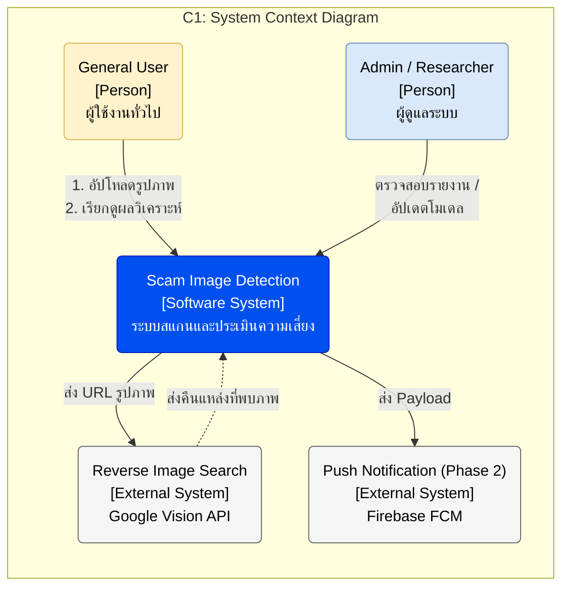
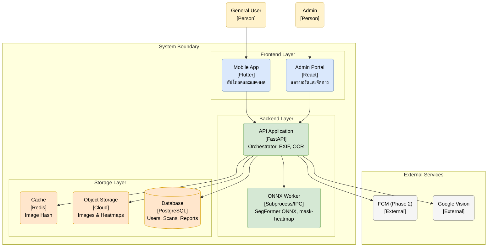
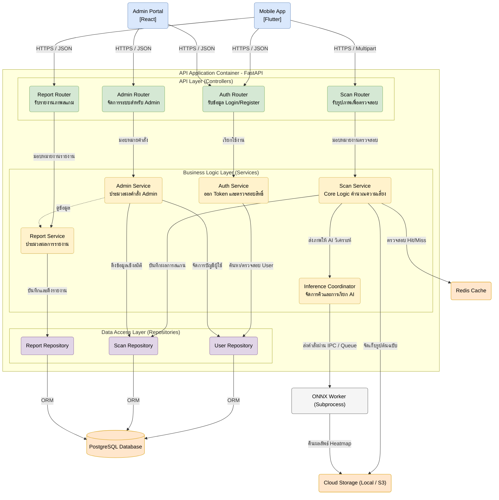
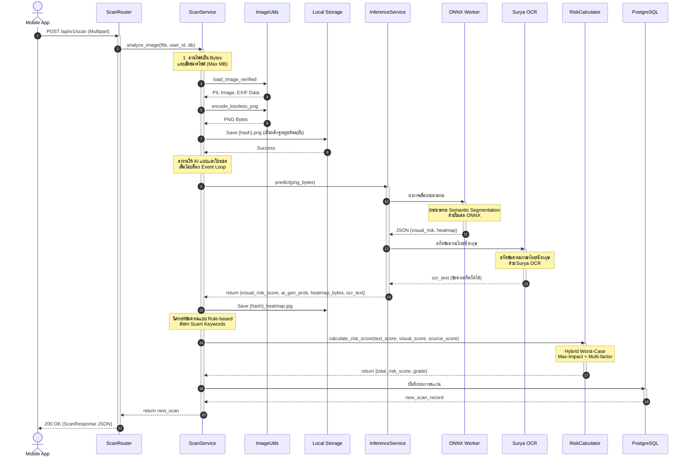

# Software Architecture 

**Project Name:** แอปตรวจสอบรูปภาพตัดต่อที่ถูกนำมาหลอกลวง (Scam Image Detection)  
**Version:** 1.0  
**Date:** August 23, 2026

---

## 1. Architecture Overview

ระบบ ScamGuard ได้รับการออกแบบภายใต้แนวคิด **Cloud-Native Architecture** และ **Microservices Architecture** เพื่อให้สามารถรองรับการประมวลผล AI ที่ใช้ทรัพยากรสูงโดยไม่กระทบต่อประสิทธิภาพของระบบหลัก

### 1.1 Design Principles

1. **Separation of Concerns:** แยก UI, Business Logic และ AI Processing ออกจากกันอย่างชัดเจน
2. **Scalability:** แต่ละ Container สามารถ Scale ได้อิสระตามความต้องการ
3. **Asynchronous Processing:** การประมวลผล AI รันใน ONNX Worker แยกโปรเซสผ่าน BackgroundTasks เพื่อไม่ Block event loop/UI
4. **Caching Strategy:** ใช้ Redis Cache เพื่อลดการประมวลผลซ้ำและเพิ่มความเร็วตอบสนอง
5. **Security by Design:** HTTPS, JWT Authentication, Rate Limiting, และ RBAC ตั้งแต่เริ่มต้น
6. **Explainability (XAI):** ระบบสร้างแผนที่ความร้อนแบบ mask-to-heatmap overlay เพื่ออธิบายผลการตัดสินใจของ AI

**Evidence:**
- File: project/design/architecture.md
- Section: 1. ภาพรวมสถาปัตยกรรมระบบ (Architecture Overview)
- Paraphrase: ระบบออกแบบแบบ Cloud-Native และ Decoupled เพื่อแยก Frontend ออกจาก AI Core ที่ต้องใช้ทรัพยากรสูง

---

## 2. C1: System Context Diagram

### 2.1 System Boundary

ระบบ ScamGuard ประกอบด้วยองค์ประกอบหลัก:

**Software System:**
- **Scam Image Detection System** — ระบบสแกนและประเมินความเสี่ยงของภาพถ่ายจากการดัดแปลง, AI และประวัติสแกม

**Actors (People):**
- **General User (ST01)** — ผู้ใช้งานทั่วไปที่อัปโหลดรูปภาพเพื่อตรวจสอบและเรียกดูผลวิเคราะห์
- **Admin / Researcher (ST02)** — ผู้ดูแลระบบและนักวิจัยที่ตรวจสอบเคสที่ถูกรายงานและอัปโหลดโมเดล

**External Systems:**
- **Reverse Image Search Provider** — Google Vision API / Bing Visual Search สำหรับค้นหาแหล่งที่มาของภาพ
- **Push Notification Service** — Firebase Cloud Messaging (FCM) สำหรับส่งการแจ้งเตือนแบบ Async (Phase 2; v1 ใช้ polling + in-app)

### 2.2 System Context Diagram



**Evidence:**
- File: project/Document/Software Architecture/C1-System-Context-Diagram.md
- Section: Full diagram and explanations

---

## 3. C2: Container Diagram

### 3.1 System Containers

ระบบแบ่งออกเป็น 3 Layer หลัก:

#### **Frontend Layer**
1. **Mobile App (Flutter)** — แอปพลิเคชันบนมือถือสำหรับผู้ใช้ทั่วไป
2. **Admin Web Portal (React + Tailwind)** — เว็บพอร์ทัลสำหรับผู้ดูแลระบบ

#### **Backend & API Layer**
3. **API Application (Python FastAPI)** — API Gateway และ Orchestrator หลัก
4. **ONNX Worker** — ประมวลผล AI ในโปรเซสแยกจาก API หลัก

#### **Storage & Cache Layer**
5. **Cache Store (Redis)** — แคชข้อมูลภาพที่สแกนแล้ว (Image Hash)
6. **Object Storage (Cloud Storage)** — จัดเก็บไฟล์รูปภาพและ Heatmap
7. **Main Database (PostgreSQL)** — ฐานข้อมูลหลักเชิงสัมพันธ์

#### **External Services**
8. **Push Notification Service (FCM, Phase 2)** — ส่งการแจ้งเตือน
9. **Reverse Image Search (Google Vision API)** — ค้นหาแหล่งที่มาของภาพ

### 3.2 Container Diagram



**Evidence:**
- File: project/Document/Software Architecture/C2-Container-Diagram.md
- Section: Full diagram and container descriptions

---

## 4. Container Details

### 4.1 Mobile App (Flutter)

**Technology:** Flutter (Dart)  
**Architecture Pattern:** Clean Architecture + MVVM + BLoC  
**Platforms:** Android (iOS ใน Future Release)

**Key Features:**
- การจัดการ State ด้วย BLoC (Business Logic Component)
- Dark Mode และ Light Mode support
- Offline-first approach สำหรับประวัติการสแกน
- Secure Storage สำหรับ JWT Token

**Layers:**
1. **Presentation Layer (UI)** — Widgets, Screens, BLoC
2. **Domain Layer** — Use Cases, Entities, Repository Interfaces
3. **Data Layer** — Repository Implementations, Data Sources (Remote API, Local Cache)

**Evidence:**
- File: project/design/architecture.md
- Section: 4.1.1 Mobile Application (Flutter)
- File: project/design/design.md
- Section: สถาปัตยกรรมโค้ด Clean Architecture + MVVM + BLoC

---

### 4.2 Admin Web Portal (React)

**Technology:** React.js, Tailwind CSS  
**Architecture Pattern:** Component-based Architecture

**Key Features:**
- Role-Based Access Control (RBAC): Admin, User, Researcher (Moderator/Viewer เป็น Phase 2)
- Statistical Dashboard (Charts, Metrics, KPIs)
- Report Queue Management (Approve/Reject Reports)
- Model Management (Upload/Activate/Deactivate Models)
- Audit Logs (Immutable Activity Logs)

**Main Modules:**
1. Authentication & Authorization
2. Dashboard & Analytics
3. User Management (CRUD)
4. Report Management
5. Model Management
6. Audit Logs Viewer

**Evidence:**
- File: project/Document/scop.md
- Section: 4. หน้าเว็บควบคุมสำหรับผู้ดูแลระบบ (Admin Web Portal)

---

### 4.3 API Application (FastAPI)

**Technology:** Python FastAPI  
**Architecture Pattern:** Microservices, Async/Await

**Key Responsibilities:**
1. **API Gateway** — Routing, Authentication (JWT), Rate Limiting
2. **Orchestration** — ประสานงานระหว่าง Cache, AI Service, Storage, External APIs
3. **Metadata Extraction** — สกัดข้อมูล EXIF/GPS จากรูปภาพ
4. **OCR & NLP** — สกัดข้อความด้วย Surya OCR v0.5.0 (Native PyTorch) และตรวจจับ Scam Keywords
5. **Reverse Image Search** — เชื่อมต่อ Google Vision API
6. **Risk Score Calculation** — คำนวณคะแนนรวมด้วยแนวทาง Hybrid Worst-Case (Max-Impact & Multi-Factor Compounding) ร่วมกับการแจกแจงความเสี่ยง 3 มิติอิสระเต็ม 100%

**API Endpoints (prefix `/api/v1`):**
- `POST /api/v1/auth/register` — สมัครสมาชิก
- `POST /api/v1/auth/login` — เข้าสู่ระบบ
- `POST /api/v1/auth/refresh` / `POST /api/v1/auth/logout` / `GET /api/v1/auth/me`
- `POST /api/v1/scan/` — อัปโหลดรูปภาพเพื่อตรวจสอบ
- `GET /api/v1/scan/{scan_id}` — ดึงผลการตรวจสอบ
- `GET /api/v1/history`, `GET /api/v1/history/{scan_id}`, `DELETE /api/v1/history/{scan_id}`
- `POST /api/v1/reports`, `GET /api/v1/reports/categories`, `GET /api/v1/reports/my`
- กลุ่ม Admin (`/api/v1/admin/*` ต้องเป็น Admin เท่านั้น)
- `WS /api/v1/ws/admin/dashboard` สำหรับ Dashboard realtime

**Evidence:**
- File: project/Document/scop.md
- Section: 2. ระบบ API หลังบ้านและส่วนเชื่อมต่อภายนอก (API Backend & Integrations)
- File: project/design/architecture.md
- Section: API Application details

---

### 4.4 AI Inference (ONNX Worker Subprocess)

**Technology:** PyTorch (Training), ONNX Runtime (Inference)
**Topology:** ONNX Worker แยกโปรเซสจาก API หลัก
**GPU:** NVIDIA GPU with CUDA support (Optional: CPU fallback)

**Key Responsibilities:**
1. **Image Forgery Detection** — ตรวจจับการตัดต่อระดับพิกเซลด้วย SegFormer ONNX
   - ตรวจจับ Splicing, Copy-Move, Inpainting
2. **AI-Generated Image Detection** — คำนวณคะแนนภาพ AI-Generated ควบคู่คะแนนความเสี่ยงทางภาพ
   - ตรวจจับ Artifacts จาก Stable Diffusion, Midjourney, DALL-E
   - วิเคราะห์ความผิดปกติทางฟิสิกส์ (ใบหน้า, มือ, พื้นหลัง)
3. **Explainability (XAI)** — สร้างแผนที่ความร้อนแบบ mask-to-heatmap overlay
    - ระบุจุดพิกเซลที่มีความเสี่ยงสูง
4. **Visual Risk Score Calculation** — คะแนน 0–100
5. **XAI reasoning** — โมเดลภาษาขนาดเล็กสำหรับสร้างคำอธิบายภาษาไทย (แยกจากโมดูล OCR ที่ใช้ Surya)

**Model Performance Target:**
- Accuracy ≥ 85%
- mDice ≥ 85%
- Inference Time ≤ 10 วินาที/ภาพ (GPU)

**Evidence:**
- File: project/Document/scop.md
- Section: 3. บริการตรวจจับภาพตัดต่อและปัญญาประดิษฐ์ (AI Inference Engine)
- File: project/Document/objective.md
- Section: OBJ-02 — เพื่อประยุกต์ใช้เทคโนโลยี Deep Learning

---

### 4.5 Cache Store (Redis)

**Technology:** Redis (In-Memory Data Store)

**Purpose:**
- เก็บแคชผลการวิเคราะห์ของรูปภาพที่เคยตรวจสอบแล้ว
- ใช้ SHA-256 เป็น Key ใน Redis
- ลดเวลาตอบสนองจาก 10-15 วินาที เหลือ ≤ 3 วินาที (Cache Hit)
- ลดการใช้ GPU/CPU จากการรัน AI ซ้ำ

**Cache Strategy:**
- TTL (Time To Live): 30 วัน (`setex` 2592000 วินาที)
- Eviction Policy: LRU (Least Recently Used)

**Evidence:**
- File: project/Document/scop.md
- Section: งานพัฒนาฐานข้อมูลหลักและแคช (PostgreSQL & Redis Cache)
- File: project/design/architecture.md
- Section: Cache Store details

---

### 4.6 Object Storage (Local Filesystem)

**Technology:** Local filesystem เสิร์ฟผ่าน static mount

**Purpose:**
- จัดเก็บไฟล์รูปภาพต้นฉบับที่ผู้ใช้อัปโหลด
- จัดเก็บภาพ Heatmap ที่สร้างโดย AI
- เก็บเฉพาะ path ใน DB

**File Structure:**
```
{UPLOAD_DIR}/{image_hash}.png
{UPLOAD_DIR}/heatmaps/{image_hash}_heatmap.jpg
```

**Evidence:**
- File: project/Document/scop.md
- Section: งานพัฒนาฐานข้อมูลหลักและแคช
- File: project/design/architecture.md
- Section: Object Storage details

---

### 4.7 Main Database (PostgreSQL)

**Technology:** PostgreSQL (Relational Database)

**Purpose:**
- จัดเก็บข้อมูลที่มีโครงสร้างแบบ Relational
- รองรับ ACID Transactions สำหรับความสมบูรณ์ของข้อมูล
- จัดเก็บข้อมูล PDPA Consent Logs

**Main Tables (9 ตาราง):**
1. **users** — id, email, hashed_password, full_name, role, is_active, created_at, updated_at
2. **admins** — ตารางแยกสำหรับผู้ดูแลระบบ
3. **scans** — id, user_id, image_hash (SHA-256), raw_image_url, heatmap_image_url, title, text/visual/source/total_risk_score, exif_data, ocr_text, scam_keywords_found, reverse_search_results, ai_gen_probability, xai_explanation, status, progress, created_at, completed_at
4. **consent_logs** — user_id, system_consent, research_consent, ip_address, user_agent, created_at
5. **scam_reports** — user_id, scan_id, category, reason, platform, reference_url, allow_research_use, status, admin_note, moderated_by/at, created_at, version
6. **model_versions** — version_tag, file_path, is_active, deployed_at, artifact_checksum, framework_compatibility, a_acc, m_iou, m_acc, m_dice, dataset_reference, created_by, status, deployment_history
7. **admin_sessions** — session/refresh-token rotation
8. **audit_log** — admin_id, action, entity_type/id, before/after_state, reason, ip, user_agent, request_id, details, created_at
9. **export_jobs** — admin_id, status, progress, file_path, manifest, filter_config, expires_at, created/completed_at

**Evidence:**
- File: project/database/init.sql
- File: project/database/ER_Diagram.md
- File: project/Document/scop.md
- Section: งานพัฒนาฐานข้อมูลหลักและแคช

---

### 4.8 External Services

#### 4.8.1 Push Notification Service (FCM) — Phase 2 (v1 ใช้ polling + in-app)

**Service:** Firebase Cloud Messaging  
**Purpose:** ส่งการแจ้งเตือนไปยังแอปมือถือเมื่อการประมวลผลเสร็จสิ้น (เริ่ม Phase 2; มติ DOC-06, 2026-09-11)

**Use Cases:**
- การวิเคราะห์เสร็จสิ้น (Analysis Complete)
- Admin อนุมัติ/ปฏิเสธรายงาน (Report Status Update)
- ระบบมีการอัปเดตโมเดล AI ใหม่ (Model Update Notification)

**Evidence:**
- File: project/Document/Software Architecture/C2-Container-Diagram.md
- Section: Push Notification Service

---

#### 4.8.2 Reverse Image Search (Google Vision API)

**Service:** Google Vision API (Web Detection)  
**Alternative:** Bing Visual Search API

**Purpose:** ค้นหาแหล่งที่มาของภาพบนอินเทอร์เน็ต

**Use Cases:**
- ตรวจสอบว่ารูปโปรไฟล์ถูกคัดลอกมาจากที่ใด
- ตรวจสอบว่าสลิปโอนเงินเป็นรูปเดิมที่เคยมีคนใช้หลอกลวงแล้ว
- คำนวณ Source Risk Score จากจำนวนและบริบทของแหล่งที่พบ

**Evidence:**
- File: project/Document/scop.md
- Section: งานพัฒนาสกัดข้อมูลแฝงและการค้นหาภาพย้อนกลับ (Metadata & Reverse Image Search)
- File: project/wiki/decisions/technology-choices.md
- Section: การตัดสินใจ 6: ใช้ Google Vision API

---

## 5. Multi-layer Analysis Pipeline

ระบบวิเคราะห์รูปภาพผ่านกระบวนการ 3 ชั้น และรวมผลเป็นคะแนนความเสี่ยงรวม

### 5.1 Pipeline Overview

```
[User Upload Image]
        ↓
[API Gateway: Check Cache (Redis)]
        ↓ (Cache Miss)
[Parallel Processing]
        ├── Layer 1: Textual Analysis (OCR + NLP)
        ├── Layer 2: Visual Analysis (AI Inference)
        └── Layer 3: Source Analysis (Reverse Search)
        ↓
[Risk Score Calculation]
        ↓
[Store Results (PostgreSQL + Object Storage)]
        ↓
[Send Notification (in-app/polling; FCM Phase 2)]
        ↓
[User Views Result]
```

### 5.2 Layer 1: Textual Analysis (S_text)

**Process:**
1. สกัดข้อความจากรูปภาพด้วย Surya OCR v0.5.0
2. ตรวจจับ Scam Keywords ด้วย RegEx และ NLP
   - กู้เงินด่วน, ถอนยอด, โบนัสพิเศษ, ด่วน, รับเงิน, ลงทุน, แจกเงิน, รวยเร็ว
3. คำนวณ Text Risk Score (0-100) จากจำนวนและความรุนแรงของคำหลอกลวง

**Formula:**
```
S_text = (keyword_count × severity_weight) / max_possible_score × 100
```

**Evidence:**
- File: project/Document/scop.md
- Section: งานพัฒนาโมดูลสกัดข้อความและการวิเคราะห์ประโยค (OCR & Textual Analysis)

---

### 5.3 Layer 2: Visual Analysis (S_visual)

**Process:**
1. รัน SegFormer ONNX ผ่าน worker แยกโปรเซส
2. คำนวณ visual_risk_score และ ai_gen_probability (0–100)
3. สร้าง mask-to-heatmap overlay เพื่ออธิบายผล
4. คำนวณ Visual Risk Score (0-100)

**Formula:**
```
S_visual = Normalize(Confidence × Coverage)
```
(สเกล confidence/coverage เป็น 0–100 ก่อนนำไปคำนวณรวม)

**Evidence:**
- File: project/Document/scop.md
- Section: งานพัฒนาโมดูลตรวจสอบร่องรอยการดัดแปลงภาพ, งานพัฒนาโมดูลตรวจสอบภาพสังเคราะห์จากปัญญาประดิษฐ์
- File: project/Document/objective.md
- Section: OBJ-02

---

### 5.4 Layer 3: Source Analysis (S_source)

**Process:**
1. ส่งรูปภาพไป Google Vision API (Web Detection)
2. รับรายการแหล่งที่มาที่คล้ายกัน (Similar URLs)
3. วิเคราะห์บริบทของแหล่งที่มา:
   - จำนวนแหล่งที่พบ (พบ ≥ 3 แหล่ง = เสี่ยงสูง, พบ ≤ 1 แหล่ง = เสี่ยงต่ำ)
   - ประเภทเว็บไซต์ (สื่อสังคมออนไลน์, เว็บข่าว, เว็บหลอกลวง)
   - ความเก่าของภาพ (ภาพเก่า > 1 ปี = เสี่ยง)
4. คำนวณ Source Risk Score (0-100)

**Formula:**
```
S_source = (source_count_factor × 0.5) + (context_risk_factor × 0.5)
```

**Evidence:**
- File: project/Document/scop.md
- Section: งานพัฒนาสกัดข้อมูลแฝงและการค้นหาภาพย้อนกลับ
- File: project/Document/objective.md
- Section: OBJ-03

---

### 5.5 Hybrid Worst-Case Risk Score Calculation

**Final Formula:**
```
S_base = max(S_visual, S_textual, S_source)
Risk Score = min(100, S_base + compounding_bonus)
```

**Risk Grade Mapping (3 ระดับ: Low 0-39 / Medium 40-69 / High 70-100):**
- **Low (สีเขียว):** 0-39
- **Medium (สีเหลือง):** 40-69
- **High (สีแดง):** 70-100
- **Special Rule:** หาก `visual_score ≥ 80` → High ทันที

**Rationale:**
- ป้องกันปัญหา Score Dilution เมื่อรูปภาพไม่มีองค์ประกอบข้อความ (เช่น ภาพ Romance Scam)
- ยึดตามมิติที่พบความเสี่ยงรุนแรงที่สุดเป็นฐานหลัก (Worst-case Dominance)
- เพิ่มค่าความเสี่ยงทวีคูณเมื่อพบภัยคุกคามหลายมิติพร้อมกัน (Multi-factor Compounding)

**Evidence:**
- File: project/design/architecture.md
- Section: Multi-layer Analysis Pipeline
- File: project/Document/objective.md
- Section: OBJ-03 — สูตรคำนวณคะแนนความเสี่ยงรวม

---

## 6. C3: Component Diagram (API Application)

### 6.1 Component Overview

แผนภาพ C3 นี้นำเสนอโครงสร้างภายในของ **API Application Container (FastAPI)** ซึ่งเป็นศูนย์กลาง (Orchestrator) ของระบบ Scam Image Detection โดยแสดงให้เห็นถึงการแบ่งเลเยอร์ตามหน้าที่

สถาปัตยกรรมภายในของ Backend ยึดหลักการ **Layered Architecture** เพื่อแยกส่วนหน้าที่ (Separation of Concerns) ทำให้ระบบดูแลรักษาง่าย โดยแบ่งเป็น 3 เลเยอร์หลัก:

**Layered Architecture:**
1. **API Layer (Controllers)**
2. **Business Logic Layer (Services)**
3. **Data Access Layer (Repositories)**

### 6.2 Component Diagram



### 6.3 Component Details

#### 6.3.1 API Layer (Controllers)

ทำหน้าที่เป็นด่านหน้าในการรับ HTTP Request, ตรวจสอบความถูกต้องของข้อมูลเบื้องต้น (Data Validation) และส่งต่องานไปยัง Service ที่เกี่ยวข้อง

**Components:**
- **Auth Router:** จัดการ Endpoint สำหรับ Login และ Register
- **Scan Router:** รับไฟล์รูปภาพแบบ Multipart Form Data สำหรับตรวจสอบสแกม
- **Report Router:** รับแจ้งรูปภาพหลอกลวงจากผู้ใช้ (Crowdsourcing)
- **Admin Router:** เปิด Endpoint ให้นักวิจัยและ Admin จัดการข้อมูลโมเดลและระบบ

#### 6.3.2 Business Logic Layer (Services)

เป็นหัวใจหลักของแอปพลิเคชัน ทำหน้าที่ประมวลผลตามกฎทางธุรกิจ (Business Rules)

**Components:**
- **Scan Service:** ควบคุมขั้นตอนการตรวจสอบภาพทั้งหมด เริ่มตั้งแต่เช็ค Cache, สกัด EXIF (แสดงผลเท่านั้น), และคำนวณ Hybrid max+bonus Risk Score
- **Inference Coordinator:** ตัวประสานงานระหว่าง Backend กับ AI Model ทำหน้าที่จัดคิวรูปภาพและส่งคำสั่งไปให้ ONNX Worker
- **Auth Service:** จัดการการเข้ารหัสผ่าน (Hashing) และออก JWT Token
- **Admin Service:** ประมวลผลคำสั่ง Admin (User Management, Model Management)
- **Report Service:** ประมวลผลการรายงานภาพหลอกลวงจากผู้ใช้

#### 6.3.3 Data Access Layer (Repositories)

ทำหน้าที่ติดต่อกับฐานข้อมูลหลัก ช่วยให้ Business Logic Layer ไม่ต้องเขียนคำสั่ง SQL โดยตรง

**Components:**
- **User Repository:** Query ข้อมูลบัญชีและสิทธิ์ของผู้ใช้งาน
- **Scan Repository:** บันทึกและดึงประวัติ Risk Score ของแต่ละรูปภาพ
- **Report Repository:** บันทึกข้อมูลที่ผู้ใช้แจ้งเข้ามาว่ารูปไหนเป็นสแกมของจริง

#### 6.3.4 AI Integration (ONNX Worker)

โมเดล AI ถูกออกแบบให้ทำงานแยกส่วน (Isolation) จาก Web Server หลัก โดยรันผ่าน worker แยกโปรเซส เพื่อแยกภาระงานประมวลผลที่กินทรัพยากรสูงออกจาก Thread หลักของ API ทำให้ API ยังคงสามารถตอบสนอง Request อื่นๆ ได้อย่างรวดเร็วและไม่สะดุด

**Evidence:**
- File: project/Document/Software Architecture/C3-Component-Diagram.md
- Complete component structure documentation

---

## 7. C4: Code Diagram (Image Scanning Flow)

### 7.1 Overview

แผนภาพ C4 นี้แสดงลำดับขั้นตอนการทำงานของกระบวนการวิเคราะห์รูปภาพ (Image Scanning) ภายใน Backend ของระบบ Scam Image Detection ซึ่งครอบคลุมตั้งแต่การรับ Request จากผู้ใช้ ไปจนถึงการจัดเก็บผลลัพธ์ลงฐานข้อมูล

### 7.2 Sequence Diagram



### 7.3 Details

#### 7.3.1 API Layer (ScanRouter)

**หน้าที่:** 
- ตรวจสอบสิทธิ์ผู้ใช้งาน
- รับไฟล์รูปแบบ Multipart Form Data 
- ส่งต่อให้ Service ประมวลผล

#### 7.3.2 Business Logic Layer (ScanService)

**หน้าที่:**
1. ตรวจสอบความปลอดภัยของไฟล์ (ขนาดไฟล์ และการแปลงเป็นภาพ Lossless PNG ป้องกันมัลแวร์แฝง)
2. สร้าง Hash จากไฟล์ต้นฉบับเพื่อใช้ตั้งชื่อไฟล์ (Deduplication)
3. เรียกงานประมวลผลหนัก (AI และ Image Processing) ใน worker แยก เพื่อไม่ให้ Event Loop ของ API ถูกบล็อก
4. วิเคราะห์คำหลอกลวงเบื้องต้นจากผลลัพธ์ OCR ด้วย scam keywords
5. บันทึกผลสู่ฐานข้อมูล

#### 7.3.3 AI Integration Layer (InferenceService)

**หน้าที่:** ทำงานประสาน AI โมเดลทั้ง 2 ตัว

**ONNX Worker (SegFormer):**
- รันในโปรเซสแยกต่างหาก (AI Workload Isolation)
- แยกการจัดการทรัพยากรและหน่วยความจำของฝั่ง AI ออกจาก Web Server หลัก

**Surya OCR:**
- โมเดลถูกเตรียมพร้อมไว้ในหน่วยความจำหลักตั้งแต่ระบบเริ่มทำงาน
- ประมวลผลข้อความจากรูปภาพได้ทันทีโดยไม่ต้องเสียเวลาโหลดโมเดลใหม่
- ช่วยลดความหน่วง (Latency) ในการตอบสนอง

#### 7.3.4 Utility & Calculation
**โมดูล:** RiskCalculator

**หน้าที่:** 
- รับค่าตัวเลขคะแนนดิบเข้าไปคำนวณตามสูตร Hybrid max+bonus
- ส่งค่าความเสี่ยงรวม (Total Risk) กลับมา

**Evidence:**
- File: project/Document/Software Architecture/C4-code-Diagram.md
- Complete sequence diagram with code-level details

---

## 8. Technology Stack Summary

| Layer | Component | Technology | Purpose |
|-------|-----------|------------|---------|
| **Frontend** | Mobile App | Flutter (Dart) | Cross-platform Android app |
| **Frontend** | Admin Portal | React.js + Tailwind CSS | Web-based admin interface |
| **Backend** | API Gateway | Python FastAPI | REST API, Orchestration, OCR |
| **Backend** | AI Inference | PyTorch / ONNX Runtime | Forgery & AI-Gen Detection |
| **Storage** | Cache | Redis | Image hash caching |
| **Storage** | Object Storage | Cloud Storage (S3/GCS) | Image & heatmap files |
| **Storage** | Database | PostgreSQL | Relational data |
| **External** | Notification | Firebase Cloud Messaging | Push notifications |
| **External** | Image Search | Google Vision API | Reverse image search |

**Evidence:**
- File: project/wiki/entities/tech-stack.md
- File: project/wiki/decisions/technology-choices.md
- File: project/design/architecture.md

---

## 9. Security Architecture

### 9.1 Authentication & Authorization

**Authentication:**
- JWT (JSON Web Token) สำหรับ Stateless Authentication
- Access Token (TTL: 15 นาที) + Refresh Token (TTL: 7 วัน)
- Password Hashing ด้วย bcrypt (cost factor: 12)

**Authorization:**
- Role-Based Access Control (RBAC)
  - General User: Read own data, Create scans, Report images
  - Researcher: เข้าถึงข้อมูลเพื่อการวิจัย
  - Admin: Full CRUD, Review reports, Manage users (Phase 2 สำหรับ Moderator/Viewer)

**Evidence:**
- File: project/Document/srs-doc.md
- Section: FR-AUTH series (FR-AUTH-01 to FR-AUTH-05)

---

### 9.2 Data Security

**In Transit:**
- HTTPS/TLS 1.3 สำหรับการสื่อสารทั้งหมด
- Certificate Pinning ในแอปมือถือ

**At Rest:**
- Database Encryption (PostgreSQL Transparent Data Encryption)
- Object Storage Encryption (Server-Side Encryption)
- Secure Storage สำหรับ JWT Token ในแอปมือถือ (Flutter Secure Storage)

**PDPA Compliance:**
- Consent Management (2-level consent)
- Right to Access (ผู้ใช้ดูข้อมูลตัวเองได้)
- Right to Delete (ผู้ใช้ลบประวัติได้)
- Data Retention Policy (เก็บข้อมูล 1 ปี หลังจากนั้นลบอัตโนมัติ)

**Evidence:**
- File: project/Document/srs-doc.md
- Section: NFR-06 — ระบบต้องปฏิบัติตามข้อกำหนดความเป็นส่วนตัว (PDPA)

---

### 9.3 API Security

**Rate Limiting (tiered ต่อนาที แยกตาม role — มติ DOC-02, 2026-09-11, implement แล้วใน `server/app/core/rate_limit.py`):**
- Guest (public endpoints: register/login/refresh): 10 requests/minute ต่อ IP
- Authenticated User (scan/history/reports/me/logout): 60 requests/minute ต่อ IP
- Admin (`/admin/*`): 300 requests/minute ต่อ IP
- `POST /api/v1/scan/`: 5 requests/minute (อัปโหลดภาพต้นทุนสูง)
- Login/Refresh ฝั่ง user: 10 requests/minute (อยู่ใน guest tier); ฝั่ง admin (`/admin/login`, `/admin/refresh`): 5 requests/minute (กัน brute-force)
- Key: IP address (`get_remote_address`); ตอบ HTTP 429 เมื่อเกิน

**Input Validation:**
- File Type Check (MIME type validation)
- File Size Limit (Mobile 10 MB client-side / API Server Max 20 MB → 413)
- Image Pixel Limit (Max 100M pixels หลัง decode → error)
- SQL Injection Prevention (Parameterized Queries)
- XSS Prevention (Input Sanitization)

**Evidence:**
- File: project/Document/srs-doc.md
- Section: NFR-04 — ความปลอดภัย (Security)

---

## 10. Performance Architecture

### 10.1 Performance Targets

| Metric | Target | Evidence |
|--------|--------|----------|
| Cache Hit Response Time | ≤ 3 seconds | OBJ-04 |
| New Analysis Response Time | ≤ 15 seconds (median) | OBJ-04 |
| AI Inference Time | ≤ 10 seconds (GPU) | SC03 |
| System Uptime | ≥ 99.5% | OBJ-04 |
| Concurrent Users | ≥ 100 simultaneous | NFR-02 |

**Evidence:**
- File: project/Document/objective.md
- Section: OBJ-04 — ตัวชี้วัดความสำเร็จ (Success Criteria)

---

### 10.2 Scalability Strategy

**Horizontal Scaling:**
- API Application: Multiple instances behind Load Balancer
- ONNX Worker: แยกโปรเซสต่อรอบการประมวลผล
- Database: Read Replicas for heavy read operations

**Vertical Scaling:**
- GPU Upgrade สำหรับ AI Inference (T4 → A100)

**Caching Strategy:**
- Redis Cache สำหรับ Image Hash (Cache Hit Rate target: ≥ 40%)
- CDN สำหรับ Static Assets

**Evidence:**
- File: project/design/architecture.md
- Section: Scalability และ Performance considerations

---

## 11. Deployment Architecture

### 11.1 Deployment Options

**Option 1: Cloud Deployment (Recommended)**
- Frontend: Vercel (Admin Portal), Google Play Store (Mobile App)
- Backend: AWS ECS / Google Cloud Run
- Database: AWS RDS PostgreSQL / Google Cloud SQL
- Cache: AWS ElastiCache Redis / Google Cloud Memorystore
- Object Storage: AWS S3 / Google Cloud Storage
- AI Inference: AWS EC2 (GPU) / Google Cloud Compute Engine

**Option 2: On-Premise Deployment**
- Docker Compose / Kubernetes
- Self-hosted PostgreSQL + Redis
- MinIO สำหรับ Object Storage
- GPU Server สำหรับ AI Inference

**Evidence:**
- File: project/design/architecture.md
- Section: Deployment Architecture (inferred from Cloud-Native design)

---

### 11.2 CI/CD Pipeline

**Continuous Integration:**
1. Git Push → GitHub/GitLab
2. Run Unit Tests (pytest, Flutter test)
3. Run Linting (flake8, dartfmt)
4. Build Docker Images
5. Push to Container Registry

**Continuous Deployment:**
1. Deploy to Staging Environment
2. Run Integration Tests
3. Manual Approval (Production)
4. Deploy to Production
5. Health Check & Monitoring

**Tools:**
- GitHub Actions / GitLab CI
- Docker + Docker Compose
- Kubernetes (Optional)

---

## 12. Monitoring & Observability

### 12.1 Logging

**Application Logs:**
- Structured Logging (JSON format)
- Log Levels: DEBUG, INFO, WARNING, ERROR, CRITICAL
- Centralized Logging: ELK Stack (Elasticsearch, Logstash, Kibana) หรือ Cloud Logging

**Audit Logs:**
- บันทึกทุกการกระทำของ Admin (Immutable)
- บันทึก API Calls ที่สำคัญ (Authentication, Scans, Reports)

---

### 12.2 Metrics

**System Metrics:**
- CPU, Memory, Disk Usage
- Network I/O
- GPU Utilization (AI Inference)

**Application Metrics:**
- Request Count, Response Time
- Error Rate (4xx, 5xx)
- Cache Hit Rate
- AI Inference Time (ONNX subprocess)

**Business Metrics:**
- Total Scans
- Daily Active Users (DAU)
- Risk Score Distribution (Low/Medium/High)
- Report Approval Rate

**Tools:**
- Prometheus + Grafana
- Google Cloud Monitoring
- AWS CloudWatch

---

### 12.3 Alerting

**Critical Alerts:**
- System Down (Uptime < 99.5%)
- Database Connection Failure
- AI Inference Service Failure
- Cache Failure (Redis down)

**Warning Alerts:**
- High Response Time (> 20 seconds)
- High Error Rate (> 5%)
- Low Cache Hit Rate (< 30%)
- High GPU Usage (> 90%)

**Tools:**
- PagerDuty / Opsgenie
- Email / Slack Notifications

---

## 13. Architecture Quality Attributes

### 13.1 Quality Attribute Summary

| Quality Attribute | Target | Design Decision |
|-------------------|--------|-----------------|
| **Performance** | Cache Hit ≤ 3s, New Analysis ≤ 15s | Redis Cache, ONNX Runtime, Async Processing |
| **Scalability** | ≥ 100 concurrent users | Microservices, Queue-based AI, Load Balancer |
| **Availability** | ≥ 99.5% uptime | Health Checks, Auto-restart, Monitoring |
| **Security** | HTTPS, JWT, RBAC, PDPA | Authentication, Authorization, Encryption |
| **Maintainability** | Clean Architecture, Separation of Concerns | Flutter Clean Arch, FastAPI modular design |
| **Explainability** | ≥ 80% users understand Heatmap | Mask-to-heatmap overlay, Risk breakdown |
| **Testability** | Unit Test Coverage ≥ 80% | Clean Architecture, Dependency Injection |

**Evidence:**
- File: project/Document/srs-doc.md
- Section: 4. ข้อกำหนดที่ไม่ใช่หน้าที่การใช้งาน (Non-Functional Requirements)

---

## 14. Architecture Risks & Mitigation

### 14.1 Technical Risks

| Risk | Impact | Likelihood | Mitigation |
|------|--------|------------|------------|
| AI Inference Timeout (> 15s) | High | Medium | Queue-based processing, Async notifications, ONNX optimization |
| Google Vision API Downtime | Medium | Low | ตั้ง `source_status="unavailable"` แจ้งผู้ใช้ว่าฟังก์ชันยังไม่พร้อมใช้งาน คำนวณคะแนนจากมิติที่สำเร็จเท่านั้น ไม่ใช้ Neutral 50 (มติ DOC-01; ปัจจุบันยังไม่เชื่อมจริง code ใช้ค่าคงที่ชั่วคราว) |
| Redis Cache Failure | Medium | Low | Fallback to Database, Auto-restart, Monitoring |
| GPU Resource Exhaustion | High | Medium | Queue management, Auto-scaling, Batch processing |
| False Positive (ภาพจริงแต่ระบบบอกว่าปลอม) | High | Medium | Threshold tuning, Human-in-the-loop (Admin review) |
| False Negative (ภาพปลอมแต่ระบบบอกว่าจริง) | Critical | Low | Multi-layer analysis, Continuous model training |

**Evidence:**
- File: project/design/architecture.md
- Section: Risk considerations (inferred from design decisions)

---

## 15. Architecture Decision Records (ADRs)

### ADR-01: ใช้ Flutter แทน React Native
**Decision:** ใช้ Flutter สำหรับ Mobile App  
**Rationale:** Performance สูงกว่า, Hot Reload, Material Design built-in, BLoC State Management  
**Status:** Accepted

### ADR-02: ใช้ FastAPI แทน Django/Flask
**Decision:** ใช้ FastAPI สำหรับ Backend API  
**Rationale:** Async I/O, Performance สูง, Pydantic Validation, OpenAPI Docs อัตโนมัติ  
**Status:** Accepted

### ADR-03: ใช้ ONNX Runtime สำหรับ Inference
**Decision:** แปลงโมเดล PyTorch เป็น ONNX สำหรับ Production  
**Rationale:** Inference เร็วกว่า 2-5 เท่า, ลด Dependency  
**Status:** Accepted

### ADR-04: ใช้ PostgreSQL แทน MongoDB
**Decision:** ใช้ PostgreSQL สำหรับฐานข้อมูลหลัก  
**Rationale:** ACID Transactions, Relational data structure, PDPA compliance  
**Status:** Accepted

### ADR-05: ใช้ Google Vision API สำหรับ Reverse Search
**Decision:** ใช้ Google Vision API (มี Bing เป็น fallback)  
**Rationale:** ฐานข้อมูลภาพใหญ่ที่สุด, API มีเสถียรภาพสูง  
**Status:** Accepted

**Evidence:**
- File: project/wiki/decisions/technology-choices.md
- All technology decision sections

---

## 16. Document Summary

เอกสาร Software Architecture ฉบับนี้อธิบายสถาปัตยกรรมระบบ ScamGuard อย่างครบถ้วน ครอบคลุม:

**System Structure:**
- C1 System Context Diagram — Actors และ External Systems
- C2 Container Diagram — 9 Containers แบ่งเป็น 3 Layers

**Container Details:**
- Frontend: Mobile App (Flutter), Admin Portal (React)
- Backend: API Application (FastAPI), AI Inference (PyTorch/ONNX)
- Storage: Redis Cache, Cloud Storage, PostgreSQL

**Analysis Pipeline:**
- Multi-layer Analysis: Independent 3-Factor (Visual 0-100%, Text 0-100%, Source 0-100%) with Hybrid max+bonus Trigger
- Hybrid max+bonus Risk Score Calculation
- Explainable AI (mask-to-heatmap overlay)

**Quality Attributes:**
- Performance, Scalability, Security, Availability, Explainability

**Technology Decisions:**
- Flutter, FastAPI, ONNX, PostgreSQL, Google Vision API

สถาปัตยกรรมนี้ออกแบบเพื่อรองรับ:
1. การประมวลผล AI ที่ใช้ทรัพยากรสูง
2. การตอบสนองที่รวดเร็ว (Cache Hit ≤ 3s)
3. ความปลอดภัยและความเป็นส่วนตัว (PDPA)
4. ความสามารถในการ Scale
5. ความโปร่งใสและความเข้าใจได้ (XAI)

---


