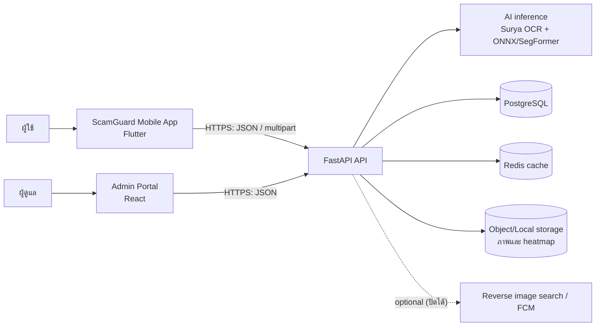
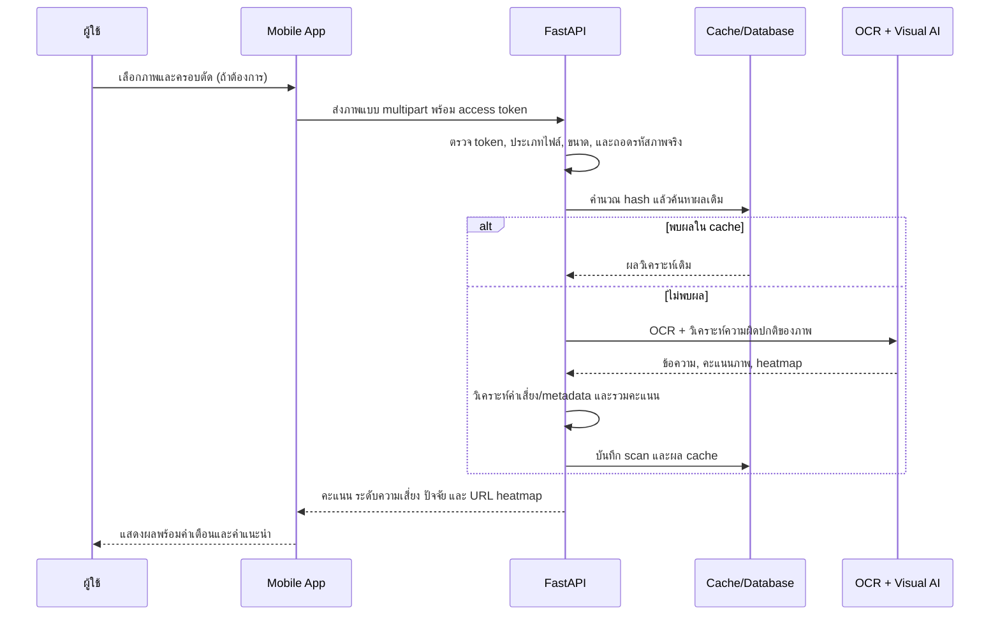

## 1. โครงการนี้ทำอะไร

**ScamGuard** คือระบบประเมินความเสี่ยงของรูปภาพที่อาจถูกใช้ในการหลอกลวง เช่น สลิปปลอม ภาพโฆษณาหลอกลวง ภาพตัดต่อ หรือภาพที่สร้างด้วย AI ผู้ใช้ส่งภาพผ่านแอปมือถือ ระบบจะวิเคราะห์ข้อมูลหลายด้านและคืนผลเป็นคะแนนความเสี่ยง `0–100` พร้อมเหตุผลประกอบและ heatmap เพื่อช่วยให้ผู้ใช้ตัดสินใจได้ดีขึ้น

ผลลัพธ์ของระบบเป็นเพียง **การประเมินความเสี่ยง** ไม่ใช่การยืนยันว่าภาพนั้นเป็นของปลอมหรือเป็นการฉ้อโกง และไม่ใช่หลักฐานทางกฎหมายหรือคำแนะนำทางการเงิน

### เป้าหมายหลัก

1. ให้ผู้ใช้ตรวจภาพน่าสงสัยบนมือถือได้สะดวกและรวดเร็ว
2. ผสานการวิเคราะห์ข้อความ ภาพ และแหล่งที่มาของภาพ เพื่อคัดกรองความเสี่ยงได้รอบด้าน
3. อธิบายผล AI ให้เข้าใจง่ายด้วยคะแนน ระดับความเสี่ยง ปัจจัยเสี่ยง และ heatmap
4. รองรับประวัติการตรวจ รายงานภาพน่าสงสัย และการบริหารข้อมูลโดยคำนึงถึง PDPA
5. ให้ผู้ดูแลตรวจสอบรายงาน จัดการผู้ใช้/รุ่นโมเดล และตรวจสอบการดำเนินการย้อนหลังได้

## 2. ภาพรวมสถาปัตยกรรม

| ส่วนประกอบ | หน้าที่ |
|---|---|
| Mobile App (Flutter) | สมัคร/เข้าสู่ระบบ ขอความยินยอม เลือกและครอบตัดภาพ ส่งสแกน ดูผล ประวัติ รายงาน และตั้งค่า |
| API Backend (FastAPI) | ยืนยันตัวตน ตรวจสิทธิ์และไฟล์ ประสาน AI คำนวณคะแนน บันทึกข้อมูล และเปิด REST API |
| AI inference | OCR ไทย/อังกฤษ, ตรวจความผิดปกติของภาพ, สร้าง heatmap |
| PostgreSQL | เก็บผู้ใช้ consent scan report รุ่นโมเดล และ audit log |
| Redis | เก็บผลที่อ้างอิงจาก hash ของภาพเพื่อลดการรัน AI ซ้ำ |
| Storage | เก็บภาพต้นฉบับและภาพ heatmap โดยต้องจำกัดสิทธิ์การเข้าถึง |
| Admin Portal | แดชบอร์ด คิวรายงาน จัดการผู้ใช้ รุ่นโมเดล และ audit log |

## 3. ลอจิกการสแกนภาพ (แกนหลักของระบบ)

ลำดับการทำงานมีดังนี้

1. ผู้ใช้ต้องเข้าสู่ระบบ เลือกภาพจากคลัง และอาจครอบตัด/หมุนก่อนส่ง
2. แอปส่งภาพพร้อม Bearer token ไปยัง API; ฝั่งเซิร์ฟเวอร์ตรวจ ownership/สิทธิ์ ตรวจชนิดไฟล์จากข้อมูลจริง ไม่เชื่อเพียง `Content-Type` และจำกัดขนาดไฟล์/จำนวนพิกเซล
3. ระบบสร้าง hash ของภาพเพื่อตรวจผลเดิม หากพบ cache จะคืนผลเร็วโดยไม่รันโมเดลซ้ำ
4. หากเป็นภาพใหม่ ระบบรันการวิเคราะห์หลายชั้น แล้วสร้าง/บันทึก heatmap และข้อมูลผลลัพธ์
5. ระบบรวมคะแนน แปลงเป็นระดับความเสี่ยง บันทึก `Scan` และส่งผลให้แอปแสดงแก่เจ้าของภาพ
6. หาก OCR, โมเดล หรือบริการภายนอกล้มเหลว ระบบต้องแสดงสถานะ/ผลบางส่วนอย่างชัดเจน ไม่บันทึกว่า “สำเร็จ” ทั้งที่วิเคราะห์ไม่ครบ

งาน AI ที่หนักต้องรันนอก event loop ของ FastAPI (thread pool หรือ worker แยก) เพื่อไม่ให้ API อื่นหยุดรอ โดยแผนงานกำหนดให้ ONNX worker ทำงานแบบ subprocess แยกและสื่อสารผ่าน standard input/output

## 4. การวิเคราะห์แบบหลายชั้น

### 4.1 Textual analysis — OCR และคำเสี่ยง

- ใช้ **Surya-OCR** สกัดข้อความไทยและอังกฤษจากภาพ
- ใช้กฎ RegEx/NLP ค้นหาคำหรือรูปแบบที่เกี่ยวข้องกับการหลอกลวง เช่น ข้อความเร่งรัด โปรโมชั่นผิดปกติ หรือการกู้/ลงทุน
- คะแนนข้อความ (`text_score`) อยู่ในช่วง 0–100 และขึ้นกับจำนวนกับความรุนแรงของคำที่พบ
- ผลที่ส่งกลับควรมีข้อความ OCR และรายการคำที่ตรวจพบ เพื่อให้ผู้ใช้ตรวจสอบเหตุผลได้

### 4.2 Visual analysis — ภาพตัดต่อและภาพสร้างโดย AI

- ~~ใช้การเตรียมภาพแบบ ELA เพื่อช่วยมองหาร่องรอยการบีบอัดซ้ำ/การแก้ไข~~ (ยกเลิกแล้ว — มติ DOC-12: ใช้ SegFormer แทน ELA, ไม่มี ELA ใน pipeline/code)
- โมเดลสาย SegFormer/ONNX วิเคราะห์บริเวณผิดปกติระดับพิกเซล และให้ `visual_score` รวมถึง heatmap
- เอกสารแผนงานระบุการประเมินทั้งร่องรอย copy-move, splicing, inpainting และความเป็นไปได้ของภาพ AI-generated
- Heatmap เป็นเครื่องมืออธิบายบริเวณที่โมเดลให้น้ำหนัก ไม่ใช่หลักฐานยืนยันว่าบริเวณนั้นถูกตัดต่อ

คะแนนภาพได้จากทั้งความมั่นใจของโมเดลและสัดส่วนของพื้นที่ผิดปกติ แล้วปรับสเกลให้อยู่ในช่วง 0–100:

$$
S_{visual} = \operatorname{Normalize}(\text{Confidence} \times \text{Mask Coverage})
$$

`Confidence` คือความน่าจะเป็นที่โมเดลเห็นว่าพิกเซลถูกดัดแปลง ส่วน `Mask Coverage` คือสัดส่วนพื้นที่ใน segmentation mask เทียบกับภาพทั้งหมด จึงทำให้รอยที่มีความมั่นใจสูงและกินพื้นที่มากส่งผลต่อคะแนนมากกว่ารอยขนาดเล็ก

### 4.3 Source analysis — แหล่งที่มาของภาพ

- อ่าน EXIF/metadata ที่มี และอาจเรียก reverse image search เพื่อดู URL/บริบทที่ภาพเคยปรากฏ
- คำนวณ `source_score` เมื่อ integration พร้อมใช้งาน
- Reverse search และ FCM เป็นบริการภายนอก: หากยังไม่ตั้งค่า/ล้มเหลว ต้องแจ้งสถานะว่าไม่มีข้อมูล ไม่ควรสรุปเองว่าภาพปลอดภัยหรือมีความเสี่ยง

## 5. ลอจิกคะแนนและระดับความเสี่ยง (Hybrid Worst-Case Risk Scoring)

> สูตร/เกณฑ์ฉบับสมบูรณ์นิยามที่ `Document/docs/05_Software_Requirement_Specification.md` FR-ANALYSIS-04 ที่เดียว — หัวข้อนี้เหลือแค่ภาพรวมและลิงก์อ้าง

ระบบประเมินความเสี่ยงด้วยแนวทางผสมผสาน **Hybrid Worst-Case Trigger ร่วมกับ Multi-Factor Breakdown** เพื่อแก้ไขปัญหาการเจือจางคะแนน (Dilution Effect) ในกรณีที่ภาพมีองค์ประกอบไม่ครบ (เช่น ภาพ Romance Scam ที่ไม่มีข้อความ) โดยแจกแจงคะแนนแยก 3 มิติอิสระเต็ม 100% (Visual, Textual, Source) ควบคู่กับคะแนนรวม ดูนิยามสูตรและเกณฑ์ทั้งหมดที่ FR-ANALYSIS-04 ใน 05-SRS

### 5.1 คะแนนแยกมิติอิสระ (Independent Factors)
ดูนิยามที่ `Document/docs/05_Software_Requirement_Specification.md` FR-ANALYSIS-01..03 ที่เดียว — สรุปสั้น: Visual (SegFormer), Textual (Surya OCR + NLP), Source (Reverse Search)

### 5.2 คะแนนสรุปภาพรวม (Overall Risk Score)
ดูนิยามสูตร/เกณฑ์ที่ `Document/docs/05_Software_Requirement_Specification.md` FR-ANALYSIS-04 ที่เดียว

ผลลัพธ์คือผู้ใช้ได้รับทั้งคะแนนสรุปภาพรวมที่ชัดเจน และเห็นการแจกแจงแยกมิติ (Breakdown Cards) ตามหลัก Explainable AI (XAI) รายละเอียดสูตร/เกณฑ์ดู FR-ANALYSIS-04 ใน 05-SRS ที่เดียว
กฎพิเศษของคะแนนภาพมีไว้เพื่อไม่ให้ร่องรอยภาพที่รุนแรงถูกกลบด้วยคะแนนด้านอื่น ทั้งนี้ UI ต้องแสดงทั้งข้อความและสี ไม่ใช้สีอย่างเดียว และต้องมีคำเตือนว่าเป็นผลช่วยประกอบการตัดสินใจ

### การเทรนและประเมินโมเดล SegFormer

การเทรน semantic segmentation ใช้ loss แบบผสม เพื่อให้โมเดลเรียนรู้ทั้งความถูกต้องรายพิกเซลและขอบเขตของรอยตัดต่อ:

$$
L = L_{BCE} + L_{Dice}
$$

ใช้ AdamW พร้อม differential learning rates: backbone ใช้ `lr_mult = 0.1` เพื่อคงความรู้จากโมเดล pre-trained ไว้ ส่วน classification head ใช้ `lr_mult = 10.0` เพื่อปรับเข้ากับข้อมูลสแกมใหม่ได้เร็วขึ้น

การประเมินต้องไม่ดู Accuracy เพียงค่าเดียว เพราะชุดข้อมูลอาจไม่สมดุล แต่ดู **Accuracy** สำหรับผลระดับภาพ และ **IoU/Dice coefficient** สำหรับ mask ระดับพิกเซลร่วมกัน เพื่อวัดทั้งความถูกต้องและความแม่นยำของคุณภาพของขอบเขตรอยผิดปกติ

## 6. บัญชี สิทธิ์ และความเป็นส่วนตัว

### การยืนยันตัวตน

- สมัครด้วยชื่อ อีเมล รหัสผ่าน และ consent; อีเมลหนึ่งรายการมีได้หนึ่งบัญชี
- รหัสผ่านต้อง hash ก่อนเก็บ ระบบออก access token และ refresh token สำหรับ session
- แอปเก็บ token ใน secure storage และ interceptor ควรต่ออายุ access token เมื่อจำเป็น
- บัญชีที่ถูกปิดใช้งานต้องใช้งาน API ที่ต้องยืนยันตัวตนหรือขอ token ใหม่ไม่ได้

### สิทธิ์ (RBAC) และ ownership

- ผู้ใช้ทั่วไปเข้าถึง scan, ประวัติ และรายงานของตนเองเท่านั้น
- Admin ที่ active ใช้ Admin Portal เพื่อดูแลระบบตามสิทธิ์ที่ได้รับ
- ทุก endpoint ของ Admin ต้องตรวจบทบาท และทรัพยากรที่มีเจ้าของต้องตรวจ ownership เสมอ
- การเปลี่ยนบทบาท/สถานะผู้ใช้ การตัดสินรายงาน และการจัดการรุ่นโมเดล ต้องสร้าง audit log

### PDPA และข้อมูล

- `system consent` สำหรับการประมวลผลเป็นเงื่อนไขจำเป็น ส่วน `research consent` เป็นทางเลือกและจัดเก็บแยกกัน
- ภาพหรือรายงานที่ไม่อนุญาตใช้เพื่อวิจัย ห้ามนำไปสร้าง dataset สำหรับเทรน
- ภาพต้นฉบับ/heatmap ต้องจำกัดสิทธิ์อ่าน; hash ของภาพไม่ถือเป็นการทำข้อมูลให้ไม่ระบุตัวบุคคลโดยสมบูรณ์

## 7. ประวัติ การรายงาน และงานผู้ดูแล

### ประวัติการสแกน

ผู้ใช้ดู ค้นหา กรอง และลบประวัติการสแกนของตนได้ โดยรายการหนึ่งควรเก็บ hash, เวลา, คะแนนรายด้าน/คะแนนรวม, ข้อความ OCR, metadata, สถานะ และที่อยู่ภาพ/heatmap ตามความจำเป็น

### การรายงานภาพต้องสงสัย

1. ผู้ใช้เปิด scan ที่เป็นของตนเอง เลือกหมวดหมู่ และกรอกรายละเอียดอย่างน้อย 10 ตัวอักษร
2. ระบบตรวจว่า scan เป็นของผู้ใช้และยังไม่เคยถูกรายงานโดยผู้ใช้รายเดิม
3. หากผ่าน ระบบสร้างรายงานสถานะ `pending`; หากซ้ำต้องปฏิเสธ (HTTP 409)
4. Admin ตรวจคิวรายงานและเปลี่ยนสถานะเป็น `reviewing`, `approved` หรือ `rejected`
5. การปฏิเสธต้องบันทึกหมายเหตุ และทุกการตัดสินต้องมีผู้ดำเนินการ เวลา และ audit log

### หน้าที่ของ Admin Portal

- ดูสถิติและแดชบอร์ด
- ค้นหา ดูรายละเอียด แก้ไขสถานะ หรือปิดใช้งานผู้ใช้ตามสิทธิ์
- ตรวจและตัดสินรายงานสแกม
- ดู/อัปโหลด/activate รุ่นโมเดล; การ deploy ควรล้างหรือ version cache อย่างระมัดระวัง
- export ชุดข้อมูลที่ได้รับอนุญาต และตรวจ audit log

## 8. โครงสร้างเชิงตรรกะของข้อมูล

| ข้อมูล | ความสัมพันธ์/ข้อมูลสำคัญ |
|---|---|
| User | บัญชี บทบาท สถานะ และความเป็นเจ้าของ scan/report |
| ConsentLog | บันทึกการยินยอมแยกตามวัตถุประสงค์และเวลา |
| Scan | ผู้ใช้เจ้าของ, hash ภาพ, URL ภาพ/heatmap, OCR/EXIF, คะแนน, สถานะ และเวลา |
| ScamReport | อ้างถึง user และ scan, หมวด รายละเอียด สถานะ และผู้ตรวจ |
| ModelVersion | tag/ตำแหน่งโมเดล สถานะ active และเวลา deploy |
| AuditLog | Admin, การกระทำ, รายละเอียด และเวลา เพื่อการตรวจสอบย้อนหลัง |

การเปลี่ยนแปลงสำคัญ เช่น สร้าง scan/report หรือเปลี่ยนสถานะ ควรบันทึกเป็น transaction เพื่อหลีกเลี่ยงข้อมูลค้างครึ่งรายการ

## 9. คุณภาพและข้อจำกัดที่ต้องคุม

- เป้าหมายการคืนผลจาก cache ไม่เกิน 3 วินาที (P95) และ P50 ≤15s (P95 ≤25s, P99 ≤35s) ของการวิเคราะห์ภาพใหม่ในสภาพแวดล้อมทดสอบ (1080p/T4)
- API production ใช้ HTTPS/TLS; ห้ามส่ง password หรือ token ผ่าน URL
- ต้องมี rate limit, health check, logging ที่ไม่เปิดเผย secret และ error ที่ผู้ใช้ retry ได้
- รุ่นแรก (v1) รองรับ Android เท่านั้น และการวิเคราะห์บน server; iOS, วิดีโอ, เสียง, on-device inference และการตัดสินคดีอัตโนมัติอยู่นอกขอบเขต
- เป้าหมายโมเดล: ภาพตัดต่อ Accuracy + mDice ≥85%, ภาพ AI-Gen Accuracy ≥85% + AUROC ≥0.90 (mDice เฉพาะ segmentation) วัดบน frozen test set ที่กำหนดและรายงานข้อจำกัดของชุดข้อมูลเสมอ
