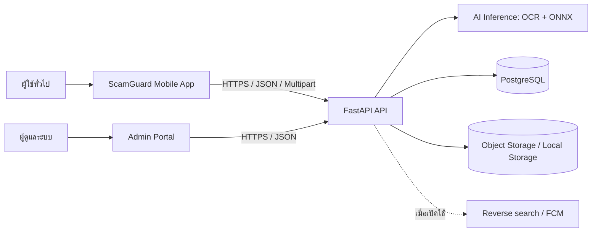

# เอกสารข้อกำหนดความต้องการซอฟต์แวร์
# Software Requirements Specification (SRS)

## ScamGuard — ระบบตรวจสอบความเสี่ยงของรูปภาพเพื่อป้องกันการหลอกลวง

| รายการ | รายละเอียด |
|---|---|
| รหัสเอกสาร | SRS-SCAMGUARD-001 |
| รุ่นเอกสาร | 1.0 (Baseline) |
| วันที่ | 8 สิงหาคม 2569 |
| สถานะ | ร่างเพื่อทบทวนและรับรองความต้องการ |
| เจ้าของเอกสาร | ทีมโครงงาน ScamGuard |

---

## ประวัติการแก้ไข

| รุ่น | วันที่ | ผู้แก้ไข | สรุปการเปลี่ยนแปลง |
|---|---:|---|---|
| 1.0 | 8 ส.ค. 2569 | ทีมโครงงาน | สร้าง SRS ฉบับสมบูรณ์จากขอบเขตระบบ Mobile, API, AI และ Admin Portal |

## สารบัญ

1. [บทนำ](#1-บทนำ)
2. [คำอธิบายระบบโดยรวม](#2-คำอธิบายระบบโดยรวม)
3. [ขอบเขตและกฎทางธุรกิจ](#3-ขอบเขตและกฎทางธุรกิจ)
4. [ข้อกำหนดเชิงฟังก์ชัน](#4-ข้อกำหนดเชิงฟังก์ชัน)
5. [ข้อกำหนดด้านส่วนติดต่อและข้อมูล](#5-ข้อกำหนดด้านส่วนติดต่อและข้อมูล)
6. [ข้อกำหนดที่ไม่ใช่เชิงฟังก์ชัน](#6-ข้อกำหนดที่ไม่ใช่เชิงฟังก์ชัน)
7. [กรณีใช้งานและเกณฑ์ยอมรับ](#7-กรณีใช้งานและเกณฑ์ยอมรับ)
8. [การตรวจสอบย้อนกลับและการบริหารข้อกำหนด](#8-การตรวจสอบย้อนกลับและการบริหารข้อกำหนด)
9. [ภาคผนวก](#9-ภาคผนวก)

---

# 1. บทนำ

## 1.1 วัตถุประสงค์

ScamGuard เป็นระบบสำหรับช่วยผู้ใช้ประเมินความเสี่ยงของรูปภาพที่น่าสงสัย เช่น สลิปโอนเงินปลอม ภาพโฆษณาหลอกลวง หรือภาพที่อาจถูกสร้าง/ดัดแปลงด้วย AI ระบบรับภาพจากผู้ใช้ วิเคราะห์ข้อความ ร่องรอยทางทัศนภาพ และข้อมูลแหล่งที่มา แล้วแสดงคะแนนความเสี่ยงพร้อมคำอธิบายเพื่อใช้ประกอบการตัดสินใจ

วัตถุประสงค์ของเอกสารฉบับนี้คือกำหนดขอบเขต พฤติกรรม คุณภาพ ข้อจำกัด และเกณฑ์ตรวจรับของระบบให้ผู้มีส่วนได้ส่วนเสียเข้าใจตรงกัน เอกสารนี้เป็นฐานสำหรับออกแบบ พัฒนา ทดสอบ UAT และติดตามการเปลี่ยนแปลงของโครงการ

## 1.2 ขอบเขตผลิตภัณฑ์

ระบบประกอบด้วย Mobile App สำหรับผู้ใช้ทั่วไป, REST API/บริการประมวลผล, ฐานข้อมูลและที่เก็บภาพ, AI inference และ Admin Portal สำหรับเจ้าหน้าที่ ระบบวิเคราะห์ภาพแบบหลายชั้นดังนี้

1. **Textual analysis** — OCR ข้อความไทย/อังกฤษและตรวจคำหรือรูปแบบที่มีความเสี่ยง
2. **Visual analysis** — ตรวจความน่าจะเป็นของภาพที่สร้างด้วย AI และสร้าง heatmap เพื่อชี้บริเวณที่โมเดลให้ความสำคัญ
3. **Source analysis** — จัดเก็บ/แสดงผลการตรวจสอบแหล่งที่มาหรือผล reverse-image search เมื่อมีบริการภายนอกที่พร้อมใช้งาน

ผลลัพธ์เป็น “การประเมินความเสี่ยง” ไม่ใช่คำวินิจฉัยว่าเป็นการฉ้อโกง และไม่อาจใช้แทนคำแนะนำทางกฎหมาย การเงิน หรือหลักฐานพิสูจน์ข้อเท็จจริง

## 1.3 เป้าหมายทางธุรกิจ

| รหัส | เป้าหมาย |
|---|---|
| BR-01 | ให้ผู้ใช้ตรวจภาพน่าสงสัยผ่านอุปกรณ์เคลื่อนที่ได้ง่ายและรวดเร็ว |
| BR-02 | เพิ่มคุณภาพการคัดกรองด้วยการรวมสัญญาณจากข้อความ ภาพ และแหล่งที่มา |
| BR-03 | อธิบายผลที่เข้าใจได้ด้วยคะแนน ระดับความเสี่ยง และ heatmap |
| BR-04 | ให้ผู้ใช้เก็บประวัติและแจ้งรายงานภาพน่าสงสัยได้อย่างควบคุมความเป็นส่วนตัว |
| BR-05 | ให้ผู้ดูแลระบบตรวจสอบรายงาน จัดการบัญชี และติดตามการดำเนินงานได้ |
| BR-06 | ปกป้องข้อมูลส่วนบุคคลและมีบันทึกการดำเนินการสำคัญที่ตรวจสอบย้อนหลังได้ |

## 1.4 คำจำกัดความและคำย่อ

| คำ | ความหมาย |
|---|---|
| AI | ปัญญาประดิษฐ์ (Artificial Intelligence) |
| API | ส่วนติดต่อระหว่างโปรแกรมผ่านเครือข่าย |
| Admin | ผู้ดูแลระบบที่ได้รับสิทธิ์บริหาร |
| Consent | การให้ความยินยอมของเจ้าของข้อมูล |
| EXIF | ข้อมูลกำกับที่อาจฝังอยู่ในไฟล์ภาพ |
| Heatmap | ภาพระบุบริเวณที่โมเดลใช้ประกอบการประเมิน |
| OCR | การรู้จำข้อความจากภาพ |
| PDPA | พระราชบัญญัติคุ้มครองข้อมูลส่วนบุคคล |
| Risk score | คะแนนความเสี่ยง 0–100 ซึ่งไม่ใช่ค่าความแน่นอนของการฉ้อโกง |
| RBAC | การควบคุมสิทธิ์ตามบทบาท |
| Scan | รายการรับภาพหนึ่งรายการพร้อมผลวิเคราะห์ |

## 1.5 เอกสารอ้างอิง

| เอกสาร | จุดประสงค์ |
|---|---|
| `planning/scam_image_mobile/requirements.md` | ข้อกำหนดหน้าจอและประสบการณ์ Mobile App |
| `wiki/planning/project-scope.md` | ขอบเขตโครงการและส่วนประกอบระบบ |
| `Document/C1-System-Context-Diagram.md` และ `Document/C2-Container-Diagram.md` | บริบทและสถาปัตยกรรมระดับสูง |
| `server/app/api/v1/` และ `server/app/schemas/` | สัญญา API ที่พัฒนาอยู่ในปัจจุบัน |

---

# 2. คำอธิบายระบบโดยรวม

## 2.1 มุมมองผลิตภัณฑ์

Mobile App เป็นช่องทางหลักของผู้ใช้ Android ส่วน Admin Portal ใช้บริหารระบบผ่านเว็บ API ทำหน้าที่ตรวจสอบสิทธิ์ รับไฟล์ บันทึกผล และเรียกบริการวิเคราะห์ ทั้งผลวิเคราะห์และข้อมูลที่จำเป็นจะถูกจัดเก็บโดยแยกความรับผิดชอบของข้อมูลบัญชี รายการสแกน รายงาน และ audit log

## 2.2 กลุ่มผู้ใช้

| บทบาท | คุณลักษณะ | สิทธิ์หลัก |
|---|---|---|
| ผู้ใช้ทั่วไป (User) | ผู้ใช้โทรศัพท์ Android ที่ต้องการประเมินภาพ | จัดการบัญชีตนเอง อัปโหลดภาพ ดู/จัดการรายการของตน ส่งรายงาน |
| ผู้วิจัย (Researcher) | บทบาทที่อาจขยายในอนาคต | ใช้เฉพาะเมื่ออนุมัติกระบวนการข้อมูลวิจัย; ไม่ใช่สิทธิ์ Admin โดยอัตโนมัติ |
| ผู้ดูแลระบบ (Admin) | เจ้าหน้าที่ที่ผ่านการแต่งตั้ง | ดูสถิติ จัดการผู้ใช้ ตรวจและตัดสินรายงาน จัดการรุ่นโมเดล และดู audit log |

บัญชีที่ถูกปิดใช้งานต้องไม่สามารถขอ token ใหม่หรือใช้ API ที่ต้องยืนยันตัวตนได้

## 2.3 ฟังก์ชันหลัก

| กลุ่ม | ความสามารถ |
|---|---|
| บัญชีและความยินยอม | สมัครสมาชิก ล็อกอิน ต่ออายุ session ออกจากระบบ และบันทึก consent |
| การสแกน | เลือก/ครอบตัดภาพ ตรวจชนิดและขนาดไฟล์ ส่งภาพ ประมวลผล และแสดงผล |
| ผลวิเคราะห์ | แสดงคะแนนรวม/รายด้าน คำสำคัญ OCR metadata แหล่งที่มา และ heatmap เมื่อมี |
| ประวัติและรายงาน | เรียกดู ค้นหา กรอง ลบประวัติของตน และรายงานภาพที่เชื่อว่าน่าสงสัย |
| ผู้ดูแลระบบ | แดชบอร์ด ผู้ใช้ คิวรายงาน รุ่นโมเดล และ audit log |

## 2.4 ข้อจำกัดและสิ่งที่อยู่นอกขอบเขต

### ข้อจำกัด

- รุ่นแรกมุ่งรองรับ Android; iOS ไม่อยู่ในขอบเขตการส่งมอบนี้
- การวิเคราะห์เป็นแบบ server-side จึงต้องเชื่อมต่ออินเทอร์เน็ต
- ผล OCR และ AI ขึ้นกับคุณภาพภาพ ชุดข้อมูล และรุ่นโมเดล จึงไม่มีการรับประกันความถูกต้อง 100%
- บริการ reverse search และ push notification เป็น integration ภายนอก; ต้องเสื่อมสภาพอย่างปลอดภัยเมื่อบริการไม่พร้อม

### นอกขอบเขต v1

- วิเคราะห์วิดีโอหรือเสียง
- inference บนอุปกรณ์ทั้งหมด (on-device inference)
- การตัดสินคดี การยืนยันตัวตนบุคคล หรือการแจ้งหน่วยงานภายนอกโดยอัตโนมัติ
- การอ้างว่าระบบรับรองว่าภาพ “จริง” หรือ “ปลอม” อย่างเด็ดขาด

## 2.5 สมมติฐานและการพึ่งพา

- ผู้ใช้มีบัญชีและอินเทอร์เน็ตก่อนเรียกใช้ฟังก์ชันที่ต้องใช้ API
- การจัดเก็บภาพและฐานข้อมูลพร้อมใช้งานตามสภาพแวดล้อมที่ติดตั้ง
- ผู้ดูแลระบบกำหนดรุ่นโมเดลที่ active เพียงรุ่นเดียวในแต่ละครั้ง
- การเชื่อมต่อ Google/ผู้ให้บริการค้นหาภาพและ FCM ต้องมี credential และนโยบายใช้งานที่ถูกต้องก่อนเปิดให้บริการจริง

---

# 3. ขอบเขตและกฎทางธุรกิจ

## 3.1 กฎทางธุรกิจ

| รหัส | กฎ |
|---|---|
| BUS-01 | ผู้ใช้ต้องยอมรับเงื่อนไขการใช้ระบบก่อนใช้บริการที่ต้องมีบัญชี; ความยินยอมเพื่อใช้ข้อมูลวิจัยเป็นทางเลือก |
| BUS-02 | อีเมลหนึ่งรายการลงทะเบียนได้หนึ่งบัญชีเท่านั้น |
| BUS-03 | ผู้ใช้ดูหรือรายงานได้เฉพาะ scan ของตน; Admin ดูได้ตามสิทธิ์บริหาร |
| BUS-04 | ไฟล์ภาพต้องเป็นไฟล์ภาพที่ถอดรหัสได้จริง ไม่เชื่อ `Content-Type` เพียงอย่างเดียว |
| BUS-05 | ขนาดไฟล์ที่ API ยอมรับสูงสุดคือ 20 MB และขนาดภาพหลังถอดรหัสสูงสุด 100 ล้านพิกเซล; Mobile App ควรบีบอัดหรือแจ้งผู้ใช้ก่อนส่งเมื่อภาพมีขนาดมาก |
| BUS-06 | คะแนนแต่ละด้านและคะแนนรวมอยู่ในช่วง 0–100 และต้องจัดเก็บผลพร้อมเวลาเสร็จสิ้น |
| BUS-07 | เกณฑ์ระดับความเสี่ยง: ต่ำ 0–39, ปานกลาง 40–69, สูง 70–100; หาก `visual_score ≥ 80` ให้ระดับสูงแม้คะแนนถ่วงน้ำหนักต่ำกว่า 70 |
| BUS-08 | สูตรคะแนนรวม: `round(text×0.25 + visual×0.45 + source×0.30)` แล้วจำกัดผลให้อยู่ใน 0–100 |
| BUS-09 | ผู้ใช้รายงาน scan เดิมซ้ำไม่ได้; รายงานต้องมีคำอธิบายอย่างน้อย 10 ตัวอักษร |
| BUS-10 | สถานะรายงานใช้ `pending`, `reviewing`, `approved`, `rejected`; การปฏิเสธต้องมีบันทึกคำอธิบายของ Admin |
| BUS-11 | การเปลี่ยนบทบาท/สถานะผู้ใช้ การตัดสินรายงาน และการดำเนินการกับรุ่นโมเดลต้องมี audit log |
| BUS-12 | ผลการวิเคราะห์ต้องมีข้อความเตือนว่าใช้เพื่อประกอบการตัดสินใจ ไม่ใช่ข้อสรุปการฉ้อโกง |

## 3.2 ลำดับความสำคัญ

| ระดับ | ความหมาย |
|---|---|
| Must | ต้องมีจึงจะถือว่ารุ่นนี้ใช้งานได้ |
| Should | สำคัญ ควรส่งมอบหากไม่กระทบ Must |
| Could | เพิ่มคุณค่า แต่เลื่อนได้ |

---

# 4. ข้อกำหนดเชิงฟังก์ชัน

## 4.1 บัญชีและความยินยอม

### FR-AUTH-001 — สมัครสมาชิก

**ลำดับความสำคัญ:** Must
ระบบต้องให้ผู้ใช้สมัครด้วย `full_name`, อีเมล, รหัสผ่าน, `system_consent` และ `research_consent` โดยต้องตรวจรูปแบบอีเมลและปฏิเสธอีเมลที่มีอยู่แล้ว ระบบต้อง hash รหัสผ่านก่อนบันทึก และบันทึก consent แยกเป็น audit record พร้อมเวลา หากสำเร็จต้องตอบข้อมูลบัญชีโดยไม่ส่งรหัสผ่านกลับ

**เกณฑ์ยอมรับ:** ส่งอีเมลซ้ำได้ HTTP 400; สมัครสำเร็จได้ HTTP 201; ไม่มีรหัสผ่านหรือ hash ใน response

### FR-AUTH-002 — ล็อกอิน ต่ออายุ และออกจากระบบ

**ลำดับความสำคัญ:** Must
ระบบต้องรับอีเมล/รหัสผ่านผ่าน OAuth2 password form, ออก access token และ refresh token แบบ Bearer, รองรับการต่ออายุด้วย refresh token ที่ถูกต้อง และปฏิเสธ token หมดอายุ/ไม่ถูกต้อง/บัญชีไม่ active ผู้ใช้ Mobile ต้องเก็บ token ใน secure storage และลบ token กับ cache ที่มีข้อมูลส่วนบุคคลเมื่อออกจากระบบ

**เกณฑ์ยอมรับ:** รหัสผ่านผิดได้ HTTP 401; บัญชีปิดใช้งานได้ HTTP 403; access token ใช้ได้ 60 นาทีและ refresh token ใช้ได้ 7 วันตามค่าตั้งต้นที่กำหนดได้จาก environment

### FR-AUTH-003 — Consent และความเป็นส่วนตัว

**ลำดับความสำคัญ:** Must
Mobile App ต้องมี onboarding อธิบายวัตถุประสงค์การใช้ข้อมูล ให้เลือกยอมรับเงื่อนไขบังคับและ consent เพื่อการวิจัยแบบไม่บังคับ ปุ่มดำเนินการต่อใช้ไม่ได้จนกว่าจะยอมรับข้อบังคับ ผู้ใช้ต้องดูสถานะ consent และถอน research consent ได้โดยไม่ทำให้ใช้ฟังก์ชันพื้นฐานไม่ได้

> การส่งสำเนาข้อมูลและลบบัญชีเป็นความสามารถระดับ Should จนกว่าจะมี endpoint และกระบวนการ retention ที่อนุมัติแล้ว

## 4.2 การรับและวิเคราะห์ภาพ

### FR-SCAN-001 — เลือกภาพและเตรียมภาพ

**ลำดับความสำคัญ:** Must
Mobile App ต้องให้ผู้ใช้เลือกภาพจากคลัง และควรรองรับการถ่ายภาพเมื่อ permission พร้อมใช้งาน ต้องรองรับ JPG/JPEG, PNG และ WebP พร้อมแสดงข้อผิดพลาดที่เข้าใจได้หากชนิดไฟล์ไม่รองรับ ขนาดเกินกำหนด หรือ permission ถูกปฏิเสธ ผู้ใช้ต้องสามารถ preview, crop, หมุน หรือเปลี่ยนภาพก่อนส่ง และต้องยืนยันก่อนทิ้งการแก้ไขที่ยังไม่ส่ง

### FR-SCAN-002 — ส่งภาพและตรวจสอบไฟล์

**ลำดับความสำคัญ:** Must
API `POST /api/v1/scan/` ต้องรับ `multipart/form-data` field ชื่อ `file` จากผู้ใช้ที่ผ่านการยืนยันตัวตน ระบบต้องตรวจว่าไฟล์ไม่ว่าง ไม่เกิน 20 MB และถอดรหัสเป็นภาพได้จริงก่อนเริ่มวิเคราะห์ ระบบต้องป้องกันภาพที่มีขนาดเกิน 100 ล้านพิกเซล และตอบ HTTP 400 สำหรับไฟล์ว่าง/ไม่ใช่ภาพ กับ HTTP 413 สำหรับไฟล์เกินขนาด

### FR-SCAN-003 — วิเคราะห์แบบหลายชั้น

**ลำดับความสำคัญ:** Must
หลังตรวจไฟล์ ระบบต้องทำงานตามลำดับต่อไปนี้: (1) อ่าน EXIF ที่ปลอดภัย (2) สร้าง PNG lossless เพื่อให้ภาพที่เก็บและภาพที่ส่งเข้า inference มีพิกเซลเดียวกัน (3) สร้าง SHA-256 hash ของไฟล์ต้นฉบับ (4) เรียก OCR/AI inference (5) ตรวจคำเสี่ยงจากข้อความ OCR (6) คำนวณคะแนนและบันทึก scan เป็น `completed` พร้อมเวลาสำเร็จ

คำเสี่ยงเริ่มต้นประกอบด้วย `ด่วน`, `โบนัส`, `กู้เงิน`, `รับเงิน`, `ลงทุน`, `อนุมัติไว`, `ได้เงินจริง`, `คลิก`, `เครดิตฟรี`, `แจกฟรี`, `หลุด` และต้องออกแบบให้ปรับปรุงรายการได้โดยไม่ต้องแก้ Mobile UI

### FR-SCAN-004 — คำนวณและแสดงผล

**ลำดับความสำคัญ:** Must
ระบบต้องส่งคืน `id`, image hash, URL ภาพและ heatmap (ถ้ามี), `text_score`, `visual_score`, `source_score`, `total_risk_score`, `risk_grade`, EXIF, ข้อความ OCR, คำที่พบ, ผล source analysis, ความน่าจะเป็นภาพ AI, สถานะ และเวลา ผลบน Mobile ต้องแสดงคะแนน 0–100, badge สีพร้อมข้อความ, สรุปภาษาง่าย และคำเตือนตาม BUS-12

### FR-SCAN-005 — Heatmap และรายละเอียดผล

**ลำดับความสำคัญ:** Should
เมื่อมี heatmap ระบบต้องให้ผู้ใช้เปิดหน้ารายละเอียด สลับภาพต้นฉบับ/heatmap ปรับ opacity, zoom และ pan ได้ พร้อมคำอธิบายว่าสีร้อนหมายถึงบริเวณที่โมเดลให้ความสำคัญ ไม่ได้ยืนยันว่าพื้นที่นั้นถูกปลอมโดยเด็ดขาด

### FR-SCAN-006 — สถานะและการแจ้งเตือน

**ลำดับความสำคัญ:** Should
Mobile App ต้องแสดง loading/progress และ error state ที่ retry ได้ สำหรับสถาปัตยกรรม asynchronous ในอนาคต สามารถ polling สถานะทุก 3 วินาทีจนเสร็จหรือ 120 วินาที แล้วแจ้งผลผ่าน FCM เมื่อผู้ใช้อนุญาตการแจ้งเตือน ใน implementation ปัจจุบัน API ส่งผล synchronous จึงต้องแสดงผลเมื่อ response สำเร็จโดยไม่บังคับ polling

## 4.3 ประวัติ การแชร์ และรายงาน

### FR-HIST-001 — ประวัติการสแกน

**ลำดับความสำคัญ:** Must
ระบบต้องบันทึก scan พร้อมผู้เป็นเจ้าของ วันที่ คะแนน สถานะ และ URL ภาพ/heatmap ผู้ใช้ต้องเรียกดูผลรายรายการผ่าน `GET /api/v1/scan/{scan_id}` ได้เฉพาะรายการของตนเอง Admin เข้าถึงได้ตามสิทธิ์ หน้าประวัติควรแสดง thumbnail วันที่ คะแนนและระดับความเสี่ยง ค้นหา/กรองตามระดับและวันที่, pull-to-refresh, empty state และยืนยันก่อนลบ

> Endpoint list/search/delete ของประวัติเป็นข้อกำหนด Must ของผลิตภัณฑ์ แต่ยังต้องเพิ่มใน API ก่อนถือว่าพร้อมส่งมอบเต็มรูปแบบ

### FR-HIST-002 — แชร์ผล

**ลำดับความสำคัญ:** Could
ผู้ใช้ควรแชร์ summary ที่ไม่มี token, ข้อมูลบัญชี หรือ URL ไฟล์ส่วนตัวได้ ระบบต้องยืนยันเนื้อหาก่อนส่งให้ share sheet ของอุปกรณ์

### FR-REPORT-001 — ส่งรายงานภาพต้องสงสัย

**ลำดับความสำคัญ:** Must
ผู้ใช้ที่ล็อกอินต้องส่งรายงานผ่าน `POST /api/v1/reports` โดยระบุ `scan_id`, category, description ความยาวอย่างน้อย 10 ตัวอักษร และอาจระบุ platform, reference URL และ `allow_research_use` ได้ ระบบต้องตรวจว่า scan เป็นของผู้ใช้, ป้องกันการรายงานซ้ำ และสร้างรายการสถานะ `pending` หากสำเร็จตอบ HTTP 201 พร้อมข้อความยืนยัน

### FR-REPORT-002 — ดูรายงานของตน

**ลำดับความสำคัญ:** Should
ผู้ใช้ต้องเรียกดูรายงานของตนผ่าน `GET /api/v1/reports/my` โดยรองรับ `page`, `limit` และ filter `status`; ระบบต้องส่ง items, total, page และ limit

## 4.4 ฟังก์ชันผู้ดูแลระบบ

### FR-ADMIN-001 — ยืนยันตัวตนผู้ดูแล

**ลำดับความสำคัญ:** Must
Admin Portal ต้องล็อกอินและต่ออายุ token ผ่าน `/api/v1/admin/login` และ `/api/v1/admin/refresh` แยกจากบัญชีผู้ใช้ทั่วไป ทุก endpoint ฝั่ง Admin ต้องตรวจบทบาท `admin` และสถานะ active ก่อนทำงาน

### FR-ADMIN-002 — แดชบอร์ด

**ลำดับความสำคัญ:** Must
Admin ต้องดู dashboard ที่สรุปจำนวนผู้ใช้, scan, การกระจาย low/medium/high, สถานะรายงาน, หมวดรายงาน, แนวโน้ม scan และสถานะรุ่นโมเดลได้ผ่าน `GET /api/v1/admin/dashboard`

### FR-ADMIN-003 — จัดการรายงาน

**ลำดับความสำคัญ:** Must
Admin ต้องดูรายการ/รายละเอียดรายงาน กรองตาม status/category และเปลี่ยนสถานะเป็น `approved` หรือ `rejected` ได้ การปฏิเสธต้องมี `admin_note` ทุกการตัดสินต้องบันทึกผู้ทำและเวลา รวมทั้งสร้าง audit log

### FR-ADMIN-004 — จัดการผู้ใช้

**ลำดับความสำคัญ:** Must
Admin ต้องดูรายการและรายละเอียดผู้ใช้พร้อมสถิติพื้นฐาน และแก้ไข `role` หรือ `is_active` ได้ ระบบต้องบันทึกการเปลี่ยนแปลงที่มีผลต่อสิทธิ์ใน audit log และไม่เปิดเผย password/hash

### FR-ADMIN-005 — จัดการรุ่นโมเดลและ audit log

**ลำดับความสำคัญ:** Should
Admin ต้องดูรุ่นโมเดล, เปิดใช้งานรุ่นที่ผ่านการอนุมัติ, ดูเวลา deploy และเข้าถึง audit logs แบบแบ่งหน้าได้ การเปิดใช้รุ่นใหม่ต้องไม่ทำให้มีมากกว่าหนึ่งรุ่นที่ active และต้องบันทึกการกระทำพร้อมผู้กระทำ

---

# 5. ข้อกำหนดด้านส่วนติดต่อและข้อมูล

## 5.1 ส่วนติดต่อผู้ใช้

### Mobile App

| หน้าจอ | เนื้อหา/พฤติกรรมขั้นต่ำ |
|---|---|
| Splash / Onboarding | ตรวจ token, แสดง consent และนำทางตามสถานะ |
| Login / Register | validation, แสดง/ซ่อน password, error ที่ผู้ใช้เข้าใจได้ |
| Home / Scan | เลือกภาพ, safety tips, ประวัติล่าสุด |
| Preview & Crop | preview, crop, rotate, เปลี่ยนภาพ, ยืนยันก่อน discard |
| Loading / Result | สถานะวิเคราะห์ คะแนน badge summary และการเปิดรายละเอียด |
| Heatmap | original/heatmap, opacity, zoom/pan และคำอธิบาย |
| History / Detail | รายการ ค้นหา กรอง empty/error state และรายละเอียด |
| Report | category, description, platform, URL, consent เพื่อวิจัย |
| Settings / Profile | แก้ชื่อ, theme/language, privacy/consent และ logout |

Mobile App ต้องมี bottom navigation อย่างน้อย 4 จุด: หน้าหลัก, ประวัติ, รายงาน, ตั้งค่า ใช้ภาษาไทยเป็นภาษาเริ่มต้น รองรับ Dark และ Light mode และต้องแสดง loading, empty และ error state ทุกหน้าที่ดึงข้อมูลจากเครือข่าย

### Admin Portal

ต้องมี Login, Dashboard, Users, Reports, Models และ Audit logs ใช้การนำทางที่แยกพื้นที่บริหารชัดเจน และไม่แสดงข้อมูลมากกว่าที่บทบาท Admin ได้รับอนุญาต

## 5.2 ส่วนติดต่อซอฟต์แวร์ (API)

การเรียก API ใช้ HTTPS ใน production, JSON สำหรับ body ปกติ, UTF-8 และ `Authorization: Bearer <access_token>` สำหรับ endpoint ที่ป้องกัน เว้นแต่ endpoint login/register

| วิธี/เส้นทาง | ผู้มีสิทธิ์ | หน้าที่ |
|---|---|---|
| `POST /api/v1/auth/register` | สาธารณะ | สร้างบัญชีและ consent log |
| `POST /api/v1/auth/login` | สาธารณะ | รับ token ผู้ใช้ |
| `POST /api/v1/auth/refresh` | มี refresh token | ต่ออายุ token ผู้ใช้ |
| `POST /api/v1/scan/` | User | ส่งภาพและรับผลวิเคราะห์ |
| `GET /api/v1/scan/{scan_id}` | เจ้าของ/Admin | รับผล scan รายการเดียว |
| `POST /api/v1/reports` | User | ส่งรายงาน |
| `GET /api/v1/reports/categories` | สาธารณะ/ผู้ใช้ | รับหมวดรายงาน |
| `GET /api/v1/reports/my` | User | รับรายงานของตน |
| `POST /api/v1/admin/login` | สาธารณะ | รับ token Admin |
| `POST /api/v1/admin/refresh` | มี refresh token | ต่ออายุ token Admin |
| `GET /api/v1/admin/dashboard` | Admin | ดูสถิติ |
| `GET/PATCH /api/v1/admin/reports...` | Admin | ดู/ตัดสินรายงาน |
| `GET/PATCH /api/v1/admin/users...` | Admin | ดู/แก้ผู้ใช้ |
| `GET/... /api/v1/admin/models...` | Admin | จัดการรุ่นโมเดล |
| `GET /health` | สาธารณะ | ตรวจสุขภาพบริการและรุ่น API |

รูปแบบ error ต้องเป็น HTTP status ที่ถูกต้องและข้อความที่ปลอดภัยสำหรับผู้ใช้ ห้ามส่ง stack trace, secret, token, path ภายใน หรือข้อมูลของผู้ใช้อื่นกลับไป

## 5.3 แบบจำลองข้อมูลเชิงตรรกะ

| เอนทิตี | ข้อมูลสำคัญ | ความสัมพันธ์ |
|---|---|---|
| User | id, email, hashed_password, full_name, role, is_active, timestamps | มี Scan และ ConsentLog หลายรายการ |
| ConsentLog | user_id, system_consent, research_consent, IP/user agent (เมื่อมี), created_at | เป็นบันทึกความยินยอมของ User |
| Scan | UUID, user_id, image_hash, URLs, คะแนน, OCR/EXIF, สถานะ, timestamps | เป็นของ User และอาจมี ScamReport |
| ScamReport | user_id, scan_id, category, reason/description, status, note, moderator | อ้างถึง User และ Scan |
| Admin | id, email, hashed_password, full_name, is_active | ทำ audit/moderate report |
| ModelVersion | version_tag, file_path, is_active, deployed_at | ใช้บอกโมเดลที่ deploy |
| AuditLog | admin_id, action, details, created_at | เก็บการดำเนินการ Admin |

ข้อมูลภาพต้องใช้ SHA-256 `image_hash` เพื่ออ้างอิง/ตรวจซ้ำ แต่ไม่ถือว่า hash เป็นการทำให้ข้อมูลนิรนามโดยสมบูรณ์

## 5.4 การจัดเก็บและอายุข้อมูล

- ภาพต้นฉบับและ heatmap จัดเก็บใน local/object storage ตาม environment และต้องจำกัดสิทธิ์อ่าน
- ข้อมูลรายงานที่ผู้ใช้เลือก `allow_research_use=false` ต้องไม่ถูกนำไปใช้สร้างชุดข้อมูลวิจัย
- นโยบาย retention, การลบบัญชี และการส่งออกข้อมูลต้องได้รับอนุมัติจากเจ้าของระบบ/ผู้รับผิดชอบ PDPA ก่อน production; จนกว่าจะอนุมัติ ห้ามอ้างว่าระบบลบข้อมูลครบถ้วนโดยอัตโนมัติ
- backup ต้องเข้ารหัสและทดสอบการกู้คืนตามข้อกำหนดการปฏิบัติการ

---

# 6. ข้อกำหนดที่ไม่ใช่เชิงฟังก์ชัน

| รหัส | หมวด | ข้อกำหนดและเกณฑ์ตรวจ |
|---|---|---|
| NFR-PERF-001 | ประสิทธิภาพ | หน้าหลัก Mobile ต้องพร้อมใช้งานภายใน 3 วินาทีบนอุปกรณ์/เครือข่ายทดสอบที่ตกลงกัน โดยไม่รวมเวลาวิเคราะห์ภาพ |
| NFR-PERF-002 | ประสิทธิภาพ | การเลือกภาพและเข้า preview ควรเสร็จภายใน 1 วินาทีสำหรับภาพภายในข้อจำกัดอุปกรณ์ |
| NFR-PERF-003 | ประสิทธิภาพ | ระบบต้องบันทึกระยะเวลาการวิเคราะห์ต่อ scan เพื่อติดตาม baseline; เป้าหมายบริการคือ median ไม่เกิน 15 วินาทีต่อภาพในสภาพแวดล้อมทดสอบที่ระบุแยกต่างหาก |
| NFR-SEC-001 | การสื่อสาร | Production API ต้องใช้ HTTPS/TLS; ห้ามส่ง password หรือ token ใน URL/query string |
| NFR-SEC-002 | การยืนยันตัวตน | รหัสผ่านต้อง hash ด้วยอัลกอริทึมที่เหมาะสม; access/refresh token ต้องหมดอายุตามการตั้งค่าและตรวจลายเซ็นก่อนใช้ |
| NFR-SEC-003 | การอนุญาต | ทุก resource ที่มีเจ้าของต้องตรวจ ownership; endpoint Admin ต้องบังคับ RBAC ทุกครั้ง |
| NFR-SEC-004 | ป้องกันข้อมูลนำเข้า | API ต้องตรวจขนาดและถอดรหัสไฟล์ภาพจริง จำกัดขนาดภาพ และมี rate limit เริ่มต้น 60 คำขอต่อชั่วโมงต่อ client IP ซึ่งต้องปรับได้จาก config |
| NFR-REL-001 | ความเชื่อถือได้ | ความผิดพลาดจาก OCR/AI/บริการภายนอกต้องให้ error state ที่กู้คืนได้หรือผลบางส่วนที่ระบุชัดว่าไม่ครบ ห้ามบันทึกผลสำเร็จปลอม |
| NFR-REL-002 | ความถูกต้องข้อมูล | การบันทึก Scan, Report และการเปลี่ยนสถานะสำคัญต้องเป็นธุรกรรมที่ไม่ทิ้งข้อมูลครึ่งรายการ |
| NFR-USE-001 | การใช้งาน | ระดับความเสี่ยงต้องสื่อทั้งสีและข้อความ; ไม่มีการใช้สีเพียงอย่างเดียวในการตัดสินความหมาย |
| NFR-ACC-001 | การเข้าถึง | เป้าหมายพื้นที่แตะอย่างน้อย 44×44 px, icon มี semantic label, รองรับ dynamic font โดยหน้าจอไม่ซ้อนทับ และมี contrast เพียงพอ |
| NFR-I18N-001 | ภาษา | ภาษาเริ่มต้นเป็นไทย และข้อความ error/คำเตือนต้องเขียนด้วยภาษาที่ผู้ใช้ทั่วไปเข้าใจ; ตัวเลข/วันที่ต้องจัดรูปแบบตาม locale ที่เลือก |
| NFR-MNT-001 | การบำรุงรักษา | Mobile ใช้ Clean Architecture (Presentation/Domain/Data) และ BLoC/Cubit; Backend แยก router/schema/service/model เพื่อให้ทดสอบและแก้ไขได้ |
| NFR-OBS-001 | การสังเกตการณ์ | API ต้องมี `/health`, บันทึกเหตุขัดข้องโดยไม่เก็บ secret, และ audit log สำหรับกิจกรรม Admin ที่มีผลต่อข้อมูล/สิทธิ์ |
| NFR-SCALE-001 | การขยาย | งาน inference ที่ใช้ CPU/GPU ต้องไม่ block event loop ของ API และต้องออกแบบให้แยก/ขยาย worker ได้ในอนาคต |
| NFR-PRIV-001 | ความเป็นส่วนตัว | เก็บ consent แยกตามวัตถุประสงค์, ใช้ข้อมูลเท่าที่จำเป็น, จำกัดการเข้าถึงภาพและผล scan, และไม่ใช้ข้อมูลวิจัยหากไม่มี consent |
| NFR-TEST-001 | การทดสอบ | ทุก FR ระดับ Must ต้องมีอย่างน้อย unit, API integration หรือ UI test ที่ระบุรหัส requirement เป็นหลักฐานก่อนรับมอบ |

---

# 7. กรณีใช้งานและเกณฑ์ยอมรับ

## 7.1 ตารางสรุป Use Case

| รหัส | กรณีใช้งาน | Actor | FR หลัก |
|---|---|---|---|
| UC-01 | สมัครสมาชิกและให้ความยินยอม | User | FR-AUTH-001, 003 |
| UC-02 | เข้าสู่ระบบ/ต่ออายุ session | User/Admin | FR-AUTH-002, FR-ADMIN-001 |
| UC-03 | ส่งภาพเพื่อสแกน | User | FR-SCAN-001–004 |
| UC-04 | ดู heatmap และผลละเอียด | User | FR-SCAN-004–005 |
| UC-05 | เรียกดูประวัติ | User | FR-HIST-001 |
| UC-06 | รายงานภาพต้องสงสัย | User | FR-REPORT-001–002 |
| UC-07 | ตรวจและตัดสินรายงาน | Admin | FR-ADMIN-003 |
| UC-08 | จัดการผู้ใช้และโมเดล | Admin | FR-ADMIN-004–005 |

## 7.2 UC-03: ส่งภาพเพื่อสแกน

| รายการ | รายละเอียด |
|---|---|
| Actor หลัก | ผู้ใช้ที่ล็อกอิน |
| เงื่อนไขก่อนหน้า | มี access token ที่ใช้ได้ และอุปกรณ์เชื่อมต่อเครือข่าย |
| เหตุเริ่มต้น | ผู้ใช้เลือก “วิเคราะห์ภาพ” |
| กระแสหลัก | 1) เลือกภาพ 2) preview/crop/rotate ตามต้องการ 3) แอปตรวจเบื้องต้น 4) ส่งไฟล์พร้อม Bearer token 5) API ตรวจและวิเคราะห์ 6) API บันทึก Scan 7) แอปแสดงผลและคำเตือน |
| ทางเลือก/ข้อผิดพลาด | ไฟล์ไม่ใช่ภาพ/เกินขนาด → แจ้งและเลือกใหม่; token หมดอายุ → refresh/login; network/inference ล้มเหลว → แสดง Retry โดยไม่สร้างรายการสำเร็จปลอม |
| เงื่อนไขหลังจบ | มี Scan สถานะ completed และผู้ใช้ได้รับผล หรือได้รับ error ที่ดำเนินการต่อได้ |

## 7.3 UC-06: รายงานภาพต้องสงสัย

| รายการ | รายละเอียด |
|---|---|
| Actor หลัก | ผู้ใช้ที่ล็อกอิน |
| เงื่อนไขก่อนหน้า | Scan เป็นของผู้ใช้และยังไม่เคยรายงาน |
| กระแสหลัก | 1) ผู้ใช้เปิดผล scan 2) เลือกประเภทรายงาน 3) กรอกรายละเอียด ≥10 ตัวอักษร 4) ระบุแพลตฟอร์ม/URL และ consent เพื่อวิจัยถ้ามี 5) ส่ง 6) ระบบสร้าง `pending` และยืนยัน |
| ข้อยกเว้น | รายงานซ้ำ → HTTP 409; Scan ไม่ใช่ของผู้ใช้/ไม่พบ → HTTP 403; รายละเอียดสั้นเกิน → validation error |

## 7.4 UC-07: ผู้ดูแลตัดสินรายงาน

| รายการ | รายละเอียด |
|---|---|
| Actor หลัก | Admin ที่ active |
| กระแสหลัก | 1) ล็อกอิน 2) เปิดคิวรายงาน/กรอง 3) ตรวจข้อมูล 4) เลือก approve หรือ reject 5) กรอกเหตุผลเมื่อ reject 6) ระบบบันทึกสถานะ moderator เวลา และ audit log |
| ข้อยกเว้น | ไม่มีสิทธิ์ → 401/403; status ไม่ถูกต้อง → 400; reject ไม่มี note → 400 |

## 7.5 ชุดเกณฑ์ตรวจรับขั้นต่ำ

| รหัสทดสอบ | สถานการณ์ | ผลที่คาดหวัง |
|---|---|---|
| AT-01 | สมัครด้วยอีเมลใหม่และ consent | HTTP 201, User และ ConsentLog ถูกบันทึก, ไม่มี password ใน response |
| AT-02 | สมัครด้วยอีเมลเดิม | HTTP 400 และไม่เกิด User เพิ่ม |
| AT-03 | ล็อกอินถูกต้อง/ผิด/บัญชีปิด | ได้ token / HTTP 401 / HTTP 403 ตามลำดับ |
| AT-04 | ส่งไฟล์ภาพถูกต้อง ≤20 MB | ได้ Scan completed มีคะแนน 0–100 และเวลาสำเร็จ |
| AT-05 | ส่งไฟล์ว่างหรือไฟล์ที่ปลอม content type | HTTP 400 และไม่รัน inference |
| AT-06 | ส่งไฟล์ >20 MB | HTTP 413 และไม่บันทึก Scan |
| AT-07 | ผู้ใช้อื่นขอดู scan | HTTP 403; เจ้าของและ Admin เข้าถึงได้ |
| AT-08 | คะแนน visual 80 แต่คะแนนรวมต่ำ | `risk_grade=high` ตาม BUS-07 |
| AT-09 | รายงาน scan ของตนด้วย description 10 ตัวอักษร | HTTP 201 และสถานะ pending |
| AT-10 | รายงาน scan เดิมซ้ำ | HTTP 409 |
| AT-11 | Admin reject รายงานโดยไม่ใส่ note | HTTP 400; ไม่เปลี่ยนสถานะ |
| AT-12 | Admin เปลี่ยน role/is_active หรือผลรายงาน | มี audit log ระบุ action และเวลาการกระทำ |
| AT-13 | UI ใช้ระดับความเสี่ยง | badge มีทั้งสีและข้อความ ต่ำ/ปานกลาง/สูง |

---

# 8. การตรวจสอบย้อนกลับและการบริหารข้อกำหนด

## 8.1 Traceability Matrix

| เป้าหมายธุรกิจ | ข้อกำหนดสนับสนุน | หลักฐานทดสอบ |
|---|---|---|
| BR-01 | FR-AUTH-001–002, FR-SCAN-001–004 | AT-01–06 |
| BR-02 | FR-SCAN-003–004, BUS-06–08 | AT-04, AT-08 |
| BR-03 | FR-SCAN-004–005, NFR-USE-001 | AT-13 และ UI test |
| BR-04 | FR-HIST-001, FR-REPORT-001–002 | AT-07, AT-09–10 |
| BR-05 | FR-ADMIN-002–005, NFR-OBS-001 | AT-11–12 |
| BR-06 | FR-AUTH-003, NFR-SEC-001–004, NFR-PRIV-001 | security/privacy review |

## 8.2 สถานะความพร้อมเชิงผลิตภัณฑ์

ตารางนี้เป็นข้อมูลประกอบการวางแผน ไม่เปลี่ยนสถานะ normativity ของ FR ที่ระบุข้างต้น

| ส่วนงาน | สถานะจากโค้ดที่ตรวจ ณ baseline | ช่องว่างที่ต้องปิดก่อน release เต็มรูปแบบ |
|---|---|---|
| Auth/Consent API | มี register, login, refresh และ ConsentLog | validation นโยบาย password และ flow UI ให้ครบ |
| Scan API/AI | มี upload validation, hash, OCR/ONNX, risk score, heatmap และ get รายการเดียว | source/reverse search และ history list/delete |
| Report API | มีสร้างรายงาน, หมวด, รายงานของฉัน | ตรวจ contract ชื่อ `reason`/`description` ให้สอดคล้อง migration/schema |
| Admin API | มี login, dashboard, reports, users, models, audit endpoints | ทดสอบสิทธิ์และ workflow model activation แบบครบวงจร |
| Mobile App | มีโครงสร้าง Flutter และหน้าจอ/การทดสอบหลายส่วน | เชื่อม API ครบ, permission, history และ notification ตาม FR |

## 8.3 กระบวนการเปลี่ยนแปลง

1. ผู้ขอเปลี่ยนระบุรหัส requirement เหตุผล ผลกระทบ และลำดับความสำคัญ
2. เจ้าของเอกสารประเมินผลกระทบต่อขอบเขต ความปลอดภัย PDPA สถาปัตยกรรม งบ และกรณีทดสอบ
3. ผู้มีอำนาจอนุมัติบันทึกผลในประวัติรุ่นและปรับ Traceability Matrix
4. ทีมพัฒนา/QA อัปเดตโค้ด เอกสาร และหลักฐานทดสอบก่อนปิดคำขอ

---

# 9. ภาคผนวก

## ภาคผนวก A — สถานะและรหัสตอบกลับสำคัญ

| สถานะ | ความหมาย |
|---|---|
| 200 | คำขอสำเร็จ |
| 201 | สร้างทรัพยากรสำเร็จ |
| 400 | คำขอหรือข้อมูลนำเข้าไม่ถูกต้อง |
| 401 | ยังไม่ยืนยันตัวตน หรือ token ไม่ถูกต้อง/หมดอายุ |
| 403 | ยืนยันตัวตนแล้วแต่ไม่มีสิทธิ์ หรือบัญชีปิดใช้งาน |
| 404 | ไม่พบทรัพยากร |
| 409 | ขัดแย้งกับข้อมูลเดิม เช่น รายงาน scan ซ้ำ |
| 413 | ไฟล์ใหญ่เกินขีดจำกัด |
| 429 | เกินอัตราคำขอที่อนุญาต |
| 5xx | ความผิดพลาดภายใน; ต้องไม่เปิดเผยรายละเอียดทางเทคนิคแก่ผู้ใช้ |

## ภาคผนวก B — ค่าตั้งต้นที่ต้องควบคุมด้วย environment

| ค่า | ค่าเริ่มต้น baseline | หมายเหตุ |
|---|---:|---|
| Access token lifetime | 60 นาที | เปลี่ยนได้ตามนโยบายความปลอดภัย |
| Refresh token lifetime | 7 วัน | เปลี่ยนได้ตามนโยบายความปลอดภัย |
| ขนาดไฟล์สูงสุด | 20 MB | API canonical limit |
| ขนาดภาพหลัง decode สูงสุด | 100 MP | ป้องกัน decompression bomb |
| Rate limit | 60 requests/hour/IP | ต้องปรับตาม production workload |
| Source score เริ่มต้น | 20 | ต้องระบุความหมายเมื่อเปิด source integration จริง |

## ภาคผนวก C — ข้อควรระวังในการสื่อสารผล AI

- ใช้ข้อความ “ความเสี่ยงต่ำ/ปานกลาง/สูง” แทนคำว่า “เป็นของปลอมแน่นอน”
- แสดงปัจจัยที่มีข้อมูลจริงเท่านั้น; หาก OCR, heatmap หรือ source check ใช้ไม่ได้ ให้ระบุว่าไม่พร้อมแทนการคาดเดา
- แนะนำผู้ใช้ตรวจแหล่งที่มา ติดต่อหน่วยงาน/แพลตฟอร์มที่เกี่ยวข้อง หรือหยุดทำธุรกรรมเมื่อพบความเสี่ยงสูง
- ห้ามใช้คะแนนเป็นเกณฑ์อัตโนมัติในการลงโทษผู้ใช้หรือกล่าวหาบุคคล
