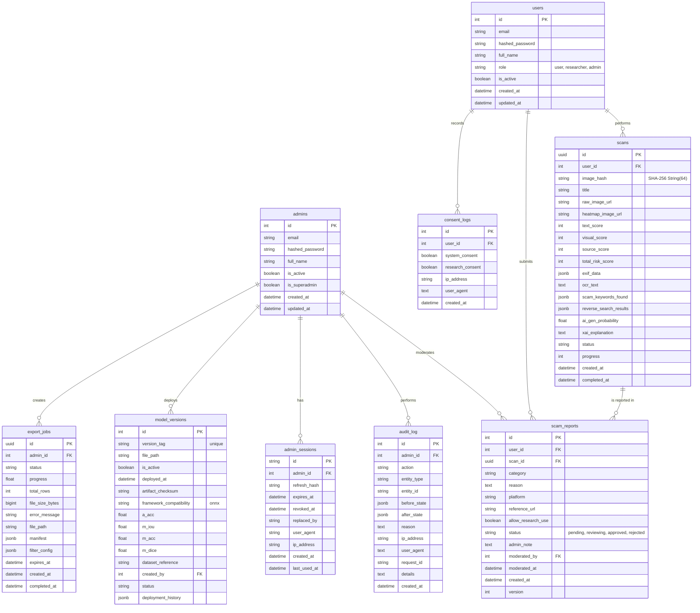

# ER Diagram for ScamGuard (9 ตาราง)

## รายละเอียดแต่ละตาราง
- **users**: เก็บข้อมูลบัญชีผู้ใช้ (role: user/researcher/admin)
- **admins**: เก็บข้อมูลบัญชีผู้ดูแลระบบแยกตาราง
- **scans**: เก็บข้อมูลสรุปของการสแกนรูปภาพ พร้อมคะแนนความเสี่ยง
- **scam_reports**: การรายงานภาพว่าเป็น Scam โดยผู้ใช้ และแอดมินใช้พิจารณา
- **consent_logs**: ใช้เก็บประวัติการยินยอมเพื่อทำ PDPA Compliance
- **model_versions**: ข้อมูลโมเดล AI ที่ Deploy แต่ละเวอร์ชัน (metrics a_acc/m_iou/m_acc/m_dice)
- **admin_sessions**: session/refresh-token ของ admin
- **audit_log**: บันทึกกิจกรรมสำคัญที่กระทำโดย Admin (Append-only)
- **export_jobs**: งาน export dataset ของ admin
