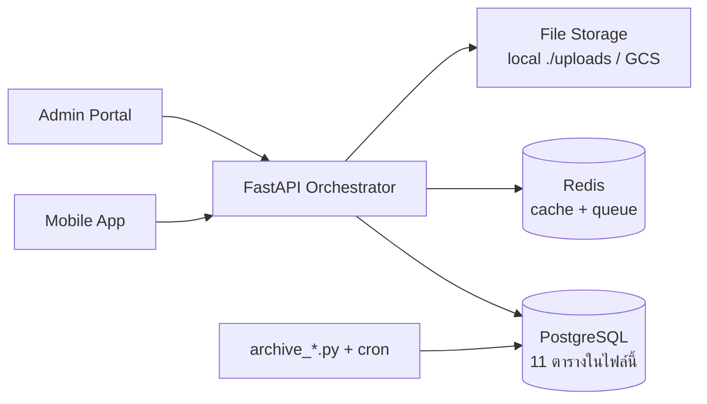

# Database Design Document — ScamGuard (PostgreSQL)

## 1. ภาพรวมและวัตถุประสงค์ (Overview)

ฐานข้อมูลหลักของระบบ **ScamGuard / Scam Image Detection** (ตรวจจับรูปภาพที่อาจถูกดัดแปลง ปลอมแปลง
หรือสร้างด้วย AI เพื่อใช้หลอกลวง) ทำหน้าที่เก็บข้อมูลเชิงสัมพันธ์ทั้งหมดด้วย ACID transaction:
บัญชีผู้ใช้/แอดมิน, ผลสแกน, รีพอร์ต, consent (PDPA), model registry, sessions, audit log และงาน export

- **ขอบเขต (Scope)**: เฉพาะ PostgreSQL (11 ตาราง: 9 หลัก + 2 archive) — Redis (cache/queue)
  และ file storage อยู่นอกขอบเขตไฟล์นี้ (ดู §9)
- **ผู้ใช้งานฐานข้อมูล**: FastAPI backend (role `scamguard_app`), migration/ops (owner `scamguard`),
  สคริปต์ maintenance (purge/archive) ผ่าน cron
- **DBMS**: PostgreSQL 15 (`postgres:15-alpine`, `database/docker-compose.yml`)

## 2. Requirements Analysis

### Business Rules (กฎที่สะท้อนอยู่ใน schema ปัจจุบัน)

- **BR-01 Consent ก่อนใช้**: สมัครต้องมี consent row (สร้างพร้อม register); หลักฐาน consent ต้องรอดพ้นการลบ user
- **BR-02 Audit โปร่งใส**: การกระทำของ admin ต้องบันทึกแบบ append-only แก้/ลบไม่ได้
- **BR-03 หมวดหมู่รีพอร์ตมาตรฐาน**: ใช้ 7 ค่า canonical ตรงกับ API `GET /reports/categories` (มติ DOC-08)
- **BR-04 คะแนน 0–100**: score ทุกมิติและ progress ต้องอยู่ในช่วง 0–100
- **BR-05 ข้อมูลเก่าต้องถูกจัดการ**: scan+ไฟล์ >90 วันลบ, log >1 ปี archive, ไฟล์ export 7 วัน
- **BR-06 สิทธิ์น้อยที่สุด**: app เข้าถึงได้แค่ DML, DDL เป็นของ owner เท่านั้น

## 3. Conceptual Design

### ER Diagram

> หมายเหตุ: constraints ตรงกับ `server/app/models/*.py` — ข้อความใน `"..."` ของแต่ละฟิลด์
> ระบุ nullable / default / unique / index / FK ondelete

```mermaid
erDiagram
    users {
        int id PK "index"
        string email "NOT NULL, unique, index"
        string hashed_password "NOT NULL"
        string full_name "nullable"
        string role "NOT NULL, default user; user, researcher; CHECK ck_users_role (admin แยกตาราง admins)"
        boolean is_active "default True"
        datetime created_at "server_default now()"
        datetime updated_at "server_default now(), onupdate now()"
    }

    admins {
        int id PK "index"
        string email "NOT NULL, unique, index"
        string hashed_password "NOT NULL"
        string full_name "nullable"
        boolean is_active "default True"
        boolean is_superadmin "default False"
        datetime created_at "server_default now()"
        datetime updated_at "server_default now(), onupdate now()"
    }

    scans {
        uuid id PK "default uuid4"
        int user_id FK "nullable; FK users.id ON DELETE SET NULL; index"
        string image_hash "NOT NULL, SHA-256 String(64), index"
        string title "nullable"
        string raw_image_url "NOT NULL"
        string heatmap_image_url "nullable"
        int text_score "NOT NULL, default 0; CHECK 0-100"
        int visual_score "NOT NULL, default 0; CHECK 0-100"
        int source_score "NOT NULL, default 0; CHECK 0-100"
        int total_risk_score "NOT NULL, default 0; CHECK 0-100"
        jsonb exif_data "nullable"
        text ocr_text "nullable"
        jsonb scam_keywords_found "nullable"
        jsonb reverse_search_results "nullable"
        float ai_gen_probability "default 0.0"
        text xai_explanation "nullable"
        string status "NOT NULL, default pending; CHECK 8 ค่า (ดู §6)"
        int progress "NOT NULL, default 0; CHECK 0-100"
        datetime created_at "server_default now(), index"
        datetime updated_at "server_default now(), onupdate now()"
        datetime completed_at "nullable"
    }

    scam_reports {
        int id PK
        int user_id FK "nullable; FK users.id ON DELETE SET NULL; index"
        uuid scan_id FK "nullable; FK scans.id ON DELETE SET NULL; index"
        string category "NOT NULL, default other, index; CHECK 7 ค่า canonical (ดู §6)"
        text reason "NOT NULL"
        string platform "nullable"
        string reference_url "nullable"
        boolean allow_research_use "NOT NULL, default False"
        string status "NOT NULL, default pending; pending, reviewing, approved, rejected; index"
        text admin_note "nullable"
        int moderated_by FK "nullable; FK admins.id ON DELETE SET NULL; index"
        datetime moderated_at "nullable"
        datetime created_at "server_default now(), index"
        int version "NOT NULL, default 1"
    }

    consent_logs {
        int id PK
        int user_id FK "nullable; FK users.id ON DELETE SET NULL; index"
        boolean system_consent "NOT NULL, default True"
        boolean research_consent "NOT NULL, default False"
        string ip_address "nullable"
        text user_agent "nullable"
        datetime created_at "server_default now()"
    }

    model_versions {
        int id PK
        string version_tag "NOT NULL, unique"
        string file_path "NOT NULL"
        boolean is_active "NOT NULL, default False"
        datetime deployed_at "server_default now()"
        string artifact_checksum "nullable"
        string framework_compatibility "nullable, default onnx"
        float a_acc "nullable; เดิม accuracy (เปลี่ยนโดย 042de00eee1b)"
        float m_iou "nullable; เดิม precision (เปลี่ยนโดย 042de00eee1b)"
        float m_acc "nullable; เพิ่มโดย 042de00eee1b"
        float m_dice "nullable; เพิ่มโดย 042de00eee1b"
        string dataset_reference "nullable"
        int created_by FK "nullable; FK admins.id ON DELETE SET NULL; index"
        string status "NOT NULL, default inactive; CHECK pending, active, inactive, failed"
        jsonb deployment_history "nullable"
    }

    admin_sessions {
        string id PK "String(64)"
        int admin_id FK "NOT NULL; FK admins.id ON DELETE CASCADE; index"
        string refresh_hash "NOT NULL, unique, index"
        datetime expires_at "NOT NULL"
        datetime revoked_at "nullable, index"
        string replaced_by "nullable; ไม่มี FK (รหัส session ใหม่แบบ plain text)"
        string user_agent "nullable"
        string ip_address "nullable"
        datetime created_at "server_default now()"
        datetime last_used_at "nullable"
    }

    audit_log {
        int id PK
        int admin_id FK "nullable; FK admins.id ON DELETE SET NULL; index"
        string action "NOT NULL, index"
        string entity_type "nullable, index"
        string entity_id "nullable"
        jsonb before_state "nullable"
        jsonb after_state "nullable"
        text reason "nullable"
        string ip_address "nullable"
        text user_agent "nullable"
        string request_id "nullable"
        text details "nullable"
        datetime created_at "server_default now(), index"
    }

    export_jobs {
        uuid id PK "default uuid4"
        int admin_id FK "nullable; FK admins.id ON DELETE SET NULL; index"
        string status "NOT NULL, default queued; CHECK queued, running, succeeded, failed, canceled, expired"
        float progress "NOT NULL, default 0.0"
        int total_rows "nullable"
        bigint file_size_bytes "nullable"
        string error_message "nullable"
        string file_path "nullable"
        jsonb manifest "nullable"
        jsonb filter_config "NOT NULL"
        datetime expires_at "nullable"
        datetime created_at "NOT NULL, server_default now()"
        datetime completed_at "nullable"
    }

    %% Relationships
    users |o--o{ scans : "performs"
    users |o--o{ scam_reports : "submits"
    users |o--o{ consent_logs : "records"
    admins |o--o{ scam_reports : "moderates"
    admins |o--o{ audit_log : "performs"
    admins ||--o{ admin_sessions : "has"
    admins |o--o{ model_versions : "deploys"
    admins |o--o{ export_jobs : "creates"
    scans |o--o{ scam_reports : "is reported in"

    audit_log_archive {
        int id PK
        string action "index"
        datetime created_at "index"
        datetime archived_at "server_default now()"
    }

    consent_logs_archive {
        int id PK
        int user_id "nullable, index"
        datetime created_at
        datetime archived_at "server_default now()"
    }
```

### Entities และ Cardinality

| ความสัมพันธ์ | แบบ | หมายเหตุ |
| :--- | :--- | :--- |
| users – scans | 1:N (optional ทั้งสองฝั่ง) | ลบ user แล้ว scan อยู่ต่อ (SET NULL) |
| users – scam_reports | 1:N (optional) | เช่นเดียวกัน |
| users – consent_logs | 1:N (optional) | consent รอดพ้นการลบ user (BR-01) |
| admins – scam_reports / audit_log / model_versions / export_jobs | 1:N (optional) | ลบ admin แล้วงานอยู่ต่อ (SET NULL) |
| admins – admin_sessions | 1:N (mandatory ฝั่ง session) | ลบ admin แล้ว session หายด้วย (CASCADE) |
| scans – scam_reports | 1:N (optional) | ลบ scan แล้วรีพอร์ตอยู่ต่อ (SET NULL) |
| (archive tables) | ไม่มี FK | เก็บสำเนาอย่างเดียว ไม่ join กลับ |

## 4. Logical Design

### รายละเอียดแต่ละตาราง

- **users**: บัญชีผู้ใช้ (role: user/researcher; admin แยกตาราง admins)
- **admins**: บัญชีผู้ดูแลระบบแยกตาราง (is_superadmin, default False)
- **scans**: ผลสแกนรูปภาพ + คะแนนความเสี่ยง 4 มิติ + สถานะ pipeline
- **scam_reports**: รีพอร์ตจากผู้ใช้ + การพิจารณาของแอดมิน (`version` ไว้กัน concurrent edit)
- **consent_logs**: หลักฐานการยินยอม PDPA
  (ลบ user แล้ว row อยู่ต่อแบบ user_id NULL + trigger ล้าง ip_address/user_agent)
- **model_versions**: registry โมเดล AI + metrics + ประวัติ deploy
- **admin_sessions**: session/refresh-token ของ admin (replaced_by ไม่มี FK)
- **audit_log**: บันทึกการกระทำของ admin (append-only)
- **export_jobs**: งาน export dataset ของ admin (เก็บไฟล์ 7 วัน)
- **audit_log_archive / consent_logs_archive**: ที่เก็บ log เกิน retention 1 ปี
  (schema เดียวกับตัวจริง + `archived_at`, ไม่มี FK/trigger; ย้ายโดย `scripts/archive_old_logs.py` รายเดือน)

### Data Dictionary

รายละเอียดคอลัมน์ (ชนิด/ขนาด/nullable/default/index) อยู่ใน annotations ของ ER Diagram ข้างต้น
ซึ่ง generate ตรงจาก `server/app/models/*.py` — ค่าที่อนุญาต (allowed values) ของทุก enum
อยู่ใน §6 (CHECK constraints) ไม่กระจายตามโค้ด

### Normalization

- Schema อยู่ใน **3NF**: ทุกตารางมี PK เดี่ยว, ไม่มี repeating group, ไม่มี transitive dependency
- ข้อยกเว้นที่ยอมรับ 2 จุด (ดู Design decisions §6 ประกอบ):
  1. `scans.total_risk_score` เก็บซ้ำจากผลรวม 3 scores — แลก query เร็ว, คุมด้วย CHECK + logic ที่ service
  2. คอลัมน์ JSONB (exif/ocr/keywords/reverse-search/deployment_history) — semi-structured ที่ schema ไม่นิ่ง
     และไม่เคย join จึงไม่แตกตารางตาม 1NF เคร่งครัด

## 5. Physical Design (PostgreSQL 15)

- **ชนิดข้อมูลเฉพาะ DBMS**: PK ใช้ `UUID` (native) สำหรับ scans/export_jobs (id ที่เดาไม่ได้ ปลอดภัยกว่า
  Integer run ต่อกัน), `JSONB` สำหรับ semi-structured (query/index ได้), timestamp แบบ `TIMESTAMPTZ`
  (`DateTime(timezone=True)`) ทุกตาราง, string จำกัดขนาด (`String(64/100/255/512)`) ตามการใช้งานจริง
- **Index design**: PK/unique อัตโนมัติ + index บน (1) คอลัมน์ล็อกอิน (`users.email`, `admins.email`,
  `admin_sessions.refresh_hash`), (2) ทุก FK, (3) คอลัมน์กรองบ่อย
  (report category/status, audit action/entity_type, created_at ของตาราง log)
- **Partitioning**: ไม่มี — ปริมาณข้อมูลระดับแอป coursework ยังไม่ถึงจุดที่ต้อง partition;
  การคุมขนาดตารางใช้ retention (§8) แทน
- **Storage**: ข้อมูลอยู่ถาวรใน volume `postgres_data` (`podman compose down` ไม่หาย);
  ไฟล์รูป/blob ไม่เก็บใน DB (เก็บแค่ path/URL — ดู §8)

## 6. Constraints & Integrity (ตรงกับ `server/app/models/*.py` + migration `d4e5f6a7b8c9`)

- **Unique**: users.email, admins.email, model_versions.version_tag, admin_sessions.refresh_hash
- **CHECK (migration `d4e5f6a7b8c9`)**: users.role (user, researcher);
  scans.status (pending, uploading, queued, processing_source, processing_visual, processing_text, completed, failed);
  scans scores/progress 0–100; scam_reports.category (7 ค่าตาม ReportCategory);
  scam_reports.status (pending, reviewing, approved, rejected);
  model_versions.status (pending, active, inactive, failed);
  export_jobs.status (queued, running, succeeded, failed, canceled, expired)
- **Index เพิ่มเติม (migration `8b428eff3721` + `d4e5f6a7b8c9`)**: audit_log(action, admin_id, created_at, entity_type),
  scam_reports(category, status, created_at, user_id, scan_id, moderated_by),
  scans(user_id, created_at), consent_logs(user_id),
  model_versions(created_by), export_jobs(admin_id)
- **Referential integrity (ON DELETE)**: consent_logs.user_id → SET NULL (BR-01);
  scans.user_id, scam_reports.user_id/scan_id/moderated_by, audit_log.admin_id,
  model_versions.created_by, export_jobs.admin_id → SET NULL (เนื้อหาอยู่ต่อเมื่อลบเจ้าของ);
  admin_sessions.admin_id → CASCADE (session ไร้ความหมายเมื่อ admin หาย)
- **ไม่มี FK**: admin_sessions.replaced_by เป็น String(64) ธรรมดา เก็บ id ของ session ใหม่ตอน rotation

### Triggers

- `trg_prevent_audit_log_modification` (migration `e3844dc4110e`, แก้โดย `c8d9e0f1a2b3`):
  `BEFORE UPDATE OR DELETE ON audit_log` — append-only (BR-02);
  ยกเว้น DELETE ใน transaction ที่ตั้ง `SET LOCAL app.allow_audit_archive='on'` (มีแค่สคริปต์ archive ใช้)
- `trg_anonymize_consent_on_user_delete` (migration `b7c8d9e0f1a2`): `BEFORE DELETE ON users` —
  ล้าง `ip_address`/`user_agent` ใน consent_logs ของ user นั้น (FK SET NULL ตัด link ให้)

### Design decisions

- **แยกตาราง admins**: auth admin ผูกกับ admin_sessions/audit_log/`is_superadmin` แยก concerns ชัด;
  แลกกับ email ซ้ำกันข้ามตารางได้ — รับได้เพราะสมัครคนละช่องทาง
- **consent_logs ใช้ SET NULL ไม่ใช้ CASCADE** (BR-01)
- **admin_sessions.replaced_by ไม่มี FK**: แลก referential integrity กับความเรียบง่ายของ rotation flow
- **total_risk_score เก็บซ้ำ / JSONB ไม่แตกตาราง**: ดู §4

## 7. Security Design

- **DB roles (least-privilege, migration `e0f1a2b3c4d5`)**: owner `scamguard` รัน migration อย่างเดียว;
  app ใช้ role `scamguard_app` (NOLOGIN ตั้งต้น) มีแค่ CONNECT + USAGE schema + DML
  (SELECT/INSERT/UPDATE/DELETE) บนตารางปัจจุบันและอนาคต (DEFAULT PRIVILEGES) — ไม่มี DDL
- เปิดใช้งาน app role (ops, รหัสห้ามเข้า git):
  `ALTER ROLE scamguard_app WITH LOGIN PASSWORD '<strong-password>';`
  แล้วชี้ `DATABASE_URL` ของ app มาที่ user นี้
- **ระดับแอป**: รหัสผ่าน bcrypt hash (`passlib`), refresh token ของ admin เก็บแบบ sha256 hash เพิกถอนได้จริง
- **Backup encryption**: dump เข้ารหัส AES-256-CBC (รหัสใน `BACKUP_PASSWORD`)
- > [!NOTE]
> ข้อมูล at-rest บน volume ยังไม่เข้ารหัส (พึ่งพา host security) — ถ้าขึ้น production จริงควรเปิด
> full-disk encryption หรือ pgcrypto สำหรับฟิลด์อ่อนไหว

## 8. Performance Considerations

- **Indexing**: ครอบคลุม join key (FK ทุกตัว), lookup ล็อกอิน และคอลัมน์กรอง/เรียงบ่อย (ดู §5–§6)
- **คุมขนาดตารางแทนการ tune ซับซ้อน**: purge scan >90 วัน (row + ไฟล์, `scripts/purge_old_scans.py`
  cron ทุกวัน 03:00, `scam_reports` อยู่ต่อแบบ `scan_id NULL`), archive log >1 ปี
  (`scripts/archive_old_logs.py` cron วันที่ 1 เวลา 04:00, batch ละ 1000), ไฟล์ export 7 วัน
  (mark `expired` แบบ opportunistic ตอนสร้าง job ใหม่) — ทุกสคริปต์มี `--dry-run`
- **ไฟล์รูปและ storage (DB เก็บแค่ pointer)**: `scans.raw_image_url/heatmap_image_url`,
  `model_versions.file_path`, `export_jobs.file_path` เก็บแค่ path/URL ไม่เก็บ blob ใน DB;
  `STORAGE_BACKEND=local` (dev, `./uploads`, ไฟล์ ≤20MB) / `gcs` (production)
- **Backup / Recovery**: `server/scripts/backup.sh` / `restore.sh` (dump เข้ารหัส AES-256-CBC);
  กู้ด้วย `./restore.sh <backup_file.enc>` (ต้องตั้ง `BACKUP_PASSWORD`)

## 9. Diagram ประกอบ

- **ER Diagram**: §3 ของไฟล์นี้
- **Schema Diagram**: ใช้ ER Diagram เดียวกัน (table/column/constraint ครบ ไม่แยกไฟล์)
- **System context (DB อยู่ตรงไหนในระบบ)**:

- C1/C2/C3 และ Data Flow เต็มดู `Document/docs/03_Software_Architecture.md` (§2–§4) —
  ไฟล์นี้ลงลึกเฉพาะ Postgres; Redis ไม่เก็บข้อมูลถาวร (cache ผล inference ตาม `image_hash` + queue)
  จึงไม่มีใน ER; pgAdmin มีแค่ dev ไม่เกี่ยว production

## 10. Version Control / Change Log

- Schema ทุกครั้งเปลี่ยนผ่าน Alembic migration เท่านั้น (history เต็มดู
  `wiki/architecture/database-migrations.md`); เอกสารนี้อัปเดตคู่กันทุกครั้ง

| วันที่ | เวอร์ชัน schema (head) | สิ่งที่เปลี่ยนในเอกสาร |
| :--- | :--- | :--- |
| 2026-09-13 | `e0f1a2b3c4d5` | จัดโครงใหม่ตามมาตรฐาน 10 ข้อ; เติม §1–§2 (overview/BR), §4 (normalization), §5 (physical), §9–§10; โน้ต at-rest encryption |
| 2026-09-13 | `e0f1a2b3c4d5` | DB roles least-privilege + เปิดใช้ app role |
| 2026-09-13 | `d9e0f1a2b3c4` | เติม `scans.updated_at` |
| 2026-09-13 | `c8d9e0f1a2b3` | ตาราง archive + retention 1 ปี + trigger bypass |
| 2026-09-13 | `b7c8d9e0f1a2` | trigger anonymize consent |
| 2026-09-13 | `d4e5f6a7b8c9` | CHECK + index + SET NULL + role ตัด admin |
| ก่อนหน้า | ดู git history | เนื้อหาเดิม (ER + constraints + decisions บางส่วน) |
