# ER Diagram for ScamGuard (9 ตาราง)

> หมายเหตุ: constraints ตรงกับ `server/app/models/*.py` — ข้อความใน `"..."` ของแต่ละฟิลด์
> ระบุ nullable / default / unique / index / FK ondelete

```mermaid
erDiagram
    users {
        int id PK "index"
        string email "NOT NULL, unique, index"
        string hashed_password "NOT NULL"
        string full_name "nullable"
        string role "NOT NULL, default user; user, researcher; CHECK ck_users_role (admin แยกตาราง admins)"
        boolean is_active "default True"
        datetime created_at "server_default now()"
        datetime updated_at "server_default now(), onupdate now()"
    }

    admins {
        int id PK "index"
        string email "NOT NULL, unique, index"
        string hashed_password "NOT NULL"
        string full_name "nullable"
        boolean is_active "default True"
        boolean is_superadmin "default False"
        datetime created_at "server_default now()"
        datetime updated_at "server_default now(), onupdate now()"
    }

    scans {
        uuid id PK "default uuid4"
        int user_id FK "nullable; FK users.id ON DELETE SET NULL; index"
        string image_hash "NOT NULL, SHA-256 String(64), index"
        string title "nullable"
        string raw_image_url "NOT NULL"
        string heatmap_image_url "nullable"
        int text_score "NOT NULL, default 0; CHECK 0-100"
        int visual_score "NOT NULL, default 0; CHECK 0-100"
        int source_score "NOT NULL, default 0; CHECK 0-100"
        int total_risk_score "NOT NULL, default 0; CHECK 0-100"
        jsonb exif_data "nullable"
        text ocr_text "nullable"
        jsonb scam_keywords_found "nullable"
        jsonb reverse_search_results "nullable"
        float ai_gen_probability "default 0.0"
        text xai_explanation "nullable"
        string status "NOT NULL, default pending; CHECK 8 ค่า (ดูหัวข้อ constraints)"
        int progress "NOT NULL, default 0; CHECK 0-100"
        datetime created_at "server_default now(), index"
        datetime completed_at "nullable"
    }

    scam_reports {
        int id PK
        int user_id FK "nullable; FK users.id ON DELETE SET NULL; index"
        uuid scan_id FK "nullable; FK scans.id ON DELETE SET NULL; index"
        string category "NOT NULL, default other, index; CHECK 7 ค่า canonical (ดูหัวข้อ constraints)"
        text reason "NOT NULL"
        string platform "nullable"
        string reference_url "nullable"
        boolean allow_research_use "NOT NULL, default False"
        string status "NOT NULL, default pending; pending, reviewing, approved, rejected; index"
        text admin_note "nullable"
        int moderated_by FK "nullable; FK admins.id ON DELETE SET NULL; index"
        datetime moderated_at "nullable"
        datetime created_at "server_default now(), index"
        int version "NOT NULL, default 1"
    }

    consent_logs {
        int id PK
        int user_id FK "nullable; FK users.id ON DELETE SET NULL; index"
        boolean system_consent "NOT NULL, default True"
        boolean research_consent "NOT NULL, default False"
        string ip_address "nullable"
        text user_agent "nullable"
        datetime created_at "server_default now()"
    }

    model_versions {
        int id PK
        string version_tag "NOT NULL, unique"
        string file_path "NOT NULL"
        boolean is_active "NOT NULL, default False"
        datetime deployed_at "server_default now()"
        string artifact_checksum "nullable"
        string framework_compatibility "nullable, default onnx"
        float a_acc "nullable; เดิม accuracy (เปลี่ยนโดย 042de00eee1b)"
        float m_iou "nullable; เดิม precision (เปลี่ยนโดย 042de00eee1b)"
        float m_acc "nullable; เพิ่มโดย 042de00eee1b"
        float m_dice "nullable; เพิ่มโดย 042de00eee1b"
        string dataset_reference "nullable"
        int created_by FK "nullable; FK admins.id ON DELETE SET NULL; index"
        string status "NOT NULL, default inactive; CHECK pending, active, inactive, failed"
        jsonb deployment_history "nullable"
    }

    admin_sessions {
        string id PK "String(64)"
        int admin_id FK "NOT NULL; FK admins.id ON DELETE CASCADE; index"
        string refresh_hash "NOT NULL, unique, index"
        datetime expires_at "NOT NULL"
        datetime revoked_at "nullable, index"
        string replaced_by "nullable; ไม่มี FK (รหัส session ใหม่แบบ plain text)"
        string user_agent "nullable"
        string ip_address "nullable"
        datetime created_at "server_default now()"
        datetime last_used_at "nullable"
    }

    audit_log {
        int id PK
        int admin_id FK "nullable; FK admins.id ON DELETE SET NULL; index"
        string action "NOT NULL, index"
        string entity_type "nullable, index"
        string entity_id "nullable"
        jsonb before_state "nullable"
        jsonb after_state "nullable"
        text reason "nullable"
        string ip_address "nullable"
        text user_agent "nullable"
        string request_id "nullable"
        text details "nullable"
        datetime created_at "server_default now(), index"
    }

    export_jobs {
        uuid id PK "default uuid4"
        int admin_id FK "nullable; FK admins.id ON DELETE SET NULL; index"
        string status "NOT NULL, default queued; CHECK queued, running, succeeded, failed, canceled, expired"
        float progress "NOT NULL, default 0.0"
        int total_rows "nullable"
        bigint file_size_bytes "nullable"
        string error_message "nullable"
        string file_path "nullable"
        jsonb manifest "nullable"
        jsonb filter_config "NOT NULL"
        datetime expires_at "nullable"
        datetime created_at "NOT NULL, server_default now()"
        datetime completed_at "nullable"
    }

    %% Relationships
    users |o--o{ scans : "performs"
    users |o--o{ scam_reports : "submits"
    users |o--o{ consent_logs : "records"
    admins |o--o{ scam_reports : "moderates"
    admins |o--o{ audit_log : "performs"
    admins ||--o{ admin_sessions : "has"
    admins |o--o{ model_versions : "deploys"
    admins |o--o{ export_jobs : "creates"
    scans |o--o{ scam_reports : "is reported in"
```

## รายละเอียดแต่ละตาราง
- **users**: เก็บข้อมูลบัญชีผู้ใช้ (role: user/researcher; admin แยกตาราง admins)
- **admins**: เก็บข้อมูลบัญชีผู้ดูแลระบบแยกตาราง (is_superadmin, default False)
- **scans**: เก็บข้อมูลสรุปของการสแกนรูปภาพ พร้อมคะแนนความเสี่ยง
- **scam_reports**: การรายงานภาพว่าเป็น Scam โดยผู้ใช้ และแอดมินใช้พิจารณา
- **consent_logs**: ใช้เก็บประวัติการยินยอมเพื่อทำ PDPA Compliance
  (ลบ user แล้ว row อยู่ต่อแบบ user_id NULL + trigger `trg_anonymize_consent_on_user_delete` ล้าง ip_address/user_agent)
- **model_versions**: ข้อมูลโมเดล AI ที่ Deploy แต่ละเวอร์ชัน (metrics a_acc/m_iou/m_acc/m_dice)
- **admin_sessions**: session/refresh-token ของ admin (replaced_by ไม่มี FK)
- **audit_log**: บันทึกกิจกรรมสำคัญที่กระทำโดย Admin (Append-only ผ่าน trigger `trg_prevent_audit_log_modification` ห้าม UPDATE/DELETE)
- **export_jobs**: งาน export dataset ของ admin

## สรุป constraints (ตรงกับ `server/app/models/*.py` + migration `d4e5f6a7b8c9`)
- **Unique**: users.email, admins.email, model_versions.version_tag, admin_sessions.refresh_hash
- **CHECK (migration `d4e5f6a7b8c9`)**: users.role (user, researcher);
  scans.status (pending, uploading, queued, processing_source, processing_visual, processing_text, completed, failed);
  scans scores/progress 0–100; scam_reports.category (7 ค่าตาม ReportCategory);
  scam_reports.status (pending, reviewing, approved, rejected);
  model_versions.status (pending, active, inactive, failed);
  export_jobs.status (queued, running, succeeded, failed, canceled, expired)
- **Index เพิ่มเติม (migration `8b428eff3721` + `d4e5f6a7b8c9`)**: audit_log(action, admin_id, created_at, entity_type),
  scam_reports(category, status, created_at, user_id, scan_id, moderated_by),
  scans(user_id, created_at), consent_logs(user_id),
  model_versions(created_by), export_jobs(admin_id)
- **ON DELETE**: consent_logs.user_id → SET NULL (เก็บ log เป็นหลักฐาน PDPA); scans.user_id → SET NULL;
  scam_reports.user_id/scan_id/moderated_by → SET NULL; audit_log.admin_id → SET NULL;
  model_versions.created_by, export_jobs.admin_id → SET NULL;
  admin_sessions.admin_id → CASCADE
- **ไม่มี FK**: admin_sessions.replaced_by เป็น String(64) ธรรมดา เก็บ id ของ session ใหม่ตอน rotation

## Triggers
- `trg_prevent_audit_log_modification` (migration `e3844dc4110e`): `BEFORE UPDATE OR DELETE ON audit_log` —
  audit_log เป็น append-only แก้/ลบไม่ได้
- `trg_anonymize_consent_on_user_delete` (migration `b7c8d9e0f1a2`): `BEFORE DELETE ON users` —
  ล้าง `ip_address`/`user_agent` ใน consent_logs ของ user นั้น (FK SET NULL ตัด link ให้)

## Design decisions
- **แยกตาราง admins (ไม่รวมกับ users)**: auth admin ผูกกับ admin_sessions/audit_log/`is_superadmin`
  แยก concerns ชัด; แลกกับ email ซ้ำกันข้ามตารางได้ — รับได้เพราะสมัครคนละช่องทาง
  (`users.role` มีแค่ user/researcher, CHECK `ck_users_role` กัน `admin` ระดับ DB)
- **consent_logs ใช้ SET NULL ไม่ใช้ CASCADE**: consent คือหลักฐาน PDPA ต้องรอดพ้นการลบ user;
  ตัด link + trigger ล้าง PII แทนการลบ row
- **admin_sessions.replaced_by ไม่มี FK**: เก็บ id ของ session ใหม่ตอน rotation เป็น plain text
  แลก referential integrity กับความเรียบง่ายของ rotation flow
- **scans.total_risk_score เก็บซ้ำ (derived)**: มาจากผลรวม 3 scores — ยอมเสีย 3NF เพื่อให้ query เร็ว,
  CHECK 0–100 กันค่าหลุด, ความถูกต้องคุมที่ service
- **JSONB สำหรับ semi-structured** (exif/ocr/keywords/reverse-search/deployment_history): ไม่แตกตาราง
  เพราะ schema ไม่นิ่งและไม่ join

## ไฟล์รูปและ storage (DB เก็บแค่ pointer)
- `scans.raw_image_url/heatmap_image_url`, `model_versions.file_path`, `export_jobs.file_path`
  เก็บแค่ path/URL ไม่เก็บ blob ใน DB
- `STORAGE_BACKEND=local` (dev, `./uploads`, ไฟล์ ≤20MB) / `gcs` (production) — ดู `server/app/core/config.py`
- ไฟล์ export เก็บ 7 วัน (`expires_at`, `export_service.py`) แล้ว mark `expired`

## Security
- รหัสผ่านเก็บแบบ bcrypt hash (`passlib`, `server/app/core/security.py`) ไม่เก็บ plain text
- refresh token ของ admin เก็บแบบ sha256 hash (`admin_sessions.refresh_hash`) เพิกถอนได้จริง

## Backup / Restore
- `server/scripts/backup.sh` / `restore.sh`: dump เข้ารหัส AES-256-CBC (openssl, รหัสใน `BACKUP_PASSWORD`)
- ข้อมูล Postgres อยู่ถาวรใน volume `postgres_data` (`podman compose down` ไม่หาย)

## Retention
- **scans + ไฟล์รูป: ลบอัตโนมัติเมื่ออายุเกิน 90 วัน** — `server/scripts/purge_old_scans.py --days 90`
  รันด้วย cron ทุกวัน 03:00 (`crontab -l`); ลบทั้ง row + ไฟล์ raw/heatmap (เฉพาะไฟล์ใต้ `LOCAL_UPLOAD_DIR`);
  `scam_reports` ที่อ้าง scan นั้นอยู่ต่อแบบ `scan_id NULL`; มี `--dry-run` ไว้เช็คก่อน
- ไฟล์ export เก็บ 7 วัน (`expires_at`) ลบไฟล์ + mark `expired` แบบ opportunistic ตอนสร้าง job ใหม่
- audit_log/consent_logs: append-only + เก็บถาวร — TBD อายุ (เช่น 1–2 ปีตาม PDPA)

## Version เอกสาร
- อัปเดตล่าสุด: 2026-09-13, migration head `b7c8d9e0f1a2`
- ทุกครั้งที่เปลี่ยน schema: แก้ `server/app/models/` + เพิ่ม migration + อัปเดตไฟล์นี้ให้ตรงกัน
