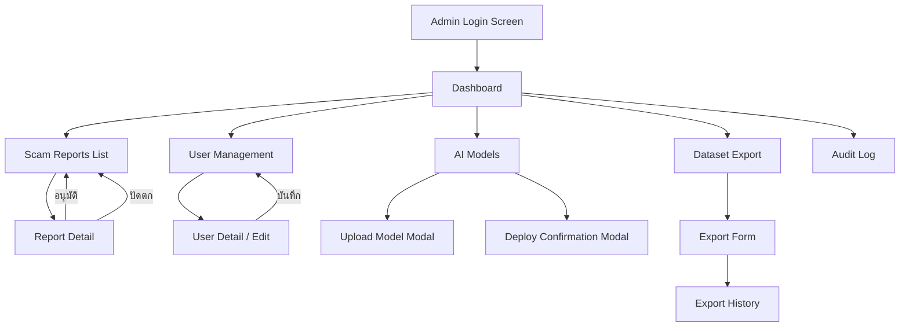

# การออกแบบ UX/UI หน้าผู้ดูแลระบบ (Admin Portal UX/UI Design)
## โครงงาน: แอปตรวจสอบรูปภาพตัดต่อที่ถูกนำมาหลอกลวง (Scam Image Detection)

เอกสารฉบับนี้อธิบายรายละเอียดการออกแบบส่วนติดต่อผู้ใช้ (UX/UI) ของ Admin Web Portal สำหรับผู้ดูแลระบบ Scam Image Detection โดยอ้างอิงจากเอกสารออกแบบ API/Backend ใน `Document/admin/admin.md` และใช้ระบบสี (Design System) ที่สอดคล้องกับ Mobile App เดิม

---

## 1. เป้าหมายการออกแบบ (Design Goals)

Admin Portal ถูกออกแบบให้เป็น Web Application บน React.js สำหรับผู้ดูแลระบบและทีมวิจัย โดยมีเป้าหมายดังนี้:

1. ให้ Admin มองเห็นภาพรวมระบบได้ทันทีจาก Dashboard
2. ตรวจสอบและตัดสินใจเรื่องรายงานสแกมได้อย่างรวดเร็ว
3. จัดการผู้ใช้ โมเดล AI และ Dataset ได้ในที่เดียว
4. แสดงข้อมูลในรูปแบบที่อ่านง่าย ไม่รกสายตา ใช้งานได้จริง
5. รักษาภาพลักษณ์ที่สอดคล้องกับ Mobile App (Dark Theme, Neon Cyan Accent)

---

## 2. Design System สำหรับ Admin Portal

### 2.1 Color Palette

Admin Portal ใช้ Dark Theme เป็นหลัก สอดคล้องกับ Mobile App ที่ใช้ Slate Gray + Neon Cyan โดยปรับให้เหมาะกับการใช้งานบนจอ Desktop ที่ต้องอ่านข้อมูลจำนวนมาก

#### สีพื้นหลัง (Background Colors)

| Token | ชื่อสี | Hex Code | การใช้งาน |
|:---|:---|:---|:---|
| `bg-primary` | Deep Navy | `#0B1120` | พื้นหลังหลักของทั้งหน้า |
| `bg-secondary` | Dark Slate | `#111827` | พื้นหลัง Sidebar, Section หลัก |
| `bg-surface` | Charcoal Blue | `#1E293B` | Card, Table, Modal, Panel |
| `bg-surface-hover` | Slate Hover | `#263348` | Hover State ของ Card/Row |
| `bg-elevated` | Elevated Surface | `#334155` | Dropdown, Popover, Tooltip |

#### สีเน้น (Accent Colors)

| Token | ชื่อสี | Hex Code | การใช้งาน |
|:---|:---|:---|:---|
| `accent-primary` | Neon Cyan | `#00E5FF` | ปุ่มหลัก, Link, Active State, Icon เน้น |
| `accent-primary-hover` | Bright Cyan | `#00B8D4` | Hover State ของปุ่มหลัก |
| `accent-secondary` | Soft Teal | `#14B8A6` | ปุ่มรอง, Badge ทั่วไป |
| `accent-tertiary` | Violet Blue | `#818CF8` | Accent เสริม สำหรับ Chart, Tag |

#### สีสถานะ (Status Colors)

| Token | ชื่อสี | Hex Code | การใช้งาน |
|:---|:---|:---|:---|
| `status-success` | Emerald Green | `#00E676` | สำเร็จ, อนุมัติ, ความเสี่ยงต่ำ |
| `status-warning` | Amber Gold | `#FFD700` | เตือน, กำลังตรวจสอบ, ความเสี่ยงปานกลาง |
| `status-danger` | Crimson Red | `#FF1744` | อันตราย, ปัดตก, ความเสี่ยงสูง, Ban |
| `status-info` | Sky Blue | `#38BDF8` | ข้อมูล, สถานะ Pending |
| `status-neutral` | Cool Gray | `#94A3B8` | ไม่ระบุ, ไม่เกี่ยวข้อง |

#### สีข้อความ (Text Colors)

| Token | ชื่อสี | Hex Code | การใช้งาน |
|:---|:---|:---|:---|
| `text-primary` | White Smoke | `#F1F5F9` | ข้อความหลัก, หัวข้อ |
| `text-secondary` | Silver Gray | `#94A3B8` | ข้อความรอง, Label, Placeholder |
| `text-tertiary` | Dim Gray | `#64748B` | ข้อความเสริม, คำอธิบาย |
| `text-inverse` | Deep Navy | `#0B1120` | ข้อความบนปุ่มสีสว่าง |

#### สีเส้นขอบ (Border Colors)

| Token | ชื่อสี | Hex Code | การใช้งาน |
|:---|:---|:---|:---|
| `border-default` | Dark Border | `#1E293B` | เส้นแบ่ง, ขอบ Card |
| `border-subtle` | Faint Border | `#334155` | เส้นแบ่งภายใน Table |
| `border-focus` | Neon Cyan | `#00E5FF` | Focus Ring ของ Input |

### 2.2 Typography

| Style | Font | Size | Weight | Line Height | ใช้งาน |
|:---|:---|---:|---:|---:|:---|
| `display` | Inter | 32px | 700 | 1.2 | ตัวเลขหลัก Dashboard (KPI) |
| `heading-1` | Inter | 24px | 700 | 1.3 | ชื่อหน้า |
| `heading-2` | Inter | 20px | 600 | 1.3 | หัวข้อ Section |
| `heading-3` | Inter | 16px | 600 | 1.4 | หัวข้อย่อย, Label สำคัญ |
| `body` | Sarabun | 14px | 400 | 1.5 | เนื้อหาทั่วไป, Table Data |
| `body-sm` | Sarabun | 13px | 400 | 1.5 | ข้อความรอง, Caption |
| `caption` | Sarabun | 12px | 400 | 1.4 | Timestamp, Metadata |
| `button` | Inter | 14px | 600 | 1.0 | ปุ่ม |
| `code` | JetBrains Mono | 13px | 400 | 1.4 | UUID, Hash, Version Tag |

**หมายเหตุ:** ใช้ `Inter` สำหรับข้อความภาษาอังกฤษ ตัวเลข และ UI Label / `Sarabun` สำหรับข้อความภาษาไทย เพื่อความสอดคล้องกับ Mobile App

### 2.3 Spacing System

ใช้ 4-point grid เดียวกับ Mobile App:

| Token | ค่า | ใช้งาน |
|:---|---:|:---|
| `xs` | 4px | Gap เล็กมาก, Icon Padding |
| `sm` | 8px | Gap ระหว่าง Element ใกล้กัน |
| `md` | 16px | Padding ภายใน Card, Gap ทั่วไป |
| `lg` | 24px | Gap ระหว่าง Section |
| `xl` | 32px | Margin หลัก |
| `2xl` | 48px | Page Padding, Section Separator |

### 2.4 Border Radius

| Token | ค่า | ใช้งาน |
|:---|---:|:---|
| `radius-sm` | 6px | Button, Input, Badge |
| `radius-md` | 10px | Card, Modal |
| `radius-lg` | 16px | Container หลัก |
| `radius-full` | 9999px | Avatar, Pill Badge |

### 2.5 Shadow

| Token | ค่า | ใช้งาน |
|:---|:---|:---|
| `shadow-sm` | `0 1px 3px rgba(0,0,0,0.3)` | Card ทั่วไป |
| `shadow-md` | `0 4px 12px rgba(0,0,0,0.4)` | Modal, Dropdown |
| `shadow-lg` | `0 8px 24px rgba(0,0,0,0.5)` | Overlay |
| `shadow-glow` | `0 0 20px rgba(0,229,255,0.15)` | Glow Effect สำหรับ Active Element |

---

## 3. Layout Structure

### 3.1 โครงสร้างหน้าจอหลัก

```
+----------------------------------------------------------+
|  Top Bar (Logo + User Avatar)                             |
+----------+-----------------------------------------------+
|          |                                                |
| Sidebar  |              Main Content Area                 |
| (Fixed)  |              (Scrollable)                      |
|          |                                                |
| - Dashboard                                               |
| - Reports                                                 |
| - Users                                                   |
| - AI Models                                               |
| - Dataset                                                 |
| - Audit Log                                               |
|          |                                                |
+----------+-----------------------------------------------+
```

### 3.2 Sidebar Navigation

**ความกว้าง:** 260px (ยุบเหลือ 72px เมื่อ Collapse)

**รายการเมนู:**

| ไอคอน | ชื่อเมนู | Path | Badge |
|:---|:---|:---|:---|
| Grid | Dashboard | `/admin/dashboard` | - |
| Flag | Scam Reports | `/admin/reports` | จำนวน Pending (ถ้ามี) |
| Users | User Management | `/admin/users` | - |
| CPU | AI Models | `/admin/models` | - |
| Database | Dataset Export | `/admin/dataset` | - |
| FileText | Audit Log | `/admin/audit-log` | - |

**Sidebar Style:**
- พื้นหลัง: `bg-secondary` (`#111827`)
- เมนูที่ Active: พื้นหลัง `bg-surface` (`#1E293B`) + ขอบซ้ายสี `accent-primary` (`#00E5FF`) ความกว้าง 3px
- เมนูที่ Hover: พื้นหลัง `bg-surface-hover` (`#263348`)
- ไอคอน Active: สี `accent-primary` (`#00E5FF`)
- ไอคอน Default: สี `text-secondary` (`#94A3B8`)
- Badge: พื้นหลัง `status-danger` (`#FF1744`), ข้อความขาว, Border Radius `radius-full`

### 3.3 Top Bar

**ความสูง:** 64px

**องค์ประกอบ:**
- ซ้าย: โลโก้ ScamGuard + ข้อความ "Admin Portal"
- ขวา: Avatar + ชื่อ Admin + Dropdown (Profile, Logout)

**หมายเหตุ:** ไม่มีช่องค้นหารวมแบบ Global Search และไม่มีระฆังแจ้งเตือน เนื่องจากไม่มี Endpoint/Feature รองรับ — การค้นหากระทำภายในหน้า Reports / Users เท่านั้น

---

## 4. รายละเอียดหน้าจอ (Screen Specifications)

### 4.1 หน้า Dashboard

**Path:** `/admin/dashboard`
**API:** `GET /api/v1/admin/dashboard`

หน้าแรกที่ Admin เห็นเมื่อเข้าสู่ระบบ แสดงภาพรวมสถิติทั้งหมดในหน้าเดียว

#### Layout:

```
+----------------------------------------------------------+
| Page Title: "Dashboard"                       วันที่วันนี้ |
+----------------------------------------------------------+
| [KPI Card 1]  [KPI Card 2]  [KPI Card 3]  [KPI Card 4]  |
| ผู้ใช้ทั้งหมด   Active วันนี้   สแกนทั้งหมด    สแกนวันนี้    |
| 1,250          87             8,432          156         |
| [KPI Card 5]  [KPI Card 6]  [KPI Card 7]                |
| สแกนสัปดาห์นี้  สแกนเดือนนี้   รายงาน Pending              |
| 892            3,210          28                          |
+----------------------------------------------------------+
| [Scan Trend Chart]                 | [Risk Distribution]  |
| Line Chart 7 วัน                    | Donut Chart          |
| สีเส้น: accent-primary             | Low / Med / High     |
+------------------------------------+----------------------+
| [Report Category Breakdown]        | [AI Model Status]    |
| Bar Chart แนวนอน                    | Card: v2.1.0 Active  |
| แยกตาม 7 หมวดหมู่                   | Deployed: 2026-08-01 |
+------------------------------------+----------------------+
| [Reports Summary Card]                                    |
| "รายงานรอตรวจสอบ" (reports.pending) + ลิงก์                 |
| "ดูรายงานล่าสุด →" → ไปหน้า Reports (GET /admin/reports)    |
+----------------------------------------------------------+
```

**หมายเหตุ:** Response ของ `GET /api/v1/admin/dashboard` ไม่มี Payload รายการรายงานล่าสุด (recent reports) จึงใช้ Summary Card ที่ลิงก์ไปหน้า Reports แทนตาราง Recent Reports

#### KPI Cards (7 ใบ, แถวบน 2 แถว)

แต่ละ Card มี:
- พื้นหลัง: `bg-surface` (`#1E293B`)
- ขอบ: `border-default` (`#1E293B`)
- Border Radius: `radius-md` (10px)
- Shadow: `shadow-sm`
- ไอคอนมุมซ้ายบน: สี `accent-primary` พื้นหลังวงกลม `rgba(0,229,255,0.1)`
- ตัวเลข: Style `display` (32px, Bold, White)
- Label: Style `body-sm` (13px, `text-secondary`)
- เส้น Trend เล็ก (Sparkline) มุมขวาล่าง: สี `status-success` (ถ้าเพิ่ม) หรือ `status-danger` (ถ้าลด)

| Card | ไอคอน | Label | ข้อมูล | สี Trend |
|:---|:---|:---|:---|:---|
| 1 | Users | ผู้ใช้ทั้งหมด | `overview.total_users` | - |
| 2 | Activity | Active วันนี้ | `overview.active_users_today` | เปรียบเทียบเมื่อวาน |
| 3 | Scan | สแกนทั้งหมด | `overview.total_scans` | - |
| 4 | Zap | สแกนวันนี้ | `overview.scans_today` | เปรียบเทียบเมื่อวาน |
| 5 | CalendarWeek | สแกนสัปดาห์นี้ | `overview.scans_this_week` | - |
| 6 | CalendarDays | สแกนเดือนนี้ | `overview.scans_this_month` | - |
| 7 | Flag | รายงาน Pending | `reports.pending` | `status-warning` |

#### Scan Trend Chart (ซ้ายล่าง)

- ประเภท: Line Chart / Area Chart
- แกน X: วันที่ 7 วันย้อนหลัง (ข้อมูลจาก `scan_trend`)
- แกน Y: จำนวนสแกน
- สีเส้น: `accent-primary` (`#00E5FF`)
- สีพื้นที่ใต้เส้น: `rgba(0,229,255,0.08)`
- พื้นหลัง Card: `bg-surface`
- จุด Hover: แสดง Tooltip พร้อมจำนวน

#### Risk Distribution (ขวาบน)

- ประเภท: Donut Chart
- สีแต่ละส่วน:
  - Low: `status-success` (`#00E676`)
  - Medium: `status-warning` (`#FFD700`)
  - High: `status-danger` (`#FF1744`)
- ตรงกลาง Donut: จำนวนสแกนทั้งหมด
- Legend อยู่ด้านล่าง Chart
- พื้นหลัง Card: `bg-surface`

#### Report Category Breakdown (ซ้ายล่าง)

- ประเภท: Horizontal Bar Chart
- แต่ละแถวเป็นหมวดหมู่ (7 หมวด)
- สี Bar: Gradient จาก `accent-primary` ไป `accent-tertiary`
- Label ซ้าย: ชื่อหมวดหมู่ภาษาไทย
- ตัวเลขขวา: จำนวน
- พื้นหลัง Card: `bg-surface`

#### AI Model Status Card (ขวาล่าง)

- แสดง: เวอร์ชันปัจจุบัน (`v2.1.0`), วันที่ Deploy, จำนวนเวอร์ชันทั้งหมด
- Badge สถานะ: "Active" สี `status-success` พื้นหลัง `rgba(0,230,118,0.15)`
- ปุ่ม "จัดการโมเดล": สี `accent-primary`, Link ไปหน้า `/admin/models`
- พื้นหลัง Card: `bg-surface`

---

### 4.2 หน้า Scam Reports (คิวรายงาน)

**Path:** `/admin/reports`
**API:** `GET /api/v1/admin/reports`

#### Layout:

```
+----------------------------------------------------------+
| Page Title: "Scam Reports"                                |
+----------------------------------------------------------+
| [Filter Bar]                                              |
| Status: [All|Pending|Reviewing|Approved|Rejected]         |
| Category: [Dropdown]  Date: [From] - [To]                 |
| Sort: [Created At|Status] [Desc|Asc]                      |
+----------------------------------------------------------+
| [Reports Table]                                           |
| # | Thumbnail | Category | Reporter | Risk | Status | Date|
| 42| [img]     | สลิปปลอม | สมชาย    | 82   | Pending| ... |
| 41| [img]     | ซื้อขาย  | สมหญิง   | 65   | Approved|... |
+----------------------------------------------------------+
| [Pagination]                         Showing 1-20 of 28   |
+----------------------------------------------------------+
```

#### Filter Bar

- **Status Tabs:** แบบ Segmented Control
  - All (ค่าเริ่มต้น): พื้นหลัง `bg-surface`, ข้อความ `text-secondary`
  - Tab ที่เลือก: พื้นหลัง `accent-primary`, ข้อความ `text-inverse`
  - แต่ละ Tab แสดงจำนวนต่อท้าย เช่น "Pending (28)"
- **Category Dropdown:** พื้นหลัง `bg-surface`, ขอบ `border-subtle`
- **Date Range Picker:** 2 ช่อง Input วันที่ พร้อมไอคอน Calendar
- **Sort Controls:** Dropdown `sort_by` (`created_at` | `status`) + Toggle `sort_order` (`asc` | `desc`)

**หมายเหตุ:** `GET /api/v1/admin/reports` รองรับเฉพาะ `page`, `limit`, `status`, `category`, `from_date`, `to_date`, `sort_by`, `sort_order` — ไม่มีพารามิเตอร์สำหรับค้นหาข้อความ

#### Reports Table

**คอลัมน์:**

| คอลัมน์ | ความกว้าง | ข้อมูล | Style |
|:---|:---|:---|:---|
| # | 60px | Report ID | `code` font, `text-secondary` |
| ภาพ | 64px | Thumbnail ของภาพที่สแกน | รูป 48x48 rounded, Border `border-subtle` |
| หมวดหมู่ | 140px | Category (ภาษาไทย) | Badge สีตาม Category |
| ผู้รายงาน | 160px | ชื่อผู้ใช้ + Email | `body` + `caption` สี `text-secondary` |
| คะแนนเสี่ยง | 100px | Total Risk Score | ตัวเลขพร้อม Risk Badge สีตามระดับ |
| สถานะ | 120px | Status Badge | Badge สีตามสถานะ |
| วันที่ | 140px | Created At | `caption` font, `text-tertiary` |
| การกระทำ | 80px | ปุ่ม "ดู" | ปุ่ม Ghost สี `accent-primary` |

**สี Badge สถานะ:**

| สถานะ | สีพื้นหลัง | สีข้อความ |
|:---|:---|:---|
| Pending | `rgba(56,189,248,0.15)` | `#38BDF8` (Sky Blue) |
| Reviewing | `rgba(255,215,0,0.15)` | `#FFD700` (Amber) |
| Approved | `rgba(0,230,118,0.15)` | `#00E676` (Emerald) |
| Rejected | `rgba(255,23,68,0.15)` | `#FF1744` (Crimson) |

**Action "เริ่มตรวจสอบ" (แถว Pending):**

- แถวที่สถานะเป็น Pending จะมีปุ่ม "เริ่มตรวจสอบ" (Ghost Button สี `accent-primary`, แสดงเมื่อ Hover แถว) เมื่อกดจะเปิดหน้า Report Detail เพื่อเริ่มกระบวนการตรวจสอบ
- Tab "Reviewing" ใน Filter Bar และ Badge "Reviewing" (สี Amber) ยังคงแสดงตามสถานะจาก Server

**ข้อจำกัด (Flagged Gap):** Backend `PATCH /api/v1/admin/reports/{report_id}` ปัจจุบันรับเฉพาะ Transition `approved` / `rejected` เท่านั้น — การ Persist สถานะ `reviewing` ยังต้องรอ Backend เพิ่มความสามารถนี้ (UI แสดง Badge ตามค่าที่ Server ส่งกลับเท่านั้น)

**สี Badge หมวดหมู่:**

| หมวดหมู่ | สีพื้นหลัง | สีข้อความ |
|:---|:---|:---|
| สลิปปลอม | `rgba(255,23,68,0.12)` | `#FF6B81` |
| ซื้อขายออนไลน์ | `rgba(255,152,0,0.12)` | `#FFB74D` |
| หลอกลวงความรัก | `rgba(233,30,99,0.12)` | `#F06292` |
| ลงทุน | `rgba(255,215,0,0.12)` | `#FFD54F` |
| ปลอมแปลงตัวตน | `rgba(156,39,176,0.12)` | `#CE93D8` |
| AI/Deepfake | `rgba(129,140,248,0.12)` | `#818CF8` |
| อื่น ๆ | `rgba(148,163,184,0.12)` | `#94A3B8` |

**Table Style:**
- พื้นหลัง Table: `bg-surface`
- Header Row: พื้นหลัง `bg-elevated` (`#334155`), ข้อความ `text-secondary`, Font Weight 600
- Data Row: พื้นหลัง `bg-surface`, Hover: `bg-surface-hover`
- เส้นแบ่ง Row: `border-subtle` (`#334155`)
- Row ที่เป็น Pending: เส้นขอบซ้ายสี `status-info` 3px (เพื่อเน้นว่ารอตรวจสอบ)

---

### 4.3 หน้า Report Detail (รายละเอียดรายงาน)

**Path:** `/admin/reports/{id}`
**API:** `GET /api/v1/admin/reports/{report_id}`

#### Layout:

```
+----------------------------------------------------------+
| Breadcrumb: Reports > Report #42                          |
| Page Title: "Report #42"    Status Badge: [Pending]       |
+----------------------------------------------------------+
| [Left Column - 60%]               | [Right Column - 40%] |
|                                    |                      |
| === ข้อมูลรายงาน ===              | === ภาพที่รายงาน ===  |
| หมวดหมู่: สลิปปลอม                | [รูปภาพต้นฉบับ]       |
| รายละเอียด: ได้รับสลิป...          | [Toggle: Original /   |
| แพลตฟอร์ม: Facebook               |  Heatmap]             |
| ลิงก์อ้างอิง: [Link]              |                      |
| ยินยอมวิจัย: ใช่                   | === คะแนนเสี่ยง ===   |
|                                    | Total: 82 [HIGH]     |
| === ข้อมูลผู้รายงาน ===            | Text: 80 | Visual: 90|
| ชื่อ: สมชาย ใจดี                   | Source: 50           |
| Email: reporter@...                |                      |
| รายงานที่เคยส่ง: 3                 | === ผลวิเคราะห์ ===   |
|                                    | OCR: "ยินดีด้วย..."   |
| === การตัดสินใจ ===                | Keywords: [ได้รับ...]  |
| [Textarea: บันทึก Admin]           | EXIF: Photoshop      |
| [ปุ่ม: อนุมัติ] [ปุ่ม: ปัดตก]     | AI-Gen: 5%           |
+------------------------------------+----------------------+
```

#### ข้อมูลรายงาน (Report Info Section)

- พื้นหลัง: `bg-surface`
- แต่ละ Field เป็น Label + Value:
  - Label: `heading-3` สี `text-secondary`
  - Value: `body` สี `text-primary`
- หมวดหมู่: แสดงเป็น Badge สีตามหมวดหมู่
- ลิงก์อ้างอิง: เป็น Clickable Link สี `accent-primary` เปิดแท็บใหม่
- ยินยอมวิจัย: Badge เขียว "ใช่" หรือ Badge แดง "ไม่"

#### ภาพที่รายงาน (Image Preview)

- Card พื้นหลัง `bg-surface`
- รูปภาพแสดงขนาดเต็ม Card
- Toggle Switch ด้านบน: สลับระหว่าง Original และ Heatmap
- Toggle Active: สี `accent-primary`
- รูปมี Border Radius: `radius-md`
- คลิกรูปเพื่อเปิด Full-screen Modal (Zoom + Pan)

#### Risk Score Section

- แสดงคะแนนรวมด้วย Circular Gauge ขนาดเล็ก (80px)
- สี Gauge ตามระดับ:
  - 0-19: `status-success` (Safe)
  - 20-39: `status-success` (Low)
  - 40-69: `status-warning`
  - 70-100: `status-danger` (กรณี `visual_score >= 80` → High ทันที)
- คะแนนย่อยแต่ละชั้น: แสดงเป็น Progress Bar แนวนอน
  - Textual: Label + Score + Bar สี `#818CF8` (Violet)
  - Visual: Label + Score + Bar สี `#F472B6` (Pink)
  - Source: Label + Score + Bar สี `#38BDF8` (Sky Blue)

#### ผลวิเคราะห์ (Analysis Details)

- OCR Text: แสดงในกล่อง `bg-elevated` ฟอนต์ `code`, Monospace
- Scam Keywords: แสดงเป็น Tag/Chip สีแดงอ่อน `rgba(255,23,68,0.15)` ข้อความ `status-danger`
- EXIF Data: Table เล็กแบบ Key-Value
- AI-Generated Probability: แสดงเป็น % พร้อม Progress Bar

#### ส่วนตัดสินใจ (Decision Section)

- พื้นหลัง: `bg-surface` ขอบ `border-default`
- Header: "การตัดสินใจ" style `heading-2`
- Textarea สำหรับ Admin Note:
  - พื้นหลัง: `bg-elevated`
  - ขอบ: `border-subtle`
  - Focus: ขอบ `border-focus` (Neon Cyan)
  - Placeholder: "กรอกบันทึกหรือเหตุผลประกอบการตัดสินใจ..."
  - ความสูงขั้นต่ำ: 100px

- **ปุ่มอนุมัติ:**
  - พื้นหลัง: `status-success` (`#00E676`)
  - ข้อความ: `text-inverse` (Dark)
  - ไอคอน: Check
  - Hover: สว่างขึ้น 10%
  - ความกว้าง: 50% (ซ้าย)

- **ปุ่มปัดตก:**
  - พื้นหลัง: `status-danger` (`#FF1744`)
  - ข้อความ: White
  - ไอคอน: X
  - Hover: สว่างขึ้น 10%
  - ความกว้าง: 50% (ขวา)
  - Validation: ต้องกรอก Admin Note ก่อนกดปัดตก (แสดง Error ใต้ Textarea)

- **Confirmation Modal:**
  - เมื่อกดปุ่มใดก็ตาม แสดง Modal ยืนยัน:
    - หัวข้อ: "ยืนยันการ [อนุมัติ/ปัดตก] รายงาน #42"
    - ข้อความ: สรุปข้อมูลรายงาน
    - ปุ่ม "ยืนยัน" + "ยกเลิก"
  - Modal พื้นหลัง: `bg-surface`, Backdrop: `rgba(0,0,0,0.7)`

---

### 4.4 หน้า User Management (จัดการผู้ใช้)

**Path:** `/admin/users`
**API:** `GET /api/v1/admin/users`

#### Layout:

```
+----------------------------------------------------------+
| Page Title: "User Management"                             |
+----------------------------------------------------------+
| [Filter Bar]                                              |
| Role: [All|User|Researcher|Admin]                         |
| Status: [All|Active|Banned]  [Search: Email/Name]         |
+----------------------------------------------------------+
| [Users Table]                                             |
| # | Avatar | Name/Email | Role | Scans | Reports |Status |
| 101| [A]   | สมชาย/...  | User | 15    | 3       |Active |
| 102| [A]   | สมหญิง/... | Res. | 8     | 1       |Active |
+----------------------------------------------------------+
| [Pagination]                       Showing 1-20 of 1,250 |
+----------------------------------------------------------+
```

#### Users Table

**คอลัมน์:**

| คอลัมน์ | ความกว้าง | ข้อมูล | Style |
|:---|:---|:---|:---|
| # | 60px | User ID | `code` font |
| Avatar | 48px | Avatar Placeholder (อักษรตัวแรก) | วงกลม 36px, พื้นหลัง Gradient `accent-primary` to `accent-tertiary` |
| ชื่อ/Email | 220px | Full Name (บรรทัด 1) + Email (บรรทัด 2) | `body` + `caption` |
| บทบาท | 120px | Role Badge | Badge สีตาม Role |
| สแกน | 80px | จำนวนสแกนทั้งหมด | `body` ข้อความกลาง |
| รายงาน | 80px | จำนวนรายงานที่ส่ง | `body` ข้อความกลาง |
| สถานะ | 100px | Active / Banned | Badge สี |
| การกระทำ | 120px | ปุ่ม "ดู" + ปุ่ม "..." | ปุ่ม Ghost + Dropdown |

**สี Role Badge:**

| Role | สีพื้นหลัง | สีข้อความ |
|:---|:---|:---|
| User | `rgba(56,189,248,0.15)` | `#38BDF8` |
| Researcher | `rgba(129,140,248,0.15)` | `#818CF8` |
| Admin | `rgba(0,229,255,0.15)` | `#00E5FF` |

**หมายเหตุ:** Role ข้างต้นคือบทบาทของ End-user accounts (`users.role`: `user`, `researcher`, `admin`) ซึ่งแยกจากบัญชี Staff ของ Admin Portal โดยสิ้นเชิง — บัญชีผู้ดูแลพอร์ทัลอยู่ในตาราง `admins` แยกต่างหาก (มี flag `is_superadmin`) และ Sessions ของ Staff เก็บในตาราง `admin_sessions` ทั้งสองระบบมีอยู่ร่วมกัน (co-exist)

**สี Status Badge:**

| Status | สีพื้นหลัง | สีข้อความ |
|:---|:---|:---|
| Active | `rgba(0,230,118,0.15)` | `#00E676` |
| Banned | `rgba(255,23,68,0.15)` | `#FF1744` |

#### User Detail Modal / Page

เมื่อคลิก "ดู" จะเปิดหน้ารายละเอียดผู้ใช้ แสดง:
- ข้อมูลพื้นฐาน (Email, Name, Role, สถานะ, วันที่สมัคร)
- สถิติ (จำนวนสแกน, สแกนเดือนนี้, รายงานที่ส่ง, รายงานที่อนุมัติ, รายงานที่ปัดตก `stats.reports_rejected`, รายงานที่รอตรวจสอบ `stats.reports_pending`)
- รายการสแกนล่าสุด (จำนวนแถว Configurable, ค่าเริ่มต้น 5)
- ปุ่ม "เปลี่ยน Role" (Dropdown) + ปุ่ม "Ban/Unban"

**RBAC Guardrails (Disabled / Error States):**

- ปุ่ม "Ban" เมื่อเปิดรายละเอียดของบัญชี Admin เอง: Disabled (Server ปฏิเสธการ Ban ตัวเอง — ไม่ต้องให้กระทำได้เลย)
- การลดระดับ (Demote) Admin คนสุดท้ายในระบบ: Server Reject — ให้แสดง Inline Error ใต้ปุ่ม Action: "ไม่สามารถลดระดับ Admin คนสุดท้ายได้" (ข้อความ `status-danger`)

---

### 4.5 หน้า AI Model Management (จัดการโมเดล AI)

**Path:** `/admin/models`
**API:** `GET /api/v1/admin/models`, `POST /api/v1/admin/models`

#### Layout:

```
+----------------------------------------------------------+
| Page Title: "AI Model Management"     [ปุ่ม: อัปโหลดโมเดล]|
+----------------------------------------------------------+
| [Active Model Card]                                       |
| Version: v2.1.0 [ACTIVE]                                 |
| Deployed: 2026-08-01 09:00                                |
| File: /models/segformer_v2.1.0.onnx                      |
+----------------------------------------------------------+
| [Model Versions Table]                                    |
| # | Version  | File Path          | Status  | Deploy Date|
| 5 | v2.1.0   | segformer_v2.1.0   | Active  | 2026-08-01|
| 4 | v2.0.0   | segformer_v2.0.0   | Inactive| 2026-07-15|
+----------------------------------------------------------+
```

#### Active Model Card

- พื้นหลัง: Gradient จาก `bg-surface` ไป `rgba(0,229,255,0.05)`
- ขอบ: `accent-primary` 1px
- Shadow: `shadow-glow`
- แสดง Version Tag ด้วย Style `heading-1` สี `accent-primary`
- Badge "ACTIVE" สี `status-success`
- ปุ่ม "ดูรายละเอียด": Ghost Button สี `accent-primary`

#### Upload Model Modal

เมื่อกดปุ่ม "อัปโหลดโมเดล":
- Modal พื้นหลัง `bg-surface`
- Drag & Drop Zone:
  - เส้นขอบ: Dashed `border-subtle`
  - พื้นหลัง: `bg-elevated`
  - ไอคอน Upload ตรงกลาง สี `text-secondary`
  - ข้อความ: "ลากไฟล์ .onnx มาวางที่นี่ หรือคลิกเพื่อเลือกไฟล์"
  - Hover: ขอบเปลี่ยนเป็น `accent-primary`, พื้นหลังเปลี่ยนเป็น `rgba(0,229,255,0.05)`
- ช่อง Version Tag: Input Text
- Checkbox "Deploy ทันทีหลังอัปโหลด": Toggle Switch
- ปุ่ม "อัปโหลด": พื้นหลัง `accent-primary`, ข้อความ `text-inverse`
- Progress Bar ระหว่างอัปโหลด: สี `accent-primary`

#### Deploy Confirmation

เมื่อกดปุ่ม "Deploy" ข้างเวอร์ชันที่ไม่ Active:
- Endpoint: `POST /api/v1/admin/models/{model_id}/deploy`
- Modal ยืนยัน:
  - หัวข้อ: "ยืนยันการ Deploy โมเดล v2.2.0"
  - ข้อความเตือน: "การ Deploy จะล้าง Cache ทั้งหมดและทำให้ผลสแกนใหม่ใช้โมเดลเวอร์ชันนี้" (สี `status-warning`)
  - ปุ่ม "ยืนยัน Deploy" สี `accent-primary`
  - ปุ่ม "ยกเลิก" สี Ghost
- ผลลัพธ์ในตาราง: เวอร์ชันเป้าหมายเปลี่ยนสถานะเป็น "Active", เวอร์ชันเดิมเปลี่ยนเป็น "Inactive" (Active/Inactive Swap)

#### Rollback Control

เมื่อโมเดลใหม่มีปัญหา ใช้ปุ่ม "Rollback" เพื่อย้อนกลับไปเวอร์ชันก่อนหน้า (ตรงกับ Recovery Path ใน `Document/admin/runbook.md`):
- ปุ่ม "Rollback" (Ghost Button สี `accent-secondary`) แสดงบนแถวของเวอร์ชันที่ไม่ Active เพื่อ Deploy เวอร์ชันนั้นกลับคืนมา
- กดแล้วเปิด Confirmation Dialog:
  - หัวข้อ: "ยืนยันการ Rollback ไปโมเดล v2.0.0"
  - ข้อความ: "การ Rollback จะ Deploy เวอร์ชันก่อนหน้าแทนเวอร์ชันปัจจุบัน (Endpoint: `POST /api/v1/admin/models/{model_id}/deploy`)"
  - ปุ่ม "ยืนยัน Rollback" สี `accent-primary`
  - ปุ่ม "ยกเลิก" สี Ghost
- ผลลัพธ์ในตาราง: เวอร์ชันเป้าหมาย (ก่อนหน้า) เปลี่ยนสถานะเป็น "Active", เวอร์ชันปัจจุบันเปลี่ยนเป็น "Inactive"

---

### 4.6 หน้า Dataset Export

**Path:** `/admin/dataset`
**API:** `POST /api/v1/admin/dataset/export`

#### Layout:

```
+----------------------------------------------------------+
| Page Title: "Dataset Export"                              |
+----------------------------------------------------------+
| [Export Form Card]                                        |
| หมวดหมู่: [Multi-select Checkboxes]                       |
| ช่วงวันที่: [From] - [To]                                |
| รวม Metadata: [Toggle]                                    |
| [ปุ่ม: สร้าง Export]                                      |
+----------------------------------------------------------+
| [Export Status Panel]                                       |
| Export ID: exp_20260806_001                                 |
| Status: [Succeeded]  Images: 267  Size: 1.3 GB              |
| Download: dataset_20260806.zip (Expires: 2026-08-07)       |
| API: GET /api/v1/admin/dataset/export/{export_id}           |
+----------------------------------------------------------+
```

#### Export Form

- พื้นหลัง Card: `bg-surface`
- หมวดหมู่: Multi-select Checkboxes แบบ Grid (4 คอลัมน์)
  - Checkbox Active: สี `accent-primary`
  - Checkbox Default: ขอบ `border-subtle`
- ช่วงวันที่: Date Picker 2 ช่อง
- Toggle Include Metadata: Switch สี `accent-primary` เมื่อ Active
- ปุ่ม "สร้าง Export": พื้นหลัง `accent-primary`, ขนาดใหญ่

#### Export Status Panel (Single Export)

Panel ผูกกับ `export_id` เดียว ดึงสถานะจาก `GET /api/v1/admin/dataset/export/{export_id}` (แทนตารางประวัติหลายแถว เนื่องจาก Workflow รองรับ 1 Job ต่อครั้ง):

**Badge สถานะ Export Job:**

| สถานะ | สีพื้นหลัง | สีข้อความ |
|:---|:---|:---|
| Queued | `rgba(56,189,248,0.15)` | `#38BDF8` |
| Running | `rgba(255,215,0,0.15)` | `#FFD700` |
| Succeeded | `rgba(0,230,118,0.15)` | `#00E676` |
| Failed | `rgba(255,23,68,0.15)` | `#FF1744` |
| Canceled / Expired | `rgba(148,163,184,0.15)` | `#94A3B8` (Muted) |

- Panel แสดง Progress Bar (สี `accent-primary`) เมื่อสถานะเป็น Running
- ปุ่ม "Download" จะแสดงเมื่อสถานะเป็น Succeeded
- ปุ่มดาวน์โหลด: Ghost Button สี `accent-primary` ไอคอน Download

---

### 4.7 หน้า Audit Log (บันทึกการกระทำ)

**Path:** `/admin/audit-log`
**API:** `GET /api/v1/admin/audit-logs`

#### Layout:

```
+----------------------------------------------------------+
| Page Title: "Audit Log"                                   |
+----------------------------------------------------------+
| [Filter Bar]                                              |
| Admin: [Dropdown]  Action: [Dropdown]  Date: [From]-[To] |
+----------------------------------------------------------+
| [Audit Log Timeline / Table]                              |
| [Icon] Admin approved Report #42       14:00 06 ส.ค.      |
| [Icon] Admin deployed Model v2.1.0     09:00 01 ส.ค.      |
| [Icon] Admin banned User #103          16:30 31 ก.ค.      |
+----------------------------------------------------------+
| [Pagination]                          Showing 1-50 of 156|
+----------------------------------------------------------+
```

#### Audit Log Display (Timeline Style)

แต่ละรายการแสดงเป็น Timeline Item:
- ไอคอนซ้าย: วงกลมสีตามประเภท Action
  - `report_approved`: สี `status-success`
  - `report_rejected`: สี `status-danger`
  - `user_role_changed`: สี `accent-tertiary`
  - `user_banned`: สี `status-danger`
  - `user_unbanned`: สี `status-success`
  - `model_uploaded`: สี `status-info`
  - `model_deployed`: สี `accent-primary`
  - `dataset_exported`: สี `accent-secondary`
  - `cache_invalidated`: สี `status-warning`

- เส้นเชื่อมแนวตั้งระหว่างรายการ: สี `border-subtle`
- ข้อมูล:
  - บรรทัด 1: ข้อความ Action (Bold) + ชื่อ Admin (สี `accent-primary`)
  - บรรทัด 2: Details (สี `text-secondary`)
  - มุมขวา: Timestamp (สี `text-tertiary`)
- พื้นหลังแต่ละ Item: `bg-surface`, Hover: `bg-surface-hover`

---

### 4.8 หน้า Admin Login

**Path:** `/admin/login`
**API:** `POST /api/v1/auth/login`

หน้าแรกก่อนเข้าสู่ระบบ (อ้างอิง Navigation Flow ข้อ 9) แยกจาก Layout Structure หลัก — ไม่มี Sidebar / Top Bar:

- Logo กลางจอ + หัวข้อ "Admin Portal"
- Form:
  - Email Input + Password Input (Input Component §5.5, Password มี Toggle Show/Hide)
  - ปุ่ม "เข้าสู่ระบบ": Primary Button เต็มความกว้าง พร้อม Loading State เมื่อรอ Response
- Error State: ข้อมูลไม่ถูกต้อง → Inline Error ใต้ Form: "Email หรือ Password ไม่ถูกต้อง" (ข้อความ `status-danger`)
- Login สำเร็จ: Redirect ไป `/admin/dashboard`

---

## 5. Reusable Components

### 5.1 Badge Component

```
Props: label, variant (success|warning|danger|info|neutral|custom), size (sm|md)
```

| Variant | พื้นหลัง | ข้อความ |
|:---|:---|:---|
| success | `rgba(0,230,118,0.15)` | `#00E676` |
| warning | `rgba(255,215,0,0.15)` | `#FFD700` |
| danger | `rgba(255,23,68,0.15)` | `#FF1744` |
| info | `rgba(56,189,248,0.15)` | `#38BDF8` |
| neutral | `rgba(148,163,184,0.15)` | `#94A3B8` |

- Border Radius: `radius-full`
- Padding: 4px 10px (sm) / 6px 14px (md)
- Font: `button` style

### 5.2 Button Component

| Variant | พื้นหลัง | ข้อความ | Border |
|:---|:---|:---|:---|
| Primary | `accent-primary` | `text-inverse` | none |
| Secondary | transparent | `accent-primary` | `accent-primary` 1px |
| Ghost | transparent | `accent-primary` | none |
| Danger | `status-danger` | White | none |
| Success | `status-success` | `text-inverse` | none |

- Border Radius: `radius-sm` (6px)
- Padding: 8px 16px (sm) / 10px 20px (md) / 12px 24px (lg)
- Hover: สว่างขึ้น 10% + Shadow `shadow-sm`
- Active: มืดลง 5%
- Disabled: Opacity 0.5, cursor not-allowed
- Loading: แสดง Spinner แทน Icon

### 5.3 Data Table Component

- Header: พื้นหลัง `bg-elevated`, Font Weight 600, สี `text-secondary`
- Row: พื้นหลัง `bg-surface`, Hover: `bg-surface-hover`
- เส้นแบ่ง: `border-subtle`
- Sort Icon: สี `text-tertiary`, Active สี `accent-primary`
- Empty State: ไอคอนกลางตาราง + ข้อความ "ไม่พบข้อมูล" สี `text-secondary`

### 5.4 Modal Component

- Backdrop: `rgba(0,0,0,0.7)` + Blur 4px
- Content: พื้นหลัง `bg-surface`, Border Radius `radius-lg`, Shadow `shadow-lg`
- Header: Border-bottom `border-subtle`, ปุ่ม Close มุมขวาบน
- Footer: Border-top `border-subtle`, ปุ่ม Action ชิดขวา
- Animation: Fade In + Scale (0.95 to 1.0), Duration 200ms

### 5.5 Input Component

- พื้นหลัง: `bg-elevated`
- ขอบ: `border-subtle` 1px
- Focus: ขอบ `border-focus` (`accent-primary`) + Shadow `shadow-glow`
- Placeholder: สี `text-tertiary`
- Label: สี `text-secondary`, Font `heading-3`
- Error State: ขอบ `status-danger`, ข้อความ Error ด้านล่างสี `status-danger`
- Border Radius: `radius-sm`
- Padding: 10px 14px

### 5.6 Pagination Component

- ปุ่ม Previous / Next: Ghost Button
- ปุ่มหมายเลขหน้า: Default สี `text-secondary`, Active พื้นหลัง `accent-primary` สี `text-inverse`
- ข้อความ "Showing X-Y of Z": สี `text-tertiary`
- Border Radius: `radius-sm`

---

## 6. Responsive Breakpoints

| Breakpoint | ความกว้าง | Sidebar | Layout |
|:---|:---|:---|:---|
| Desktop Large | >= 1440px | เปิดเต็ม 260px | Grid 2-4 คอลัมน์ |
| Desktop | >= 1024px | เปิดเต็ม 260px | Grid 2-3 คอลัมน์ |
| Tablet | >= 768px | ยุบเหลือ 72px (Icon only) | Grid 1-2 คอลัมน์ |
| Mobile | < 768px | ซ่อน (Hamburger Menu) | Grid 1 คอลัมน์ |

---

## 7. Animation & Micro-interactions

| Element | Animation | Duration | Easing |
|:---|:---|:---|:---|
| Page Transition | Fade In | 200ms | ease-out |
| Modal Open | Fade + Scale Up (0.95->1) | 200ms | ease-out |
| Modal Close | Fade + Scale Down (1->0.95) | 150ms | ease-in |
| Sidebar Collapse | Width Transition | 250ms | ease-in-out |
| Button Hover | Background Color Shift | 150ms | ease |
| Badge Count Update | Scale Bounce (1->1.2->1) | 300ms | spring |
| Table Row Hover | Background Color | 100ms | ease |
| Toast Notification | Slide In from Right | 300ms | ease-out |
| Chart Data Load | Fade + Draw (Line/Bar) | 600ms | ease-in-out |
| KPI Number | Count Up Animation | 800ms | ease-out |

---

## 8. Toast Notifications

แสดงมุมขวาบนของหน้าจอ เมื่อมีการกระทำสำเร็จหรือเกิดข้อผิดพลาด

| Type | สีขอบซ้าย | ไอคอน | ตัวอย่างข้อความ |
|:---|:---|:---|:---|
| Success | `status-success` | Check Circle | "อนุมัติรายงาน #42 เรียบร้อย" |
| Error | `status-danger` | X Circle | "ไม่สามารถอัปโหลดโมเดลได้" |
| Warning | `status-warning` | Alert Triangle | "กำลัง Deploy โมเดล..." |
| Info | `status-info` | Info Circle | "Export Dataset กำลังดำเนินการ" |

- พื้นหลัง: `bg-surface`
- Shadow: `shadow-md`
- Border Radius: `radius-md`
- Auto-dismiss: 5 วินาที
- สามารถปิดด้วยตนเองด้วยปุ่ม X

---

## 9. Navigation Flow



---

## 10. สรุป

การออกแบบ UX/UI ของ Admin Portal ใช้หลักการ Dark Theme ที่สอดคล้องกับ Mobile App โดยมีสีหลักคือ `Deep Navy (#0B1120)` เป็นพื้นหลัง, `Neon Cyan (#00E5FF)` เป็น Accent สำหรับ Action หลัก และ `Emerald / Amber / Crimson` สำหรับสถานะ Risk/Report ระบบ Design Token ถูกกำหนดไว้ชัดเจนทั้ง Colors, Typography, Spacing, Radius และ Shadow เพื่อให้ทีมพัฒนา React.js สามารถนำไป Implement ได้ทันทีโดยไม่ต้องตีความเพิ่ม
