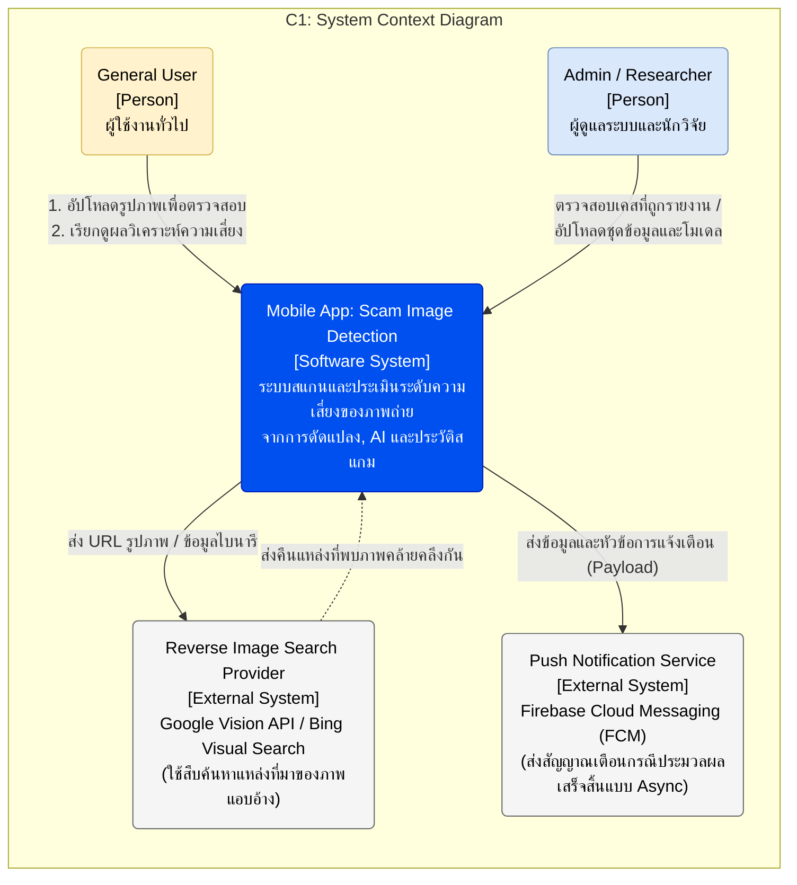
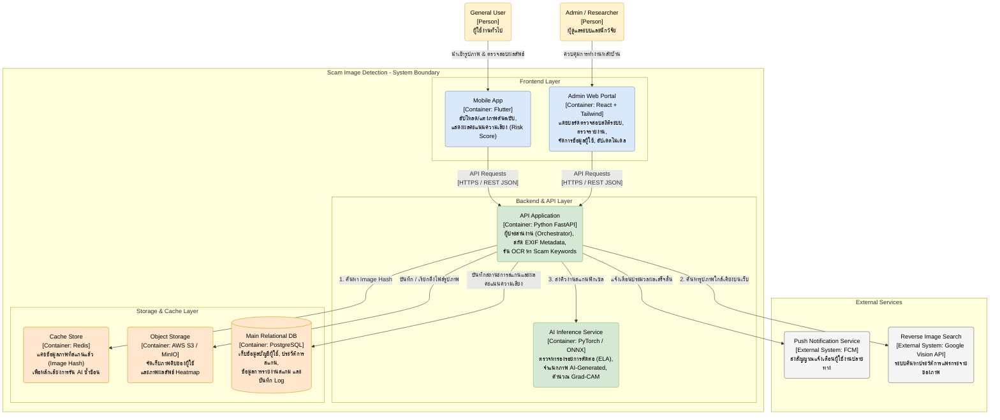

# เอกสารสถาปัตยกรรมระบบ (System Architecture)
## โครงงาน: แอปตรวจสอบรูปภาพตัดต่อที่ถูกนำมาหลอกลวง (Scam Image Detection)
### หลักสูตรวิศวกรรมซอฟต์แวร์ สาขาวิศวกรรมไฟฟ้า คณะวิศวกรรมศาสตร์ มทร.ล้านนา (เชียงใหม่ ดอยสะเก็ด)

เอกสารฉบับนี้อธิบายโครงสร้างสถาปัตยกรรมระบบ (System Architecture) ทั้งหมดของโครงการ **Scam Image Detection** โดยครอบคลุมโครงสร้างหน้าบ้าน (Frontend), หลังบ้าน (Backend), ระบบปัญญาประดิษฐ์ (AI Inference), ระบบฐานข้อมูลและการจัดเก็บไฟล์ (Database & Storage) ตลอดจนการบูรณาการระบบภายนอก (External Integrations) และแนวทางการประมวลผลข้อมูลในแต่ละชั้นวิเคราะห์ (Multi-layer Analysis Pipeline)

---

## 🔗 เอกสารที่เกี่ยวข้อง (Related Documents)

* เอกสารข้อกำหนดความต้องการระบบหลัก (SRS) (doc/srs.md)
* การออกแบบส่วนหน้าบ้าน (Mobile Application Design) (design/design.md)
* การออกแบบโมบายแอปพลิเคชันโดยละเอียด (Detailed Mobile Design) (design/mobile.md)
* แผนภาพระดับ C1 (System Context Diagram) (doc/C1-System-Context-Diagram.md)
* แผนภาพระดับ C2 (Container Diagram) (doc/C2-Container-Diagram.md)
* แผนภาพและรายละเอียดโฟลว์การทำงาน (Flowchart & System Logic) (doc/flowchart.md)

---

## 1. ภาพรวมสถาปัตยกรรมระบบ (Architecture Overview)

ระบบ Scam Image Detection ได้รับการออกแบบภายใต้แนวคิด **Cloud-Native Architecture** และ **Decoupled Architecture** เพื่อแยกส่วนแสดงผล (Frontend Widgets) ออกจากตรรกะทางธุรกิจและการคำนวณของปัญญาประดิษฐ์ (AI Core Model Inference) ที่ต้องใช้ทรัพยากรการคำนวณระดับสูง

ระบบถูกแบ่งออกเป็น 3 เลเยอร์หลัก:
1. **Presentation Layer (Frontend):** แอปพลิเคชันสมาร์ทโฟนที่พัฒนาด้วย **Flutter** สำหรับผู้ใช้งานทั่วไป และระบบเว็บพอร์ทัลที่พัฒนาด้วย **React.js** สำหรับผู้ดูแลระบบ
2. **Business & Processing Layer (Backend Services):** ใช้ระบบย่อยประเภท Microservices โดยมี **API Application (FastAPI)** ทำหน้าที่คอยประสานงาน และสั่งงานการคำนวณเฉพาะด้านแยกไปที่ **AI Inference Service (PyTorch/ONNX)**
3. **Data & Storage Layer (Storages):** ระบบจัดเก็บข้อมูลเชิงสัมพันธ์ **PostgreSQL**, หน่วยความจำแคชความเร็วสูง **Redis Cache** และพื้นที่จัดเก็บออบเจกต์ **AWS S3**

---

## 2. แผนภาพบริบทระบบ (C1: System Context Diagram)

แผนภาพแสดงขอบเขตของระบบหลัก (Software System), ผู้มีส่วนเกี่ยวข้อง (Actors) และบริการภายนอกที่ระบบมีการเข้าถึงและสื่อสาร (External Systems)

---

## 3. แผนภาพระดับคอนเทนเนอร์ (C2: Container Diagram)

แผนภาพแสดงองค์ประกอบและคอนเทนเนอร์ย่อยภายในกรอบการทำงานของระบบ (System Boundary) ซึ่งอธิบายความสัมพันธ์และโปรโตคอลในการสื่อสารระหว่างแต่ละกล่องบริการ

---

## 4. รายละเอียดส่วนประกอบของระบบ (Container Component Details)

### 4.1 Frontend Containers

#### 4.1.1 Mobile Application (Flutter)
* **สถาปัตยกรรมโค้ด:** พัฒนาภายใต้หลักการ **Clean Architecture** แยกแยะโครงสร้างเป็น Presentation Layer, Domain Layer และ Data Layer ตามรูปแบบ **MVVM (Model-View-ViewModel)**
* **การจัดการสถานะ (State Management):** ใช้บล็อกควบคุมการไหลข้อมูล **BLoC (Business Logic Component)** ช่วยให้หน้าจอ UI ปราศจาก Logic ประมวลผล และลดการผูกติดกับ SDK
* **กลไกการนำเข้ารูปภาพ:** มีโมดูลปรับแต่งครอปรูปภาพ (Image Cropper) ในตัวเครื่อง เพื่อช่วยให้ผู้ใช้สามารถโฟกัสจุดที่ต้องการตรวจสอบ (เช่น รายละเอียดข้อความบนใบเสร็จหรือพิกเซลของภาพถ่าย) ก่อนส่งผ่านโปรโตคอล Multipart ไปที่หลังบ้าน
* **การสื่อสาร:** เชื่อมโยงผ่าน REST API ของ API Application โดยใช้ HTTP Client (คลาส Dio) ร่วมกับการจัดการ Session โทเคนใน Secure Storage

#### 4.1.2 Admin Web Portal (React + Tailwind CSS)
* **บทบาท:** สำหรับเจ้าหน้าที่ระบบ นักวิจัยปัญญาประดิษฐ์ หรือทีมงานสนับสนุนระบบ
* **หน้าที่หลัก:**
  * **Dashboard:** แสดงผลสถิติภาพรวม อัตราความแม่นยำของการสแกน และปริมาณทราฟฟิก
  * **Report Management:** คัดกรองและพิจารณาความถูกต้องของรูปภาพที่ผู้ใช้รายงานเข้ามาว่าเป็นการหลอกลวงจริงหรือไม่ (Scam Reports Verification)
  * **Data Enrichment:** รวบรวมข้อมูลรูปภาพสแกมเพื่อใช้ทำ Dataset ในการ Train โมเดลเวอร์ชันใหม่
  * **Model Deployment:** เมนูในการอัปเดตและเปลี่ยนแปลงน้ำหนักของโมเดลตรวจจับปัญญาประดิษฐ์ (Weight Management)

---

### 4.2 Backend & API Containers

#### 4.2.1 API Application (Python FastAPI)
* **บทบาท:** ตัวควบคุมหลัก (Orchestrator/API Gateway) จัดการเส้นทางข้อมูล (Data Pipelines) และเป็นจุดสิ้นสุด (Endpoints) สำหรับแอปพลิเคชันภายนอกทั้งหมด
* **หน้าที่การทำงานหลัก:**
  1. **User Authentication:** ควบคุมการเข้าสู่ระบบผ่านการลงทะเบียนแบบธรรมดาและ OAuth โดยมีรูปแบบสิทธิ์ผู้ใช้จำแนกตามตำแหน่ง (Role-Based Access Control)
  2. **Metadata Extraction:** สกัดข้อมูลที่แฝงมากับไฟล์ภาพ เช่น EXIF Data, GPS Location, รุ่นของกล้อง เพื่อตรวจหาความไม่สอดคล้องเบื้องต้น
  3. **Textual OCR Analysis:** แปลงรูปภาพเป็นข้อความด้วย OCR จากนั้นส่งให้ระบบวิเคราะห์ NLP (เช่น RegEx หรือโมเดล NLP ขนาดเล็ก) เพื่อค้นหาคำศัพท์อันตราย (Scam Keywords) เช่น "ด่วน", "โอนเงินด่วน", "รับปันผลสูง"
  4. **Job Coordinator:** ดำเนินการกระจายภารกิจสแกนภาพที่เหลือไปยังคอนเทนเนอร์ AI Inference และฐานข้อมูลตามลำดับ

#### 4.2.2 AI Inference Service (PyTorch / ONNX Runtime)
* **บทบาท:** เซอร์วิสวิเคราะห์รูปภาพเชิงลึก (Deep Learning Node) แยกต่างหากเพื่อลดการใช้ CPU/GPU ของเครื่อง API Gateway
* **โมเดลการวิเคราะห์หลัก:**
  * **Visual Forgery Detection (ELA):** ตรวจสอบระดับข้อผิดพลาดของภาพ (Error Level Analysis) ในส่วนที่มีการบันทึกภาพซ้ำหรือปรับแต่งระดับพิกเซล เช่น บริเวณตัวเลขสลิปโอนเงิน หรือการเปลี่ยนใบหน้าบุคคล
  * **AI-Generated Image Detection:** ใช้โมเดลจำแนกภาพเชิงลึก (Classifier) เพื่อตรวจสอบลวดลายความถี่ของเม็ดสีพิกเซลที่เกิดจากการสร้างด้วยปัญญาประดิษฐ์ (Generative AI) เช่น ภาพเสมือนจริงของมิจฉาชีพ
  * **Explainable AI (XAI):** คำนวณหาตำแหน่งพิกเซลที่โมเดลประมวลผลว่าผิดปกติสูงสุด และเปลี่ยนรูปแบบให้เป็นภาพแผนที่ความร้อน (**Grad-CAM Heatmap**) เพื่อใช้พล็อตทับลงบนรูปภาพจริง ส่งให้ผู้ใช้เห็นพื้นที่ที่มีความเสี่ยงสูง

---

### 4.3 Storage Containers

* **Cache Store (Redis):** ทำหน้าที่เป็น Cache Lookup เมื่อมีผู้ส่งตรวจสอบรูปภาพ ระบบจะแปลงภาพเป็นค่า Hash และเช็กที่ Redis หากพบค่าเดิม (Cache Hit) จะตอบกลับข้อมูลผลลัพธ์เก่าทันทีโดยไม่ต้องรัน AI ซ้ำ
* **Object Storage (AWS S3 / MinIO):** จัดเก็บรูปภาพต้นฉบับของผู้ใช้ โดยแบ่ง Directory อย่างมีระเบียบ และจัดเก็บรูปผลลัพธ์ Grad-CAM Heatmap เพื่อให้หน้าจอแอปแสดงภาพซ้อนทับบริเวณที่ตัดต่อ
* **Main Relational Database (PostgreSQL):** ใช้จัดเก็บข้อมูลที่มีความสัมพันธ์กันและต้องรับประกันความปลอดภัยของข้อมูล (ACID Transaction) ได้แก่ ตารางประวัติผู้ใช้งาน, รายการประวัติสแกน, สถิติคะแนนความเสี่ยง, ข้อมูลรายงานสแกม และสถานะ Consent การยินยอมความเป็นส่วนตัว

---

## 5. การวิเคราะห์ข้อมูลและการคำนวณระดับความเสี่ยง (System Logic & Risk Scoring Pipeline)

ระบบดำเนินการประเมินผลภาพถ่ายผ่านขั้นตอนการประมวลผลเชิงวิเคราะห์หลายมิติ (Multi-layer Analysis Pipeline) ดังแผนภาพด้านล่างนี้:

```mermaid
graph TD
    %% Source & Initial Validation
    S3([AWS S3 / Client File]) -- อัปโหลดรูปภาพ --> Receive[/รับไฟล์รูปภาพ/]
    Receive --> NodeValidate{ตรวจสอบประเภทและ<br>ความสมบูรณ์ของรูปภาพ}
    
    NodeValidate -- ไฟล์เสียหาย/ไม่ใช่รูปภาพ --> Reject[ส่งข้อผิดพลาดกลับผู้ใช้งาน]
    NodeValidate -- ข้อมูลถูกต้อง --> Preprocess[ทำการจัดขนาดและแปลงสีภาพ]

    %% Cache Mechanism
    Preprocess --> NodeCache{มีข้อมูล Hash รูปนี้<br>ใน Redis หรือไม่}
    NodeCache -- Hit (เคยสแกนแล้ว) --> RetCache[ดึงผลลัพธ์เดิมจาก PostgreSQL]
    
    %% Processing Tasks
    NodeCache -- Miss (สแกนใหม่) --> Task1[Task 1: Metadata Check]
    Task1 --> Task2[Task 2: OCR & Textual Analysis]
    Task2 --> Task3[Task 3: Visual Forgery Detection]
    
    %% Error Handling & Logic Branching
    Task3 --> PartialFail[จัดการกรณี Timeout / Partial Failure]
    PartialFail --> NodeKeyword{ตรวจเจอคำศัพท์สุ่มเสี่ยง?}
    
    NodeKeyword -- ไม่พบความสุ่มเสี่ยงชัดเจน --> Task4[Task 4: Reverse Search]
    Task4 --> NodeSearch{สืบค้นประวัติการเผยแพร่}
    
    NodeSearch -- เจอแหล่งข้อมูลซ้ำซ้อน >= 3 แหล่ง --> SourceHigh[ประเมินความเสี่ยงสูงจากรูปแอบอ้าง]
    NodeSearch -- เจอแหล่งข้อมูลน้อยหรือไม่เจอ <= 1 แหล่ง --> SourceLow[ประเมินความเสี่ยงต่ำ ส่งเช็คภาพวาด AI]
    
    SourceLow --> Task5[Task 5: AI-Gen Detection]
    
    %% Aggregation Point (Collector)
    Collector((ตัวรวบรวมคะแนนความเสี่ยง))
    NodeKeyword -- พบคำสุ่มเสี่ยง --> Collector
    SourceHigh -- พบข้อมูลซ้ำซ้อน --> Collector
    Task5 -- ตรวจสอบความถูกต้องสมบูรณ์ --> Collector
    
    %% Final Calculation & Storage
    Collector --> Calc[คำนวณคะแนนรวมถ่วงน้ำหนัก Weighted Risk Score]
    Calc --> Gen[สร้างคำอธิบายความปลอดภัยอ้างอิงอธิบายได้ XAI]
    Gen --> DB[(จัดเก็บบันทึกลง PostgreSQL)]
    
    %% Output
    DB --> Output[/ส่ง JSON ผลลัพธ์กลับ Client/]
    RetCache --> Output

    %% Styling
    style S3 fill:#dae8fc,stroke:#6c8ebf,color:black
    style Receive fill:#0050ef,color:white
    style NodeValidate fill:#f5f5f5,stroke:#666,color:black
    style Reject fill:#f8cecc,stroke:#b85450,color:black
    style Preprocess fill:#dae8fc,stroke:#6c8ebf,color:black
    style NodeCache fill:#ffe6cc,stroke:#d79b00,color:black
    style RetCache fill:#e1d5e7,stroke:#9673a6,color:black
    style Task1 fill:#f5f5f5,stroke:#666,color:black
    style Task2 fill:#f5f5f5,stroke:#666,color:black
    style Task3 fill:#f5f5f5,stroke:#666,color:black
    style Task4 fill:#f5f5f5,stroke:#666,color:black
    style Task5 fill:#f5f5f5,stroke:#666,color:black
    style PartialFail fill:#d5e8d4,stroke:#82b366,color:black
    style NodeKeyword fill:#ffe6cc,stroke:#d79b00,color:black
    style NodeSearch fill:#ffe6cc,stroke:#d79b00,color:black
    style SourceHigh fill:#d5e8d4,stroke:#82b366,color:black
    style SourceLow fill:#d5e8d4,stroke:#82b366,color:black
    style Calc fill:#d5e8d4,stroke:#82b366,color:black
    style DB fill:#ffe6cc,stroke:#d79b00,color:black
    style Output fill:#0050ef,color:white
```

### 5.1 ขั้นตอนและเกณฑ์การคำนวณ Risk Score
ระบบจะทำการแปลงสัญญาณการตรวจจับออกมาเป็นตัวเลขตั้งแต่ **0 ถึง 100** และคำนวณน้ำหนักความเสี่ยงดังนี้:

1. **Textual Risk Score ($S_{text}$ - ค่าน้ำหนัก 25%):** คะแนนจากการวิเคราะห์คำหลอกลวง (เช่น ชักจูงโอนเงิน, ชื่อบัญชีแบล็กลิสต์, ปันผลเร็ว)
2. **Visual Anomaly Risk Score ($S_{visual}$ - ค่าน้ำหนัก 45%):** ความเสี่ยงจากโมเดล ELA ตรวจสอบการแก้ไขตัดแต่งพิกเซล ($S_{forgery}$) ร่วมกับความเสี่ยงจากการถูกสร้างด้วย AI ($S_{aigen}$)
3. **Source Verification Risk Score ($S_{source}$ - ค่าน้ำหนัก 30%):** ผลวิเคราะห์ความน่าสงสัยของการใช้ภาพผิดบริบทหรือภาพที่ถูกก๊อปปี้มาใช้งานหลายเว็บไซต์

$$Risk\ Score = (S_{text} \times 0.25) + (S_{visual} \times 0.45) + (S_{source} \times 0.30)$$

### 5.2 การแปลผลลัพธ์ระดับความเสี่ยง (Risk Grades)
* **0 - 39 คะแนน (Low Risk):** ระดับความเสี่ยงต่ำ สีเขียว 🟢 ไม่พบสิ่งบอกเหตุอันตราย
* **40 - 69 คะแนน (Medium Risk):** ระดับความเสี่ยงปานกลาง สีเหลือง 🟡 พบพฤติกรรมหรือข้อความผิดปกติบางจุด ควรใช้วิจารณญาณประกอบ
* **70 - 100 คะแนน (High Risk):** ระดับความเสี่ยงสูง สีแดง 🔴 ตรวจพบร่องรอยการตัดแต่ง คัดลอก หรือพบคำค้นหาการหลอกลวงเด่นชัด

---

## 6. ความมั่นคงปลอดภัยและการปฏิบัติตามกฎหมาย (Security & Compliance)

### 6.1 การควบคุมการเข้าถึงและการส่งผ่านข้อมูล (Access & Transport Security)
* **HTTPS/TLS Encryption:** สื่อสารผ่านระบบเครือข่ายด้วยความปลอดภัยระดับ HTTPS เพื่อป้องกันการถูกดักฟังระหว่างโมบายแอปและเซิร์ฟเวอร์หลังบ้าน
* **JSON Web Token (JWT):** ใช้ JWT ในการยืนยันตัวตนสำหรับเรียกใช้ API Gateway โดยจัดเก็บรหัสโทเคนในคลังเก็บความลับบนเครื่องอุปกรณ์เคลื่อนที่อย่างปลอดภัย (Secure Storage)
* **Role-Based Access Control (RBAC):** แยกสิทธิ์ผู้ใช้และผู้ดูแลระบบออกจากกันอย่างสิ้นเชิงทางฐานข้อมูล โดย Admin Portal เท่านั้นที่สามารถอัปโหลดโมเดลหรือสุ่มตรวจเคสผู้ใช้ได้

### 6.2 การคุ้มครองข้อมูลส่วนบุคคล (PDPA & Consent Management)
* **Privacy by Design:** ระบบถูกสร้างขึ้นโดยคำนึงถึงความเป็นส่วนตัวของผู้ใช้งานเป็นหลัก
* **Consent Control (ยินยอมระบุสิทธิ์):** ในการสมัครสมาชิกหรือเริ่มใช้งานครั้งแรก ผู้ใช้สามารถเลือกสิทธิ์ความยินยอมได้เป็น 2 ส่วน:
  1. **ความต้องการเชิงระบบ:** ความยินยอมส่งประมวลผลไฟล์ภาพแบบประจักษ์ (สแกนครั้งเดียวและลบข้อมูลจาก S3 เมื่อได้ข้อสรุปชั่วคราว)
  2. **ความยินยอมด้านงานวิจัย:** การอนุญาตให้นำรูปภาพที่ส่งสแกนหรือสปอตเต็ดบันทึกเข้าสู่คลัง Dataset เพื่อใช้เทรน AI ปรับปรุงความแม่นยำ ซึ่งผู้ใช้สามารถกดยกเลิกความยินยอม (Opt-out) ย้อนหลังในหน้าตั้งค่าได้ทุกเวลา
* **Data Anonymization:** รูปภาพในประวัติการสแกนและสเปกไฟล์ที่เปิดเผยสำหรับการศึกษาจะถูกตัดค่าพิกัด GPS หรือสัญลักษณ์แวดล้อมที่ระบุตัวตนจริงของผู้ใช้ดั้งเดิมออกไปทั้งหมด

---

## 7. ตารางสรุปการเลือกใช้เทคโนโลยี (Technology Stack Summary)

| ส่วนของระบบ | เทคโนโลยีที่เลือกใช้ | เหตุผลเชิงวิศวกรรมซอฟต์แวร์ |
| :--- | :--- | :--- |
| **Mobile App (Frontend)** | Flutter | รองรับการทำงาน Cross-platform (iOS, Android) ด้วย Codebase ชุดเดียว และง่ายต่อการปรับปรุง UI/UX ด้วยธีม Dark Mode |
| **Admin Portal (Frontend)** | React.js + Tailwind CSS | โหลดข้อมูลแบบ Dynamic ได้รวดเร็ว, จัดการ State ของหน้าต่างแอดมินได้ดี และสร้าง UI ในรูปแบบ Dashboard ได้เหมาะสม |
| **Backend & Orchestrator** | Python FastAPI | ทำงานแบบ Asynchronous ได้มีประสิทธิภาพสูง, อัตราความเร็วใกล้เคียง Go/Node.js, มีระบบ Validate ข้อมูลและสร้าง API Doc อัตโนมัติ |
| **AI Processing Framework** | PyTorch / ONNX Runtime | ปฏิบัติการคำนวณ Deep Learning โมเดลได้ดี, ONNX Runtime ช่วยเพิ่มความเร็วในการ Inference ได้มากกว่า PyTorch ดั้งเดิมถึง 2-5 เท่า |
| **Primary Relational DB** | PostgreSQL | มีเสถียรภาพในการบันทึกข้อมูลแบบสัมพันธ์ (Relational Data), ปลอดภัย, รองรับคิวรีซับซ้อนและการเก็บพิกัดเชิงภูมิศาสตร์ (PostGIS) |
| **Caching Engine** | Redis Cache | ช่วยดึงค่า Image Hash ที่เคยตรวจสอบแล้วอย่างรวดเร็ว (ลด latency จากหลายวินาทีให้เหลือหลักมิลลิวินาที) |
| **File Storage** | AWS S3 / MinIO | รองรับการจัดเก็บไฟล์อิมเมจและรูป Heatmap ได้ในปริมาณมหาศาลแบบไร้ขีดจำกัด พร้อมระบบกำหนดอายุลิงก์ชั่วคราว (Presigned URLs) |
| **External Search API** | Google Vision API | ใช้กลไก Reverse Image Search เพื่อสืบค้นข้อมูลภาพแอบอ้างในโลกออนไลน์ได้อย่างแม่นยำและครอบคลุมที่สุด |
| **Push Notification** | Firebase Cloud Messaging (FCM) | เป็นระบบส่ง Push Alert ที่เป็นมาตรฐาน เสถียรสูง และรองรับทั้งอุปกรณ์ iOS และ Android โดยไม่มีค่าใช้จ่ายพื้นฐาน |
