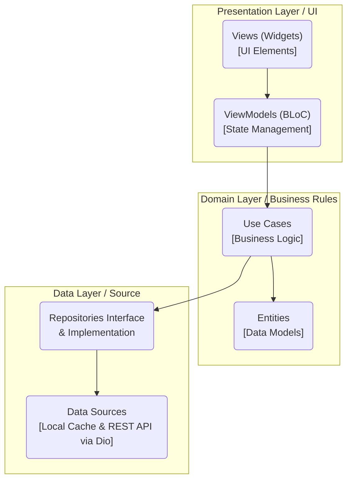
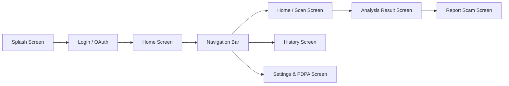
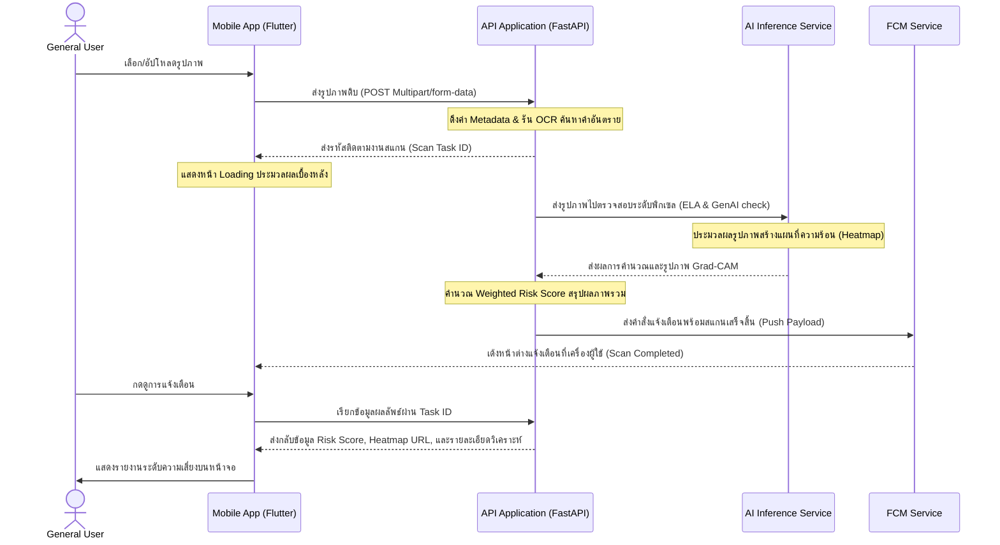

# การออกแบบแอปพลิเคชันบนอุปกรณ์เคลื่อนที่ (Mobile Application Design)
## โครงงาน: แอปตรวจสอบรูปภาพตัดต่อที่ถูกนำมาหลอกลวง (Scam Image Detection)

เอกสารฉบับนี้อธิบายรายละเอียดโครงสร้างการออกแบบส่วนหน้าบ้าน (Frontend Mobile Application) ที่พัฒนาด้วย Flutter ของระบบ Scam Image Detection โดยครอบคลุมสถาปัตยกรรมซอฟต์แวร์, ระบบการออกแบบ UI/UX, โครงสร้างหน้าจอ และแผนผังการไหลของข้อมูลผู้ใช้งาน (User Flow)

---

## 1. สถาปัตยกรรมซอฟต์แวร์ฝั่ง Mobile App (Software Architecture)

แอปพลิเคชันพัฒนาด้วย Flutter โดยยึดตามหลักการออกแบบ Clean Architecture และแบ่งการเขียนโค้ดตามรูปแบบ MVVM (Model-View-ViewModel) ร่วมกับ State Management ของ BLoC (Business Logic Component) เพื่อแยก Logic การทำงานออกจาก UI อย่างชัดเจน

### รายละเอียดโครงสร้าง Layer:
* **Presentation Layer:** ประกอบด้วย Widget ต่าง ๆ ที่ทำหน้าที่แสดงผลหน้าตาแอป และ BLoC ที่ทำหน้าที่รับ Event จากหน้าจอ ประมวลผลเปลี่ยนสถานะ (State) แล้วส่งผลลัพธ์กลับไปอัปเดต UI
* **Domain Layer:** แกนกลางที่ไม่ขึ้นตรงกับเฟรมเวิร์กใด ๆ ประกอบด้วยโมเดลข้อมูลหลัก (Entities) และคลาสคำสั่งธุรกิจ (Use Cases) เช่น การส่งตรวจวิเคราะห์ภาพ หรือการเรียกดูประวัติ
* **Data Layer:** จัดการเชื่อมต่อกับแหล่งข้อมูลภายนอก โดยเชื่อมต่อ REST API ผ่าน HTTP Client (คลาส Dio) และการจัดเก็บโทเคนความปลอดภัยใน Secure Storage

---

## 2. ระบบการออกแบบ UI/UX และธีมสี (Design System & Theme)

แอปพลิเคชันออกแบบภายใต้ธีม Dark Mode เพื่อเน้นความล้ำสมัย ปลอดภัย และลดอาการเมื่อยล้าสายตา โดยใช้สีและแบบอักษรที่คัดสรรเป็นพิเศษดังนี้:

### โทนสีของระบบ (Color Palette):
* **สีพื้นหลังหลัก (Primary Background):** Slate Gray (#121824) ให้ความรู้สึกมั่นคง สบายตา
* **สีพื้นหลังรอง (Secondary Background):** Navy Blue Gray (#1A2333) สำหรับการสร้างกล่องข้อความและส่วนประกอบย่อย
* **สีเน้นการทำงาน (Accent/Primary Color):** Neon Cyan (#00E5FF) สีฟ้าสว่าง ใช้สำหรับปุ่มกดหลักและองค์ประกอบที่ต้องการเน้นสายตา
* **สีสถานะความเสี่ยง (Risk Indicators):**
  * ความเสี่ยงต่ำ (Low Risk): Emerald Green (#00E676)
  * ความเสี่ยงปานกลาง (Medium Risk): Amber Yellow (#FFD700)
  * ความเสี่ยงสูง (High Risk): Crimson Red (#FF1744)

### ตัวอักษร (Typography):
* เลือกใช้แบบอักษร **Outfit** (จาก Google Fonts) สำหรับข้อความภาษาอังกฤษและตัวเลขเพื่อให้ความลื่นไหล ทันสมัย
* ใช้แบบอักษร **Sarabun** สำหรับการแสดงผลข้อความภาษาไทยเพื่อให้อ่านง่ายและมีความเป็นทางการ

---

## 3. โครงสร้างหน้าจอและทางเดินของผู้ใช้ (App Screen Structure & Navigation)

หน้าจอหลักของแอปพลิเคชันประกอบไปด้วย 5 หน้าจอหลักที่เชื่อมต่อผ่านระบบ Bottom Navigation Bar:

### รายละเอียดหน้าที่ของแต่ละหน้าจอ:

#### 1. Splash Screen
* ทำหน้าที่โหลดการตั้งค่าระบบ ตรวจเช็กโทเคนการเข้าสู่ระบบเดิม (Session Token)
* หากผู้ใช้เคยล็อกอินค้างไว้ ระบบจะข้ามไปหน้า Home ทันที หากไม่มีจะพาไปหน้า Login

#### 2. Login & Authentication Screen
* หน้าจอกรอก Email/Password และช่องทางล็อกอินแบบรวดเร็ว (Google Login / Apple ID)
* มีลิงก์สำหรับสมัครสมาชิกใหม่ และระบบขอเปลี่ยนรหัสผ่านใหม่ (Forgot Password)

#### 3. Home / Scan Screen (หน้าแรกและนำเข้ารูปภาพ)
* เป็นหน้าหลักเมื่อเปิดแอป ประกอบด้วย:
  * ปุ่มกดสำหรับ นำเข้ารูปภาพจากคลังภาพ (Gallery) เพื่ออัปโหลดเข้าสู่ระบบ
  * เมนูแนะนำภัยออนไลน์ (Scam Alerts Feed) สำหรับอัปเดตกลโกงใหม่ ๆ จากผู้ดูแลระบบ
  * เมื่อเลือกรูปภาพเสร็จ แอปจะส่งไปยังหน้าครอปตัดรูป (Image Cropper Widget) ก่อนจะเริ่มส่งขึ้น API และแสดงสถานะกำลังวิเคราะห์ (Loading Shimmer Effect)

#### 4. Analysis Result Screen (หน้าแสดงผลลัพธ์)
* แสดงผลคะแนนความเสี่ยงรวม (Weighted Risk Score) ในรูปของมาตรวัดวงกลมสี (Radial Risk Gauge)
* ตัวเลือกระหว่าง:
  * หน้าแสดงข้อมูลภาพต้นฉบับ
  * หน้าภาพ Heatmap (แสดง Grad-CAM ที่ชี้พิกเซลผิดปกติจาก AI)
* รายละเอียดผลวิเคราะห์ 3 ชั้น (Multi-layer Analysis Breakdown):
  * ผลตรวจสอบ OCR & คำอันตราย (Textual Detection)
  * ผลตรวจสอบข้อมูลไฟล์และอุปกรณ์ที่ใช้บันทึกภาพ (Metadata Check)
  * ผลตรวจสอบแหล่งที่มาดั้งเดิม (Reverse Image Search Results)
* ปุ่มกดรายงานเบาะแสเข้าระบบกลาง (Report to Scam DB) และปุ่มแชร์รูปภาพแจ้งเตือน (Share Scam Alert)

#### 5. History Screen (หน้าประวัติการสแกน)
* หน้าแสดงรายการการสแกนที่ผ่านมา จัดเรียงตามวัน-เวลา
* แสดงข้อมูลสรุปย่อ เช่น รูปตัวอย่าง, วันที่สแกน, และระดับความเสี่ยง
* ฟังก์ชันการลบประวัติทีละรายการ (Slide to delete) หรือลบทั้งหมดในครั้งเดียว

#### 6. Settings & PDPA Screen (หน้าการตั้งค่าและสิทธิ์)
* จัดการข้อมูลส่วนตัว และเปลี่ยนรหัสผ่าน
* ส่วนจัดการข้อตกลงความเป็นส่วนตัว (PDPA / Consent Management) ให้ผู้ใช้สามารถกดยกเลิกความยินยอมการส่งไฟล์ภาพเข้าคลังวิจัยย้อนหลังได้ตลอดเวลา

---

## 4. แผนผังการทำงานและการประมวลผลข้อมูล (Sequence Flow)

ขั้นตอนการส่งรูปภาพขึ้นไปประมวลผลและส่งการแจ้งเตือนกลับมายังแอปพลิเคชันมือถือ:

