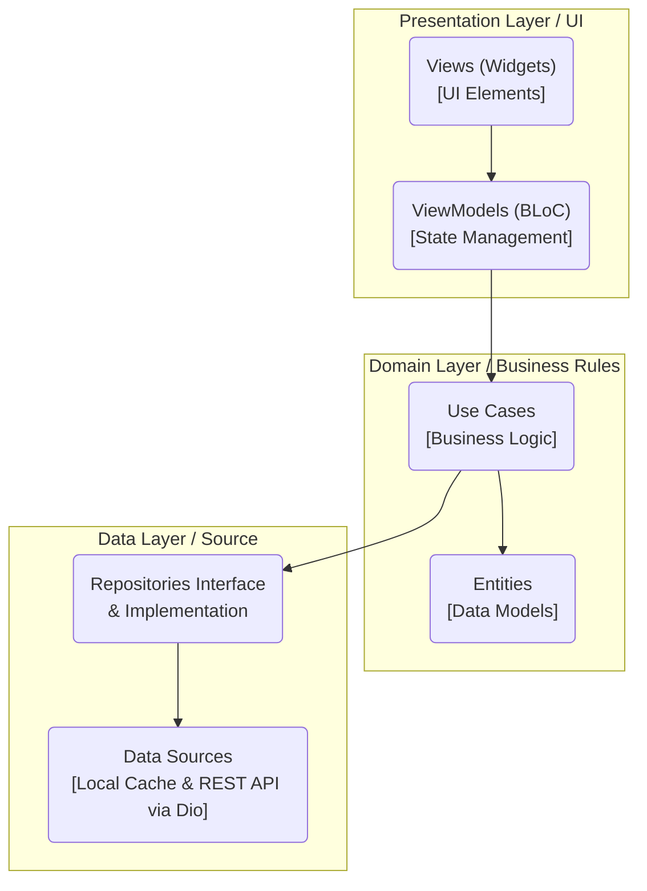
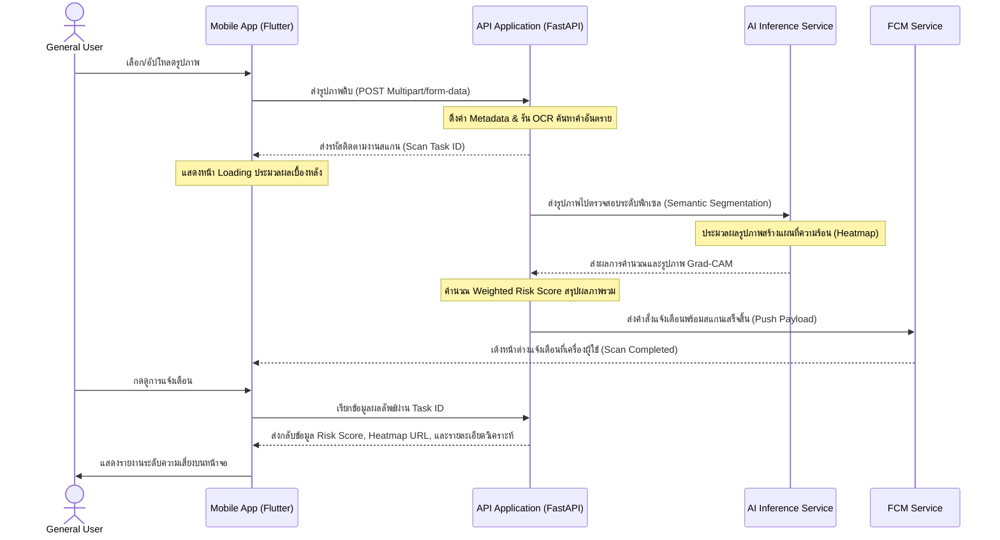

# การออกแบบแอปพลิเคชันบนอุปกรณ์เคลื่อนที่ (Mobile Application Design)
## โครงงาน: แอปตรวจสอบรูปภาพตัดต่อที่ถูกนำมาหลอกลวง (Scam Image Detection)

เอกสารฉบับนี้อธิบายรายละเอียดโครงสร้างการออกแบบส่วนหน้าบ้าน (Frontend Mobile Application) ที่พัฒนาด้วย Flutter ของระบบ Scam Image Detection โดยครอบคลุมสถาปัตยกรรมซอฟต์แวร์, ระบบการออกแบบ UI/UX, โครงสร้างหน้าจอ และแผนผังการไหลของข้อมูลผู้ใช้งาน (User Flow)

---

## 1. สถาปัตยกรรมซอฟต์แวร์ฝั่ง Mobile App (Software Architecture)

แอปพลิเคชันพัฒนาด้วย Flutter โดยยึดตามหลักการออกแบบ Clean Architecture และแบ่งการเขียนโค้ดตามรูปแบบ MVVM (Model-View-ViewModel) ร่วมกับ State Management ของ BLoC (Business Logic Component) เพื่อแยก Logic การทำงานออกจาก UI อย่างชัดเจน

```mermaid
flowchart TD
    subgraph UI_Layer [Presentation Layer / UI]
        Views("Views (Widgets)<br>[UI Elements]")
        Blocs("ViewModels (BLoC)<br>[State Management]")
    end

    subgraph Domain_Layer [Domain Layer / Business Rules]
        Entities("Entities<br>[Data Models]")
        UseCases("Use Cases<br>[Business Logic]")
    end

    subgraph Data_Layer [Data Layer / Source]
        Repositories("Repositories Interface<br>& Implementation")
        DataSources("Data Sources<br>[Local Cache & REST API via Dio]")
    end

    %% Connections
    Views --> Blocs
    Blocs --> UseCases
    UseCases --> Entities
    UseCases --> Repositories
    Repositories --> DataSources
```

### รายละเอียดโครงสร้าง Layer:
* **Presentation Layer:** ประกอบด้วย Widget ต่าง ๆ ที่ทำหน้าที่แสดงผลหน้าตาแอป และ BLoC ที่ทำหน้าที่รับ Event จากหน้าจอ ประมวลผลเปลี่ยนสถานะ (State) แล้วส่งผลลัพธ์กลับไปอัปเดต UI
* **Domain Layer:** แกนกลางที่ไม่ขึ้นตรงกับเฟรมเวิร์กใด ๆ ประกอบด้วยโมเดลข้อมูลหลัก (Entities) และคลาสคำสั่งธุรกิจ (Use Cases) เช่น การส่งตรวจวิเคราะห์ภาพ หรือการเรียกดูประวัติ
* **Data Layer:** จัดการเชื่อมต่อกับแหล่งข้อมูลภายนอก โดยเชื่อมต่อ REST API ผ่าน HTTP Client (คลาส Dio) และการจัดเก็บโทเคนความปลอดภัยใน Secure Storage

---

## 2. ระบบการออกแบบ UI/UX และธีมสี (Design System & Theme)

แอปพลิเคชันออกแบบภายใต้ธีม Dark Mode เพื่อเน้นความล้ำสมัย ปลอดภัย และลดอาการเมื่อยล้าสายตา โดยใช้สีและแบบอักษรที่คัดสรรเป็นพิเศษดังนี้:

### โทนสีของระบบ (Color Palette):
* **สีพื้นหลังหลัก (Primary Background / bg-dark):** Deep Slate (#0F1720) ให้ความรู้สึกมั่นคง สบายตา
* **สีพื้นหลังรอง (Secondary Background / surface-dark):** Navy Blue Gray (#162230) สำหรับการ์ด Bottom Navigation และ AppBar
* **สีเน้นการทำงาน (Accent/Primary Color):** Trust Blue (#006685) สีหลักสำหรับปุ่มกดหลัก และ Cyan (#00A6D6) (Primary Container) สำหรับองค์ประกอบที่ต้องการเน้นสายตา
* **สีสถานะความเสี่ยง (Risk Indicators):**
  * ความเสี่ยงต่ำ (Low Risk / Success): Green (#006E2D)
  * ความเสี่ยงปานกลาง (Medium Risk / Warning): Amber (#D68900)
  * ความเสี่ยงสูง (High Risk / Danger): Red (#DC2626)

### ตัวอักษร (Typography):
* ใช้แบบอักษร **Sarabun** สำหรับการแสดงผลข้อความภาษาไทยเพื่อให้อ่านง่ายและมีความเป็นทางการ
* เลือกใช้แบบอักษร **Inter** (จาก Google Fonts) สำหรับข้อความภาษาอังกฤษ ตัวเลข และข้อมูลเชิงเทคนิค (Technical Data)

---

## 3. โครงสร้างหน้าจอและทางเดินของผู้ใช้ (App Screen Structure & Navigation)

โครงสร้างหน้าจอของแอปพลิเคชันแบ่งเป็น 4 หน้าจอหลักใน Main Shell ที่เชื่อมต่อผ่านระบบ Bottom Navigation Bar (Home / History / Report / Settings) ส่วนหน้าจออื่น ๆ เช่น Splash, Login, Onboarding Consent และ Analysis Result เป็น Standalone Route:

```mermaid
flowchart LR
    Splash[Splash Screen] --> Login[Login / OAuth]
    Login --> Consent[Onboarding Consent Screen<br>(PDPA Consent – 2 ระดับ)]
    Consent --> Home[Home Screen]
    
    Home --> Nav[Navigation Bar]
    Nav --> NavHome[Home / Scan Screen]
    Nav --> NavHistory[History Screen]
    Nav --> NavReport[Report Scam Screen]
    Nav --> NavSettings[Settings & PDPA Screen]

    NavHome --> Result[Analysis Result Screen<br>(Standalone Route)]
    NavHistory --> Detail[History Detail Screen<br>(Standalone Route)]
```

### รายละเอียดหน้าที่ของแต่ละหน้าจอ:

#### 1. Splash Screen
* ทำหน้าที่โหลดการตั้งค่าระบบ ตรวจเช็กโทเคนการเข้าสู่ระบบเดิม (Session Token)
* หากผู้ใช้เคยล็อกอินค้างไว้ ระบบจะข้ามไปหน้า Home ทันที หากไม่มีจะพาไปหน้า Login

#### 2. Login & Authentication Screen
* หน้าจอกรอก Email/Password และช่องทางล็อกอินแบบรวดเร็วด้วย Google (Phase 2 – RC-AUTH-06)
* มีลิงก์สำหรับสมัครสมาชิกใหม่ และระบบขอเปลี่ยนรหัสผ่านใหม่ (Forgot Password – Phase 2, RC-AUTH-05)

#### 3. Onboarding / Consent Screen (หน้ายินยอม PDPA)
* แสดงเป็นหน้าจอแบบ Standalone หลังผู้ใช้ล็อกอินสำเร็จครั้งแรก ก่อนเข้าสู่หน้าหลักของแอป
* แสดงข้อตกลงการเข้าถึงข้อมูลและการเก็บรวบรวมไฟล์ภาพ (Consent Screen) แบบ 2 ระดับ (Two-level Consent)
* ผู้ใช้ต้องยอมรับข้อตกลงหลักจึงจะเข้าใช้งานได้ และสามารถยกเลิกความยินยอมย้อนหลังได้จากหน้า Settings & PDPA

#### 4. Home / Scan Screen (หน้าแรกและนำเข้ารูปภาพ)
* เป็นหน้าหลักเมื่อเปิดแอป ประกอบด้วย:
  * ปุ่มกดสำหรับ นำเข้ารูปภาพจากคลังภาพ (Gallery) เพื่ออัปโหลดเข้าสู่ระบบ
  * เมื่อเลือกรูปภาพเสร็จ แอปจะส่งไปยังหน้าครอปตัดรูป (Image Cropper Widget) ก่อนจะเริ่มส่งขึ้น API และแสดงสถานะกำลังวิเคราะห์ (Loading Shimmer Effect)

#### 5. Analysis Result Screen (หน้าแสดงผลลัพธ์)
* แสดงผลคะแนนความเสี่ยงรวม (Weighted Risk Score) ในรูปของมาตรวัดวงกลมเต็ม (Full-circle Radial Risk Gauge)
* ตัวเลือกระหว่าง:
  * หน้าแสดงข้อมูลภาพต้นฉบับ
  * หน้าภาพ Heatmap (แสดง Grad-CAM ที่ชี้พิกเซลผิดปกติจาก AI)
* รายละเอียดผลวิเคราะห์ 3 ชั้น (Multi-layer Analysis Breakdown):
  * ผลตรวจสอบ OCR & คำอันตราย (Textual Detection)
  * ผลตรวจจับพิกเซลภาพตัดต่อ/ภาพสังเคราะห์ AI (Visual Detection – SegFormer + Grad-CAM)
  * ผลตรวจสอบความน่าเชื่อถือของแหล่งที่มา (Source Reliability – Reverse Image Search Results)
* หมายเหตุ: ข้อมูลไฟล์และอุปกรณ์ที่ใช้บันทึกภาพ (Metadata/EXIF) แสดงเป็นกล่องข้อมูลประกอบ (Display-only Info Block) เท่านั้น ไม่ได้ถูกนำมาใช้คำนวณคะแนนความเสี่ยง
* ปุ่มกดรายงานเบาะแสเข้าระบบกลาง (Report to Scam DB) และปุ่มแชร์รูปภาพแจ้งเตือน (Share Scam Alert)

#### 6. History Screen (หน้าประวัติการสแกน)
* หน้าแสดงรายการการสแกนที่ผ่านมา จัดเรียงตามวัน-เวลา
* แสดงข้อมูลสรุปย่อ เช่น รูปตัวอย่าง, วันที่สแกน, และระดับความเสี่ยง
* ฟังก์ชันการลบประวัติทีละรายการ (Slide to delete) หรือลบทั้งหมดในครั้งเดียว

#### 7. Settings & PDPA Screen (หน้าการตั้งค่าและสิทธิ์)
* จัดการข้อมูลส่วนตัว และเปลี่ยนรหัสผ่าน
* ส่วนจัดการข้อตกลงความเป็นส่วนตัว (PDPA / Consent Management) ให้ผู้ใช้สามารถกดยกเลิกความยินยอมการส่งไฟล์ภาพเข้าคลังวิจัยย้อนหลังได้ตลอดเวลา

---

## 4. แผนผังการทำงานและการประมวลผลข้อมูล (Sequence Flow)

ขั้นตอนการส่งรูปภาพขึ้นไปประมวลผลและส่งการแจ้งเตือนกลับมายังแอปพลิเคชันมือถือ:

```mermaid
sequenceDiagram
    actor User as General User
    participant App as Mobile App (Flutter)
    participant API as API Application (FastAPI)
    participant AI as AI Inference Service
    participant Push as FCM Service

    User->>App: เลือก/อัปโหลดรูปภาพ
    App->>API: ส่งรูปภาพดิบ (POST Multipart/form-data)
    Note over API: ดึงค่า Metadata & รัน OCR ค้นหาคำอันตราย
    API-->>App: ส่งรหัสติดตามงานสแกน (Scan Task ID)
    Note over App: แสดงหน้า Loading ประมวลผลเบื้องหลัง
    
    API->>AI: ส่งรูปภาพไปตรวจสอบระดับพิกเซล (Semantic Segmentation)
    Note over AI: ประมวลผลรูปภาพสร้างแผนที่ความร้อน (Heatmap)
    AI-->>API: ส่งผลการคำนวณและรูปภาพ Grad-CAM
    
    Note over API: คำนวณ Weighted Risk Score สรุปผลภาพรวม
    API->>Push: ส่งคำสั่งแจ้งเตือนพร้อมสแกนเสร็จสิ้น (Push Payload)
    Push-->>App: เด้งหน้าต่างแจ้งเตือนที่เครื่องผู้ใช้ (Scan Completed)
    
    User->>App: กดดูการแจ้งเตือน
    App->>API: เรียกข้อมูลผลลัพธ์ผ่าน Task ID
    API-->>App: ส่งกลับข้อมูล Risk Score, Heatmap URL, และรายละเอียดวิเคราะห์
    App->>User: แสดงรายงานระดับความเสี่ยงบนหน้าจอ
```
