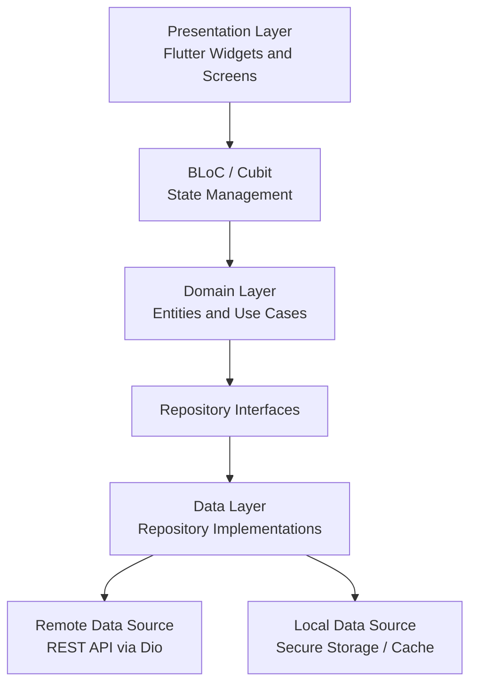
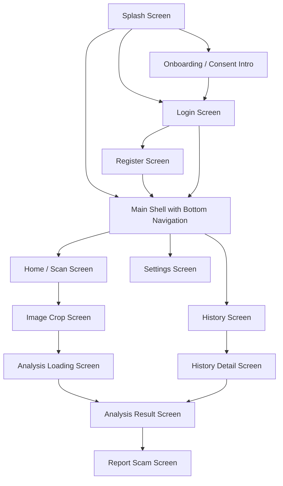

# การออกแบบโมบายแอปพลิเคชัน (Mobile Application Design)
## โครงการ: แอปตรวจสอบรูปภาพตัดต่อที่ถูกนำมาหลอกลวง (Scam Image Detection)

เอกสารฉบับนี้อธิบายรายละเอียดการออกแบบโมบายแอปพลิเคชันสำหรับผู้ใช้งานทั่วไปที่ต้องการตรวจสอบความน่าเชื่อถือของรูปภาพก่อนนำไปเชื่อถือ แชร์ หรือใช้ประกอบการตัดสินใจ โดยระบบเน้นการนำเข้ารูปภาพ วิเคราะห์ความเสี่ยงจากหลายแหล่งข้อมูล และแสดงผลลัพธ์ในรูปแบบที่เข้าใจง่าย เหมาะสำหรับการพัฒนาด้วย Flutter และเชื่อมต่อกับบริการ Backend/API ของระบบ Scam Image Detection

---

## 1. เป้าหมายของโมบายแอป

โมบายแอปทำหน้าที่เป็นส่วนติดต่อหลักระหว่างผู้ใช้งานกับระบบวิเคราะห์รูปภาพ โดยมีเป้าหมายดังนี้

1. ให้ผู้ใช้งานอัปโหลดไฟล์รูปภาพจากอุปกรณ์ได้อย่างรวดเร็ว
2. ส่งรูปภาพเข้าสู่ระบบวิเคราะห์ Scam Image Detection ผ่าน API
3. แสดงผลการวิเคราะห์เป็นระดับความเสี่ยงที่เข้าใจง่าย
4. แสดงรายละเอียดผลวิเคราะห์แบบแยกชั้น เช่น OCR, Metadata, Reverse Image Search, Visual Anomaly และ AI-generated Detection
5. แสดงภาพประกอบการอธิบาย เช่น Heatmap หรือบริเวณที่ระบบตรวจพบความผิดปกติ
6. จัดเก็บประวัติการสแกนเพื่อให้ผู้ใช้งานย้อนดูผลลัพธ์ได้
7. รองรับการรายงานรูปภาพต้องสงสัยเข้าสู่ฐานข้อมูลกลาง
8. คุ้มครองข้อมูลส่วนบุคคลตามแนวทาง PDPA โดยให้ผู้ใช้ควบคุมการยินยอมได้

---

## 2. กลุ่มผู้ใช้งานเป้าหมาย

### 2.1 ผู้ใช้งานทั่วไป

ผู้ใช้งานที่พบรูปภาพจากสื่อสังคมออนไลน์ แชต Marketplace หรือประกาศต่าง ๆ และต้องการตรวจสอบก่อนเชื่อถือหรือตัดสินใจโอนเงิน

ลักษณะการใช้งานหลัก:

- ตรวจสอบรูปโปรไฟล์ รูปสินค้า สลิปโอนเงิน หรือภาพประกาศ
- ต้องการผลลัพธ์ที่อ่านง่าย ไม่ซับซ้อน
- ต้องการคำแนะนำว่าควรเชื่อถือภาพนั้นหรือไม่

### 2.2 ผู้ใช้งานที่เคยถูกหลอกลวง

ผู้ใช้งานที่ต้องการรายงานรูปภาพหรือหลักฐานที่เกี่ยวข้องกับการหลอกลวง

ลักษณะการใช้งานหลัก:

- ส่งรายงานรูปภาพต้องสงสัย
- เพิ่มคำอธิบายหรือบริบทของเหตุการณ์
- อนุญาตให้ระบบใช้รูปภาพเป็นข้อมูลอ้างอิงหรือข้อมูลวิจัย

### 2.3 ผู้ดูแลระบบหรือทีมวิจัย

ใช้งานข้อมูลที่ผู้ใช้รายงานเข้ามาเพื่อปรับปรุงฐานข้อมูลและโมเดลตรวจจับ

ลักษณะการใช้งานหลัก:

- ตรวจสอบรายงานจากผู้ใช้
- วิเคราะห์กรณีภาพหลอกลวงใหม่
- ใช้ข้อมูลที่ได้รับความยินยอมสำหรับปรับปรุงโมเดล

---

## 3. ขอบเขตของโมบายแอป

### 3.1 ฟังก์ชันที่อยู่ในขอบเขต

- สมัครสมาชิกและเข้าสู่ระบบ
- เข้าสู่ระบบด้วย Email/Password
- เข้าสู่ระบบด้วย Google หรือ Apple ID ในระยะต่อยอด
- อัปโหลดไฟล์รูปภาพจากอุปกรณ์
- Crop หรือปรับขอบเขตรูปก่อนส่งวิเคราะห์
- อัปโหลดรูปภาพไปยัง Backend API
- แสดงสถานะการวิเคราะห์แบบกำลังประมวลผล
- แสดงคะแนนความเสี่ยงรวม
- แสดงรายละเอียดการวิเคราะห์แต่ละชั้น
- แสดง Heatmap หรือภาพประกอบผลลัพธ์
- บันทึกประวัติการสแกน
- ค้นหาและกรองประวัติการสแกน
- รายงานภาพต้องสงสัย
- แชร์ผลการแจ้งเตือนในรูปแบบภาพหรือข้อความ
- จัดการโปรไฟล์และความยินยอมด้านข้อมูลส่วนบุคคล

### 3.2 ฟังก์ชันที่อยู่นอกขอบเขตระยะแรก

- ระบบแชตภายในแอป
- ระบบตรวจสอบวิดีโอ
- การวิเคราะห์แบบออฟไลน์เต็มรูปแบบบนเครื่องผู้ใช้
- Dashboard สำหรับผู้ดูแลระบบภายในโมบายแอป
- การแจ้งความหรือส่งข้อมูลต่อหน่วยงานรัฐโดยตรง

---

## 4. สถาปัตยกรรมของแอป

โมบายแอปออกแบบด้วยแนวคิด Clean Architecture เพื่อแยกส่วนแสดงผล ธุรกิจ และแหล่งข้อมูลออกจากกัน ลดการผูกติดกับ Framework และทำให้ทดสอบง่าย



### 4.1 Presentation Layer

รับผิดชอบหน้าจอและ Widget ทั้งหมด เช่น Home, Scan, Result, History และ Settings โดยไม่เขียน Business Logic โดยตรงใน Widget

องค์ประกอบหลัก:

- Screens
- Reusable Widgets
- Form Components
- Navigation
- Loading, Empty, Error State
- Theme และ Design Tokens

### 4.2 State Management Layer

ใช้ BLoC หรือ Cubit สำหรับควบคุมสถานะของหน้าจอและกระบวนการทำงาน เช่น เลือกไฟล์รูป อัปโหลด วิเคราะห์ และแสดงผล

ตัวอย่าง BLoC/Cubit:

- `AuthBloc`
- `ScanBloc`
- `ImageUploadCubit`
- `AnalysisResultBloc`
- `HistoryBloc`
- `ReportBloc`
- `ConsentCubit`
- `SettingsBloc`

### 4.3 Domain Layer

เป็นแกนกลางของตรรกะระบบ ไม่ขึ้นกับ Flutter หรือ API โดยตรง

ตัวอย่าง Use Case:

- `LoginUseCase`
- `SelectImageFileUseCase`
- `SubmitImageForAnalysisUseCase`
- `GetAnalysisResultUseCase`
- `GetScanHistoryUseCase`
- `DeleteScanHistoryUseCase`
- `SubmitScamReportUseCase`
- `UpdateConsentUseCase`

ตัวอย่าง Entity:

- `User`
- `ScanImage`
- `AnalysisTask`
- `AnalysisResult`
- `RiskScore`
- `RiskFactor`
- `ScanHistoryItem`
- `ScamReport`
- `ConsentSetting`

### 4.4 Data Layer

รับผิดชอบการเชื่อมต่อ API, Mapping ข้อมูล JSON เป็น Model, จัดเก็บ Token และ Cache ข้อมูลที่จำเป็น

องค์ประกอบหลัก:

- `AuthRepositoryImpl`
- `ScanRepositoryImpl`
- `HistoryRepositoryImpl`
- `ReportRepositoryImpl`
- `AuthRemoteDataSource`
- `ScanRemoteDataSource`
- `SecureStorageDataSource`
- `LocalCacheDataSource`

---

## 5. โครงสร้างโฟลเดอร์ที่แนะนำ

```text
lib/
  core/
    constants/
    errors/
    network/
    router/
    storage/
    theme/
    utils/
    widgets/
  features/
    auth/
      data/
      domain/
      presentation/
    scan/
      data/
      domain/
      presentation/
    result/
      data/
      domain/
      presentation/
    history/
      data/
      domain/
      presentation/
    report/
      data/
      domain/
      presentation/
    settings/
      data/
      domain/
      presentation/
```

แนวทางการตั้งชื่อ:

- ไฟล์ใช้ `snake_case`
- Class ใช้ `PascalCase`
- ตัวแปรและเมธอดใช้ `camelCase`
- แยก Widget ย่อยเมื่อหน้าจอเริ่มซับซ้อน
- หลีกเลี่ยงการเรียก API โดยตรงจาก Widget

---

## 6. Navigation และ App Flow

ระบบนำทางใช้ Bottom Navigation สำหรับหน้าหลัก และใช้ Stack Navigation สำหรับรายละเอียดหรือขั้นตอนย่อย



### 6.1 Bottom Navigation

รายการเมนูหลัก:

1. หน้าสแกน
2. ประวัติ
3. การแจ้งเตือน
4. ตั้งค่า

หลักการใช้งาน:

- หน้าสแกนเป็นหน้าเริ่มต้นหลังเข้าสู่ระบบ
- ผู้ใช้สามารถกลับมาสแกนใหม่ได้ภายใน 1 Tap
- หน้าประวัติแยกจากผลลัพธ์ล่าสุดเพื่อลดความสับสน
- หน้าตั้งค่าเก็บเฉพาะเรื่องบัญชี ความเป็นส่วนตัว และระบบ

---

## 7. รายละเอียดหน้าจอ

### 7.1 Splash Screen

หน้าจอเริ่มต้นสำหรับโหลดค่าระบบ ตรวจสอบ Token และตรวจสอบสถานะ Consent

องค์ประกอบ UI:

- โลโก้แอป
- ชื่อระบบ Scam Image Detection
- Loading Indicator
- ข้อความสถานะสั้น ๆ เช่น กำลังเตรียมระบบ

Logic:

- ตรวจสอบว่ามี Access Token ใน Secure Storage หรือไม่
- หาก Token ยังไม่หมดอายุ ไปหน้า Main
- หาก Token หมดอายุ ให้ลอง Refresh Token
- หากไม่มี Token ไปหน้า Login
- หากผู้ใช้ยังไม่ยอมรับเงื่อนไข ไปหน้า Onboarding/Consent

State:

- `initial`
- `checkingSession`
- `authenticated`
- `unauthenticated`
- `consentRequired`
- `failure`

### 7.2 Onboarding และ Consent Intro

หน้าจออธิบายวัตถุประสงค์การใช้งานและการใช้ข้อมูลรูปภาพ

องค์ประกอบ UI:

- ข้อความอธิบายว่าแอปช่วยตรวจสอบภาพต้องสงสัย
- ข้อความแจ้งว่าผลวิเคราะห์เป็นการประเมินความเสี่ยง ไม่ใช่คำตัดสินทางกฎหมาย
- Checkbox สำหรับยอมรับเงื่อนไขการใช้งาน
- Checkbox แยกสำหรับยินยอมให้นำข้อมูลไปใช้ปรับปรุงโมเดล
- ปุ่มดำเนินการต่อ

Validation:

- ต้องยอมรับเงื่อนไขการใช้งานก่อนเข้าใช้งาน
- Consent เพื่อการวิจัยต้องเป็นแบบสมัครใจ ไม่บังคับ

### 7.3 Login Screen

หน้าจอเข้าสู่ระบบสำหรับผู้ใช้เดิม

องค์ประกอบ UI:

- ช่อง Email
- ช่อง Password พร้อมปุ่มแสดงหรือซ่อนรหัสผ่าน
- ปุ่มเข้าสู่ระบบ
- ปุ่มเข้าสู่ระบบด้วย Google
- ปุ่มเข้าสู่ระบบด้วย Apple ID เฉพาะ iOS
- ลิงก์สมัครสมาชิก
- ลิงก์ลืมรหัสผ่าน

Validation:

- Email ต้องอยู่ในรูปแบบถูกต้อง
- Password ต้องไม่ว่าง
- แสดง Error ใต้ช่องที่ผิดพลาด
- ปิดปุ่มเข้าสู่ระบบระหว่างส่งคำขอ

Error State:

- Email หรือ Password ไม่ถูกต้อง
- บัญชีถูกระงับ
- ไม่มีอินเทอร์เน็ต
- Server ไม่ตอบสนอง

### 7.4 Register Screen

หน้าจอสมัครสมาชิกใหม่

องค์ประกอบ UI:

- ชื่อที่แสดง
- Email
- Password
- Confirm Password
- Checkbox ยอมรับเงื่อนไข
- ปุ่มสมัครสมาชิก

Validation:

- Email ต้องถูกต้อง
- Password อย่างน้อย 8 ตัวอักษร
- Password และ Confirm Password ต้องตรงกัน
- ต้องยอมรับเงื่อนไขก่อนสมัคร

### 7.5 Home / Scan Screen

หน้าหลักสำหรับเริ่มการตรวจสอบรูปภาพ

องค์ประกอบ UI:

- Header แสดงชื่อผู้ใช้หรือข้อความทักทาย
- Card แสดงปุ่มอัปโหลดรูปหลัก
- ปุ่มอัปโหลดไฟล์รูปภาพจากอุปกรณ์
- แถบคำแนะนำความปลอดภัย
- รายการ Scam Alert ล่าสุด
- Shortcut ไปยังประวัติการสแกนล่าสุด

พฤติกรรม:

- เมื่อกดอัปโหลดรูป เปิด File Picker สำหรับเลือกไฟล์รูปภาพ
- เมื่อได้รูปแล้วไปหน้า Crop
- หากผู้ใช้ปฏิเสธสิทธิ์เข้าถึงรูปภาพหรือไฟล์ ให้แสดงคำอธิบายและปุ่มเปิด Settings

ข้อจำกัดไฟล์:

- รองรับ `jpg`, `jpeg`, `png`, `webp`
- ขนาดไฟล์สูงสุดที่แนะนำ 10 MB
- ความละเอียดขั้นต่ำ 300 x 300 px
- หากไฟล์ใหญ่เกิน ให้บีบอัดก่อนอัปโหลดโดยยังรักษาความชัดพอสำหรับ OCR

### 7.6 Image Preview และ Crop Screen

หน้าจอสำหรับตรวจสอบรูปก่อนส่งวิเคราะห์

องค์ประกอบ UI:

- แสดงรูปเต็ม
- เครื่องมือ Crop
- ปุ่มหมุนภาพ
- ปุ่มเปลี่ยนรูป
- ปุ่มเริ่มวิเคราะห์
- ข้อความแจ้งว่ารูปจะถูกส่งไปประมวลผลบนระบบ Backend

พฤติกรรม:

- ผู้ใช้สามารถ Crop เฉพาะบริเวณสลิป ข้อความ หรือรูปโปรไฟล์
- แอปบันทึกเฉพาะภาพที่ผ่านการยืนยันเพื่อส่ง API
- หากกดกลับ ให้ถามก่อนยกเลิกเมื่อมีการแก้ไขรูปแล้ว

### 7.7 Analysis Loading Screen

หน้าจอระหว่างรอผลการวิเคราะห์

องค์ประกอบ UI:

- Progress Indicator
- ข้อความสถานะ เช่น กำลังอ่านข้อความในภาพ, กำลังตรวจสอบแหล่งที่มา, กำลังวิเคราะห์ความผิดปกติ
- Stepper แสดง 3 ขั้นหลัก
- ปุ่มย่อไปทำอย่างอื่น เฉพาะกรณีรองรับ Background Task

Logic:

- หลังอัปโหลดสำเร็จ Backend ส่ง `taskId`
- แอป Polling สถานะงานทุก 2 ถึง 5 วินาที หรือใช้ Push Notification เมื่อพร้อม
- หากใช้ Polling ต้องมี Timeout
- หากผู้ใช้ออกจากหน้า ให้บันทึก Task ที่ยังประมวลผลไว้และแจ้งเตือนเมื่อเสร็จ

State:

- `uploading`
- `queued`
- `processingText`
- `processingSource`
- `processingVisual`
- `completed`
- `failed`
- `timeout`

### 7.8 Analysis Result Screen

หน้าจอแสดงผลลัพธ์การวิเคราะห์ภาพ

องค์ประกอบ UI:

- รูปภาพที่ตรวจสอบ
- คะแนนความเสี่ยงรวม
- ป้ายระดับความเสี่ยง
- คำสรุปผลแบบภาษาคนทั่วไป
- Tab หรือ Section สำหรับรายละเอียดแต่ละชั้น
- ปุ่มดู Heatmap
- ปุ่มบันทึกผล
- ปุ่มแชร์คำเตือน
- ปุ่มรายงานภาพต้องสงสัย

ระดับความเสี่ยง:

| ช่วงคะแนน | ระดับ | สี | ความหมาย |
|---|---|---|---|
| 0-39 | ต่ำ | เขียว | ยังไม่พบสัญญาณเสี่ยงเด่นชัด |
| 40-69 | ปานกลาง | เหลือง | พบสัญญาณบางส่วน ควรตรวจสอบเพิ่ม |
| 70-100 | สูง | แดง | พบหลายสัญญาณที่เกี่ยวข้องกับการหลอกลวง |

ข้อความสรุปควรหลีกเลี่ยงการฟันธงเกินจริง เช่น ไม่ควรใช้คำว่า เป็นของปลอมแน่นอน แต่ควรใช้คำว่า มีความเสี่ยงสูง หรือ พบสัญญาณที่ควรระวัง

### 7.9 Result Detail: Textual Analysis

แสดงผลจาก OCR และการวิเคราะห์ข้อความ

ข้อมูลที่แสดง:

- ข้อความที่ OCR อ่านได้
- คำหรือวลีที่เข้าข่ายหลอกลวง
- ประเภทคำเตือน เช่น เร่งให้โอนเงิน, รับประกันกำไร, ขอข้อมูลส่วนตัว
- คะแนนย่อยของ Textual Risk

ตัวอย่างคำเตือน:

- พบคำที่สื่อถึงการเร่งตัดสินใจ
- พบข้อความชักชวนให้โอนเงิน
- พบข้อมูลบัญชีหรือช่องทางติดต่อในภาพ
- OCR อ่านข้อความได้บางส่วน อาจต้องตรวจสอบด้วยตนเอง

### 7.10 Result Detail: Source Verification

แสดงข้อมูลจากการตรวจสอบแหล่งที่มาของภาพ

ข้อมูลที่แสดง:

- พบภาพใกล้เคียงจากแหล่งอื่นหรือไม่
- วันที่พบภาพในแหล่งอื่นครั้งแรก หากมี
- Domain หรือแหล่งอ้างอิงที่เกี่ยวข้อง
- ความคล้ายของภาพ
- ข้อสรุปว่าเป็นภาพที่อาจถูกนำกลับมาใช้ใหม่หรือไม่

ข้อควรระวัง:

- หากไม่พบผลลัพธ์ ไม่ได้แปลว่าภาพปลอดภัย
- หากพบภาพเดียวกันในหลายบริบท ต้องแจ้งให้ผู้ใช้ตรวจสอบแหล่งที่มา

### 7.11 Result Detail: Visual Anomaly

แสดงผลจากการตรวจจับความผิดปกติของภาพ เช่น การตัดต่อหรือภาพสร้างด้วย AI

ข้อมูลที่แสดง:

- คะแนน Visual Anomaly
- คะแนน AI-generated Probability
- จุดที่ระบบให้ความสนใจบนภาพ
- Heatmap จาก Grad-CAM หรือ XAI
- ข้อสรุปเชิงอธิบาย

ตัวอย่างข้อความ:

- พบความไม่สม่ำเสมอของพื้นผิวภาพบริเวณใบหน้า
- พบสัญญาณการบีบอัดภาพต่างระดับในบางบริเวณ
- โมเดลประเมินว่ามีโอกาสเป็นภาพสร้างด้วย AI ในระดับปานกลาง

### 7.12 Heatmap Viewer

หน้าจอหรือ Modal สำหรับดูภาพ Heatmap แบบละเอียด

องค์ประกอบ UI:

- Toggle ระหว่าง Original และ Heatmap
- Slider ปรับความโปร่งใสของ Heatmap
- Zoom และ Pan
- ปุ่มดาวน์โหลดหรือบันทึกภาพประกอบผลลัพธ์
- คำอธิบายสั้น ๆ ว่าสีร้อนหมายถึงบริเวณที่โมเดลให้ความสำคัญ

### 7.13 History Screen

หน้าประวัติการตรวจสอบรูปภาพ

องค์ประกอบ UI:

- Search Bar
- Filter ตามระดับความเสี่ยง
- Filter ตามวันที่
- รายการประวัติแบบ List
- Thumbnail รูปภาพ
- วันที่สแกน
- คะแนนความเสี่ยง
- สถานะงาน เช่น เสร็จแล้ว, ล้มเหลว, กำลังประมวลผล

พฤติกรรม:

- แตะรายการเพื่อดูรายละเอียด
- Swipe เพื่อลบรายการ
- Pull to Refresh
- Empty State เมื่อยังไม่มีประวัติ
- Error State เมื่อโหลดข้อมูลไม่ได้

### 7.14 History Detail Screen

แสดงรายละเอียดผลวิเคราะห์ย้อนหลัง โดยใช้โครงสร้างเดียวกับ Analysis Result Screen

ข้อกำหนด:

- หากภาพต้นฉบับถูกลบตามนโยบาย Privacy ต้องแสดงเฉพาะ Metadata และผลคะแนนที่ยังคงเก็บได้
- หากผลลัพธ์หมดอายุหรือถูกลบจาก Server ต้องแจ้งผู้ใช้ชัดเจน
- ควรมีปุ่มสแกนภาพใหม่ถ้าผู้ใช้ยังมีไฟล์อยู่ในเครื่อง

### 7.15 Report Scam Screen

หน้าจอสำหรับรายงานภาพต้องสงสัยเข้าสู่ฐานข้อมูลกลาง

องค์ประกอบ UI:

- รูปภาพที่ต้องการรายงาน
- ประเภทเหตุการณ์
- ช่องกรอกรายละเอียด
- ช่องระบุแพลตฟอร์มที่พบ เช่น Facebook, LINE, Instagram, Marketplace, Website
- ช่องแนบข้อมูลเสริม เช่น ลิงก์หรือชื่อบัญชีผู้ต้องสงสัย
- Checkbox ยินยอมให้ใช้ข้อมูลเพื่อปรับปรุงระบบ
- ปุ่มส่งรายงาน

ประเภทเหตุการณ์:

- Romance Scam
- ซื้อขายออนไลน์
- สลิปปลอม
- ลงทุนหรือผลตอบแทนสูง
- ปลอมแปลงตัวตน
- ภาพ AI หรือ Deepfake
- อื่น ๆ

Validation:

- ต้องเลือกประเภทเหตุการณ์
- รายละเอียดต้องมีความยาวขั้นต่ำ เช่น 10 ตัวอักษร
- ต้องยืนยันว่าไม่มีข้อมูลส่วนบุคคลที่ไม่จำเป็นของบุคคลที่สาม

### 7.16 Notifications Screen

หน้าจอแจ้งเตือนเกี่ยวกับงานวิเคราะห์และประกาศเตือนภัย

ข้อมูลที่แสดง:

- งานวิเคราะห์เสร็จสิ้น
- งานวิเคราะห์ล้มเหลว
- Scam Alert ใหม่
- คำแนะนำความปลอดภัยจากระบบ

พฤติกรรม:

- แตะ Notification งานวิเคราะห์เพื่อเปิด Result
- แตะ Scam Alert เพื่อเปิดรายละเอียดประกาศ
- สามารถล้างรายการแจ้งเตือนได้

### 7.17 Settings Screen

หน้าตั้งค่าระบบและบัญชี

หัวข้อหลัก:

- โปรไฟล์ผู้ใช้
- ความปลอดภัยของบัญชี
- การแจ้งเตือน
- ภาษา
- Theme
- ความเป็นส่วนตัวและ Consent
- ล้าง Cache
- ออกจากระบบ

### 7.18 Privacy และ Consent Screen

หน้าจัดการความยินยอมของผู้ใช้

ตัวเลือก:

- ยินยอมให้ระบบประมวลผลรูปภาพเพื่อวิเคราะห์
- ยินยอมให้เก็บประวัติการสแกน
- ยินยอมให้นำข้อมูลไปใช้ปรับปรุงโมเดล
- ขอรับสำเนาข้อมูลส่วนตัว
- ลบข้อมูลบัญชี

ข้อกำหนด:

- ผู้ใช้สามารถถอน Consent ที่ไม่จำเป็นได้ตลอดเวลา
- การถอน Consent เพื่อวิจัยต้องไม่กระทบการใช้งานพื้นฐาน
- การลบบัญชีต้องมีหน้าจอยืนยันซ้ำ

---

## 8. Design System

### 8.1 แนวทางภาพรวม

แอปควรมีภาพลักษณ์ที่ปลอดภัย น่าเชื่อถือ และอ่านง่าย เน้นการตัดสินใจเร็ว ไม่ใช้หน้าจอที่ซับซ้อนเกินไป เพราะผู้ใช้มักใช้งานในสถานการณ์ที่ต้องการตรวจสอบความเสี่ยงทันที

หลักการออกแบบ:

- ใช้ลำดับชั้นข้อมูลชัดเจน
- แสดงผลสรุปก่อนรายละเอียด
- ใช้สีสถานะอย่างสม่ำเสมอ
- ใช้ภาษาที่ไม่สร้างความตื่นตระหนกเกินจำเป็น
- ปุ่มหลักต้องเด่นและแตะง่าย
- ทุกหน้าจอต้องรองรับมือถือจอเล็ก

### 8.2 Color Palette

| Token | สี | การใช้งาน |
|---|---|---|
| `primary` | `#00A6D6` | ปุ่มหลัก ลิงก์ จุดเน้น |
| `background` | `#F6F8FB` | พื้นหลังโหมดสว่าง |
| `surface` | `#FFFFFF` | Card และ Container |
| `textPrimary` | `#17212B` | ข้อความหลัก |
| `textSecondary` | `#5E6B78` | ข้อความรอง |
| `success` | `#16A34A` | ความเสี่ยงต่ำ สำเร็จ |
| `warning` | `#F59E0B` | ความเสี่ยงปานกลาง |
| `danger` | `#DC2626` | ความเสี่ยงสูง ข้อผิดพลาด |
| `border` | `#D8E0EA` | เส้นแบ่งและขอบ |

Dark Mode:

| Token | สี | การใช้งาน |
|---|---|---|
| `darkBackground` | `#0F1720` | พื้นหลังหลัก |
| `darkSurface` | `#162230` | Card และ Section |
| `darkTextPrimary` | `#F4F7FA` | ข้อความหลัก |
| `darkTextSecondary` | `#AAB6C3` | ข้อความรอง |

### 8.3 Typography

ใช้ Font ที่รองรับภาษาไทยและอ่านง่าย

- ภาษาไทย: `Sarabun`
- ภาษาอังกฤษและตัวเลข: ใช้ `Sarabun` ร่วมกันเพื่อความสม่ำเสมอ หรือใช้ `Inter` เฉพาะข้อมูลตัวเลข

ขนาดตัวอักษร:

| Style | Size | Weight | ใช้งาน |
|---|---:|---:|---|
| Display | 28 | 700 | คะแนนความเสี่ยงหรือหัวข้อสำคัญ |
| Title | 22 | 700 | ชื่อหน้าจอ |
| Section | 18 | 600 | หัวข้อย่อย |
| Body | 16 | 400 | เนื้อหาทั่วไป |
| Caption | 13 | 400 | ข้อความช่วยเหลือ |
| Button | 16 | 600 | ปุ่ม |

### 8.4 Spacing

ใช้ระบบระยะห่างแบบ 4-point grid

- `xs`: 4 px
- `sm`: 8 px
- `md`: 16 px
- `lg`: 24 px
- `xl`: 32 px
- `xxl`: 48 px

### 8.5 Component หลัก

Component ที่ควรสร้างเป็น Reusable Widget:

- `PrimaryButton`
- `SecondaryButton`
- `RiskBadge`
- `RiskGauge`
- `AnalysisStepTile`
- `ImagePreviewCard`
- `HistoryListItem`
- `PermissionRequestView`
- `EmptyStateView`
- `ErrorStateView`
- `LoadingOverlay`
- `ConsentCheckboxTile`
- `AppBottomNavigation`

---

## 9. สถานะของระบบและ Error Handling

### 9.1 Loading State

ทุกหน้าที่เรียก API ต้องมี Loading State ที่ชัดเจน

ตัวอย่าง:

- Button Loading
- Full Screen Loading
- Skeleton Loading สำหรับ List
- Step Loading สำหรับการวิเคราะห์ภาพ

### 9.2 Empty State

ตัวอย่าง Empty State:

- ยังไม่มีประวัติการสแกน
- ไม่พบรายการตามตัวกรอง
- ยังไม่มีการแจ้งเตือน

ข้อความควรบอกวิธีไปต่อ เช่น เริ่มสแกนรูปแรก

### 9.3 Error State

ข้อผิดพลาดที่ต้องรองรับ:

- ไม่มีอินเทอร์เน็ต
- Server ไม่ตอบสนอง
- Token หมดอายุ
- ไฟล์ภาพไม่รองรับ
- รูปภาพใหญ่เกินไป
- OCR อ่านข้อความไม่ได้
- งานวิเคราะห์ใช้เวลานานเกินไป
- Permission รูปภาพหรือไฟล์ถูกปฏิเสธ

แนวทางแสดง Error:

- บอกปัญหาด้วยภาษาสั้นและชัด
- มีปุ่ม Retry เมื่อแก้ได้
- มีปุ่ม Open Settings เมื่อเกี่ยวกับ Permission
- ไม่แสดง Stack Trace หรือข้อความเทคนิคต่อผู้ใช้

---

## 10. API Integration

### 10.1 Authentication

```http
POST /auth/login
POST /auth/register
POST /auth/refresh
POST /auth/logout
GET /auth/me
```

ข้อมูลที่แอปต้องจัดเก็บ:

- Access Token ใน Memory หรือ Secure Storage ตามนโยบายความปลอดภัย
- Refresh Token ใน Secure Storage
- User Profile ที่จำเป็น

### 10.2 Image Scan

```http
POST /scans
GET /scans/{taskId}
GET /scans/{taskId}/result
DELETE /scans/{taskId}
```

`POST /scans` ใช้ `multipart/form-data`

Field ที่แนะนำ:

- `image`: ไฟล์ภาพ
- `source`: `upload`
- `consentForResearch`: `true` หรือ `false`
- `clientRequestId`: UUID จากแอปเพื่อกันการส่งซ้ำ

### 10.3 History

```http
GET /history
GET /history/{scanId}
DELETE /history/{scanId}
DELETE /history
```

Query ที่แนะนำ:

- `page`
- `limit`
- `riskLevel`
- `fromDate`
- `toDate`
- `keyword`

### 10.4 Report

```http
POST /reports
GET /reports/categories
```

Field ที่แนะนำ:

- `scanId`
- `category`
- `description`
- `platform`
- `referenceUrl`
- `allowResearchUse`

### 10.5 Consent

```http
GET /consents/me
PUT /consents/me
POST /privacy/export
DELETE /privacy/account
```

---

## 11. Data Model สำหรับฝั่ง Mobile

### 11.1 AnalysisResult

```json
{
  "scanId": "scan_001",
  "taskId": "task_001",
  "status": "completed",
  "riskScore": 82,
  "riskLevel": "high",
  "summary": "พบสัญญาณหลายอย่างที่ควรระวัง",
  "imageUrl": "https://example.com/original.jpg",
  "heatmapUrl": "https://example.com/heatmap.jpg",
  "createdAt": "2026-06-28T10:00:00Z",
  "factors": [
    {
      "type": "textual",
      "score": 75,
      "title": "พบข้อความชักชวนให้โอนเงิน",
      "details": ["พบคำว่า โอนทันที", "พบเลขบัญชีในภาพ"]
    },
    {
      "type": "source",
      "score": 60,
      "title": "พบภาพใกล้เคียงจากหลายแหล่ง",
      "details": ["พบภาพคล้ายกันบนเว็บไซต์อื่น"]
    },
    {
      "type": "visual",
      "score": 90,
      "title": "พบความผิดปกติของภาพ",
      "details": ["พบสัญญาณการตัดต่อบริเวณใบหน้า"]
    }
  ]
}
```

### 11.2 ScanHistoryItem

```json
{
  "scanId": "scan_001",
  "thumbnailUrl": "https://example.com/thumb.jpg",
  "riskScore": 82,
  "riskLevel": "high",
  "status": "completed",
  "createdAt": "2026-06-28T10:00:00Z"
}
```

---

## 12. Security และ Privacy

### 12.1 การจัดเก็บข้อมูลบนเครื่อง

- Token ต้องจัดเก็บใน Secure Storage
- หลีกเลี่ยงการเก็บรูปต้นฉบับไว้ถาวรโดยไม่จำเป็น
- Cache รูปภาพต้องมีวันหมดอายุ
- เมื่อล็อกเอาต์ต้องลบ Token และข้อมูล Cache ที่เกี่ยวข้อง

### 12.2 การส่งข้อมูล

- ใช้ HTTPS ทุกครั้ง
- ตรวจสอบขนาดและชนิดไฟล์ก่อนอัปโหลด
- ใช้ `clientRequestId` เพื่อป้องกันการส่งซ้ำ
- ไม่ส่งข้อมูลส่วนตัวที่ไม่จำเป็น

### 12.3 PDPA

ข้อกำหนดสำคัญ:

- แจ้งวัตถุประสงค์การใช้รูปภาพก่อนส่งวิเคราะห์
- แยก Consent สำหรับการใช้บริการและการใช้ข้อมูลเพื่อวิจัย
- ผู้ใช้ต้องถอน Consent ได้
- ผู้ใช้ต้องขอลบข้อมูลได้
- ระบบต้องมีข้อความปฏิเสธความรับผิดชอบว่าผลลัพธ์เป็นการประเมินเชิงความเสี่ยง

---

## 13. Performance

ข้อกำหนดด้านประสิทธิภาพ:

- เปิดแอปถึงหน้าแรกภายใน 3 วินาทีในสภาพเครือข่ายปกติ
- เลือกไฟล์รูปและเข้าสู่หน้า Preview ภายใน 1 วินาทีหลังเลือกไฟล์
- บีบอัดภาพก่อนอัปโหลดเมื่อไฟล์ใหญ่เกินกำหนด
- หน้า History ต้องรองรับ Pagination
- ใช้ Lazy Loading สำหรับรูป Thumbnail
- หลีกเลี่ยงการโหลดภาพขนาดใหญ่ใน List
- Polling ต้องหยุดเมื่อออกจากหน้าหรือแอปเข้า Background

---

## 14. Accessibility

แนวทางรองรับการเข้าถึง:

- ปุ่มต้องมีพื้นที่แตะอย่างน้อย 44 x 44 px
- สีสถานะต้องมีข้อความประกอบ ไม่ใช้สีเพียงอย่างเดียว
- รองรับ Dynamic Font Size เท่าที่ Layout ยังไม่พัง
- รูปภาพผลลัพธ์ต้องมีคำอธิบาย
- ปุ่ม Icon ต้องมี Semantic Label
- ข้อความ Error ต้องอ่านได้ด้วย Screen Reader

---

## 15. Testing Plan

### 15.1 Unit Test

ทดสอบส่วน Domain และ Use Case:

- คำนวณ Risk Level จากคะแนน
- Validate Email และ Password
- Mapping JSON เป็น Entity
- จัดการ Error จาก Repository

### 15.2 Widget Test

ทดสอบ UI สำคัญ:

- Login Form Validation
- ปุ่ม Scan แสดง Loading
- Result Screen แสดง Risk Level ถูกต้อง
- History Empty State
- Consent Checkbox

### 15.3 Integration Test

ทดสอบ Flow หลัก:

- Login สำเร็จแล้วเข้า Home
- อัปโหลดไฟล์รูปจากอุปกรณ์แล้วส่งวิเคราะห์
- ได้ผลลัพธ์แล้วแสดงหน้า Result
- เปิดประวัติและดูรายละเอียด
- ส่ง Report สำเร็จ

### 15.4 Manual Test Checklist

- ทดสอบบน Android จอเล็ก
- ทดสอบบน Android จอใหญ่
- ทดสอบบน iOS
- ทดสอบ Dark Mode
- ทดสอบภาษาไทยยาว ๆ
- ทดสอบไม่มีอินเทอร์เน็ต
- ทดสอบ Permission ถูกปฏิเสธ
- ทดสอบรูปขนาดใหญ่
- ทดสอบ API Timeout

---

## 16. Acceptance Criteria

แอปเวอร์ชันแรกถือว่าพร้อมใช้งานเมื่อทำได้ครบดังนี้

1. ผู้ใช้สมัครสมาชิกและเข้าสู่ระบบได้
2. ผู้ใช้อัปโหลดไฟล์รูปจากอุปกรณ์ได้
3. ผู้ใช้ Crop และยืนยันรูปก่อนส่งวิเคราะห์ได้
4. แอปอัปโหลดรูปไปยัง API และรับ `taskId` ได้
5. แอปแสดงสถานะระหว่างรอผลได้
6. แอปแสดงคะแนนความเสี่ยงและระดับความเสี่ยงได้ถูกต้อง
7. แอปแสดงรายละเอียดผลวิเคราะห์อย่างน้อย 3 ส่วนหลักได้
8. แอปแสดง Heatmap หรือภาพประกอบผลลัพธ์ได้
9. แอปบันทึกและแสดงประวัติการสแกนได้
10. ผู้ใช้ลบประวัติได้
11. ผู้ใช้ส่งรายงานภาพต้องสงสัยได้
12. ผู้ใช้จัดการ Consent พื้นฐานได้
13. แอปรองรับ Error State หลักโดยไม่ค้างหรือปิดตัวเอง
14. ไม่มีข้อมูล Token รั่วไหลใน Log
15. UI ใช้งานได้ดีทั้ง Light Mode และ Dark Mode

---

## 17. Roadmap การพัฒนา

### Phase 1: MVP

- Authentication
- เลือกไฟล์รูปจากอุปกรณ์
- Crop รูป
- อัปโหลดไฟล์รูปไปยัง API
- Loading และ Polling
- Result Screen
- History พื้นฐาน
- Settings และ Consent พื้นฐาน

### Phase 2: Usability Improvement

- Heatmap Viewer แบบปรับความโปร่งใส
- Filter History
- Share Result
- Push Notification เมื่องานวิเคราะห์เสร็จ
- Report Scam

### Phase 3: Advanced Features

- Scam Alert Feed
- Offline Draft สำหรับ Report
- Export Privacy Data
- Multi-language
- ปรับปรุง Accessibility
- Analytics แบบไม่ระบุตัวตนเพื่อดูปัญหาการใช้งาน

---

## 18. ข้อควรระวังในการออกแบบข้อความผลลัพธ์

เนื่องจากระบบเกี่ยวข้องกับการประเมินความเสี่ยงของรูปภาพ ข้อความในแอปต้องระมัดระวังไม่กล่าวหาเกินกว่าหลักฐานจากโมเดล

แนวทางข้อความ:

- ใช้คำว่า พบสัญญาณ, มีความเป็นไปได้, ควรตรวจสอบเพิ่มเติม
- หลีกเลี่ยงคำว่า ปลอมแน่นอน, คนนี้เป็นมิจฉาชีพ, หลอกลวงแน่นอน
- แสดงข้อจำกัดของระบบเมื่อ OCR อ่านไม่ได้หรือข้อมูลไม่เพียงพอ
- แนะนำให้ผู้ใช้ตรวจสอบจากแหล่งข้อมูลอื่นประกอบ

ตัวอย่างข้อความที่เหมาะสม:

> ภาพนี้มีความเสี่ยงสูง เนื่องจากพบข้อความชักชวนให้โอนเงินและพบความผิดปกติของภาพบางส่วน ควรตรวจสอบแหล่งที่มาก่อนดำเนินการต่อ

---

## 19. สรุป

โมบายแอป Scam Image Detection ถูกออกแบบให้เป็นเครื่องมือช่วยประเมินความเสี่ยงของรูปภาพที่อาจถูกใช้ในการหลอกลวง โดยเน้นประสบการณ์ผู้ใช้ที่รวดเร็ว เข้าใจง่าย และโปร่งใสต่อข้อจำกัดของระบบ โครงสร้างแอปควรแยกชั้นตาม Clean Architecture ใช้ BLoC/Cubit สำหรับจัดการ State เชื่อมต่อ Backend ผ่าน REST API และให้ความสำคัญกับความปลอดภัยของข้อมูลส่วนบุคคลตั้งแต่ระดับการออกแบบ
