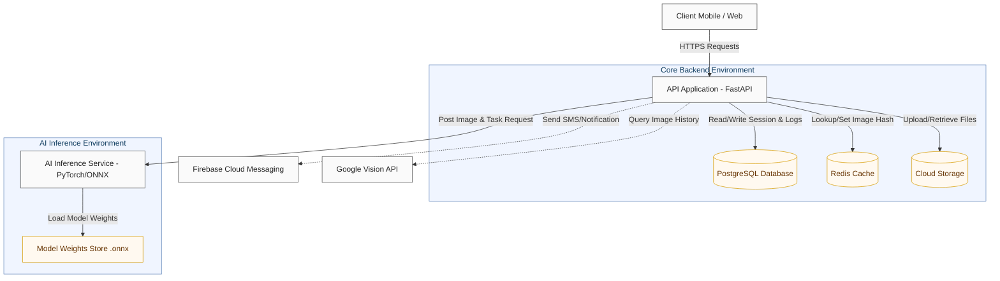

# การออกแบบระบบหลังบ้านและสถาปัตยกรรมเซิร์ฟเวอร์ (Backend & Server Architecture Design)
## โครงงาน: แอปตรวจสอบรูปภาพตัดต่อที่ถูกนำมาหลอกลวง (Scam Image Detection)

เอกสารการออกแบบนี้อธิบายโครงสร้างเชิงลึกของระบบหลังบ้าน (Backend Server) และสถาปัตยกรรมบริการประมวลผลปัญญาประดิษฐ์ (AI Inference Service) เพื่อใช้เป็นแนวทางปฏิบัติการพัฒนาซอฟต์แวร์สำหรับทีมงาน

---

## 1. ภาพรวมสถาปัตยกรรมเซิร์ฟเวอร์ (Server Architecture Overview)

ระบบหลังบ้านแบ่งออกเป็น 2 คอนเทนเนอร์หลัก (Decoupled Containers) เพื่อแยกตรรกะธุรกิจและงานประมวลผลโมเดล AI ออกจากกัน:
1. **API Application (Python FastAPI):** ทำหน้าที่เป็น API Gateway และ Core Orchestrator จัดการสิทธิ์การเข้าถึง ฐานข้อมูล แคช และจัดการท่อข้อมูลเบื้องต้น
2. **AI Inference Service (Python PyTorch / ONNX Runtime):** ทำหน้าที่เป็นโหนดคำนวณประมวลผลภาพถ่ายและรันโมเดลเชิงลึกโดยเฉพาะ เพื่อประสิทธิภาพและความเสถียรในการประมวลผล



---

## 2. การออกแบบ API Application (Python FastAPI)

### 2.1 โครงสร้างโฟลเดอร์โครงการ (Project Directory Structure)
API Application จะถูกจัดโครงสร้างตามหลัก Clean Architecture / Repository Pattern เพื่อความเป็นระเบียบและง่ายต่อการบำรุงรักษา:

```
backend/
├── app/
│   ├── core/               # การตั้งค่าหลัก ระบบความปลอดภัย การเชื่อมต่อฐานข้อมูล
│   │   ├── config.py       # การอ่านค่า Environment Variables (.env)
│   │   ├── security.py     # ระบบเข้ารหัสและการจัดการ JWT Tokens
│   │   └── database.py     # SQLAlchemy Engine & Session Local
│   ├── models/             # ฐานข้อมูล Schemas (SQLAlchemy)
│   │   ├── user.py
│   │   ├── scan.py
│   │   └── report.py
│   ├── repositories/       # คลาสเข้าถึงข้อมูลและสั่งรัน Queries (Data Access Layer)
│   │   ├── user_repo.py
│   │   └── scan_repo.py
│   ├── services/           # ตรรกะทางธุรกิจหลัก (Business Logic Layer)
│   │   ├── auth_service.py
│   │   ├── ocr_service.py  # การบูรณาการและการแปลงข้อมูลด้วย Surya-OCR
│   │   ├── scan_service.py # การวิเคราะห์ Multi-layer และรวบรวมคะแนนความเสี่ยง
│   │   └── storage_service.py
│   ├── api/                # เส้นทางการเข้าถึง API (Controllers / Routing Layer)
│   │   ├── v1/
│   │   │   ├── auth.py     # Endpoints สำหรับสมัครสมาชิก ล็อกอิน
│   │   │   ├── scan.py     # Endpoints สำหรับส่งตรวจวิเคราะห์ภาพถ่าย
│   │   │   ├── report.py   # Endpoints สำหรับการแจ้งรายงานสแกมเมอร์
│   │   │   └── admin.py    # Endpoints สำหรับควบคุมการอัปเดตโมเดล
│   │   └── router.py
│   └── main.py             # จุดเริ่มต้นแอปพลิเคชัน (FastAPI Initialization)
├── migrations/             # ประวัติและสคริปต์การโยกย้ายฐานข้อมูล (Alembic)
├── requirements.txt
└── Dockerfile
```

### 2.2 โมดูลและตรรกะการทำงาน (Core Modules)

#### 2.2.1 ระบบยืนยันตัวตนและการเข้าถึงแบบระบุสิทธิ์ (User Authentication & RBAC)
* ใช้ JSON Web Tokens (JWT) ในการลงทะเบียนและระบุตัวตนของผู้ใช้ในการเรียกใช้งาน API
* กำหนดสิทธิ์ของผู้ใช้งานออกเป็น 3 ระดับ (Role-Based Access Control):
  * **User (ผู้ใช้ทั่วไป):** สามารถเข้าถึงฟังก์ชันการสแกนภาพถ่าย ดูประวัติการสแกนของตนเอง และแจ้งรายงานสแกมเมอร์
  * **Researcher (นักวิจัย):** สามารถเรียกอ่านข้อมูล Dataset และประวัติการสแกนที่ถูกทำให้เป็นข้อมูลนิรนาม (Anonymized Data) สำหรับพัฒนาโมดูล AI
  * **Admin (ผู้ดูแลระบบ):** สามารถจัดการบัญชีผู้ใช้ ตรวจสอบและอนุมัติคิวรายงานสแกม และอัปเดตโมเดล AI (.onnx)

#### 2.2.2 การนำเข้าและจัดเก็บข้อมูลรูปภาพ (Image Storage Architecture)
* จัดเก็บรูปภาพต้นฉบับและรูปภาพแผนที่ความร้อน (Heatmap) บนคลาวด์สตอเรจ (Cloud Storage)
* เพื่อความปลอดภัยของข้อมูลและความเป็นส่วนตัว (PDPA Compliance) การเรียกอ่านภาพจะเข้าถึงผ่าน Presigned URLs ที่มีอายุการใช้งานจำกัด (เช่น 15 นาที) เท่านั้น
* โครงสร้างโฟลเดอร์บนระบบจัดเก็บข้อมูล:
  * `raw-images/{user_id}/{scan_id}.jpg` - ไฟล์ภาพต้นฉบับดิบที่ส่งเข้ามาตรวจสอบ
  * `heatmap-images/{user_id}/{scan_id}_heatmap.jpg` - ไฟล์ภาพประมวลผลวิเคราะห์การดัดแปลงและขอบเขตพิกเซล

#### 2.2.3 ระบบวิเคราะห์ข้อมูลแฝง (EXIF Metadata Extraction)
* พัฒนาโมดูลสกัดข้อมูล EXIF (Exchangeable Image File Format) โดยใช้ไลบรารี `piexif` หรือ `ExifRead` เพื่ออ่านค่า:
  * รุ่นและยี่ห้อของอุปกรณ์กล้องที่ใช้ถ่ายภาพ
  * ซอฟต์แวร์ที่ใช้บันทึก/แก้ไขภาพ (เช่น Adobe Photoshop, Canva, PicsArt)
  * พิกเซลความละเอียดดั้งเดิม เปรียบเทียบกับพิกเซลปัจจุบัน
  * พิกัดทางภูมิศาสตร์ (GPS Coordinates) และวันเวลาที่ถ่ายภาพเปรียบเทียบกับเวลาส่งตรวจสอบ

#### 2.2.4 ระบบวิเคราะห์ข้อความและการวิเคราะห์ประโยค (Surya-OCR & NLP)
* บูรณาการ Surya-OCR โดยส่งรูปภาพไปให้โมเดลรันสกัดกล่องข้อความและตัวอักษรภาษาไทยและภาษาอังกฤษ
* ส่ง String ข้อความที่ได้เข้าสู่โมดูลคัดกรองคำศัพท์อันตราย (Scam Keywords Filtering Engine) โดยทำการวิเคราะห์:
  * การตรวจจับรูปแบบคำหรือกลุ่มคำที่พบบ่อยในการทุจริตและการหลอกลวง (เช่น "เงินกู้ด่วน", "โอนเงินด่วน", "ถอนยอดสะสม", "ยินดีด้วยคุณได้รับรางวัล", "เจ้าหน้าที่สรรพากร")
  * ตรวจสอบความถูกต้องของเลขบัญชีธนาคารและชื่อธนาคารจากฐานข้อมูลบัญชีม้าหรือบัญชีเฝ้าระวังที่มีการรายงานเข้ามาในระบบ

#### 2.2.5 สถาปัตยกรรมระบบแคชข้อมูลการสแกน (Redis Cache Architecture)
* ระบบจะแปลงไฟล์รูปภาพนำเข้าเป็นค่าแฮชชนิด SHA-256 เพื่อเป็นคีย์หลักในการค้นหา
* ก่อนรันงานประมวลผลรูปภาพระบบจะทำการ Lookup ใน Redis Cache:
  * คีย์สแกน: `scan:hash:{image_sha256}`
  * หากพบค่าเดิม (Cache Hit): ส่งผลลัพธ์การสแกนที่บันทึกไว้กลับทันที ลด Latency จากวินาทีเหลือมิลลิวินาที
  * หากไม่พบข้อมูล (Cache Miss): สั่งงานประมวลผลตาม Multi-layer Pipeline และนำผลลัพธ์มาเขียนบันทึกใน Redis โดยกำหนดเวลาหมดอายุ (TTL) 7 วัน

---

## 3. การออกแบบ AI Inference Service (PyTorch / ONNX Runtime)

เพื่อให้กระบวนการรันโมเดล Deep Learning มีความเร็วสูงสุดและสามารถสเกลเซิร์ฟเวอร์แยกต่างหากได้ ระบบจึงใช้ ONNX Runtime (C++ Core Execution Engine) ในการรันโมเดลที่แปลงมาจาก PyTorch

### 3.1 ท่อประมวลผลและการอธิบายภาพ (AI Inference Pipeline)
1. **ภาพนำเข้า (Preprocessed Tensor):** รูปภาพจะถูกปรับขนาดเป็น 512x512 พิกเซล และนอร์มัลไลซ์ค่าสีตามข้อกำหนดของอินพุตโมเดล
2. **โมดูลวิเคราะห์พิกเซลและการตัดต่อ (Visual Forgery Detection):**
   * รันโมเดล PSCC-Net เพื่อดึงคุณลักษณะความสอดคล้องเชิงพื้นที่และช่องสี (Spatio-Channel Correlation) ระบุพื้นที่และขอบเขตที่น่าสงสัยว่าจะถูกดัดแปลง
   * รันโมเดล SegFormer เพื่อสร้าง Pixel-level Segmentation Mask จำแนกรอบพิกเซลดัดแปลงที่มีความสมบูรณ์และลดสัญญาณรบกวนขอบ
   * รวมผลลัพธ์ของโมเดลทั้งสองและสร้างเป็น Pixel Anomaly Map
3. **โมดูลตรวจวิเคราะห์รูปภาพจากปัญญาประดิษฐ์ (AI-Generated Image Detection):**
   * ใช้ลักษณนามแบบ Deep Learning Classifier ตรวจสอบเศษซากทางสถิติพิกเซลและความถี่ของสี (Artifacts) ที่เกิดขึ้นจากการเจเนอเรตภาพ
4. **การแสดงผลอธิบายเหตุผลของ AI (Explainable AI - XAI):**
   * ประมวลผลสร้างแผนภูมิความร้อน (Grad-CAM Heatmap / Anomaly Heatmap) นำสีระดับความเสี่ยง (สีแดงเข้มถึงสีน้ำเงิน) ไปวางซ้อนทับภาพจริง เพื่อแสดงขอบเขตของการตัดต่อตัวเลขหรือข้อมูลบนสลิป/รูปภาพอย่างชัดเจน

### 3.2 ระบบสลับและอัปเดตโมเดลเวอร์ชันใหม่ (Dynamic Model Weights Update)
* เซิร์ฟเวอร์ AI จะมีฟังก์ชันโหลดโมเดลใหม่โดยไม่ต้องหยุดการทำงานของเซิร์ฟเวอร์ (Zero-downtime hot reloading)
* เมื่อแอดมินอัปโหลดไฟล์น้ำหนักโมเดลเวอร์ชันใหม่ผ่าน Admin Portal (.onnx format) ระบบหลังบ้านจะเซฟไฟล์ลงไดเรกทอรีของโมเดล และส่งคำสั่งแจ้งเซิร์ฟเวอร์ AI ให้เคลียร์เซสชันหน่วยความจำและรันโหลดโหลดน้ำหนักโมเดลไฟล์ใหม่เข้าสู่ ONNX Runtime Session ทันที

---

## 4. โครงสร้างฐานข้อมูลเชิงสัมพันธ์ (PostgreSQL Schema)

การจัดเก็บข้อมูลหลักจะออกแบบตาม Schema ความสัมพันธ์ (Entity-Relationship) ดังต่อไปนี้:

### 4.1 ตารางผู้ใช้งาน (users)
ตารางบันทึกข้อมูลบัญชีผู้ใช้งานระบบและระดับสิทธิ์:
```sql
CREATE TABLE users (
    id SERIAL PRIMARY KEY,
    email VARCHAR(255) UNIQUE NOT NULL,
    hashed_password VARCHAR(255) NOT NULL,
    full_name VARCHAR(100),
    role VARCHAR(20) NOT NULL DEFAULT 'user', -- user, researcher, admin
    is_active BOOLEAN DEFAULT TRUE,
    created_at TIMESTAMP WITH TIME ZONE DEFAULT CURRENT_TIMESTAMP,
    updated_at TIMESTAMP WITH TIME ZONE DEFAULT CURRENT_TIMESTAMP
);
```

### 4.2 ตารางประวัติการสแกนตรวจสอบภาพ (scans)
ตารางหลักเก็บประวัติและผลลัพธ์ของการวิเคราะห์รูปภาพ:
```sql
CREATE TABLE scans (
    id UUID PRIMARY KEY DEFAULT gen_random_uuid(),
    user_id INTEGER REFERENCES users(id) ON DELETE SET NULL,
    image_hash VARCHAR(64) NOT NULL, -- SHA-256 ของรูปภาพ
    raw_image_url VARCHAR(512) NOT NULL,
    heatmap_image_url VARCHAR(512),
    
    -- ผลคะแนนระดับความเสี่ยงแยกแต่ละชั้น
    text_score INTEGER NOT NULL DEFAULT 0,
    visual_score INTEGER NOT NULL DEFAULT 0,
    source_score INTEGER NOT NULL DEFAULT 0,
    total_risk_score INTEGER NOT NULL DEFAULT 0,
    
    -- รายละเอียดผลวิเคราะห์
    exif_data JSONB,
    ocr_text TEXT,
    scam_keywords_found JSONB,
    reverse_search_results JSONB,
    ai_gen_probability FLOAT DEFAULT 0.0,
    
    status VARCHAR(20) NOT NULL DEFAULT 'pending', -- pending, processing, completed, failed
    created_at TIMESTAMP WITH TIME ZONE DEFAULT CURRENT_TIMESTAMP,
    completed_at TIMESTAMP WITH TIME ZONE
);
CREATE INDEX idx_scans_image_hash ON scans(image_hash);
```

### 4.3 ตารางการยินยอมสิทธิ์ข้อมูลผู้ใช้ (consent_logs)
ตารางบันทึกการให้สิทธิ์ความเป็นส่วนตัวตามกฎหมาย PDPA:
```sql
CREATE TABLE consent_logs (
    id SERIAL PRIMARY KEY,
    user_id INTEGER REFERENCES users(id) ON DELETE CASCADE,
    system_consent BOOLEAN NOT NULL DEFAULT TRUE, -- บังคับยินยอมการสแกนรูปภาพรายครั้ง
    research_consent BOOLEAN NOT NULL DEFAULT FALSE, -- ยินยอมให้นำรูปไปใช้ทำ Dataset วิจัย
    ip_address VARCHAR(45),
    user_agent TEXT,
    created_at TIMESTAMP WITH TIME ZONE DEFAULT CURRENT_TIMESTAMP
);
```

### 4.4 ตารางการรายงานข้อมูลจากชุมชน (scam_reports)
ตารางบันทึกรูปภาพที่ผู้ใช้งานแจ้งรายงานเข้ามาว่าเป็นภาพหลอกลวงเพื่อบันทึกเข้าสู่คลังประวัติกลาง:
```sql
CREATE TABLE scam_reports (
    id SERIAL PRIMARY KEY,
    user_id INTEGER REFERENCES users(id) ON DELETE SET NULL,
    scan_id UUID REFERENCES scans(id) ON DELETE SET NULL,
    reason TEXT NOT NULL,
    status VARCHAR(20) NOT NULL DEFAULT 'pending', -- pending, approved, rejected
    moderated_by INTEGER REFERENCES users(id),
    moderated_at TIMESTAMP WITH TIME ZONE,
    created_at TIMESTAMP WITH TIME ZONE DEFAULT CURRENT_TIMESTAMP
);
```

---

## 5. ข้อกำหนดและรูปแบบ API (API Specifications)

### 5.1 หมวดหมู่การยืนยันตัวตน (Authentication Endpoints)

#### 5.1.1 POST /api/v1/auth/register
ลงทะเบียนผู้ใช้ใหม่ในระบบ
* **Request Body (JSON):**
```json
{
  "email": "user@example.com",
  "password": "strongpassword123",
  "full_name": "Panuwat Takham",
  "system_consent": true,
  "research_consent": true
}
```
* **Response (JSON - Status 201):**
```json
{
  "id": 101,
  "email": "user@example.com",
  "full_name": "Panuwat Takham",
  "role": "user",
  "message": "User registered successfully"
}
```

#### 5.1.2 POST /api/v1/auth/login
เข้าสู่ระบบเพื่อรับ Token สำหรับเรียกใช้ API อื่นๆ
* **Request Body (JSON):**
```json
{
  "username": "user@example.com",
  "password": "strongpassword123"
}
```
* **Response (JSON - Status 200):**
```json
{
  "access_token": "eyJhbGciOiJIUzI1NiIsInR5cCI6IkpXVCJ9...",
  "token_type": "bearer",
  "user": {
    "email": "user@example.com",
    "role": "user",
    "full_name": "Panuwat Takham"
  }
}
```

### 5.2 หมวดการตรวจวิเคราะห์รูปภาพ (Scan & Analysis Endpoints)

#### 5.2.1 POST /api/v1/scan
ส่งรูปภาพอัปโหลดเพื่อตรวจวิเคราะห์ความเสี่ยง
* **Request (Multipart/Form-Data):**
  * `file`: (Binary File - JPG/PNG)
* **Response (JSON - Status 200):**
```json
{
  "scan_id": "8f8b8a5d-4f10-4cd9-bf7b-84a83e05ea01",
  "image_hash": "c85d8e788e0a1f0a1c6a218f2f211516e881023a1a9eef11082a938c82f91a0f",
  "raw_image_url": "https://cloud-storage.local/scam-app/raw-images/101/8f8b8a5d-4f10-4cd9-bf7b-84a83e05ea01.jpg?token=...",
  "heatmap_image_url": "https://cloud-storage.local/scam-app/heatmap-images/101/8f8b8a5d-4f10-4cd9-bf7b-84a83e05ea01_heatmap.jpg?token=...",
  "status": "completed",
  "risk_summary": {
    "total_risk_score": 75,
    "grade": "high",
    "message": "ตรวจพบร่องรอยการดัดแปลงข้อมูลข้อความยอดเงินในภาพสลิป และมีการตรวจพบข้อความโฆษณาชวนเชื่อชักจูงโอนเงิน"
  },
  "layers": {
    "textual_analysis": {
      "score": 80,
      "ocr_text": "ยินดีด้วยคุณได้รับรางวัล 10,000 บาท กรุณาโอนค่าธรรมเนียม",
      "matched_scam_keywords": ["ได้รับรางวัล", "กรุณาโอน"]
    },
    "visual_analysis": {
      "score": 90,
      "manipulation_detected": true,
      "ai_generated_probability": 0.05
    },
    "source_verification": {
      "score": 50,
      "matched_occurrences": 1,
      "similar_sources": [
        {
          "domain": "scamblog.com",
          "url": "https://scamblog.com/post-detail/123"
        }
      ]
    }
  },
  "exif_metadata": {
    "camera_model": "Unknown",
    "software": "Adobe Photoshop 2024",
    "timestamp": "2026-06-29T18:22:10"
  },
  "created_at": "2026-06-30T09:22:10+07:00"
}
```

#### 5.2.2 GET /api/v1/scan/{id}
เรียกดูผลลัพธ์ประวัติการสแกนย้อนหลังตาม ID
* **Response (JSON - Status 200):** คืนค่าข้อมูล JSON รูปแบบเดียวกันกับผลลัพธ์ของ `POST /api/v1/scan`

---

## 6. แนวทางปฏิบัติด้านความมั่นคงปลอดภัยและการจัดการข้อผิดพลาด (Security & Error Handling)

* **การจำกัดการเรียกใช้งาน API (Rate Limiting):** กำหนดสิทธิ์ให้ผู้ใช้ทั่วไปเรียก API ในการสแกนได้สูงสุด 60 ครั้งต่อชั่วโมง เพื่อป้องกันทราฟฟิกบอทและควบคุมค่าใช้จ่ายในการ Inference บน GPU เซิร์ฟเวอร์
* **การจัดการข้อผิดพลาดภาพเข้า (Robust Input Validation):** ตรวจเช็กขนาดและชนิดไฟล์ (Allowed: `image/jpeg`, `image/png`) หากไม่ใช่ไฟล์รูปภาพ หรือขนาดใหญ่เกิน 10MB ระบบจะปฏิเสธไฟล์ในทันทีโดยส่ง HTTP 400 Bad Request
* **การป้องกันความเสียหายบางส่วน (Graceful Degradation):** ในกรณีที่ API เชื่อมโยงกับ Google Vision API หรือ AI Inference Node เกิดปัญหาขัดข้อง (Timeout) API Application จะยังสามารถคืนค่าสแกนโดยคำนวณคะแนนเท่าที่มีข้อมูล (เช่น อ่านข้อมูลจาก EXIF และสกัดข้อความด้วย Surya-OCR) พร้อมบันทึกสถานะข้อผิดพลาดใน Log เพื่อให้นักพัฒนาดำเนินการตรวจสอบต่อไป
