# C1: System Context Diagram

```mermaid
flowchart TD
    %% การตั้งค่า Class สีต่างๆ (กำหนด color:black ตามคำสั่ง)
    classDef mainSystem fill:#0050ef,stroke:#001DBC,color:black
    classDef userFill fill:#fff2cc,stroke:#d6b656,color:black
    classDef adminFill fill:#dae8fc,stroke:#6c8ebf,color:black
    classDef extFill fill:#f5f5f5,stroke:#666666,color:black

    %% Title Area
    subgraph Context [C1: System Context Diagram]
        direction TB
        
        %% Nodes (โหนดต่างๆ)
        User("👤 General User<br>[Person]")
        
        System("📱 Mobile App: Scam Image Detection<br>[Software System]<br>Allows users to upload images to detect forgery,<br>AI generation, and existing scams.")
        
        Admin("👤 Admin<br>[Person]")
        
        ExtSearch("☁️ Reverse Image Search Provider<br>[External System]<br>Google Vision API / Bing Visual Search<br>(Used to find similar images on the web)")
        
        ExtNotify("📲 Push Notification Service<br>[External System]<br>Firebase Cloud Messaging (FCM)<br>(Sends alerts/results to mobile)")

        %% Relationships (เส้นเชื่อมโยง)
        User -- "1. อัปโหลดรูปเพื่อตรวจสอบ<br>2. ดูรายงานความเสี่ยง" --> System
        
        System -- "ส่ง URL รูปภาพ / ข้อมูลไบนารี" --> ExtSearch
        ExtSearch -.->|"ส่งคืน URL รูปภาพที่คล้ายกัน"| System
        
        System -- "ส่งข้อมูลการแจ้งเตือน (Payload)" --> ExtNotify
        
        Admin -- "ตรวจสอบรูปที่ถูกรายงาน /<br>อัปเดตข้อมูลโมเดล" --> System
    end

    %% Apply Styles (การระบายสี)
    class System mainSystem
    class User userFill
    class Admin adminFill
    class ExtSearch,ExtNotify extFill

```

### 1. ระบบหลัก (The Software System)

* **Mobile App: Scam Image Detection :**
* **หน้าที่:** เป็นแอปพลิเคชันบนมือถือที่ให้ผู้ใช้เข้ามาอัปโหลดรูปภาพที่น่าสงสัย ระบบจะทำการวิเคราะห์ เช็คค่า EXIF/GPS ว่ารูปถ่ายที่ไหน เมื่อไหร่ , เช็คการตัดต่อระดับพิกเซล (Error Level Analysis) , อ่านข้อความในภาพเพื่อหา Keyword อันตราย , วิเคราะห์ภาพเพื่อดูว่าเป็นภาพที่สร้างจาก AI หรือไม่

### 2. ผู้ใช้งาน (People)

* **General User (ผู้ใช้งานทั่วไป):**
    * คือคนธรรมดาที่อาจจะได้รับรูปภาพแปลกๆ (เช่น สลิปโอนเงินปลอม, รูปโปรไฟล์หลอกลงทุน)
    * **การกระทำ:** ส่งรูปเข้ามาในแอป (Upload) และรอรับผลการตรวจสอบ (View Report) เพื่อดูว่ารูปนั้นเสี่ยงแค่ไหน

* **Admin (ผู้ดูแลระบบ):**
    * คือทีมงานหลังบ้าน หรือนักวิจัย
    * **การกระทำ:** เข้ามาดูรูปที่ถูก Report เข้ามา เพื่อยืนยันความถูกต้อง หรือนำข้อมูลใหม่ๆ ไปอัปเดตให้โมเดล AI ฉลาดขึ้น (Updates model data)

### 3. ระบบภายนอก (External Systems)

ระบบของเราไม่ได้ทำงานด้วยตัวคนเดียว แต่มีการเชื่อมต่อกับบริการอื่นเพื่อลดภาระงานและเพิ่มประสิทธิภาพ:

* **Reverse Image Search Provider :**
* **คืออะไร:** บริการค้นหารูปภาพระดับโลก เช่น Google Vision API หรือ Bing Visual Search
* **ทำไมต้องใช้:** ระบบของเราส่งรูปไปถามเจ้านี้ว่า "เคยเห็นรูปนี้ที่ไหนในเน็ตไหม?" (Send URL/Binary)
* **สิ่งที่ได้กลับมา:** แหล่งที่มาของภาพ (Similar URLs) เช่น ถ้าเป็นรูปโปรไฟล์สาวสวย แต่ไปเจอว่าเป็นดาราเกาหลี ก็แสดงว่าปลอมแน่นอน

* **Push Notification Service :**
* **คืออะไร:** บริการส่งการแจ้งเตือน 
* **ทำไมต้องใช้:** การวิเคราะห์รูปภาพอาจใช้เวลา (2-10 วินาที หรือมากกว่า) เราจึงไม่ให้ผู้ใช้รอนิ่งๆ หน้าจอ แต่เมื่อระบบประมวลผลเสร็จ จะส่งข้อมูล (Payload) ไปที่ FCM เพื่อเด้งแจ้งเตือนที่มือถือผู้ใช้ว่า "ตรวจสอบเสร็จแล้ว!"

---

### สรุปขั้นตอนการทำงาน (Workflow Scenario)

1. **User** อัปโหลดรูปสลิปโอนเงินที่สงสัยเข้ามาใน **App**
2. **App** ส่งรูปนั้นไปเช็คกับ **Google/Bing (External)** ว่ารูปนี้ไปก๊อปมาจากเว็บไหนไหม
3. **App** ประมวลผลภายใน (เช็คการตัดต่อ/AI)
4. เมื่อได้ผลลัพธ์ครบ **App** สั่งงาน **FCM (External)** ให้แจ้งเตือนผู้ใช้
5. **User** เปิดดูผลลัพธ์คะแนนความเสี่ยง
6. (Optional) หากเป็นเคสใหม่ **Admin** จะเข้ามาตรวจสอบข้อมูลเพื่อปรับปรุงระบบในภายหลัง
