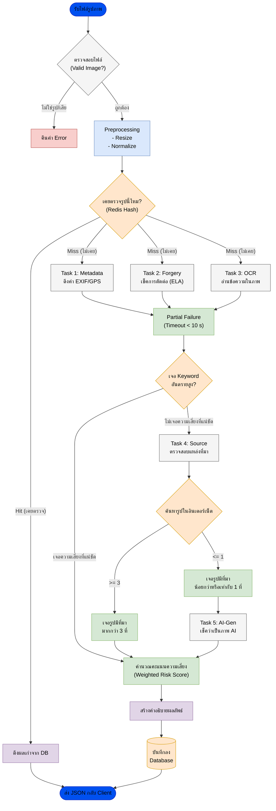

# Mobile App: Scam Image Detection

## 👤 User Flow (การทำงานฝั่งผู้ใช้)

### 1. User Flow (กระบวนการฝั่งผู้ใช้)

* **การนำเข้าข้อมูล:** ผู้ใช้สามารถเลือกได้ว่าจะ "ถ่ายรูปใหม่" หรือ "เลือกจากอัลบั้ม" จากนั้นระบบจะมีขั้นตอนให้ปรับแต่งรูปภาพ (Crop/Edit) ก่อนส่งตรวจ เพื่อให้ได้ส่วนที่ต้องการวิเคราะห์จริงๆ
* **การประมวลผล:** เมื่อกดปุ่มตรวจสอบ ระบบจะเข้าสู่สถานะวิเคราะห์ หากเกิดข้อผิดพลาด (เช่น เน็ตหลุด หรือไฟล์เสีย) ระบบจะมีทางเลือกให้ผู้ใช้ลองใหม่หรือยกเลิก
* **ผลลัพธ์และการจัดเก็บ:** เมื่อวิเคราะห์สำเร็จ ผู้ใช้จะเห็นคะแนนความเสี่ยง (Risk Score) และหลักฐานประกอบ (Evidence) โดยระบบจะทำการบันทึกข้อมูลให้อัตโนมัติ (Auto-Save) และเปิดโอกาสให้ผู้ใช้เลือกแชร์ข้อมูลนั้นเพื่อเตือนภัยผู้อื่นได้

---

## ⚙️ System Logic (การทำงานฝั่งระบบ)

### 2. System Logic (กระบวนการฝั่งระบบ/หลังบ้าน)

* **Validation & Preprocessing:** ก่อนจะเริ่มวิเคราะห์ ระบบจะเช็คความถูกต้องของไฟล์และปรับขนาด (Resize/Normalize) เพื่อให้โมเดล AI ทำงานได้แม่นยำที่สุด
* **Optimization (Cache Strategy):** มีการใช้ **Redis Hash** เพื่อตรวจสอบว่ารูปนี้เคยมีคนส่งตรวจหรือยัง หาก "เคยแล้ว" ระบบจะดึงผลเก่าจาก DB มาตอบทันที ช่วยประหยัดทรัพยากรเครื่องเซิร์ฟเวอร์
* **Parallel Processing (การทำงานขนาน):** หากเป็นรูปใหม่ ระบบจะแยกการทำงานออกเป็น 3 งานหลักพร้อมกัน (Task 1-3) เพื่อความรวดเร็ว:
* **Metadata:** เช็คค่า EXIF/GPS ว่ารูปถ่ายที่ไหน เมื่อไหร่ (ป้องกันการแอบอ้างสถานที่)
* **Forgery (ELA):** เช็คการตัดต่อระดับพิกเซล (Error Level Analysis) เช่น การแก้ตัวเลขบนสลิปโอนเงิน
* **OCR:** อ่านข้อความในภาพเพื่อหา Keyword อันตราย (เช่น ชื่อบัญชีม้า หรือข้อความเชิญชวนหลอกลวง)
* **Partial Failure** ถ้าเวลาที่ใช้มาการทำงานในบาง Task มากว่าเท่ากับ 5 วิ ให้ส่งข้อมูลไปแบบไม่ต้องรอ (ให้ส่งมาทีหลัง)

* **Decision Logic:** ระบบมีจุดตัดสินใจ (Keyword Check) หากพบความเสี่ยงที่ชัดเจนมาก จะข้ามไปคำนวณคะแนนเลย แต่ถ้ายังไม่ชัดเจน จะส่งไปเช็คต่อที่
* **Source:** ตรวจสอบแหล่งที่มาของภาพ โดยค้นหาจากในอินเตอร์เน็ต ถ้าเจอมากว่าหรือเท่ากับ 3 ที่ จะข้ามไปคำนวณคะแนนเลย แต่ถ้าไม่จะส่งไปเช็คต่อที่

* **AI-Gen Task:** เพื่อดูว่าเป็นภาพที่สร้างจาก AI หรือไม่
* **Final Output:** จบด้วยการคำนวณคะแนนแบบถ่วงน้ำหนัก (Weighted Risk Score) สร้างคำอธิบาย บันทึก และส่งกลับไปแสดงผลที่หน้าแอปในรูปแบบ JSON

---

### [Diagram ](https://drive.google.com/file/d/1I2ksLvZp0x3iNYt57_46cqnTDfPgWvzR/view?usp=sharing)

