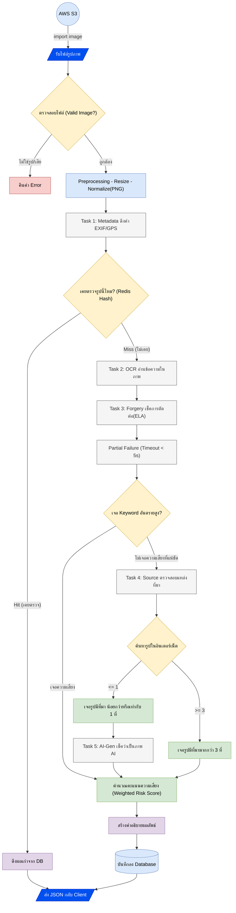

# Mobile App: Scam Image Detection

## 👤 User Flow (การทำงานฝั่งผู้ใช้)

### คำอธิบาย User Flow
1. **เริ่มต้น (Start)**: ผู้ใช้เข้าสู่แอปพลิเคชัน
2. **หน้าแรก (Home)**: แสดงเมนูหลัก
3. **นำเข้าภาพ (Import)**: เลือกระหว่างถ่ายภาพใหม่หรือเลือกจากอัลบั้ม
4. **ปรับแต่ง (Edit)**: Crop หรือปรับขนาดภาพก่อนส่ง (PNG)
5. **ตรวจสอบ (Check)**: กดปุ่มตรวจสอบเพื่อส่งข้อมูล
6. **ประมวลผล (Processing)**: อัปโหลดภาพไปยัง AWS S3 และเข้าสู่กระบวนการวิเคราะห์ System Logic
7. **ผลลัพธ์ (Result)**:
   - **สำเร็จ**: แสดงคะแนนความเสี่ยง (Risk Score) และหลักฐาน (Evidence) จากนั้น Auto-Save ลงฐานข้อมูล
   - **ล้มเหลว**: แจ้งเตือนข้อผิดพลาด และให้ทางเลือก (ลองใหม่ หรือ ยกเลิก)
8. **Action**: ผู้ใช้เลือกแชร์ผลลัพธ์ หรือจบการทำงาน

---

## ⚙️ System Logic (การทำงานฝั่งระบบ)

### คำอธิบาย System Logic
1. **Input**: รับไฟล์รูปภาพจาก AWS S3
2. **Validation**: ตรวจสอบว่าไฟล์รูปภาพถูกต้องหรือไม่
   - หากเสีย/ไม่ใช่รูป: Reject คืนค่า Error
   - หากถูกต้อง: ส่งไป Preprocessing
3. **Preprocessing**: ปรับขนาด (Resize) และ Normalize ภาพ
4. **Caching**: ตรวจสอบ Hash ใน Redis
   - **Hit**: เคยตรวจแล้ว ให้ดึงผลเก่าจาก Database ส่งคืนทันที
   - **Miss**: ไม่เคยตรวจ ให้เข้าสู่ Pipeline การตรวจสอบ
5. **Analysis Tasks**:
   - **Task 1 Metadata**: ดึงข้อมูล EXIF/GPS
   - **Task 2 OCR**: อ่านข้อความในภาพ
   - **Task 3 Forgery**: ตรวจสอบการตัดต่อ (ELA)
   - **Partial Failure**: ดักจับกรณี Timeout
   - **Keyword Check**: ตรวจสอบคำเสี่ยงสูง
   - **Task 4 Source**: ค้นหาที่มาของภาพ
     - หากพบน้อย (<=1): ความเสี่ยงต่ำ ส่งไปตรวจ AI-Gen (Task 5)
     - หากพบมาก (>=3): ความเสี่ยงสูง
6. **Scoring**: คำนวณคะแนน Weighted Risk Score จากผลลัพธ์ทุกส่วน
7. **Output**: สร้างคำอธิบาย บันทึกลง Database และส่ง JSON กลับ Client

---

### [Diagram Link](https://drive.google.com/file/d/1vf9so53ErwXpJDqi6HplX7wtufLqP1hv/view?usp=sharing)
