# Mobile App: Scam Image Detection

## 👤 User Flow (การทำงานฝั่งผู้ใช้)

```mermaid
graph TD
    %% Nodes Definition
    Start([เริ่มใช้งาน])
    Home[หน้าแรก<br/>แสดงประวัติรูป]
    ImportMethod{วิธีการนำเข้าไฟล์}
    Camera[ถ่ายรูป]
    Gallery[เลือกรูปจาก Gallery]
    Edit[ปรับแต่ง / Crop รูป]
    Preview[แสดง Preview รูปภาพ]
    CheckBtn[/กดปุ่มตรวจสอบ/]
    Analyzing{ระบบกำลังวิเคราะห์...}
    
    Result[หน้าผลลัพธ์<br/>Risk Score + Evidence]
    Error[แจ้งเตือนข้อผิดพลาด]
    
    Action{Action}
    AutoSave[(Auto-Save ลง DB)]
    Share[แชร์ผลลัพธ์]
    
    Options{ทางเลือก}
    End([จบการทำงาน])

    %% Flow Connections
    Start --> Home
    Home -- "เลือกเมนู" --> ImportMethod
    
    ImportMethod -- "กล้อง" --> Camera
    ImportMethod -- "อัลบั้ม" --> Gallery
    
    Camera --> Edit
    Gallery --> Edit
    Edit --> Preview
    Preview --> CheckBtn
    CheckBtn --> Analyzing
    
    %% Analysis Result Paths
    Analyzing -- "สำเร็จ" --> Result
    Analyzing -- "ล้มเหลว" --> Error
    
    %% Success Flow
    Result --> AutoSave
    Result --> Action
    Action -- "แชร์" --> Share
    Action -- "ไม่แชร์" --> End
    Share --> End
    
    %% Error Flow
    Error --> Options
    Options -- "นำเข้ารูปใหม่" --> ImportMethod
    Options -- "ยกเลิก" --> End

    %% Styling with Black Text (color:#000)
    classDef allText color:#000;
    class Start,Home,ImportMethod,Camera,Gallery,Edit,Preview,CheckBtn,Analyzing,Result,Error,Action,AutoSave,Share,Options,End allText;

    style Start fill:#0050ef,stroke:#001DBC
    style End fill:#0050ef,stroke:#001DBC
    
    style Home fill:#d5e8d4,stroke:#82b366
    style Camera fill:#d5e8d4,stroke:#82b366
    style Gallery fill:#d5e8d4,stroke:#82b366
    style Edit fill:#d5e8d4,stroke:#82b366
    style Preview fill:#d5e8d4,stroke:#82b366
    style Result fill:#d5e8d4,stroke:#82b366
    style Error fill:#d5e8d4,stroke:#82b366
    style Share fill:#d5e8d4,stroke:#82b366
    
    style ImportMethod fill:#fff2cc,stroke:#d6b656
    style Analyzing fill:#fff2cc,stroke:#d6b656
    style Action fill:#fff2cc,stroke:#d6b656
    style Options fill:#fff2cc,stroke:#d6b656
    
    style CheckBtn fill:#e1d5e7,stroke:#9673a6
    style AutoSave fill:#dae8fc,stroke:#6c8ebf
```

### 1. User Flow (กระบวนการฝั่งผู้ใช้)

* **การนำเข้าข้อมูล:** ผู้ใช้สามารถเลือกได้ว่าจะ "ถ่ายรูปใหม่" หรือ "เลือกจากอัลบั้ม" จากนั้นระบบจะมีขั้นตอนให้ปรับแต่งรูปภาพ (Crop/Edit) ก่อนส่งตรวจ เพื่อให้ได้ส่วนที่ต้องการวิเคราะห์จริงๆ
* **การประมวลผล:** เมื่อกดปุ่มตรวจสอบ ระบบจะเข้าสู่สถานะวิเคราะห์ หากเกิดข้อผิดพลาด (เช่น เน็ตหลุด หรือไฟล์เสีย) ระบบจะมีทางเลือกให้ผู้ใช้ลองใหม่หรือยกเลิก
* **ผลลัพธ์และการจัดเก็บ:** เมื่อวิเคราะห์สำเร็จ ผู้ใช้จะเห็นคะแนนความเสี่ยง (Risk Score) และหลักฐานประกอบ (Evidence) โดยระบบจะทำการบันทึกข้อมูลให้อัตโนมัติ (Auto-Save) และเปิดโอกาสให้ผู้ใช้เลือกแชร์ข้อมูลนั้นเพื่อเตือนภัยผู้อื่นได้

---

## ⚙️ System Logic (การทำงานฝั่งระบบ)

```mermaid
flowchart TD
    %% การตั้งค่า Class สีต่างๆ (บังคับข้อความสีดำ color:black)
    classDef blueFill fill:#dae8fc,stroke:#6c8ebf,color:black
    classDef darkBlueFill fill:#0050ef,stroke:#001DBC,color:black
    classDef greyFill fill:#f5f5f5,stroke:#666666,color:black
    classDef redFill fill:#f8cecc,stroke:#b85450,color:black
    classDef orangeFill fill:#ffe6cc,stroke:#d79b00,color:black
    classDef greenFill fill:#d5e8d4,stroke:#82b366,color:black
    classDef purpleFill fill:#e1d5e7,stroke:#9673a6,color:black

    %% Nodes (โหนดต่างๆ)
    Start(["รับไฟล์รูปภาพ"])
    Validate{"ตรวจสอบไฟล์<br>(Valid Image?)"}
    Reject["คืนค่า Error"]
    Process["Preprocessing<br>- Resize<br>- Normalize"]
    Cache{"เคยตรวจรูปนี้ไหม?<br>(Redis Hash)"}
    RetCache["ดึงผลเก่าจาก DB"]
    
    %% Parallel Tasks Group
    T1["Task 1: Metadata<br>ดึงค่า EXIF/GPS"]
    T2["Task 2: Forgery<br>เช็คการตัดต่อ (ELA)"]
    T3["Task 3: OCR<br>อ่านข้อความในภาพ"]
    
    Partial["Partial Failure<br>(Timeout < 10 s)"]
    CheckKey{"เจอ Keyword<br>อันตรายสูง?"}
    
    T4["Task 4: Source<br>ตรวจสอบแหล่งที่มา"]
    SearchNet{"ค้นหารูปในอินเตอร์เน็ต"}
    
    FoundMany["เจอรูปมีที่มา<br>มากกว่า 3 ที่"]
    FoundFew["เจอรูปมีที่มา<br>น้อยกว่าหรือเท่ากับ 1 ที่"]
    
    T5["Task 5: AI-Gen<br>เช็คว่าเป็นภาพ AI"]
    
    Calc["คำนวณคะแนนความเสี่ยง<br>(Weighted Risk Score)"]
    Gen["สร้างคำอธิบายผลลัพธ์"]
    DB[("บันทึกลง<br>Database")]
    EndNode(["ส่ง JSON กลับ Client"])

    %% Connections (เส้นเชื่อมโยง)
    Start --> Validate
    Validate -- "ไม่ใช่รูป/เสีย" --> Reject
    Validate -- "ถูกต้อง" --> Process
    Process --> Cache
    
    Cache -- "Hit (เคยตรวจ)" --> RetCache
    RetCache --> EndNode
    
    %% Miss Case (Parallel Processing)
    Cache -- "Miss (ไม่เคย)" --> T1 & T2 & T3
    
    T1 & T2 & T3 --> Partial
    Partial --> CheckKey
    
    %% Logic Checks
    CheckKey -- "เจอความเสี่ยงที่แน่ชัด" --> Calc
    CheckKey -- "ไม่เจอความเสี่ยงที่แน่ชัด" --> T4
    
    T4 --> SearchNet
    
    SearchNet -- ">= 3" --> FoundMany
    FoundMany --> Calc
    
    SearchNet -- "<= 1" --> FoundFew
    FoundFew --> T5
    T5 --> Calc
    
    %% Finalize
    Calc --> Gen
    Gen --> DB
    DB --> EndNode

    %% การใส่สีให้กับ Nodes
    class Start,EndNode darkBlueFill
    class Validate,T1,T2,T3,T5,T4 greyFill
    class Reject redFill
    class Process blueFill
    class Cache,SearchNet,CheckKey,DB orangeFill
    class RetCache,Gen purpleFill
    class Partial,Calc,FoundMany,FoundFew greenFill
```

### 2. System Logic (กระบวนการฝั่งระบบ/หลังบ้าน)

* **Validation & Preprocessing:** ก่อนจะเริ่มวิเคราะห์ ระบบจะเช็คความถูกต้องของไฟล์และปรับขนาด (Resize/Normalize) เพื่อให้โมเดล AI ทำงานได้แม่นยำที่สุด
* **Optimization (Cache Strategy):** มีการใช้ **Redis Hash** เพื่อตรวจสอบว่ารูปนี้เคยมีคนส่งตรวจหรือยัง หาก "เคยแล้ว" ระบบจะดึงผลเก่าจาก DB มาตอบทันที ช่วยประหยัดทรัพยากรเครื่องเซิร์ฟเวอร์
* **Parallel Processing (การทำงานขนาน):** หากเป็นรูปใหม่ ระบบจะแยกการทำงานออกเป็น 3 งานหลักพร้อมกัน (Task 1-3) เพื่อความรวดเร็ว:
* **Metadata:** เช็คค่า EXIF/GPS ว่ารูปถ่ายที่ไหน เมื่อไหร่ (ป้องกันการแอบอ้างสถานที่)
* **Forgery (ELA):** เช็คการตัดต่อระดับพิกเซล (Error Level Analysis) เช่น การแก้ตัวเลขบนสลิปโอนเงิน
* **OCR:** อ่านข้อความในภาพเพื่อหา Keyword อันตราย (เช่น ชื่อบัญชีม้า หรือข้อความเชิญชวนหลอกลวง)
* **Partial Failure** ถ้าเวลาที่ใช้มาการทำงานในบาง Task มากว่าเท่ากับ 5 วิ ให้ส่งข้อมูลไปแบบไม่ต้องรอ (ให้ส่งมาทีหลัง)

* **Decision Logic:** ระบบมีจุดตัดสินใจ (Keyword Check) หากพบความเสี่ยงที่ชัดเจนมาก จะข้ามไปคำนวณคะแนนเลย แต่ถ้ายังไม่ชัดเจน จะส่งไปเช็คต่อที่
* **Source:** ตรวจสอบแหล่งที่มาของภาพ โดยค้นหาจากในอินเตอร์เน็ต ถ้าเจอมากว่าหรือเท่ากับ 3 ที่ จะข้ามไปคำนวณคะแนนเลย แต่ถ้าไม่จะส่งไปเช็คต่อที่

* **AI-Gen Task:** เพื่อดูว่าเป็นภาพที่สร้างจาก AI หรือไม่
* **Final Output:** จบด้วยการคำนวณคะแนนแบบถ่วงน้ำหนัก (Weighted Risk Score) สร้างคำอธิบาย บันทึก และส่งกลับไปแสดงผลที่หน้าแอปในรูปแบบ JSON

---

### [Diagram ](https://drive.google.com/file/d/1I2ksLvZp0x3iNYt57_46cqnTDfPgWvzR/view?usp=sharing)

