# Mobile App: Scam Image Detection


## 👤 User Flow (การทำงานฝั่งผู้ใช้)

```mermaid
graph TD
    Start([เริ่มใช้งาน]) --> Home[หน้าแรก]
    Home -- "เลือกเมนู" --> ImportMethod{วิธีการนำเข้าไฟล์}
    ImportMethod -- "กล้อง" --> Camera[ถ่ายรูป]
    ImportMethod -- "อัลบั้ม" --> Gallery[เลือกรูปจาก Gallery]
    
    Camera --> Image[ปรับแต่ง / Crop รูป]
    Gallery --> Image
    
    Image -- "PNG" --> Preview[แสดง Preview รูปภาพ]
    Preview -- "upload images" --> CheckBtn[/กดปุ่มตรวจสอบ/]
    CheckBtn --> S3(("upload img AWS S3"))
    
    S3 --> Analyzing{"ระบบกำลังวิเคราะห์... (System Logic)"}
    
    Analyzing -- "สำเร็จ" --> Result["หน้าผลลัพธ์ (Risk Score + Evidence)"]
    Analyzing -- "ล้มเหลว" --> Error[แจ้งเตือนข้อผิดพลาด]
    
    Result --> AutoSave[(Auto-Save ลง DB)]
    
    AutoSave --> Action{Action}
    
    Action -- "แชร์" --> Share[แชร์ผลลัพธ์]
    Action -- "ไม่แชร์" --> End([จบการทำงาน])
    
    Share --> End
    
    Error --> Options{ทางเลือก}
    Options -- "นำเข้ารูปใหม่" --> ImportMethod
    Options -- "ยกเลิก" --> End

    %% Styling
    classDef blue fill:#0050ef,stroke:#001DBC,color:#fff
    classDef green fill:#d5e8d4,stroke:#82b366,color:#000
    classDef yellow fill:#fff2cc,stroke:#d6b656,color:#000
    classDef purple fill:#e1d5e7,stroke:#9673a6,color:#000
    classDef cloud fill:#dae8fc,stroke:#6c8ebf,color:#000
    classDef error fill:#f8cecc,stroke:#b85450,color:#000

    class Start,End blue
    class Home,Camera,Gallery,Image,Preview,Result,Error,Share green
    class ImportMethod,Analyzing,Action,Options yellow
    class CheckBtn,RetCache,Gen purple
    class S3,AutoSave cloud
```


### คำอธิบาย User Flow
1. **เริ่มต้น (Start)**: ผู้ใช้เข้าสู่แอปพลิเคชัน
2. **หน้าแรก (Home)**: แสดงเมนูหลัก
3. **นำเข้าภาพ (Import)**: เลือกระหว่างถ่ายภาพใหม่หรือเลือกจากอัลบั้ม
4. **ปรับแต่ง (Edit)**: Crop หรือปรับขนาดภาพก่อนส่ง (PNG)
5. **ตรวจสอบ (Check)**: กดปุ่มตรวจสอบเพื่อส่งข้อมูล
6. **ประมวลผล (Processing)**: อัปโหลดภาพไปยัง AWS S3 และเข้าสู่กระบวนการวิเคราะห์ System Logic
7. **ผลลัพธ์ (Result)**:
   - **สำเร็จ**: แสดงคะแนนความเสี่ยง (Risk Score) และหลักฐาน (Evidence) จากนั้น Auto-Save ลงฐานข้อมูล
   - **ล้มเหลว**: แจ้งเตือนข้อผิดพลาด และให้ทางเลือก (ลองใหม่ หรือ ยกเลิก)
8. **Action**: ผู้ใช้เลือกแชร์ผลลัพธ์ หรือจบการทำงาน

---

## ⚙️ System Logic (การทำงานฝั่งระบบ)
```mermaid
graph TD
    %% Source & Initial Validation
    S3([AWS S3]) -- "import image" --> Receive[/รับไฟล์รูปภาพ/]
    Receive --> NodeValidate{ "ตรวจสอบไฟล์<br/>(Valid Image?)" }
    
    NodeValidate -- "ไม่ใช่รูป/เสีย" --> Reject[คืนค่า Error]
    NodeValidate -- "ถูกต้อง" --> Preprocess["Preprocessing<br/>- Resize<br/>- Normalize(PNG)"]

    %% Cache Mechanism
    Preprocess --> NodeCache{ "เคยตรวจรูปนี้ไหม?<br/>(Redis Hash)" }
    NodeCache -- "Hit (เคยตรวจ)" --> RetCache[ดึงผลเก่าจาก DB]
    
    %% Processing Tasks
    NodeCache -- "Miss (ไม่เคย)" --> Task1["<b>Task 1: Metadata</b><br/>ดึงค่า EXIF/GPS"]
    Task1 --> Task2["<b>Task 2: OCR</b><br/>อ่านข้อความในภาพ"]
    Task2 --> Task3["<b>Task 3: Forgery</b><br/>เช็คการตัดต่อ(ELA)"]
    Task3 --> PartialFail["<b>Partial Failure</b><br/>( Timeout < 5 s)"]
    
    PartialFail --> NodeKeyword{ "เจอ Keyword<br/>อันตรายสูง?" }
    
    NodeKeyword -- "ไม่เจอความเสี่ยงที่แน่ชัด" --> Task4["<b>Task 4: Source</b><br/>ตรวจสอบแหล่งที่มา"]
    Task4 --> NodeSearch{ค้นหารูปในอินเตอร์เน็ต}
    
    NodeSearch -- ">= 3" --> SourceHigh["เจอรูปมีที่มามากกว่า 3 ที่"]
    NodeSearch -- "<= 1" --> SourceLow["เจอรูปมีที่มา<br/>น้อยกว่าหรือเท่ากับ 1 ที่"]
    
    SourceLow --> Task5["<b>Task 5: AI-Gen</b><br/>เช็คว่าเป็นภาพ AI"]
    
    %% Aggregation Point (Collector)
    Collector(( ))
    NodeKeyword -- "เจอ" --> Collector
    SourceHigh --> Collector
    Task5 --> Collector
    
    %% Final Calculation & Storage
    Collector --> Calc["<b>คำนวณคะแนนความเสี่ยง</b><br/>(Weighted Risk Score)"]
    Calc --> Gen[สร้างคำอธิบายผลลัพธ์]
    Gen --> DB[(บันทึกลง Database)]
    
    %% Output
    DB --> Output[/ส่ง JSON กลับ Client/]
    RetCache --> Output

    %% Styling
    style S3 fill:#dae8fc,stroke:#6c8ebf
    style Receive fill:#0050ef,color:#fff
    style NodeValidate fill:#f5f5f5,stroke:#666
    style Reject fill:#f8cecc,stroke:#b85450
    style Preprocess fill:#dae8fc,stroke:#6c8ebf
    style NodeCache fill:#ffe6cc,stroke:#d79b00
    style RetCache fill:#e1d5e7,stroke:#9673a6
    style Task1 fill:#f5f5f5,stroke:#666
    style Task2 fill:#f5f5f5,stroke:#666
    style Task3 fill:#f5f5f5,stroke:#666
    style Task4 fill:#f5f5f5,stroke:#666
    style Task5 fill:#f5f5f5,stroke:#666
    style PartialFail fill:#d5e8d4,stroke:#82b366
    style NodeKeyword fill:#ffe6cc,stroke:#d79b00
    style NodeSearch fill:#ffe6cc,stroke:#d79b00
    style SourceHigh fill:#d5e8d4,stroke:#82b366
    style SourceLow fill:#d5e8d4,stroke:#82b366
    style Calc fill:#d5e8d4,stroke:#82b366
    style DB fill:#ffe6cc,stroke:#d79b00
    style Output fill:#0050ef,color:#fff
```

### คำอธิบาย System Logic
1. **Input**: รับไฟล์รูปภาพจาก AWS S3
2. **Validation**: ตรวจสอบว่าไฟล์รูปภาพถูกต้องหรือไม่
   - หากเสีย/ไม่ใช่รูป: Reject คืนค่า Error
   - หากถูกต้อง: ส่งไป Preprocessing
3. **Preprocessing**: ปรับขนาด (Resize) และ Normalize ภาพ
4. **Caching**: ตรวจสอบ Hash ใน Redis
   - **Hit**: เคยตรวจแล้ว ให้ดึงผลเก่าจาก Database ส่งคืนทันที
   - **Miss**: ไม่เคยตรวจ ให้เข้าสู่ Pipeline การตรวจสอบ
5. **Analysis Tasks**:
   - **Task 1 Metadata**: ดึงข้อมูล EXIF/GPS
   - **Task 2 OCR**: อ่านข้อความในภาพ
   - **Task 3 Forgery**: ตรวจสอบการตัดต่อ (ELA)
   - **Partial Failure**: ดักจับกรณี Timeout
   - **Keyword Check**: ตรวจสอบคำเสี่ยงสูง
   - **Task 4 Source**: ค้นหาที่มาของภาพ
     - หากพบน้อย (<=1): ความเสี่ยงต่ำ ส่งไปตรวจ AI-Gen (Task 5)
     - หากพบมาก (>=3): ความเสี่ยงสูง
6. **Scoring**: คำนวณคะแนน Weighted Risk Score จากผลลัพธ์ทุกส่วน
7. **Output**: สร้างคำอธิบาย บันทึกลง Database และส่ง JSON กลับ Client

---

### [Diagram Link](https://drive.google.com/file/d/1vf9so53ErwXpJDqi6HplX7wtufLqP1hv/view?usp=sharing)
