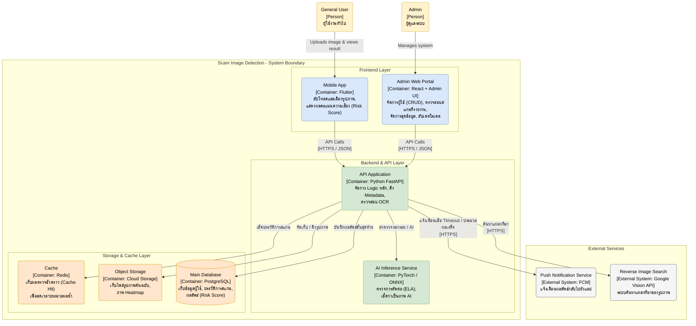

# C2: Container Diagram

---

### คำอธิบาย Container Diagram

สถาปัตยกรรมของระบบ Scam Image Detection ถูกออกแบบภายใต้แนวคิด **Microservices** และ **Cloud-Native Architecture** เพื่อให้ระบบสามารถรองรับการประมวลผลข้อมูลรูปภาพและโมเดลปัญญาประดิษฐ์ (ซึ่งใช้ทรัพยากรการคำนวณสูง) ได้อย่างมีประสิทธิภาพ โดยไม่ส่งผลกระทบต่อความเร็วในการตอบสนองของแอปพลิเคชัน ภายในขอบเขตของระบบ (System Boundary) ประกอบด้วยคอนเทนเนอร์หลัก 3 ส่วน ดังนี้:

### 1. ส่วนติดต่อผู้ใช้งาน (Frontend Containers)

* **Mobile App (Flutter):**
  * **บทบาท:** แอปพลิเคชันบนสมาร์ทโฟนสำหรับผู้ใช้งานทั่วไป (General User) ทำหน้าที่เป็นส่วนเชื่อมต่อหลักให้ผู้ใช้สามารถเลือกและอัปโหลดรูปภาพที่น่าสงสัย 
  * **หน้าที่:** ส่งข้อมูลรูปภาพไปยัง API Application และรับการแสดงผลลัพธ์กลับมาเป็นคะแนนความเสี่ยง (Risk Score) พร้อมคำอธิบายและภาพแผนที่ความร้อน (Heatmap) แสดงจุดที่ผิดปกติ
  * **เทคโนโลยี:** Flutter (รองรับทั้ง iOS และ Android)

* **Admin Web Portal (React + Admin UI):**
  * **บทบาท:** เว็บแอปพลิเคชันสำหรับผู้ดูแลระบบและนักวิจัย (Admin / Researcher)
  * **หน้าที่:** ใช้เป็นหน้าจอควบคุมและตรวจสอบสถานะระบบหลังบ้าน (Dashboard) การจัดการสิทธิ์ของผู้ใช้ (CRUD), ตรวจสอบรูปภาพสแกมที่ผู้ใช้ส่งรายงานเข้ามา (Scam Reports), จัดการคลังชุดข้อมูล (Dataset) และการอัปโหลดไฟล์น้ำหนักโมเดล AI (Model Weights)
  * **เทคโนโลยี:** React.js + TailwindCSS (หรือ Admin Template สำเร็จรูป)

### 2. ส่วนประมวลผลหลัก (Backend Containers)

* **API Application (Python FastAPI):**
  * **บทบาท:** ทำหน้าที่เป็น API Gateway และตัวควบคุมการประสานงานหลัก (Orchestrator) 
  * **หน้าที่:** จัดการตรรกะทางธุรกิจหลัก (Core Business Logic) ทั้งหมด เช่น การยืนยันตัวตน, จัดการข้อมูลผู้ใช้, ดึงข้อมูลเมทาดาตาแฝงของรูปภาพ (Metadata/EXIF Extraction), และสั่งประมวลผลสกัดตัวอักษรในภาพ (OCR) จากนั้นประสานงานส่งข้อมูลไปยังบริการวิเคราะห์ตัวอื่น ๆ
  * **เทคโนโลยี:** Python FastAPI

* **AI Inference Service (PyTorch / ONNX):**
  * **บทบาท:** เซอร์วิสวิเคราะห์รูปภาพผ่านระบบปัญญาประดิษฐ์เชิงลึก (Deep Learning)
  * **หน้าที่:** ประมวลผลรูปภาพเพื่อตรวจหาร่องรอยการแก้ไขภาพในระดับพิกเซลด้วยเทคนิค ELA (Error Level Analysis) และตรวจสอบลักษณะทางกายภาพของภาพว่าถูกสร้างด้วยปัญญาประดิษฐ์ (AI-Generated Image) หรือไม่
  * **เทคโนโลยี:** PyTorch / ONNX Runtime (เพื่อเพิ่มประสิทธิภาพความเร็วในการ Inference โมเดล)

### 3. ส่วนจัดเก็บข้อมูล (Storage Containers)

* **Cache (Redis):**
  * **บทบาท:** ฐานข้อมูลในหน่วยความจำชั่วคราวความเร็วสูง
  * **หน้าที่:** จัดเก็บแคชของรูปภาพที่เคยผ่านการสแกนตรวจสอบแล้วเพื่อลดการประมวลผลซ้ำ (Cache Hit) ช่วยให้อุปกรณ์ของผู้ใช้รายอื่นที่ส่งรูปภาพเดิมเข้ามาได้รับผลวิเคราะห์แทบจะทันทีโดยไม่ต้องรัน AI ซ้ำ
  * **เทคโนโลยี:** Redis Cache

* **Object Storage (Cloud Storage):**
  * **บทบาท:** แหล่งจัดเก็บไฟล์รูปภาพขนาดใหญ่
  * **หน้าที่:** จัดเก็บไฟล์รูปภาพต้นฉบับที่ผู้ใช้อัปโหลดเข้ามา และรูปภาพแผนที่ความร้อน (Grad-CAM Heatmap) ที่ส่งกลับมาจากบริการ AI เพื่อแสดงจุดผิดปกติ
  * **เทคโนโลยี:** ระบบจัดเก็บไฟล์บนคลาวด์ (Cloud Storage)

* **Main Database (PostgreSQL):**
  * **บทบาท:** ฐานข้อมูลหลักเชิงสัมพันธ์ (Relational Database)
  * **หน้าที่:** จัดเก็บข้อมูลที่มีโครงสร้าง เช่น ข้อมูลบัญชีผู้ใช้, บันทึกสิทธิ์การเข้าใช้งาน (RBAC), รายการประวัติสแกน, และข้อมูลการรายงานรูปภาพต้องสงสัย
  * **เทคโนโลยี:** PostgreSQL

### 4. การเชื่อมต่อกับระบบภายนอก (External Systems)

* **Reverse Image Search (Google Vision API):**
  * **บทบาท:** บริการสืบค้นหาแหล่งที่มาของภาพย้อนกลับ
  * **หน้าที่:** API Application จะส่งคำขอเพื่อตรวจสอบว่ารูปภาพที่ผู้ใช้อัปโหลดมานั้น เคยถูกเผยแพร่ในอินเทอร์เน็ตที่เว็บไซต์ใดมาก่อนหน้านี้หรือไม่ เพื่อตรวจสอบบริบทความสอดคล้อง (เช่น รูปโปรไฟล์จริง หรือรูปดาราที่มิจฉาชีพนำมาแอบอ้าง)
  * **เทคโนโลยี:** Google Vision API / Bing Visual Search

* **Push Notification Service (Firebase Cloud Messaging - FCM):**
  * **บทบาท:** ระบบส่งการแจ้งเตือนพุชไปยังผู้ใช้
  * **หน้าที่:** ในกรณีที่การสแกนตรวจสอบภาพในฝั่ง AI Inference Service ใช้เวลาประมวลผลนานกว่าปกติ หรือเกิดปัญหารอคิว ระบบจะทำงานเป็นแบบ Asynchronous โดย API Application จะส่ง Payload ไปยัง FCM เพื่อแจ้งเตือนกลับไปยัง Mobile App ของผู้ใช้งานเมื่อประมวลผลวิเคราะห์เสร็จสมบูรณ์
  * **เทคโนโลยี:** Firebase Cloud Messaging
