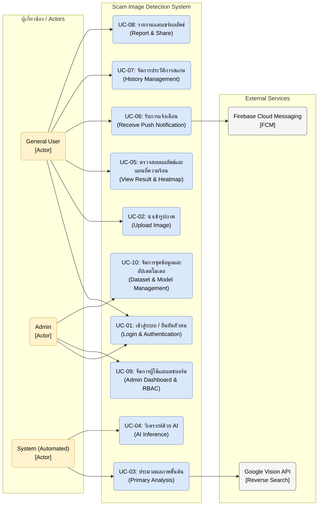

# Use Case Diagram

---

### คำอธิบายรายละเอียดกรณีการใช้งาน (Use Case Details)

* **UC-01: เข้าสู่ระบบ / ยืนยันตัวตน (Login & Authentication):**
  * **ผู้เกี่ยวข้อง (Actors):** General User, Admin
  * **รายละเอียด:** กระบวนการยืนยันตัวตนเพื่อรักษาความปลอดภัยก่อนเข้าใช้งานระบบ โดยเข้าผ่าน Email/Password หรือ Social Login เพื่อทำการตรวจสอบและกำหนดสิทธิ์การดูข้อมูลตามบทบาท (Role-Based Access Control)
  * **ความต้องการทางระบบ (FR):** FR-01 - ระบบเข้าสู่ระบบและยืนยันตัวตน (Authentication): ผู้ใช้และผู้ดูแลระบบสามารถเข้าสู่ระบบผ่าน Email/Password หรือโซเชียลมีเดีย พร้อมระบบกู้คืนรหัสผ่าน

* **UC-02: นำเข้ารูปภาพ (Upload Image):**
  * **ผู้เกี่ยวข้อง (Actors):** General User
  * **รายละเอียด:** ผู้ใช้งานสามารถอัปโหลดภาพที่ต้องการตรวจสอบ เช่น สลิปโอนเงิน หรือรูปโปรไฟล์บุคคลอื่น โดยเลือกรูปที่มีอยู่แล้วในคลังรูปภาพ (Gallery) ของอุปกรณ์เคลื่อนที่
  * **ความต้องการทางระบบ (FR):** FR-02 - ระบบนำเข้ารูปภาพ (Image Input): ผู้ใช้สามารถอัปโหลดรูปภาพที่ต้องการตรวจสอบได้จากคลังภาพ (Gallery) หรืออัปโหลดไฟล์ภาพเข้าสู่ระบบ

* **UC-03: ประมวลผลภาพขั้นต้น (Primary Analysis):**
  * **ผู้เกี่ยวข้อง (Actors):** System (Automated)
  * **รายละเอียด:** การดึงข้อมูลเมทาดาตา (Metadata/EXIF) ของภาพ, การสกัดตัวอักษรด้วยเทคนิค OCR เพื่อวิเคราะห์ Keyword อันตรายร่วมกับเทคนิค NLP และการส่งข้อมูลรูปภาพไปสืบค้นหาแหล่งที่มาดั้งเดิมด้วย Google Vision API
  * **ความต้องการทางระบบ (FR):** FR-03 - ระบบวิเคราะห์ข้อมูลชั้นต้น (Primary Analysis): ระบบสามารถดึงข้อมูลแฝง (Metadata/EXIF), สกัดข้อความในภาพ (OCR), และค้นหาแหล่งที่มาของภาพ (Reverse Image Search) ได้โดยอัตโนมัติ

* **UC-04: วิเคราะห์ด้วย AI (AI Inference):**
  * **ผู้เกี่ยวข้อง (Actors):** System (Automated)
  * **รายละเอียด:** ส่งรูปภาพเพื่อนำเข้าโมเดลปัญญาประดิษฐ์เชิงลึก (Deep Learning) ในการตรวจสอบการแก้ไขระดับพิกเซล (ELA) เพื่อหาร่องรอยการตัดต่อ (Image Forgery) และตรวจสอบลักษณะว่าภาพถูกสังเคราะห์ด้วย Generative AI หรือไม่
  * **ความต้องการทางระบบ (FR):** FR-04 - ระบบวิเคราะห์ด้วยปัญญาประดิษฐ์ (AI Inference): ระบบส่งภาพเข้าสู่โมเดล Deep Learning เพื่อตรวจสอบร่องรอยการตัดต่อ (Image Forgery/ELA) และตรวจสอบภาพที่สร้างด้วยปัญญาประดิษฐ์ (AI-Generated)

* **UC-05: ตรวจสอบผลลัพธ์และแผนที่ความร้อน (View Result & Heatmap):**
  * **ผู้เกี่ยวข้อง (Actors):** General User
  * **รายละเอียด:** หน้าจอแสดงค่าคะแนนความเสี่ยงรวม (Weighted Risk Score) พร้อมแสดงผลสรุปเหตุผลความผิดปกติ และแสดงแผนที่ความร้อน (Grad-CAM Heatmap) บนจุดที่น่าสงสัยของภาพ เพื่อตอบโจทย์ความโปร่งใสของปัญญาประดิษฐ์ (XAI)
  * **ความต้องการทางระบบ (FR):** FR-05 - ระบบแสดงผลลัพธ์ (Result & Visualization): ระบบคำนวณคะแนนความเสี่ยงรวม (Weighted Risk Score) และสร้างแผนที่ความร้อน (Grad-CAM Heatmap) เพื่ออธิบายผลลัพธ์ให้ผู้ใช้เข้าใจ

* **UC-06: รับการแจ้งเตือน (Receive Push Notification):**
  * **ผู้เกี่ยวข้อง (Actors):** General User
  * **รายละเอียด:** การรับข้อความการแจ้งเตือนแบบพุช (Push Notification) ผ่านระบบ Firebase Cloud Messaging (FCM) เมื่อระบบทำการตรวจสอบวิเคราะห์รูปภาพบนเซิร์ฟเวอร์เบื้องหลัง (Background Task) เสร็จสิ้นสมบูรณ์
  * **ความต้องการทางระบบ (FR):** FR-06 - ระบบแจ้งเตือน (Push Notification): ระบบสามารถส่งข้อความแจ้งเตือนผู้ใช้งานผ่าน Firebase Cloud Messaging (FCM) เมื่อการวิเคราะห์ภาพเบื้องหลัง (Background Task) เสร็จสิ้น

* **UC-07: จัดการประวัติการสแกน (History Management):**
  * **ผู้เกี่ยวข้อง (Actors):** General User
  * **รายละเอียด:** ผู้ใช้งานทั่วไปสามารถเรียกดูประวัติรูปภาพและผลคะแนนความเสี่ยงย้อนหลังที่เคยส่งตรวจสอบ เพื่อเก็บบันทึกข้อมูลหรือเรียกดูใหม่ และผู้ใช้สามารถกดลบข้อมูลการสแกนประวัติตนเองได้ตามนโยบาย PDPA
  * **ความต้องการทางระบบ (FR):** FR-07 - ระบบจัดการประวัติการสแกน (History Management): ระบบบันทึกประวัติการตรวจสอบภาพของผู้ใช้โดยสามารถเรียกดูผลลัพธ์ย้อนหลัง หรือลบประวัติได้

* **UC-08: รายงานและแชร์ผลลัพธ์ (Report & Share):**
  * **ผู้เกี่ยวข้อง (Actors):** General User
  * **รายละเอียด:** การกดรายงาน (Report) ส่งยืนยันภาพหลอกลวงเข้าคลังสแกมเมอร์ส่วนกลางเพื่อเป็นประโยชน์ในอนาคต และสามารถกดแชร์ภาพสรุปความเสี่ยงหรือคำเตือนภัยไปยังสื่อโซเชียลภายนอก (เช่น LINE) เพื่อเตือนภัยบุคคลใกล้ชิด
  * **ความต้องการทางระบบ (FR):** FR-08 - ระบบรายงานและแชร์ข้อมูล (Report & Share): ผู้ใช้สามารถกดรายงาน (Report) ภาพหลอกลวงเข้าสู่ฐานข้อมูลกลาง และสามารถแชร์ภาพผลลัพธ์/คำเตือนไปยังแอปพลิเคชันภายนอกได้

* **UC-09: จัดการผู้ใช้และแดชบอร์ด (Admin Dashboard & RBAC):**
  * **ผู้เกี่ยวข้อง (Actors):** Admin
  * **รายละเอียด:** แอดมินเข้าใช้งานหน้าเว็บแผงควบคุมระบบ (Admin Panel) เพื่อติดตามกราฟสถิติการใช้งาน, จัดการข้อมูลของผู้ใช้งาน, ตรวจสอบสิทธิ์การเข้าถึง และการอนุมัติจัดการรายงานต่าง ๆ
  * **ความต้องการทางระบบ (FR):** FR-09 - ระบบผู้ดูแลและการจัดการสิทธิ์ (Admin & RBAC): มีหน้าแดชบอร์ดให้ผู้ดูแลระบบตรวจสอบสถิติการใช้งาน, จัดการข้อมูลผู้ใช้, และกำหนดสิทธิ์การเข้าถึงระบบตามบทบาท

* **UC-10: จัดการชุดข้อมูลและอัปเดตโมเดล (Dataset & Model Management):**
  * **ผู้เกี่ยวข้อง (Actors):** Admin
  * **รายละเอียด:** แอดมินทำหน้าที่ตรวจสอบรูปภาพสแกมที่ผู้ใช้รายงาน ตรวจจัดหมวดหมู่เพื่อส่งเข้าชุดข้อมูล (Scam Dataset) สำหรับนำไปเทรนและวิเคราะห์เพิ่มเติม พร้อมทำการอัปโหลดไฟล์น้ำหนักโมเดล (Model Weights) เวอร์ชันใหม่ขึ้นระบบ
  * **ความต้องการทางระบบ (FR):** FR-10 - ระบบจัดการข้อมูลและโมเดล (Dataset & Model Management): ผู้ดูแลระบบสามารถตรวจสอบรูปภาพที่ถูกผู้ใช้รายงาน นำไปจัดหมวดหมู่ชุดข้อมูล และอัปโหลดโมเดล AI (Weights) เวอร์ชันใหม่เข้าสู่ระบบได้
