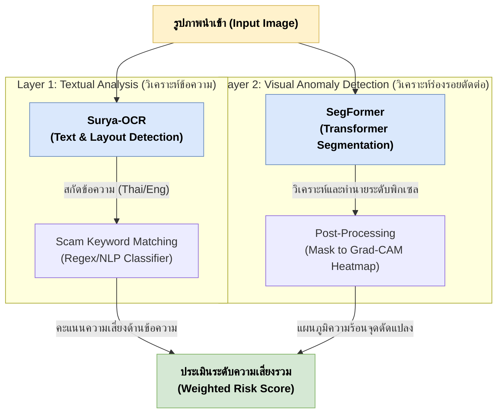

# รายละเอียดโมเดลปัญญาประดิษฐ์ (AI Models Specification)
## โครงงาน: แอปตรวจสอบรูปภาพตัดต่อที่ถูกนำมาหลอกลวง (Scam Image Detection)

เอกสารฉบับนี้อธิบายรายละเอียดทางเทคนิคของโมเดลปัญญาประดิษฐ์ (AI Models) ที่ใช้ในระบบ เพื่อตอบสนองความต้องการด้านความแม่นยำในการวิเคราะห์ข้อความแฝง และการตรวจหาร่องรอยดัดแปลงภาพ (Forgery Detection) โดยปรับลดความซับซ้อนของโครงสร้างและมุ่งเน้นไปที่โมเดลที่มีประสิทธิภาพสูงสุดตามสถาปัตยกรรมล่าสุด

---

## 1. แผนภาพการทำงานร่วมกันของโมเดล (Model Pipeline Architecture)

ระบบวิเคราะห์และประมวลผลถูกแบ่งเป็น 2 เลเยอร์หลัก ดังนี้:

---

## 2. โมเดลในชั้นวิเคราะห์ข้อความ (Textual Analysis Layer)

เพื่อดึงข้อความจากรูปภาพ (เช่น สลิปโอนเงินปลอม, หน้าจอแชตหลอกลวง, สื่อโฆษณาชวนเชื่อ) มาตรวจสอบคำศัพท์อันตราย (Scam Keywords) เช่น "กู้เงินด่วน", "โอนเงินรับปันผล"

### Surya-OCR 2 (GGUF Format)
**Surya-OCR 2** เป็นโมเดลสำหรับอ่านตัวอักษรและวิเคราะห์โครงสร้างเอกสารสมัยใหม่ (Modern OCR) ขับเคลื่อนด้วย VLM (Vision-Language Model) เพื่อลดข้อผิดพลาดที่มักเกิดใน OCR ยุคเก่า โดยในโปรเจกต์นี้เลือกใช้ในรูปแบบ **GGUF Format** (`datalab-to/surya-ocr-2-gguf`) เพื่อรีดประสิทธิภาพการทำงานบน Local Server (CPU / Apple Silicon หรือ GPU ขนาดเล็ก) ผ่าน `llama.cpp`

* **คุณสมบัติหลัก (Key Features):**
  * **Multi-lingual Support:** รองรับการอ่านมากกว่า 90 ภาษา รวมทั้งภาษาไทยและภาษาอังกฤษได้อย่างแม่นยำ
  * **GGUF Optimized:** แปลงน้ำหนักโมเดล (Quantization) ให้อยู่ในฟอร์แมต GGUF ทำให้กินทรัพยากรน้อยลง แต่ยังคงความแม่นยำสูง (อิงสถาปัตยกรรมระดับ 0.65B Params)
  * **Layout Detection:** สามารถวิเคราะห์บรรทัดและฟิลด์ของสลิปโอนเงิน (เช่น การแยกแยะจุดที่เป็นชื่อผู้รับเงิน ออกจากยอดเงิน) ทำให้โครงสร้างข้อความไม่สับสน
  * **Robust to Noise:** ทนทานต่อภาพที่มีความละเอียดต่ำ ภาพเบลอ หรือภาพที่ผ่านการบีบอัดไฟล์ผ่านแอปแชต
* **บทบาทในระบบ:**
  * รับรูปภาพอินพุตมาเพื่อแปลงออกมาเป็นสตริงข้อความ (Text Recognition) และระบุขอบเขต (Layout)
  * ส่งข้อมูลสตริงที่ได้ให้ทาง Backend API กรองต่อด้วยอัลกอริทึมจับคู่คำ (Scam Keyword Matching)

---

## 3. โมเดลในชั้นวิเคราะห์ความผิดปกติของภาพ (Visual Anomaly Detection Layer)

สำหรับการวิเคราะห์ร่องรอยการตัดต่อ ดัดแปลง แก้ไข หรือปลอมแปลงตัวเลขบนสลิปในระดับพิกเซล

### SegFormer (Semantic Segmentation using Transformers)
**SegFormer** เป็นโมเดลสถาปัตยกรรมแบบ Transformer ที่เบาแต่มีประสิทธิภาพสูงมากในงานแยกส่วนภาพ (Semantic Segmentation) โดยถูกนำมาใช้เป็นโมเดลหลักในการระบุตำแหน่งพิกเซลที่ผิดปกติ แทนที่สถาปัตยกรรมแบบ Hybrid ที่ซับซ้อนเกินจำเป็น

* **โครงสร้างและหลักการทำงาน (Mechanism):**
  * **MiT Encoder (Mix Transformer):** สกัดลักษณะเด่นของรูปภาพ (Feature Extraction) จากหลายสเกลความละเอียด ทำให้ AI สามารถพิจารณาบริบทภาพรวมและรายละเอียดระดับพิกเซลไปพร้อมกันได้โดยไม่ต้องใช้ Positional Encoding
  * **All-MLP Decoder:** ถอดรหัสโครงสร้างพิกเซลเพื่อสร้าง Segmentation Mask แบบ Binary (จริง/ปลอม) ว่าจุดไหนในภาพเป็นภาพดั้งเดิม และจุดไหนคือจุดที่ถูกดัดแปลง

### อัลกอริทึมและสมการคณิตศาสตร์ของ SegFormer (Mathematical Formulation)
การทำงานของ Mix Transformer (MiT) อาศัยกระบวนการลดรูปของ Self-Attention เพื่อประหยัดหน่วยความจำ (Efficient Self-Attention) โดยสามารถเขียนเป็นสมการได้ดังนี้:

1. **Efficient Self-Attention:**
   ในกรณีที่อินพุตคือ $X \in \mathbb{R}^{H \times W \times C}$ จะถูกแปลงให้แบนราบ (Flatten) เป็น Sequence $N = H \times W$
   โดยกระบวนการ Sequence Reduction จะลดมิติของ Key และ Value ลงด้วยอัตราส่วน $R$ เพื่อลดภาระการคำนวณ:
   $$K' = \text{Reshape}\left(\frac{N}{R}, C \cdot R\right)(K) \cdot W_K$$
   $$V' = \text{Reshape}\left(\frac{N}{R}, C \cdot R\right)(V) \cdot W_V$$
   $$ \text{Attention}(Q, K', V') = \text{Softmax}\left( \frac{Q (K')^T}{\sqrt{d_k}} \right) V' $$
   เมื่อ $Q$ คือ Query, $K'$ และ $V'$ คือ Key และ Value ที่ลดมิติแล้ว, และ $d_k$ คือมิติของ Key

2. **Mix-FFN (Mix Feed-Forward Network):**
   เพื่อหลีกเลี่ยงการใช้ Positional Encoding แบบตายตัว SegFormer ใช้ 3x3 Convolution ใน Feed-Forward Network เพื่อพิจารณาตำแหน่งจากบริบท:
   $$x_{out} = \text{MLP}(\text{GELU}(\text{Conv}_{3\times3}(\text{MLP}(x_{in})))) + x_{in}$$

* **บทบาทในระบบ:**
  * ทำหน้าที่ทำนายความน่าจะเป็นระดับพิกเซลของร่องรอยการปลอมแปลง (Pixel-level Prediction)
  * คืนค่าผลลัพธ์เป็น Segmentation Mask ซึ่งจะถูกแปลง (Post-Processing) ให้อยู่ในรูปของ **แผนภูมิความร้อน (Grad-CAM Heatmap)** เพื่อใช้วางซ้อน (Overlay) บนรูปต้นฉบับ แจ้งให้ผู้ใช้งานเห็นพื้นที่ดัดแปลงอย่างชัดเจนผ่านแอปพลิเคชัน

---

## 4. อัลกอริทึมการประเมินความเสี่ยงรวม (Weighted Risk Score Algorithm)

คะแนนความเสี่ยงโดยรวม (Total Risk Score) คำนวณจากการถ่วงน้ำหนักความสำคัญระหว่างผลลัพธ์การตรวจภาพ (Visual Score) และผลลัพธ์ข้อความ (Textual Score) โดยมีสมการดังนี้:

$$ S_{total} = (\alpha \times S_{visual}) + (\beta \times S_{textual}) $$

โดยที่:
* $S_{total}$ คือคะแนนความเสี่ยงรวม มีค่าตั้งแต่ 0 ถึง 100
* $S_{visual}$ คือคะแนนความเสี่ยงจากการถูกดัดแปลงภาพ (คำนวณจากค่าเฉลี่ยหรือพื้นที่พิกเซลความร้อนของ SegFormer)
* $S_{textual}$ คือคะแนนความเสี่ยงด้านข้อความหลอกลวง (ประเมินจากระดับความรุนแรงของ Scam Keyword)
* $\alpha$ และ $\beta$ คือค่าน้ำหนักถ่วง (Weight Factors) โดย $\alpha + \beta = 1.0$ (ในโปรเจกต์นี้กำหนดค่าเริ่มต้นคือ $\alpha = 0.6, \beta = 0.4$ เพื่อให้น้ำหนักกับการตัดต่อภาพมากกว่า)

เกณฑ์การตัดสินระดับความเสี่ยง (Risk Grade):
* $S_{total} < 30$ $\rightarrow$ **Safe (ปลอดภัย)**
* $30 \le S_{total} \le 70$ $\rightarrow$ **Suspicious (น่าสงสัย)**
* $S_{total} > 70$ $\rightarrow$ **Danger (อันตราย)**

---

## 5. ประสิทธิภาพและเป้าหมายตัวชี้วัด (Target Metrics)

เพื่อให้แอปพลิเคชันทำงานได้อย่างมีประสิทธิภาพในการใช้งานจริง (Production):
* **ความแม่นยำรวมของ AI (F1-Score / Accuracy):** ตั้งเป้าหมายที่ความแม่นยำ $\ge 85\%$ สำหรับการตรวจจับจุดที่ถูกตัดต่อ
* **เวลาเฉลี่ยในการประมวลผล (Inference Latency):** $< 5$ วินาทีต่อภาพ (โดยรวมการทำงานผ่าน ONNX Runtime บนฝั่ง AI Inference Service แล้ว)

---

## 5. การอ้างอิง (References & Related Documents)

เอกสารฉบับนี้อธิบายถึงคุณลักษณะของตัวโมเดลเท่านั้น สำหรับรายละเอียดอื่นๆ สามารถดูเพิ่มเติมได้ที่:
* **กลยุทธ์การฝึกสอนโมเดล:** ดูรายละเอียดเชิงลึกเกี่ยวกับ Incremental Learning, การ Freeze Backbone, และการอัปเดตโมเดลได้ที่ [training.md](./training.md)
* **สถาปัตยกรรมระดับซอฟต์แวร์:** การจัดการไฟล์โมเดล, เวอร์ชัน และ ONNX Export ในระดับระบบ ให้ดูที่เอกสาร [Model Design (Design Folder)](../../design/model.md) และ [Training Design (Design Folder)](../../design/training.md)
