# ขอบเขตงานที่ต้องทำ (Project Scope & Tasks)
## โครงงาน: แอปตรวจสอบรูปภาพตัดต่อที่ถูกนำมาหลอกลวง (Scam Image Detection)

เอกสารฉบับนี้กำหนดรายละเอียด ขอบเขตการพัฒนาระบบและรายการงาน (Tasks) ทั้งหมดของโครงงานวิศวกรรมซอฟต์แวร์ เพื่อใช้เป็นแผนนำทาง (Roadmap) ในการดำเนินงานของทีมงานตามสัดส่วนความรับผิดชอบ

---

## ภาพรวมขอบเขตงาน (System Overview)
ระบบแบ่งงานพัฒนาออกเป็น 4 ส่วนหลัก (Containers) และ 1 ชุดบริการตรวจวิเคราะห์ชั้นนอก (Integrations) ดังแผนภาพ C2:

```mermaid
flowchart TD
    %% การตั้งค่า Class สีต่างๆ
    classDef rootFill fill:#fff2cc,stroke:#d6b656,color:black,font-weight:bold
    classDef level1Fill fill:#dae8fc,stroke:#6c8ebf,color:black,font-weight:bold
    classDef level2Fill fill:#f5f5f5,stroke:#666666,color:black

    Root("Scam Image Detection<br>[ภาพรวมขอบเขตงาน]")
    
    %% Level 1 Modules
    MobileApp("Mobile App<br>(React Native)")
    Backend("API Backend<br>(FastAPI)")
    AIEngine("AI Inference Engine<br>(PyTorch / ONNX)")
    AdminPortal("Admin Portal<br>(React)")

    %% Connect Root to Modules
    Root --> MobileApp
    Root --> Backend
    Root --> AIEngine
    Root --> AdminPortal

    %% Mobile App Details
    MobileApp --> UC1("Authentication")
    MobileApp --> UC2("Image Upload/Capture")
    MobileApp --> UC3("Risk Score & Heatmap UI")
    MobileApp --> UC4("History & PDPA Controls")
    MobileApp --> UC5("Scam Report & Share")

    %% Backend Details
    Backend --> BE1("API Gateway")
    Backend --> BE2("Metadata/EXIF Extraction")
    Backend --> BE3("OCR (Thai/Eng) & NLP")
    Backend --> BE4("Redis Cache Logic")
    Backend --> BE5("PostgreSQL DB Schema")

    %% AI Engine Details
    AIEngine --> AI1("Error Level Analysis ELA")
    AIEngine --> AI2("GenAI Image Detection")
    AIEngine --> AI3("PyTorch to ONNX Pipeline")
    AIEngine --> AI4("Grad-CAM Generation")

    %% Admin Portal Details
    AdminPortal --> AD1("RBAC & Dashboard")
    AdminPortal --> AD2("User Management CRUD")
    AdminPortal --> AD3("Scam Report Queue")
    AdminPortal --> AD4("Model Update Console")

    %% Apply Styles
    class Root rootFill
    class MobileApp,Backend,AIEngine,AdminPortal level1Fill
    class UC1,UC2,UC3,UC4,UC5,BE1,BE2,BE3,BE4,BE5,AI1,AI2,AI3,AI4,AD1,AD2,AD3,AD4 level2Fill
```

---

## รายละเอียดขอบเขตงานแยกตามส่วนประกอบ (Detailed Work Packages)

### 1. ระบบแอปพลิเคชันสำหรับผู้ใช้ทั่วไป (General User Mobile App)
พัฒนาในรูปแบบ Cross-Platform (iOS และ Android) เพื่ออำนวยความสะดวกในการใช้งานบนอุปกรณ์เคลื่อนที่

* **งานพัฒนาระบบลงทะเบียนและยืนยันตัวตน (Authentication):**
  * พัฒนาหน้าลงทะเบียน (Register) และเข้าสู่ระบบ (Login) ด้วยอีเมลและรหัสผ่าน
  * เชื่อมต่อการล็อกอินภายนอก (Social OAuth - Google Login / Apple ID)
  * ออกแบบระบบจัดเก็บสถานะการเข้าสู่ระบบแบบปลอดภัย (Secure Storage)
* **งานพัฒนาระบบนำเข้ารูปภาพ (Image Input Module):**
  * พัฒนาหน้าการเลือกและอัปโหลดรูปภาพจากคลังภาพ (Gallery) เพื่อส่งประมวลผล
  * เพิ่มระบบครอปตัดรูปภาพ (Image Cropper) ก่อนส่งประมวลผล
* **งานพัฒนาการแสดงผลรายงานระดับความเสี่ยง (Risk Visualization Dashboard):**
  * หน้าแสดงคะแนนความเสี่ยงโดยรวม (Weighted Risk Score) ในรูปของเกจสี (เขียว-เหลือง-แดง)
  * แสดงข้อมูลเหตุผลที่เสี่ยง (เช่น ตรวจพบร่องรอย ELA หรือดึงพิกัดผิดปกติ)
  * หน้าแสดงภาพผลลัพธ์แผนที่ความร้อน (Grad-CAM Heatmap Overlay) เพื่อระบุจุดผิดปกติ
* **งานพัฒนาระบบจัดการประวัติและนโยบายความเป็นส่วนตัว (History & PDPA Control):**
  * หน้าเรียกดูรายการประวัติรูปภาพย้อนหลัง (History List)
  * ฟังก์ชันการลบประวัติการสแกนทีละรายการหรือทั้งหมด (ตามกฎ PDPA)
  * หน้ายินยอมการเข้าถึงข้อมูลและการเก็บรวบรวมไฟล์ภาพ (Consent Screen)
* **งานพัฒนาระบบรายงานและแจ้งเตือน (Community Report & Notification):**
  * ปุ่มรายงานภาพหลอกลวง (Scam Report Button) เพื่อส่งข้อมูลภาพเข้าคลังฐานข้อมูลกลาง
  * ระบบรับการแจ้งเตือนพุช (Push Notification FCM Integration) เมื่อระบบหลังบ้านสแกนรูปเสร็จสมบูรณ์

---

### 2. ระบบ API หลังบ้านและส่วนเชื่อมต่อภายนอก (API Backend & Integrations)
พัฒนาขึ้นเพื่อเป็นศูนย์กลางประมวลผลและประสานงาน (Orchestrator) ระหว่างแอปพลิเคชัน, เซิร์ฟเวอร์ AI และบริการภายนอก

* **งานพัฒนา API Core & Gateway (FastAPI):**
  * พัฒนาระบบ Routing ปลอดภัย รองรับโปรโตคอล HTTPS 
  * ระบบความปลอดภัยการยืนยันตัวตนระดับ Token (JWT Authentication)
  * ระบบควบคุมอัตราการเรียกใช้ API (Rate Limiting) ป้องกันบอท
* **งานพัฒนาโมดูลสกัดข้อความและการวิเคราะห์ประโยค (OCR & Textual Analysis):**
  * พัฒนาโมดูลสกัดตัวอักษรไทย-อังกฤษ จากสลิปโอนเงินหรือข้อความในรูปภาพด้วยเทคโนโลยี OCR (Surya-OCR)
  * พัฒนาระบบค้นหาและตรวจจับชุดคำค้นอันตราย (Scam Keywords) เช่น "กู้เงินด่วน", "ถอนยอด", "โบนัสพิเศษ" ด้วยตรรกะ Regex และ NLP
* **งานพัฒนาสกัดข้อมูลแฝงและการค้นหาภาพย้อนกลับ (Metadata & Reverse Image Search):**
  * พัฒนาโมดูลการอ่านข้อมูลเมทาดาตาของภาพ (EXIF/GPS Extraction) เพื่อเช็คประวัติรุ่นอุปกรณ์ที่ใช้บันทึกภาพและรายละเอียดไฟล์ภาพ
  * เชื่อมต่อ API บริการค้นหาภาพย้อนกลับภายนอก (Google Vision API) เพื่อตรวจสถิติการใช้งานรูปนี้บนเว็บอื่น
* **งานพัฒนาฐานข้อมูลหลักและแคช (PostgreSQL & Redis Cache):**
  * ออกแบบฐานข้อมูล (Database Schema) จัดเก็บข้อมูลผู้ใช้งาน, ข้อมูลประวัติการตรวจเช็ก, และบันทึกรายงานสแกมเมอร์
  * พัฒนา Logic ระบบแคช (Redis) เก็บค่าคีย์รูปภาพ (Image Hash Index) เพื่อส่งข้อมูลที่ตรวจแล้วกลับทันทีโดยไม่ต้องรัน AI ซ้ำ
  * พัฒนา Logic การเก็บอัปโหลดไฟล์รูปภาพและผลการวิเคราะห์ขึ้นระบบจัดเก็บไฟล์คลาวด์ (Cloud Storage)

---

### 3. บริการตรวจจับภาพตัดต่อและปัญญาประดิษฐ์ (AI Inference Engine)
พัฒนาส่วนประมวลผลโมเดล Deep Learning สำหรับแยกวิเคราะห์รูปภาพโดยเฉพาะ แยกคอนเทนเนอร์ทำงานอิสระเพื่อรองรับการขยายตัว (Scalability)

* **งานวิจัยและคัดกรองชุดข้อมูลฝึกสอน (Scam Dataset Preparation):**
  * รวบรวมสลิปโอนเงินปลอม, ภาพบุคคลตัดต่อ, และรูปภาพที่สร้างจาก Generative AI มารวมจัดกลุ่มข้อมูล (Dataset)
  * ดำเนินการจัดทำป้ายกำกับพิกเซล (Pixel-level Annotations) ในส่วนที่ถูกแก้ไขของรูปภาพ
* **งานพัฒนาโมดูลตรวจสอบร่องรอยการดัดแปลงภาพ (Image Forgery Detection):**
  * พัฒนาโมดูลคำนวณและดึงข้อมูลระดับพิกเซลด้วยเทคนิค ELA (Error Level Analysis)
  * พัฒนาโมเดล Deep Learning (เช่น PSCC-Net ร่วมกับ SegFormer) เพื่อหาค่าคะแนนความผิดปกติของภาพที่ผ่านการแต่งรูป (Copy-Move, Splice, Inpainting)
* **งานพัฒนาโมดูลตรวจสอบภาพสังเคราะห์จากปัญญาประดิษฐ์ (AI-Generated Image Detection):**
  * พัฒนาโมเดลปัญญาประดิษฐ์เชิงลึกในการตรวจหาเศษซากลักษณะทางฟิสิกส์ผิดปกติ (Artifacts) ที่หลงเหลือจากการรันโมเดล Generative AI (เช่น DALL-E, Midjourney, Stable Diffusion)
* **งานพัฒนาเซอร์วิสประมวลผลและการอธิบายโมเดล (AI Inference & Explainability):**
  * พัฒนาส่วนควบคุมการรับไฟล์ส่งประมวลผล (PyTorch Backend Service) และแปลงโมเดลให้อยู่ในรูปของ ONNX format เพื่อให้ Inference ได้เร็วที่สุด
  * พัฒนาระบบส่งคืนแผนภาพอธิบายเหตุผลของปัญญาประดิษฐ์ (Explainable AI) ในรูปแบบแผนที่ความร้อน Grad-CAM (Gradient-weighted Class Activation Mapping) ซ้อนทับลงบนรูปภาพผลลัพธ์

---

### 4. หน้าเว็บควบคุมสำหรับผู้ดูแลระบบ (Admin Web Portal)
พัฒนาหน้าเว็บแสดงสถิติและควบคุมความปลอดภัยของระบบสำหรับทีมผู้ดูแลระบบและนักวิจัย

* **งานพัฒนาระบบควบคุมสิทธิ์ผู้ดูแลระบบ (Dashboard & RBAC):**
  * หน้าจอยืนยันตัวตนสำหรับผู้ดูแลระบบและออกสิทธิ์ตามบทบาท (Role-Based Access Control)
  * หน้ารายงานสถิติภาพรวมระบบ (Statistical Dashboard) เช่น กราฟแสดงสถิติจำนวนผู้ใช้, ความแม่นยำของโมเดล AI, และอัตราสัดส่วนการสแกนรูปภาพต่อวัน
* **งานพัฒนาระบบตรวจสอบรายงานประวัติการสแกม (Scam Reports Queue):**
  * หน้าสำหรับดึงรูปภาพที่ผู้ใช้สวมบทบาทรายงานส่งเข้ามา (Report List Queue) เพื่อกดอนุมัติหรือปฏิเสธความเป็นสแกม
  * หน้าประวัติการทำงานของผู้ดูแลระบบ (Audit Logs) บันทึกทุกคำสั่งเพื่อความโปร่งใสความมั่นคงปลอดภัยของระบบ
* **งานพัฒนาระบบอัปเดตโมเดลและความยืดหยุ่น (Model Update Module):**
  * หน้าอัปโหลดไฟล์น้ำหนักโมเดล (Model Weights) เวอร์ชันใหม่เพื่อเปลี่ยนเข้าแทนที่ในบริการ AI Inference Service
  * ฟังก์ชันควบคุมการส่งออกชุดข้อมูลรูปภาพไปเทรนโมเดลเพิ่มเติม (Export scam datasets)

---

## สรุปความรับผิดชอบของคณะผู้ดำเนินงาน (Tasks Assignment Matrix)

| ส่วนประกอบที่ต้องพัฒนา (Modules / Components) | ภานุวัฒน์ ต๋าคำ (70%) | เอกพันธ์ ทศทิศรังสรรค์ (30%) |
| :--- | :---: | :---: |
| **1. Mobile App (React Native)** - UI/UX Design, Camera & Gallery Integration - Risk Score, History & Report System | **รับผิดชอบหลัก (Lead)** | ร่วมพัฒนาส่วนหน้าจอและทดสอบการใช้งาน |
| **2. API Backend (FastAPI & Integrations)** - API Gateway, User Auth (JWT) - OCR Text Extraction, EXIF Extraction - Cloud Storage, Redis Cache, PostgreSQL | **รับผิดชอบหลัก (Lead)** | สนับสนุนการออกแบบ Database & Schema |
| **3. AI Inference Service (PyTorch / ONNX)** - Dataset Prep, ELA & GenAI Detection Model - ONNX conversion, Grad-CAM Generation | **รับผิดชอบหลัก (Lead)** | - |
| **4. Admin Web Portal (React)** - User Controls & statistical dashboard - Scam Reports approval queue, Model Weight Upload | ร่วมพัฒนาและเชื่อมต่อ Backend API | **รับผิดชอบหลัก (Lead)** |
| **5. SIT, Performance & Security Testing** - Verification of AI performance - Load test & Security audit | **รับผิดชอบหลัก (Lead)** | ร่วมดำเนินการทดสอบระบบแบบ SIT และเขียนบันทึกผลการทดสอบ |
