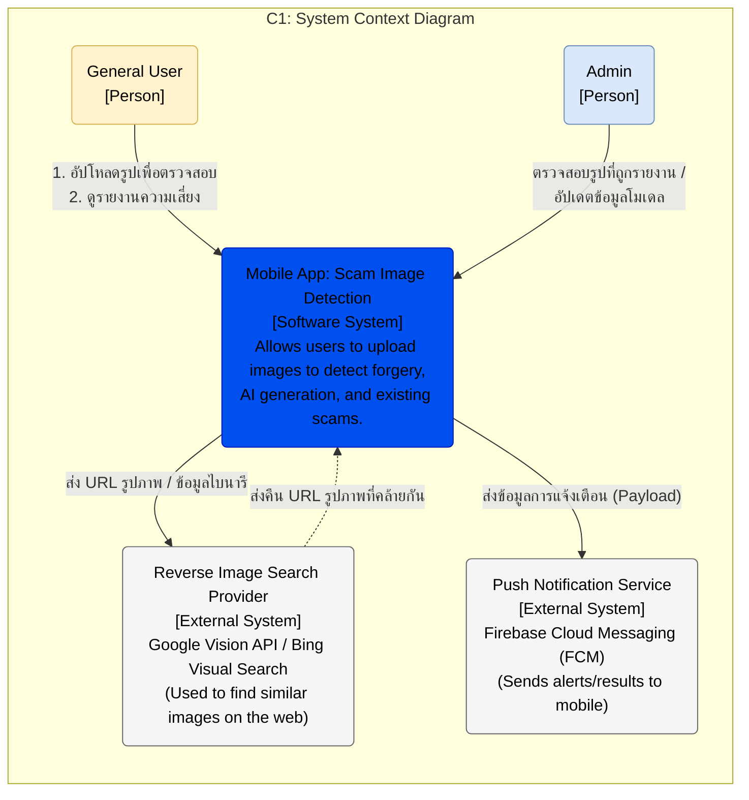
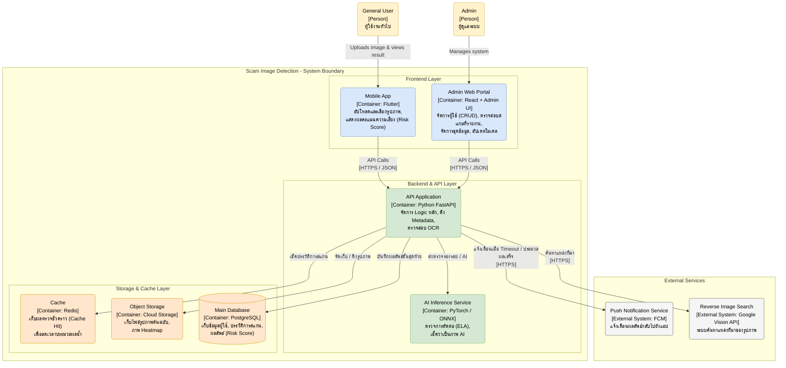
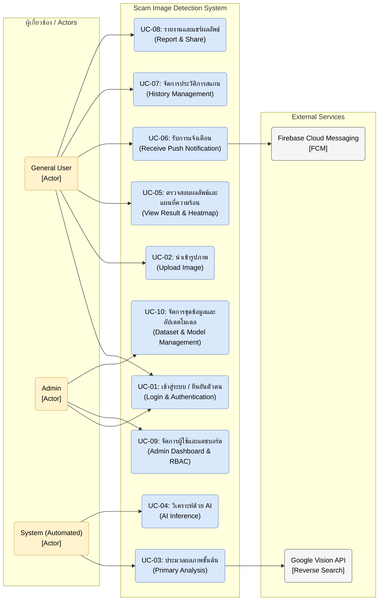
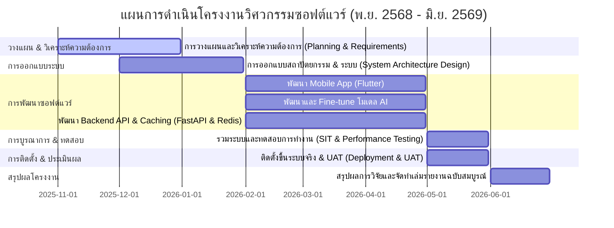

# เอกสารข้อกำหนดความต้องการทางซอฟต์แวร์ (Software Requirements Specification - SRS)
## โครงงาน: แอปตรวจสอบรูปภาพตัดต่อที่ถูกนำมาหลอกลวง (Image Forgery Detection Application for Fraud Prevention)

**หลักสูตรวิศวกรรมซอฟต์แวร์ สาขาวิศวกรรมไฟฟ้า คณะวิศวกรรมศาสตร์**  
**มหาวิทยาลัยเทคโนโลยีราชมงคลล้านนา ปีการศึกษา 2/2568**  
**รหัสโครงงานวิศวกรรม:** SE02

---

## คณะผู้ดำเนินงาน
1. **นาย ภานุวัฒน์ ต๋าคำ** (หัวหน้าโครงงาน)  
   รหัสนักศึกษา: 67543210044-3 ชั้นปี: วิศวกรรมซอฟต์แวร์ ปี 2ข (หลักสูตรเทียบโอน)  
   ความเชี่ยวชาญ: การพัฒนาโมบายแอปพลิเคชัน, การพัฒนาเว็บแอปพลิเคชัน, การวิเคราะห์และออกแบบระบบ, การออกแบบฐานข้อมูล, การออกแบบส่วนติดต่อผู้ใช้ (UI), การเขียนโปรแกรมภาษา Python และ JavaScript  
   ความรับผิดชอบ: วางแผนและกำหนดขอบเขตโครงงาน, เก็บและวิเคราะห์ความต้องการระบบ, วิเคราะห์และออกแบบระบบ, พัฒนาแอปพลิเคชันบนอุปกรณ์เคลื่อนที่, พัฒนาระบบฝั่งเซิร์ฟเวอร์, พัฒนาและฝึกสอนโมเดลปัญญาประดิษฐ์ (AI), จัดทำเอกสารประกอบโครงงาน  
   สัดส่วนความรับผิดชอบ: 70%  
   สถานที่ติดต่อ: มหาวิทยาลัยเทคโนโลยีราชมงคลล้านนา เชียงใหม่ ดอยสะเก็ด  
   โทรศัพท์: 083-923-0703  
   อีเมล: panuwat_ta67@live.rmutl.ac.th  

2. **นาย เอกพันธ์ ทศทิศรังสรรค์** (ผู้ร่วมโครงงาน)  
   รหัสนักศึกษา: 67543210050-0 ชั้นปี: วิศวกรรมซอฟต์แวร์ ปี 2ข (หลักสูตรเทียบโอน)  
   ความเชี่ยวชาญ: การพัฒนาโมบายแอปพลิเคชัน, การพัฒนาเว็บแอปพลิเคชัน, การวิเคราะห์และออกแบบระบบ  
   ความรับผิดชอบ: การวิเคราะห์และออกแบบระบบ, พัฒนาแอปพลิเคชันบนอุปกรณ์เคลื่อนที่, จัดทำเอกสารประกอบโครงงาน, ดำเนินการทดสอบระบบ  
   สัดส่วนความรับผิดชอบ: 30%  
   สถานที่ติดต่อ: มหาวิทยาลัยเทคโนโลยีราชมงคลล้านนา เชียงใหม่ ดอยสะเก็ด  
   โทรศัพท์: 093-149-1440  
   อีเมล: akkapan_to67@live.rmutl.ac.th  

**อาจารย์ที่ปรึกษา:** อาจารย์   
**วันที่เสนอโครงงาน:** 20 มีนาคม พ.ศ. 2568  

---

## 1. บทนำ (Introduction)

### 1.1 วัตถุประสงค์ของเอกสาร (Purpose)
เอกสารฉบับนี้จัดทำขึ้นเพื่อระบุข้อกำหนดความต้องการทางซอฟต์แวร์ (Software Requirements Specification: SRS) สำหรับแอปพลิเคชันตรวจสอบรูปภาพตัดต่อเพื่อป้องกันการหลอกลวง โดยแสดงข้อมูลเกี่ยวกับความต้องการทางธุรกิจ (Business Requirements) ความต้องการเชิงฟังก์ชัน (Functional Requirements) ความต้องการที่ไม่ใช่ฟังก์ชัน (Non-Functional Requirements) สถาปัตยกรรมของระบบ และการออกแบบระบบเบื้องต้นเพื่อใช้เป็นแนวทางและข้อตกลงร่วมในการพัฒนาโครงงานวิศวกรรมซอฟต์แวร์นี้

### 1.2 ขอบเขตของผลิตภัณฑ์ (Product Scope)
ระบบ Scam Image Detection เป็นระบบตรวจสอบความเสี่ยงของรูปภาพที่สงสัยว่าถูกตัดต่อหรือสร้างขึ้นด้วยปัญญาประดิษฐ์เพื่อลดการตกเป็นเหยื่อของการหลอกลวงทางไซเบอร์ เช่น สลิปโอนเงินปลอม หรือภาพหน้าคนปลอม โดยระบบจะตรวจสอบผ่าน 3 เลเยอร์หลัก (Multi-layer Analysis):
1. **Textual Analysis (วิเคราะห์ข้อความในภาพ):** ดึงข้อความด้วย OCR และวิเคราะห์หาคำสำคัญหรือรูปแบบประโยคหลอกลวงด้วย NLP
2. **Source Verification (ตรวจสอบแหล่งที่มา):** ค้นหาภาพย้อนกลับ (Reverse Image Search) เพื่อตรวจสอบว่าภาพเคยปรากฏในอินเทอร์เน็ตมาก่อนหรือไม่
3. **Visual Anomaly Detection (วิเคราะห์ความผิดปกติทางทัศนภาพ):** ใช้โมเดลการเรียนรู้เชิงลึก (Deep Learning) เพื่อหาร่องรอยการตัดต่อ (Image Forgery) หรือภาพที่ถูกสร้างโดย Generative AI (AI-Generated Image)

### 1.3 คำสำคัญ (Keywords)
* **Image Forgery Detection:** การตรวจสอบการปลอมแปลงรูปภาพ
* **Explainable AI (XAI):** ปัญญาประดิษฐ์ที่อธิบายได้
* **Grad-CAM (Heatmap):** แผนที่ความร้อนระบุจุดผิดปกติ
* **Multi-layer Analysis:** การวิเคราะห์ข้อมูลแบบหลายชั้น
* **Microservices Architecture:** สถาปัตยกรรมไมโครเซอร์วิส
* **PDPA (Personal Data Protection Act):** พระราชบัญญัติคุ้มครองข้อมูลส่วนบุคคล

---

## 2. คำอธิบายโดยรวม (Overall Description)

### 2.1 มุมมองของผลิตภัณฑ์ (Product Perspective)
ระบบตรวจสอบภาพหลอกลวงได้รับการพัฒนาให้อยู่ในรูปของแอปพลิเคชันบนสมาร์ทโฟน (Flutter) เพื่อให้เข้าถึงง่าย ทำงานร่วมกับ API Gateway ฝั่งระบบหลังบ้าน (FastAPI) และระบบบริการตรวจสอบวิเคราะห์ปัญญาประดิษฐ์ (AI Inference Service) เพื่อส่งผลลัพธ์ที่เป็นระดับความเสี่ยง (Risk Score) และคำอธิบายเชิงภาพ (Grad-CAM Heatmap) กลับไปยังผู้ใช้

#### 2.1.1 แผนภาพ Context Diagram (C1)
แสดงขอบเขตและการแลกเปลี่ยนข้อมูลระหว่างผู้ใช้ ระบบ และบริการภายนอก:

##### คำอธิบายระบบในภาพรวม (System Context Details)

* **1. ระบบหลัก (The Software System):**
  * **Mobile App: Scam Image Detection:** เป็นแอปพลิเคชันบนมือถือที่พัฒนาด้วย Flutter สำหรับอำนวยความสะดวกให้ผู้ใช้งานทั่วไปสามารถอัปโหลดรูปภาพที่น่าสงสัยเข้ามาตรวจสอบความเสี่ยงของการปลอมแปลงและการหลอกลวง
* **2. ผู้ใช้งาน (People):**
  * **General User (ผู้ใช้งานทั่วไป):** ผู้รับรูปภาพน่าสงสัย เช่น สลิปโอนเงินปลอม หรือรูปโปรไฟล์หลอกลวง ส่งภาพเข้ามาตรวจสอบและดูรายงานระดับความเสี่ยงเพื่อประกอบการตัดสินใจ
  * **Admin (ผู้ดูแลระบบ):** ตรวจสอบรูปภาพสแกมที่ผู้ใช้รายงาน ส่งภาพเข้าคลังชุดข้อมูล หรือดำเนินงานอัปเดตข้อมูลไฟล์โมเดลปัญญาประดิษฐ์ให้เท่าทันรูปแบบกลโกงใหม่ๆ
* **3. ระบบภายนอก (External Systems):**
  * **Reverse Image Search Provider:** ระบบภายนอก (Google Vision API / Bing Visual Search) สำหรับสืบค้นและค้นหาว่าไฟล์ภาพดังกล่าวเคยปรากฏในอินเทอร์เน็ตที่ใดบ้าง เพื่อระบุแหล่งที่มาและบริบทที่แท้จริง
  * **Push Notification Service:** บริการส่งการแจ้งเตือน Firebase Cloud Messaging (FCM) ในการส่งข้อมูลแจ้งเตือน (Push Notification) ไปยังอุปกรณ์ของผู้ใช้เมื่อระบบวิเคราะห์ผลลัพธ์ในเบื้องหลังเสร็จสมบูรณ์
* **สรุปขั้นตอนการทำงาน (Workflow Scenario):**
  1. **User** อัปโหลดรูปภาพที่ต้องการตรวจสอบเข้ามาในระบบผ่านแอปพลิเคชันมือถือ
  2. **System** ตรวจสอบความละเอียด ร่องรอยการตัดต่อ (ELA) และส่งข้อมูลสกัดภาพไปสืบค้นแหล่งที่มาผ่าน Google/Bing API
  3. ระบบประมวลผลคำนวณความเสี่ยง และส่งคำสั่งแจ้งเตือนผ่านบริการ FCM ไปยังผู้ใช้งาน
  4. ผู้ใช้เปิดตรวจสอบรายงานผลลัพธ์ดัชนีความเสี่ยงพร้อมแผนที่ความร้อน (Grad-CAM Heatmap)
  5. หากภาพเป็นรูปแบบกลโกงใหม่ ผู้ใช้สามารถกดรายงานเพื่อส่งข้อมูลไปให้ Admin ทำการอัปเดตโมเดลในอนาคต

#### 2.1.2 แผนภาพ Container Diagram (C2)
แสดงโครงสร้างส่วนประกอบย่อยภายในระบบที่ทำงานร่วมกันแบบ Microservices:

##### คำอธิบาย Container Diagram

สถาปัตยกรรมของระบบ Scam Image Detection ถูกออกแบบภายใต้แนวคิด **Microservices** และ **Cloud-Native Architecture** เพื่อให้ระบบสามารถรองรับการประมวลผลข้อมูลรูปภาพและโมเดลปัญญาประดิษฐ์ (ซึ่งใช้ทรัพยากรการคำนวณสูง) ได้อย่างมีประสิทธิภาพ โดยไม่ส่งผลกระทบต่อความเร็วในการตอบสนองของแอปพลิเคชัน ภายในขอบเขตของระบบ (System Boundary) ประกอบด้วยคอนเทนเนอร์หลัก 3 ส่วน ดังนี้:

* **1. ส่วนติดต่อผู้ใช้งาน (Frontend Containers):**
  * **Mobile App (Flutter):** แอปพลิเคชันบนสมาร์ทโฟนสำหรับผู้ใช้งานทั่วไป (General User) ทำหน้าที่รับส่งไฟล์ภาพและแสดงผลคะแนนความเสี่ยง (Risk Score) พร้อมแผนที่ความร้อน (Grad-CAM Heatmap)
  * **Admin Web Portal (React + Admin UI):** เว็บแอปสำหรับแอดมินใช้ตรวจสอบสถิติระบบ บริหารจัดการบัญชีผู้ใช้งาน (CRUD) ตรวจสอบรูปภาพสแกมที่รายงาน และอัปเดตโมเดล AI
* **2. ส่วนประมวลผลหลัก (Backend Containers):**
  * **API Application (FastAPI):** ทำหน้าที่เป็น API Gateway รับส่งข้อมูล และประมวลผลตรรกะทางธุรกิจ เช่น การยืนยันตัวตน ดึงข้อมูลแฝง (Metadata) และตรวจสอบ OCR เบื้องต้น
  * **AI Inference Service (PyTorch / ONNX):** เซอร์วิสวิเคราะห์โมเดล AI โดยเฉพาะ ทำการตรวจสอบรูปภาพว่าถูกตัดต่อ (ELA) หรือสร้างจากปัญญาประดิษฐ์ (AI-Generated Image) หรือไม่
* **3. ส่วนจัดเก็บข้อมูล (Storage Containers):**
  * **Cache (Redis):** เก็บบันทึกข้อมูลผลการสแกนภาพล่าสุด เพื่อนำกลับมาแสดงผลทันทีโดยไม่ต้องประมวลผลใหม่ (Cache Hit) เมื่อส่งรูปเดิมเข้ามาซ้ำ
  * **Object Storage (Cloud Storage):** จัดเก็บข้อมูลรูปภาพดิบที่ผู้ใช้อัปโหลดเข้ามาและรูปภาพผลลัพธ์ของ Heatmap
  * **Main Database (PostgreSQL):** จัดเก็บข้อมูลระบบหลัก เช่น ข้อมูลบัญชีผู้ใช้ บันทึกประวัติการสแกน และล็อกระบบ RBAC
* **4. การเชื่อมต่อกับระบบภายนอก (External Systems):**
  * **Reverse Image Search (Google Vision API):** สืบค้นหาแหล่งที่มาดั้งเดิมของภาพจากเว็บไซต์ทั่วโลก
  * **Push Notification Service (FCM):** แจ้งเตือนผู้ใช้งานเมื่อรูปภาพที่รันในลักษณะ Asynchronous หลังบ้านทำการตรวจสอบเสร็จสิ้น

#### 2.1.3 เทคโนโลยีที่ใช้ในการพัฒนา (Technology Stack)
* **Frontend:** Flutter (แอปพลิเคชันมือถือ), React.js (หน้าเว็บแอดมิน)
* **Backend:** Python FastAPI (API Gateway และ Core Service)
* **AI Engine:** PyTorch / ONNX (สำหรับ AI Inference), รันการดัดแปลงภาพด้วย PSCC-Net และ SegFormer
* **Database & Caching:** PostgreSQL (ฐานข้อมูลหลัก), Redis (สำหรับจัดเก็บข้อมูลแคช)
* **Object Storage:** ระบบจัดเก็บไฟล์บนคลาวด์ (Cloud Storage) (สำหรับรูปภาพและ Heatmap)
* **Deployment:** Docker & Containerization

### 2.2 ฟังก์ชันการทำงานของระบบ (Product Functions)
* ระบบสมัครสมาชิกและล็อกอินแบบสากลและ OAuth
* เลือกและอัปโหลดรูปภาพเพื่อตรวจสอบ
* ถอดข้อความจากรูปภาพ วิเคราะห์ประเด็นหลอกลวง และค้นหาแหล่งที่มาของรูปภาพ
* ส่งรูปภาพตรวจสอบผ่านโมเดลปัญญาประดิษฐ์เพื่อหาจุดตัดต่อและระบุดัชนีความเสี่ยง
* แสดงผลวิเคราะห์ภาพพร้อมแผนที่ความร้อน (Grad-CAM Heatmap)
* การแจ้งเตือนผู้ใช้งานเมื่อวิเคราะห์ภาพในเบื้องหลังเสร็จสิ้น (Push Notification)
* บันทึกประวัติและรายงานรูปภาพที่น่าสงสัย
* แดชบอร์ดตรวจสอบสถิติและเครื่องมืออัปเดตโมเดล AI สำหรับผู้ดูแลระบบ

### 2.3 กลุ่มผู้ใช้และคุณลักษณะ (User Classes and Characteristics)
1. **General User (ผู้ใช้งานทั่วไป):**
   * ประชาชนทั่วไปที่ทำธุรกรรมออนไลน์ ซื้อของออนไลน์ หรือผู้ใช้สื่อสังคมออนไลน์
   * ต้องการความสามารถในการตรวจเช็กภาพอย่างรวดเร็วและเข้าใจง่าย (ผ่านผลลัพธ์ Visual Heatmap)
2. **Administrator (ผู้ดูแลระบบ):**
   * มีความเข้าใจด้านเทคนิคและระบบซอฟต์แวร์
   * ทำหน้าที่จัดการสิทธิ์เข้าถึง จัดการชุดข้อมูลรูปภาพ (Dataset) ที่ผู้ใช้รายงานเข้ามา และอัปโหลดไฟล์น้ำหนักโมเดล (AI Weights)

### 2.4 ข้อจำกัดในการพัฒนา (Design and Implementation Constraints)
* อุปกรณ์เคลื่อนที่ต้องเชื่อมต่ออินเทอร์เน็ตในการส่งรูปภาพไปประมวลผลบนคลาวด์
* การตรวจสอบทางด้านข้อความ (OCR) อาจได้ผลลัพธ์ไม่แม่นยำ 100% หากรูปภาพเบลอ มีความละเอียดต่ำ หรือแสงไม่เพียงพอ
* การประเมินผลความเสี่ยง (Risk Score) เป็นการประเมินเชิงสถิติจากโมเดล ไม่สามารถใช้เป็นข้อสรุปทางกฎหมายหรือพยานหลักฐานเด็ดขาดในชั้นศาลได้โดยตรง
* ระบบต้องปฏิบัติตามมาตรฐาน พ.ร.บ. คุ้มครองข้อมูลส่วนบุคคล (PDPA) อย่างเคร่งครัด

### 2.5 สมมติฐานและความขึ้นต่อกัน (Assumptions and Dependencies)
* สมมติว่าระบบบริการค้นหาข้อมูลภายนอก (Google Vision API) เปิดบริการตามปกติและมีอัตราการเชื่อมต่อที่เสถียร
* โมเดล AI จำเป็นต้องมีการเก็บรวบรวมรูปภาพสแกมไทย (Thai-Context Scam Images) เพิ่มเติมอย่างต่อเนื่องเพื่ออัปเดตโมเดลให้เข้ากับกลโกงรูปแบบใหม่ๆ

---

## 3. ข้อกำหนดความต้องการเชิงระบบ (System Requirements)

### 3.1 ความต้องการทางธุรกิจ (Business Requirements - BR)

| รหัส (BR-ID) | รายละเอียดความต้องการทางธุรกิจ | เหตุผล / คุณค่าทางธุรกิจ (Business Value) |
| :--- | :--- | :--- |
| **BR-01** | ระบบต้องช่วยให้ผู้ใช้สามารถอัปโหลดและตรวจสอบรูปภาพที่น่าสงสัยผ่านสมาร์ทโฟนได้ | ป้องกันความสูญเสียทรัพย์สินและทำให้ประชาชนรู้เท่าทันกลโกงได้ทุกที่ทุกเวลา |
| **BR-02** | ระบบต้องวิเคราะห์ภาพแบบหลายชั้น (ข้อความ, แหล่งที่มา, การตัดต่อ, AI) ได้อัตโนมัติ | เพิ่มความแม่นยำในการตรวจสอบและลดข้อผิดพลาดที่เกิดจากการประเมินด้วยสายตามนุษย์ |
| **BR-03** | ระบบต้องสามารถแสดงคำอธิบายผลลัพธ์ผ่านแผนที่ความร้อน (Heatmap) ได้ | สร้างความน่าเชื่อถือ (Trust) และเพิ่มความตระหนักรู้ทางดิจิทัล (Digital Literacy) ให้ผู้ใช้ |
| **BR-04** | ระบบต้องประมวลผลได้อย่างรวดเร็ว หรือมีการแจ้งเตือน (Push Notification) เมื่อเสร็จสิ้น | มอบประสบการณ์ใช้งานที่ดี (UX) ทำให้ผู้ใช้ไม่ต้องเปิดหน้าจอแอปพลิเคชันค้างไว้เพื่อรอผล |
| **BR-05** | ระบบต้องสามารถจัดเก็บประวัติการสแกนและเรียกดูย้อนหลังได้ | ช่วยให้ผู้ใช้มีระบบจัดเก็บข้อมูลที่เป็นระเบียบ และสามารถนำมาใช้เป็นหลักฐานอ้างอิงได้ในภายหลัง |
| **BR-06** | ระบบต้องเปิดให้ผู้ใช้สามารถส่งรายงาน (Report) รูปภาพตัดต่อหลอกลวงเข้าสู่ระบบส่วนกลางได้ | สร้างความร่วมมือในชุมชน (Crowdsourcing) และรวบรวมข้อมูลเพื่อใช้สอน AI ในอนาคต |
| **BR-07** | ระบบต้องสามารถแชร์ (Share) หรือส่งออกภาพผลลัพธ์ความเสี่ยงไปยังแอปพลิเคชันอื่นได้ | เพื่อให้ผู้ใช้สามารถส่งภาพแจ้งเตือนภัยไปยังบุคคลใกล้ชิด (เช่น ผ่าน LINE) ได้อย่างสะดวกรวดเร็ว |
| **BR-08** | ระบบต้องจัดเก็บข้อมูลและประวัติผู้ใช้งานด้วยมาตรการรักษาความปลอดภัย (PDPA Compliance) | ป้องกันการรั่วไหล of ข้อมูลส่วนบุคคล และสร้างความมั่นใจในการใช้งานแอปพลิเคชัน |
| **BR-09** | ระบบต้องมีหน้าแดชบอร์ด (Admin Dashboard) และระบบควบคุมสิทธิ์ผู้ใช้ (RBAC) | ช่วยให้ผู้ดูแลระบบสามารถควบคุม ตรวจสอบ และบริหารจัดการระบบได้อย่างมีประสิทธิภาพ |
| **BR-10** | ระบบต้องรองรับการจัดการชุดข้อมูล (Dataset) และการอัปเดตโมเดล AI โดยผู้ดูแลระบบ | เพื่อให้ระบบมีความยืดหยุ่น สามารถเรียนรู้กลโกงรูปแบบใหม่ๆ และรักษาความแม่นยำได้ในระยะยาว |

### 3.2 ความต้องการเชิงฟังก์ชัน (Functional Requirements - FR)

| รหัส (FR-ID) | รายละเอียดความต้องการเชิงฟังก์ชัน |
| :--- | :--- |
| **FR-01** | **ระบบเข้าสู่ระบบและยืนยันตัวตน (Authentication):** ผู้ใช้และผู้ดูแลระบบสามารถเข้าสู่ระบบผ่าน Email/Password หรือโซเชียลมีเดีย พร้อมระบบกู้คืนรหัสผ่าน |
| **FR-02** | **ระบบนำเข้ารูปภาพ (Image Input):** ผู้ใช้สามารถอัปโหลดรูปภาพที่ต้องการตรวจสอบได้จากคลังภาพ (Gallery) หรืออัปโหลดไฟล์ภาพเข้าสู่ระบบ |
| **FR-03** | **ระบบวิเคราะห์ข้อมูลชั้นต้น (Primary Analysis):** ระบบสามารถดึงข้อมูลแฝง (Metadata/EXIF), สกัดข้อความในภาพ (OCR), และค้นหาแหล่งที่มาของภาพ (Reverse Image Search) ได้โดยอัตโนมัติ |
| **FR-04** | **ระบบวิเคราะห์ด้วยปัญญาประดิษฐ์ (AI Inference):** ระบบส่งภาพเข้าสู่โมเดล Deep Learning เพื่อตรวจสอบร่องรอยการตัดต่อ (Image Forgery/ELA) และตรวจสอบภาพที่สร้างด้วยปัญญาประดิษฐ์ (AI-Generated) |
| **FR-05** | **ระบบแสดงผลลัพธ์ (Result & Visualization):** ระบบคำนวณคะแนนความเสี่ยงรวม (Weighted Risk Score) และสร้างแผนที่ความร้อน (Grad-CAM Heatmap) เพื่ออธิบายผลลัพธ์ให้ผู้ใช้เข้าใจ |
| **FR-06** | **ระบบแจ้งเตือน (Push Notification):** ระบบสามารถส่งข้อความแจ้งเตือนผู้ใช้งานผ่าน Firebase Cloud Messaging (FCM) เมื่อการวิเคราะห์ภาพเบื้องหลัง (Background Task) เสร็จสิ้น |
| **FR-07** | **ระบบจัดการประวัติการสแกน (History Management):** ระบบบันทึกประวัติการตรวจสอบภาพของผู้ใช้โดยสามารถเรียกดูผลลัพธ์ย้อนหลัง หรือลบประวัติได้ |
| **FR-08** | **ระบบรายงานและแชร์ข้อมูล (Report & Share):** ผู้ใช้สามารถกดรายงาน (Report) ภาพหลอกลวงเข้าสู่ฐานข้อมูลกลาง และสามารถแชร์ภาพผลลัพธ์/คำเตือนไปยังแอปพลิเคชันภายนอกได้ |
| **FR-09** | **ระบบผู้ดูแลและการจัดการสิทธิ์ (Admin & RBAC):** มีหน้าแดชบอร์ดให้ผู้ดูแลระบบตรวจสอบสถิติการใช้งาน, จัดการข้อมูลผู้ใช้, และกำหนดสิทธิ์การเข้าถึงระบบตามบทบาท |
| **FR-10** | **ระบบจัดการข้อมูลและโมเดล (Dataset & Model Management):** ผู้ดูแลระบบสามารถตรวจสอบรูปภาพที่ถูกผู้ใช้รายงาน นำไปจัดหมวดหมู่ชุดข้อมูล และอัปโหลดโมเดล AI (Weights) เวอร์ชันใหม่เข้าสู่ระบบได้ |

### 3.3 ความต้องการที่ไม่ใช่ฟังก์ชัน (Non-Functional Requirements - NFR)

| รหัส (NFR-ID) | รายละเอียดคุณภาพของระบบ (Non-Functional Requirements) |
| :--- | :--- |
| **NFR-01** | **ประสิทธิภาพความเร็ว (Performance):** ระบบต้องดึงผลลัพธ์จาก Cache ได้ภายใน 1 วินาที และหากต้องประมวลผลผ่าน AI ใหม่ทั้งหมด ต้องใช้เวลาไม่เกิน 15 วินาทีต่อภาพ |
| **NFR-02** | **สถาปัตยกรรมระบบ (Architecture):** ระบบต้องออกแบบเป็น Microservices โดยแยกส่วน API Gateway ออกจาก AI Inference Service เพื่อป้องกันปัญหาคอขวด (Resource Isolation) |
| **NFR-03** | **การคุ้มครองข้อมูลส่วนบุคคล (PDPA Compliance):** ระบบต้องมีการขอความยินยอม (Consent) และจัดเก็บข้อมูลประวัติการสแกนของผู้ใช้ด้วยความรัดกุม ป้องกันการเข้าถึงโดยไม่ได้รับอนุญาต |
| **NFR-04** | **ความมั่นคงปลอดภัยของข้อมูล (Security):** ข้อมูลที่มีการรับส่งระหว่างแอปพลิเคชันและเซิร์ฟเวอร์ต้องเข้ารหัสผ่านโปรโตคอล TLS 1.3 และรหัสผ่านต้องถูกเข้ารหัสแบบ Hashing ไว้ในฐานข้อมูลเสมอ |
| **NFR-05** | **การรองรับการใช้งาน (Cross-Platform):** แอปพลิเคชันฝั่งผู้ใช้ (Mobile App) ต้องรองรับการทำงานได้อย่างสมบูรณ์ทั้งบนระบบปฏิบัติการ iOS และ Android |
| **NFR-06** | **การเพิ่มขยายของระบบ (Scalability):** สถาปัตยกรรมฝั่งเซิร์ฟเวอร์ต้องรองรับการขยายตัว (Scale-out) ของคอนเทนเนอร์ AI Inference ได้อย่างอิสระ เมื่อมีปริมาณผู้ใช้งานเพิ่มสูงขึ้น |
| **NFR-07** | **ความเสถียรภาพ (Availability):** ระบบต้องมีเสถียรภาพสูง (Uptime) พร้อมใช้งาน และมีระบบจัดการข้อผิดพลาด (Error Handling) ที่ไม่ทำให้แอปพลิเคชันปิดตัวลงกะทันหัน (Crash) |
| **NFR-08** | **การเพิ่มประสิทธิภาพด้วยแคช (Caching Optimization):** ระบบต้องนำ Redis มาใช้จัดเก็บผลลัพธ์ชั่วคราว เพื่อลดภาระการทำงานซ้ำซ้อนของ AI และลดค่าใช้จ่ายในการเรียกใช้ External API |
| **NFR-09** | **ความง่ายในการใช้งาน (Usability):** ส่วนติดต่อผู้ใช้งาน (UI) ต้องออกแบบให้ใช้งานง่าย (Intuitive) ผู้ใช้งานทั่วไปสามารถเข้าใจผลลัพธ์ Heatmap ได้โดยไม่ต้องมีพื้นฐานด้านเทคนิคคอมพิวเตอร์ |
| **NFR-10** | **การตรวจสอบย้อนหลัง (Auditability):** ทุกการทำงานที่สำคัญของผู้ดูแลระบบ (เช่น การลบผู้ใช้, การอัปเดตโมเดล) จะต้องถูกเก็บบันทึก Log ไว้เพื่อการตรวจสอบด้านความปลอดภัยย้อนหลัง |

### 3.4 เมตริกย้อนกลับความต้องการ (Traceability Matrix)

#### 3.4.1 ตารางตรวจสอบย้อนกลับความต้องการ (BR & FR/NFR Mapping)

| รหัส BR | รายละเอียดความต้องการทางธุรกิจ | รหัส FR ที่เกี่ยวข้อง | รหัส NFR ที่เกี่ยวข้อง | หมายเหตุ / การเชื่อมโยง |
| :--- | :--- | :--- | :--- | :--- |
| **BR-01** | อัปโหลดและตรวจสอบรูปภาพผ่านสมาร์ทโฟน | FR-02 | NFR-05 | ฟังก์ชันหลักฝั่ง Mobile App (Cross-Platform) |
| **BR-02** | วิเคราะห์ภาพแบบหลายชั้นอัตโนมัติ | FR-03, FR-04 | NFR-02 | ประมวลผลผ่านสถาปัตยกรรม Microservices |
| **BR-03** | แสดงแผนที่ความร้อน (Heatmap) อธิบายผล | FR-05 | NFR-09 | แสดงผลภาพ XAI เพื่อเพิ่มความเข้าใจ (Usability) |
| **BR-04** | ประมวลผลรวดเร็ว / แจ้งเตือนเมื่อเสร็จสิ้น | FR-06 | NFR-01, NFR-08 | ใช้ Redis Cache และ Firebase Push Notification |
| **BR-05** | จัดเก็บประวัติการสแกนย้อนหลัง | FR-07 | NFR-03 | เรียกดูประวัติโดยอิงตามข้อกำหนด PDPA |
| **BR-06** | ส่งรายงาน (Report) รูปภาพหลอกลวง | FR-08 | NFR-09 | ผู้ใช้ช่วยแจ้งเบาะแสเพื่อให้แอดมินตรวจสอบ |
| **BR-07** | แชร์ภาพผลลัพธ์ไปยังแอปพลิเคชันอื่น | FR-08 | NFR-04 | แชร์คำเตือนภัยไปยังแอปแชทภายนอกอย่างปลอดภัย |
| **BR-08** | รักษาความปลอดภัยตามมาตรการ (PDPA) | FR-01 | NFR-03, NFR-04 | การเข้ารหัสข้อมูล (TLS 1.3/Hashing) และ Auth |
| **BR-09** | หน้าแดชบอร์ดจัดการผู้ดูแลระบบ (RBAC) | FR-09 | NFR-10 | แอดมินตรวจสอบข้อมูลและมีการเก็บ Log |
| **BR-10** | จัดการชุดข้อมูลและอัปเดตโมเดล AI | FR-10 | NFR-06, NFR-07 | รองรับการขยายตัว (Scalability) โดยระบบไม่ขัดข้อง |

#### 3.4.2 ตารางตรวจสอบย้อนกลับระหว่างวัตถุประสงค์และความต้องการ (Objectives-Requirements Mapping)

| ลำดับวัตถุประสงค์ | วัตถุประสงค์ของโครงงาน | รหัส FR ที่เกี่ยวข้อง | รหัส NFR ที่เกี่ยวข้อง | หมายเหตุ |
| :---: | :--- | :--- | :--- | :--- |
| **OBJ-01** | เพื่อพัฒนาแอปพลิเคชันบนอุปกรณ์เคลื่อนที่สำหรับคัดกรองรูปภาพที่มีความเสี่ยง | FR-01, FR-02, FR-05, FR-07 | NFR-05, NFR-09 | ครอบคลุมการทำงานตั้งแต่ล็อกอิน อัปโหลด แสดงผล และดูประวัติ บน iOS/Android |
| **OBJ-02** | เพื่อประยุกต์ใช้เทคโนโลยี Deep Learning ตรวจสอบ Image Forgery และ AI-Generated | FR-04, FR-10 | NFR-02, NFR-06 | ระบบ AI Inference แยกการทำงานอิสระ และแอดมินสามารถอัปเดตโมเดลได้ |
| **OBJ-03** | เพื่อพัฒนาระบบวิเคราะห์ความเสี่ยงแบบบูรณาการ (Multi-layer Analysis) | FR-03, FR-04 | NFR-01, NFR-08 | วิเคราะห์ Metadata, OCR และ Source ควบคู่กับการประมวลผลให้รวดเร็วด้วย Cache |
| **OBJ-04** | เพื่อทดสอบและประเมินประสิทธิภาพของระบบ รวมถึงความพึงพอใจของผู้ใช้งาน | FR-06, FR-08, FR-09 | NFR-07, NFR-10 | มีการแจ้งเตือนเพื่อรักษา UX การแชร์เพื่อทดสอบการใช้งานจริง และระบบเก็บ Log |

---

## 4. กรณีการใช้งานของระบบ (Use Cases)

### 4.1 ตารางสรุป Use Case (Use Case Summary Table)

| UC-ID | Use Case Name | Primary Actor | Description | Related FR |
| :--- | :--- | :---: | :--- | :---: |
| **UC-01** | เข้าสู่ระบบ / ยืนยันตัวตน (Login & Authentication) | User / Admin | ผู้ใช้และผู้ดูแลระบบเข้าสู่ระบบโดยใช้ Email/Password หรือโซเชียลมีเดีย เพื่อเข้าถึงระบบตามสิทธิ์ | FR-01 |
| **UC-02** | นำเข้ารูปภาพ (Upload Image) | User | ผู้ใช้อัปโหลดรูปภาพที่น่าสงสัยจากคลังภาพ (Gallery) หรืออัปโหลดไฟล์ภาพ | FR-02 |
| **UC-03** | ประมวลผลภาพขั้นต้น (Primary Analysis) | System | ระบบดำเนินการสกัดข้อความ (OCR), ดึง Metadata, และสืบค้นแหล่งที่มา (Reverse Image Search) อัตโนมัติ | FR-03 |
| **UC-04** | วิเคราะห์ด้วยปัญญาประดิษฐ์ (AI Inference) | System | ระบบประมวลผลผ่านโมเดล Deep Learning เพื่อตรวจหาการตัดต่อ (ELA) และการใช้ AI สร้างภาพ | FR-04 |
| **UC-05** | ตรวจสอบผลลัพธ์และแผนที่ความร้อน (View Result & Heatmap) | User | ผู้ใช้ตรวจสอบคะแนนความเสี่ยงรวม (Risk Score) และดูแผนที่ความร้อน (Grad-CAM) ที่อธิบายจุดผิดปกติ | FR-05 |
| **UC-06** | รับการแจ้งเตือน (Receive Push Notification) | User | ผู้ใช้รับการแจ้งเตือนผ่าน Firebase Cloud Messaging เมื่อระบบ AI วิเคราะห์ภาพเสร็จสิ้น | FR-06 |
| **UC-07** | จัดการประวัติการสแกน (History Management) | User | ผู้ใช้สามารถเรียกดูผลลัพธ์ย้อนหลัง หรือลบประวัติการสแกนภาพของตนเองได้ | FR-07 |
| **UC-08** | รายงานและแชร์ผลลัพธ์ (Report & Share) | User | ผู้ใช้สามารถกดรายงาน (Report) ภาพสแกมเมอร์ หรือแชร์ภาพเตือนภัยไปยังแอปพลิเคชันภายนอกได้ | FR-08 |
| **UC-09** | จัดการผู้ใช้และแดชบอร์ด (Admin Dashboard & RBAC) | Admin | ผู้ดูแลระบบตรวจสอบสถิติ เพิ่ม/ลบผู้ใช้ และกำหนดสิทธิ์การเข้าถึงระบบ | FR-09 |
| **UC-10** | จัดการชุดข้อมูลและอัปเดตโมเดล (Dataset & Model Management) | Admin | ผู้ดูแลระบบตรวจสอบรูปภาพที่ถูก Report เพื่อรวบรวมเป็น Dataset และอัปเดตโมเดล AI ใหม่เข้าสู่ระบบ | FR-10 |

### 4.2 ตารางเชื่อมโยง Use Case และ Functional Requirements

| FR-ID | รายละเอียดความต้องการเชิงฟังก์ชัน | Use Case ที่เกี่ยวข้อง |
| :--- | :--- | :--- |
| **FR-01** | ระบบเข้าสู่ระบบและยืนยันตัวตน (Authentication) | UC-01 |
| **FR-02** | ระบบนำเข้ารูปภาพผ่านกล้องหรือคลังภาพ (Image Input) | UC-02 |
| **FR-03** | ระบบวิเคราะห์ข้อมูลขั้นต้น (Metadata, OCR, Source) | UC-03 |
| **FR-04** | ระบบวิเคราะห์ด้วยปัญญาประดิษฐ์ (AI Inference) | UC-04 |
| **FR-05** | ระบบแสดงผลลัพธ์ Risk Score และภาพ Heatmap | UC-05 |
| **FR-06** | ระบบแจ้งเตือน (Push Notification) เบื้องหลัง | UC-06 |
| **FR-07** | ระบบจัดการประวัติการสแกน (History Management) | UC-07 |
| **FR-08** | ระบบรายงานและแชร์ข้อมูล (Report & Share) | UC-08 |
| **FR-09** | ระบบผู้ดูแลและการจัดการสิทธิ์ (Admin & RBAC) | UC-09 |
| **FR-10** | ระบบจัดการข้อมูลและโมเดล AI (Dataset & Model) | UC-10 |

### 4.3 แผนภาพกรณีการใช้งาน (Use Case Diagram)

##### คำอธิบายรายละเอียดกรณีการใช้งาน (Use Case Details)

* **UC-01: เข้าสู่ระบบ / ยืนยันตัวตน (Login & Authentication):**
  * **ผู้เกี่ยวข้อง (Actors):** General User, Admin
  * **รายละเอียด:** กระบวนการยืนยันตัวตนเพื่อรักษาความปลอดภัยก่อนเข้าใช้งานระบบ โดยเข้าผ่าน Email/Password หรือ Social Login เพื่อทำการตรวจสอบและกำหนดสิทธิ์การดูข้อมูลตามบทบาท (Role-Based Access Control)
  * **ความต้องการทางระบบ (FR):** FR-01 - ระบบเข้าสู่ระบบและยืนยันตัวตน (Authentication): ผู้ใช้และผู้ดูแลระบบสามารถเข้าสู่ระบบผ่าน Email/Password หรือโซเชียลมีเดีย พร้อมระบบกู้คืนรหัสผ่าน

* **UC-02: นำเข้ารูปภาพ (Upload Image):**
  * **ผู้เกี่ยวข้อง (Actors):** General User
  * **รายละเอียด:** ผู้ใช้งานสามารถอัปโหลดภาพที่ต้องการตรวจสอบ เช่น สลิปโอนเงิน หรือรูปโปรไฟล์บุคคลอื่น โดยเลือกรูปที่มีอยู่แล้วในคลังรูปภาพ (Gallery) ของอุปกรณ์เคลื่อนที่
  * **ความต้องการทางระบบ (FR):** FR-02 - ระบบนำเข้ารูปภาพ (Image Input): ผู้ใช้สามารถอัปโหลดรูปภาพที่ต้องการตรวจสอบได้จากคลังภาพ (Gallery) หรืออัปโหลดไฟล์ภาพเข้าสู่ระบบ

* **UC-03: ประมวลผลภาพขั้นต้น (Primary Analysis):**
  * **ผู้เกี่ยวข้อง (Actors):** System (Automated)
  * **รายละเอียด:** การดึงข้อมูลเมทาดาตา (Metadata/EXIF) ของภาพ, การสกัดตัวอักษรด้วยเทคนิค OCR เพื่อวิเคราะห์ Keyword อันตรายร่วมกับเทคนิค NLP และการส่งข้อมูลรูปภาพไปสืบค้นหาแหล่งที่มาดั้งเดิมด้วย Google Vision API
  * **ความต้องการทางระบบ (FR):** FR-03 - ระบบวิเคราะห์ข้อมูลชั้นต้น (Primary Analysis): ระบบสามารถดึงข้อมูลแฝง (Metadata/EXIF), สกัดข้อความในภาพ (OCR), และค้นหาแหล่งที่มาของภาพ (Reverse Image Search) ได้โดยอัตโนมัติ

* **UC-04: วิเคราะห์ด้วย AI (AI Inference):**
  * **ผู้เกี่ยวข้อง (Actors):** System (Automated)
  * **รายละเอียด:** ส่งรูปภาพเพื่อนำเข้าโมเดลปัญญาประดิษฐ์เชิงลึก (Deep Learning) ในการตรวจสอบการแก้ไขระดับพิกเซล (ELA) เพื่อหาร่องรอยการตัดต่อ (Image Forgery) และตรวจสอบลักษณะว่าภาพถูกสังเคราะห์ด้วย Generative AI หรือไม่
  * **ความต้องการทางระบบ (FR):** FR-04 - ระบบวิเคราะห์ด้วยปัญญาประดิษฐ์ (AI Inference): ระบบส่งภาพเข้าสู่โมเดล Deep Learning เพื่อตรวจสอบร่องรอยการตัดต่อ (Image Forgery/ELA) และตรวจสอบภาพที่สร้างด้วยปัญญาประดิษฐ์ (AI-Generated)

* **UC-05: ตรวจสอบผลลัพธ์และแผนที่ความร้อน (View Result & Heatmap):**
  * **ผู้เกี่ยวข้อง (Actors):** General User
  * **รายละเอียด:** หน้าจอแสดงค่าคะแนนความเสี่ยงรวม (Weighted Risk Score) พร้อมแสดงผลสรุปเหตุผลความผิดปกติ และแสดงแผนที่ความร้อน (Grad-CAM Heatmap) บนจุดที่น่าสงสัยของภาพ เพื่อตอบโจทย์ความโปร่งใสของปัญญาประดิษฐ์ (XAI)
  * **ความต้องการทางระบบ (FR):** FR-05 - ระบบแสดงผลลัพธ์ (Result & Visualization): ระบบคำนวณคะแนนความเสี่ยงรวม (Weighted Risk Score) และสร้างแผนที่ความร้อน (Grad-CAM Heatmap) เพื่ออธิบายผลลัพธ์ให้ผู้ใช้เข้าใจ

* **UC-06: รับการแจ้งเตือน (Receive Push Notification):**
  * **ผู้เกี่ยวข้อง (Actors):** General User
  * **รายละเอียด:** การรับข้อความการแจ้งเตือนแบบพุช (Push Notification) ผ่านระบบ Firebase Cloud Messaging (FCM) เมื่อระบบทำการตรวจสอบวิเคราะห์รูปภาพบนเซิร์ฟเวอร์เบื้องหลัง (Background Task) เสร็จสิ้นสมบูรณ์
  * **ความต้องการทางระบบ (FR):** FR-06 - ระบบแจ้งเตือน (Push Notification): ระบบสามารถส่งข้อความแจ้งเตือนผู้ใช้งานผ่าน Firebase Cloud Messaging (FCM) เมื่อการวิเคราะห์ภาพเบื้องหลัง (Background Task) เสร็จสิ้น

* **UC-07: จัดการประวัติการสแกน (History Management):**
  * **ผู้เกี่ยวข้อง (Actors):** General User
  * **รายละเอียด:** ผู้ใช้งานทั่วไปสามารถเรียกดูประวัติรูปภาพและผลคะแนนความเสี่ยงย้อนหลังที่เคยส่งตรวจสอบ เพื่อเก็บบันทึกข้อมูลหรือเรียกดูใหม่ และผู้ใช้สามารถกดลบข้อมูลการสแกนประวัติตนเองได้ตามนโยบาย PDPA
  * **ความต้องการทางระบบ (FR):** FR-07 - ระบบจัดการประวัติการสแกน (History Management): ระบบบันทึกประวัติการตรวจสอบภาพของผู้ใช้โดยสามารถเรียกดูผลลัพธ์ย้อนหลัง หรือลบประวัติได้

* **UC-08: รายงานและแชร์ผลลัพธ์ (Report & Share):**
  * **ผู้เกี่ยวข้อง (Actors):** General User
  * **รายละเอียด:** การกดรายงาน (Report) ส่งยืนยันภาพหลอกลวงเข้าคลังสแกมเมอร์ส่วนกลางเพื่อเป็นประโยชน์ในอนาคต และสามารถกดแชร์ภาพสรุปความเสี่ยงหรือคำเตือนภัยไปยังสื่อโซเชียลภายนอก (เช่น LINE) เพื่อเตือนภัยบุคคลใกล้ชิด
  * **ความต้องการทางระบบ (FR):** FR-08 - ระบบรายงานและแชร์ข้อมูล (Report & Share): ผู้ใช้สามารถกดรายงาน (Report) ภาพหลอกลวงเข้าสู่ฐานข้อมูลกลาง และสามารถแชร์ภาพผลลัพธ์/คำเตือนไปยังแอปพลิเคชันภายนอกได้

* **UC-09: จัดการผู้ใช้และแดชบอร์ด (Admin Dashboard & RBAC):**
  * **ผู้เกี่ยวข้อง (Actors):** Admin
  * **รายละเอียด:** แอดมินเข้าใช้งานหน้าเว็บแผงควบคุมระบบ (Admin Panel) เพื่อติดตามกราฟสถิติการใช้งาน, จัดการข้อมูลของผู้ใช้งาน, ตรวจสอบสิทธิ์การเข้าถึง และการอนุมัติจัดการรายงานต่าง ๆ
  * **ความต้องการทางระบบ (FR):** FR-09 - ระบบผู้ดูแลและการจัดการสิทธิ์ (Admin & RBAC): มีหน้าแดชบอร์ดให้ผู้ดูแลระบบตรวจสอบสถิติการใช้งาน, จัดการข้อมูลผู้ใช้, และกำหนดสิทธิ์การเข้าถึงระบบตามบทบาท

* **UC-10: จัดการชุดข้อมูลและอัปเดตโมเดล (Dataset & Model Management):**
  * **ผู้เกี่ยวข้อง (Actors):** Admin
  * **รายละเอียด:** แอดมินทำหน้าที่ตรวจสอบรูปภาพสแกมที่ผู้ใช้รายงาน ตรวจจัดหมวดหมู่เพื่อส่งเข้าชุดข้อมูล (Scam Dataset) สำหรับนำไปเทรนและวิเคราะห์เพิ่มเติม พร้อมทำการอัปโหลดไฟล์น้ำหนักโมเดล (Model Weights) เวอร์ชันใหม่ขึ้นระบบ
  * **ความต้องการทางระบบ (FR):** FR-10 - ระบบจัดการข้อมูลและโมเดล (Dataset & Model Management): ผู้ดูแลระบบสามารถตรวจสอบรูปภาพที่ถูกผู้ใช้รายงาน นำไปจัดหมวดหมู่ชุดข้อมูล และอัปโหลดโมเดล AI (Weights) เวอร์ชันใหม่เข้าสู่ระบบได้

---

## 5. การเปรียบเทียบกระบวนการทำงานระบบเดิมและระบบใหม่ (AS-IS vs TO-BE)

| หัวข้อเปรียบเทียบ | ระบบเดิม (AS-IS) | ระบบใหม่ (TO-BE: Scam Image Detection) |
| :--- | :--- | :--- |
| **ขั้นตอนการตรวจสอบ** | ใช้สายตามนุษย์คาดเดา หรือต้องบันทึกรูปไปสืบค้นบน Google Images ด้วยตนเองทีละขั้นตอน | อัปโหลดรูปภาพผ่านสมาร์ทโฟน ระบบทำการตรวจสอบแบบหลายชั้น (Multi-layer Analysis) ให้โดยอัตโนมัติในแอปเดียว |
| **เครื่องมือที่ใช้** | ต้องใช้คอมพิวเตอร์และซอฟต์แวร์นิติวิทยาศาสตร์ (Digital Forensics) ที่มีความซับซ้อน | ใช้งานง่ายผ่านแอปพลิเคชันบนสมาร์ทโฟน (Cross-Platform) ไม่ต้องมีพื้นฐานด้านไอที |
| **ความสามารถของ AI** | สายตามนุษย์และซอฟต์แวร์ดั้งเดิมไม่สามารถแยกแยะภาพที่สร้างจาก Generative AI รุ่นใหม่ได้ | ประยุกต์ใช้โมเดล Deep Learning ตรวจสอบความผิดปกติของสเปกตรัมภาพระดับพิกเซลได้อย่างแม่นยำ |
| **การทำความเข้าใจผลลัพธ์** | ทราบเพียงแค่ภาพนี้ "น่าจะจริง" หรือ "น่าจะปลอม" แต่ไม่ทราบพิกัดที่ถูกแก้ไข | ระบบแสดงผลแบบ Explainable AI ผ่านแผนที่ความร้อน (Heatmap) ชี้พิกัดที่ถูกตัดต่อให้เห็นอย่างเป็นรูปธรรม |
| **ประสิทธิภาพและเวลา** | ใช้เวลาหลายนาทีถึงหลักชั่วโมงในการสืบหาข้อมูลแหล่งที่มาและการตัดต่อ | ใช้เวลาเพียงเสี้ยววินาที (กรณี Cache Hit) หรือไม่เกิน 15 วินาที พร้อมส่ง Push Notification เมื่อเสร็จสิ้น |
| **การจัดเก็บและการมีส่วนร่วม**| รูปภาพหลอกลวงไม่ถูกบันทึกเป็นฐานข้อมูล ทำให้เกิดเหยื่อรายใหม่ซ้ำซาก | มีระบบ History จัดเก็บประวัติและระบบ Report ที่ช่วยรวบรวมข้อมูลภาพหลอกลวงส่งให้ส่วนกลางอัปเดต AI ต่อไป |

---

## 6. ขอบเขตการทำงานของระบบโดยละเอียด (Detailed System Scope)

### 6.1 ขอบเขตของผู้ใช้ (User Scope)
* **General User (ผู้ใช้งานทั่วไป):**
  * ลงทะเบียนและยืนยันตัวตนก่อนเข้าใช้งานระบบ
  * นำเข้ารูปภาพเพื่อตรวจสอบความเสี่ยง จากการเลือกรูปภาพในแกลเลอรีของเครื่อง
  * เรียกดูรายงานผลลัพธ์ความเสี่ยง (Risk Score) และดูตรรกะเหตุผลผ่านแผนที่ความร้อน (Heatmap)
  * ดูรายการประวัติการตรวจสอบย้อนหลังของตนเองและลบได้
  * รายงาน (Report) ข้อมูลรูปภาพที่เป็นการหลอกลวงเข้าสู่คลังฐานข้อมูลกลาง
* **Administrator (ผู้ดูแลระบบ):**
  * เข้าสู่ระบบผ่านหน้าเว็บแอปพลิเคชัน (Admin Portal)
  * บริหารจัดการข้อมูลผู้ใช้งานและกำหนดระดับความปลอดภัย (RBAC)
  * ตรวจสอบรายงานรูปภาพตัดต่อที่ส่งเข้ามาโดยผู้ใช้เพื่อพิจารณาอัปเดตเข้าคลังข้อมูลวิจัย
  * อัปเดตไฟล์น้ำหนักโมเดล AI (Model Weights) เวอร์ชันใหม่เพื่อใช้ในการประมวลผลตรวจจับที่ดียิ่งขึ้น

### 6.2 ขอบเขตการประมวลผลและการจัดเก็บข้อมูล (System & Data Scope)
* **การประมวลผลภาพขั้นต้น (Primary Analysis):**
  * ดึงค่า Metadata ของรูปภาพเพื่อตรวจสอบรายละเอียดของไฟล์ภาพ อุปกรณ์ที่ใช้บันทึก และประวัติตำแหน่ง (ถ้ามี)
  * สกัดอักษร (OCR) เพื่อตรวจสอบเนื้อความเบื้องต้น โดยจะตรวจจับประเด็นคำหรือตัวเลขที่มีความเสี่ยงสูง (เช่น คำที่มักใช้ในการโกงหรือข้อความแปลกปลอม)
  * ใช้ Google Vision API เพื่อทำธุรกรรม Reverse Image Search ค้นหาความถี่ของการปรากฏของภาพในสื่อออนไลน์
* **การตรวจจับภาพตัดต่อด้วย AI (AI Inference):**
  * ประมวลผลบนเซิร์ฟเวอร์แยกต่างหาก (AI Inference Container)
  * ใช้โครงข่ายประสาทเทียมแบบ Deep Learning (PyTorch) ในการประเมินร่องรอยการแก้ไขพิกเซล (ELA) และตรวจเช็กการสังเคราะห์ภาพจาก Generative AI
* **สถาปัตยกรรมความปลอดภัยและการจัดเก็บข้อมูล:**
  * จัดเก็บรายละเอียดบัญชีผู้ใช้งาน ประวัติรายการสแกน และรายงานความปลอดภัยลงในฐานข้อมูล PostgreSQL
  * เก็บรูปภาพต้นฉบับและรูปภาพผลลัพธ์แผนที่ความร้อนลงในระบบจัดเก็บไฟล์บนคลาวด์ (Cloud Storage)
  * ใช้ Redis ในฐานะระบบจัดเก็บข้อมูลชั่วคราว (Caching) เพื่อตอบสนองความเร็วกรณีตรวจสอบรูปภาพซ้ำ

---

## 7. แผนการดำเนินงานและงบประมาณ (Project Plan & Budget)

### 7.1 แผนการดำเนินงาน (Gantt Chart / Timeline)
โครงการใช้เวลาในการดำเนินงานทั้งสิ้น 8 เดือน ตั้งแต่เดือนพฤศจิกายน พ.ศ. 2568 ถึง เดือนมิถุนายน พ.ศ. 2569:

### 7.2 ผลงานที่คาดว่าจะสำเร็จในแต่ละช่วงเวลา (Deliverables)

* **เดือนที่ 1-2 (พ.ย. - ธ.ค. 2568):**
  * เอกสารข้อกำหนดความต้องการทางซอฟต์แวร์ (SRS) และเอกสารขอบเขตโครงงาน (Scope)
  * แบบร่างหน้าจอผู้ใช้งาน (Wireframes) และหน้าจอแอปพลิเคชันต้นแบบ (UI Prototype)
  * เอกสารแผนภาพสถาปัตยกรรมระบบระดับ C1, C2 และ C3
* **เดือนที่ 3-5 (ม.ค. - เม.ย. 2569):**
  * โมเดลปัญญาประดิษฐ์ที่ผ่านการ Fine-tuning สำหรับตรวจร่องรอยการตัดต่อและภาพจาก GenAI
  * ระบบ Backend API (FastAPI) ที่เชื่อมต่อระบบฐานข้อมูลหลักและ Redis Cache เรียบร้อย
  * หน้าจอแอปพลิเคชันมือถือ (Flutter) ส่วนหน้าบ้านเชื่อมต่อฟังก์ชันการรับและส่งรูปภาพ
* **เดือนที่ 6-7 (พ.ค. 2569):**
  * ระบบรักษาความปลอดภัยข้อมูล (Auth, TLS 1.3) และมาตรการยินยอมข้อมูลตาม PDPA
  * รายงานการประเมินค่าความแม่นยำของ AI (AI Metrics) และรายงานผลการทดสอบระบบแบบบูรณาการ (SIT)
  * ผลประเมินการทดสอบการยอมรับจากผู้ใช้ (UAT) และการแก้ไขจุดแสดงผล Heatmap ตามผลตอบรับ
* **เดือนที่ 8 (มิ.ย. 2569):**
  * ติดตั้งระบบจริงบนระบบคลาวด์ (Cloud Deployment) และตั้งค่า Firebase Cloud Messaging
  * คู่มือการใช้งานแอปพลิเคชัน (User Manual) และเล่มรายงานโครงงานวิศวกรรมซอฟต์แวร์ฉบับสมบูรณ์

### 7.3 งบประมาณโครงงาน (Budget)

| ลำดับ | รายการ | จำนวนเงิน (บาท) |
| :---: | :--- | :---: |
| 1 | **ค่าวัสดุและอุปกรณ์** - วัสดุสำนักงานทั่วไป กระดาษ แฟ้ม สำหรับจัดทำเล่มรายงาน | 500 |
| 2 | **ค่าดำเนินงานระบบ** - ค่าเช่า Cloud Server / บริการรันโมเดล AI (เช่น AWS/GCP) และ Firebase สำหรับระบบแจ้งเตือน - ค่าเช่าบริการชื่อโดเมน (Domain Name) และใบรับรองความปลอดภัย (SSL) สำหรับ API | 4,000 |
| 3 | **ค่าจัดทำเล่มรายงาน** - ค่าพิมพ์เอกสารโครงงานฉบับสมบูรณ์ รูปเล่ม และเอกสารนำเสนอผลงาน | 1,000 |
| | **รวมทั้งสิ้น** | **5,500** |

### 7.4 วิธีการประเมินผลโครงการ (Evaluation Criteria)

* **การประเมินเชิงคุณภาพ (Qualitative):**
  * สัมภาษณ์ผู้ใช้งานกลุ่มตัวอย่างเพื่อประเมินความง่ายในการใช้งาน (Usability) และความเข้าใจต่อผลวิเคราะห์ Heatmap
  * มีเกณฑ์เป้าหมายคือ ผู้ใช้งานไม่น้อยกว่าร้อยละ 80 เห็นว่าระบบใช้งานง่ายและเข้าใจเหตุผลของ AI ได้อย่างชัดเจน
  * แบบสอบถามความพึงพอใจการใช้ระบบอ้างอิง Likert Scale 5 ระดับ จากกลุ่มตัวอย่าง 100 คน ต้องได้คะแนนเฉลี่ยรวมไม่น้อยกว่า 4.00 (ระดับดี)
* **การประเมินเชิงปริมาณ (Quantitative):**
  * ตรวจประเมินความแม่นยำทางสถิติของโมเดล Deep Learning ในการคัดกรองรูปภาพหลอกลวงผ่านชุดข้อมูลทดสอบ (Testing Set)
  * วัดประสิทธิภาพความเร็วในการดึงข้อมูลผลลัพธ์ตรวจสอบจาก Cache ต้องเสร็จสิ้นใน 3 วินาที และการประมวลผลวิเคราะห์ผ่าน AI ใหม่ทั้งหมดต้องใช้เวลาเฉลี่ยไม่เกิน 15 วินาทีต่อภาพ
