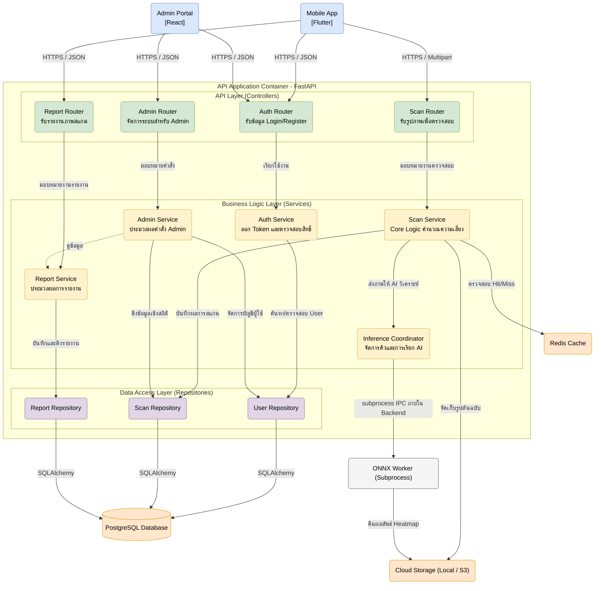

# C3: Component Diagram (API Application)

แผนภาพ C3 นี้นำเสนอโครงสร้างภายในของ **API Application Container (FastAPI)** ซึ่งเป็นศูนย์กลาง (Orchestrator) ของระบบ Scam Image Detection โดยแสดงให้เห็นถึงการแบ่งเลเยอร์ภายใน

---

## คำอธิบายองค์ประกอบภายใน (Component Details)

สถาปัตยกรรมภายในของ Backend ยึดหลักการ **Layered Architecture** เพื่อแยกส่วนหน้าที่ (Separation of Concerns) ทำให้โค้ดอ่านง่าย ทดสอบง่าย (Testable) และดูแลรักษาง่าย โดยแบ่งเป็น 3 เลเยอร์หลัก:

### 1. API Layer (Controllers)
ทำหน้าที่เป็นด่านหน้าในการรับ HTTP Request, ตรวจสอบความถูกต้องของข้อมูลเบื้องต้นผ่าน Schemas และส่งต่องานไปยัง Service ที่เกี่ยวข้อง
- **Auth Router:** จัดการ Endpoint สำหรับ Login และ Register
- **Scan Router:** รับไฟล์รูปภาพแบบ Multipart Form Data สำหรับตรวจสอบสแกม
- **Report Router:** รับแจ้งรูปภาพหลอกลวงจากผู้ใช้ (Crowdsourcing)
- **Admin Router:** เปิด Endpoint ให้นักวิจัยและ Admin จัดการข้อมูลโมเดลและระบบ

### 2. Business Logic Layer (Services)
เป็นหัวใจหลักของแอปพลิเคชัน ทำหน้าที่ประมวลผลตามกฎทางธุรกิจ
- **Scan Service:** ควบคุมขั้นตอนการตรวจสอบภาพทั้งหมด เริ่มตั้งแต่เช็ค Cache, สกัด EXIF (แสดงผลเท่านั้น ไม่ร่วมคำนวณ), และคำนวณ **Overall Risk Score** ตามสูตร Hybrid Worst-Case
- **Inference Coordinator:** ตัวประสานงานระหว่าง Backend กับ AI Model ทำหน้าที่จัดคิวรูปภาพและส่งคำสั่งข้าม Process ไปให้ Worker
- **Auth Service:** จัดการการเข้ารหัสผ่าน (Hashing) และออก JWT Token 

### 3. Data Access Layer (Repositories)
ทำหน้าที่ติดต่อกับฐานข้อมูลหลัก ช่วยให้ Business Logic Layer ไม่ต้องเขียนคำสั่ง SQL 
- **User Repository:** Query ข้อมูลบัญชีและสิทธิ์ของผู้ใช้งาน
- **Scan Repository:** บันทึกและดึงประวัติ Risk Score ของแต่ละรูปภาพ
- **Report Repository:** บันทึกข้อมูลที่ผู้ใช้แจ้งเข้ามาว่ารูปไหนเป็นสแกมของจริง

### การทำงานร่วมกับ AI (ONNX Worker)
โมเดล AI ถูกออกแบบให้ทำงานแยกส่วนจาก Web Server หลัก โดยรันผ่าน subprocess เพื่อแยกภาระงานประมวลผลที่กินทรัพยากรสูงออกจากงานหลักของ FastAPI ทำให้ API ยังคงสามารถตอบสนอง Request อื่นๆ ได้อย่างรวดเร็วและไม่สะดุด
