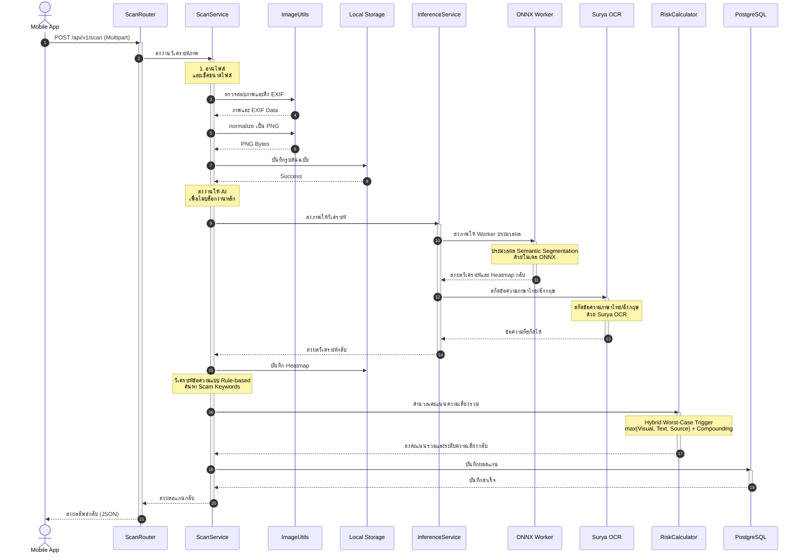

# C4: Code Diagram (Image Scanning Flow)

แผนภาพ C4 (ระดับ Code) นี้แสดงลำดับขั้นตอนการทำงานเชิงลึกของกระบวนการวิเคราะห์รูปภาพ (Image Scanning) ภายใน Backend ของระบบ Scam Image Detection ซึ่งครอบคลุมตั้งแต่การรับ Request จากผู้ใช้ ไปจนถึงการจัดเก็บผลลัพธ์ลงฐานข้อมูล

---

## คำอธิบายองค์ประกอบที่เกี่ยวข้อง

แผนภาพนี้เจาะลึกการทำงานหลักของ ScanService ซึ่งแสดงให้เห็นถึงการทำงานแบบ Non-blocking (Asynchronous) และวิธีการที่ Backend สื่อสารกับ AI

### 1. API Layer (ScanRouter)
*   **หน้าที่:** ตรวจสอบสิทธิ์ผู้ใช้งาน และรับไฟล์รูปแบบ Multipart Form Data จากนั้นส่งต่อให้ Service ประมวลผล

### 2. Business Logic Layer (ScanService)
*   **หน้าที่:**
    1.  ตรวจสอบความปลอดภัยของไฟล์ (ขนาดไฟล์ และการแปลงเป็นภาพ Lossless PNG)
    2.  สร้าง Hash จากไฟล์ต้นฉบับเพื่อใช้ตั้งชื่อไฟล์
    3.  เรียกงานประมวลผลหนัก เช่น AI และ Image Processing แบบไม่บล็อกงานหลักของ FastAPI
    4.  วิเคราะห์คำหลอกลวงเบื้องต้นจากผลลัพธ์ OCR
    5.  บันทึกผลสู่ฐานข้อมูล

### 3. AI Integration Layer (InferenceService)
*   **หน้าที่:** ทำงานประสาน AI โมเดลทั้ง 2 ตัว
    *   **ONNX Worker (SegFormer):** ออกแบบให้รันใน subprocess แยกต่างหาก เพื่อแยกการจัดการทรัพยากรและหน่วยความจำของฝั่ง AI ออกจาก Web Server หลัก
    *   **Surya OCR:** โมเดลจะถูกเตรียมพร้อมไว้ในหน่วยความจำหลักตั้งแต่ระบบเริ่มทำงาน เพื่อให้สามารถประมวลผลข้อความจากรูปภาพได้ทันทีโดยไม่ต้องเสียเวลาโหลดโมเดลใหม่ ช่วยลดความหน่วงในการตอบสนอง

### 4. Utility and Calculation
*   **คลาส/โมดูล:** RiskCalculator
*   **หน้าที่:** รับค่าตัวเลขคะแนนดิบเข้าไปคำนวณตามหลัก Worst-Case Trigger ร่วมกับ Multi-factor Compounding และส่งค่าความเสี่ยงรวม ระดับ ปัจจัยหลัก และ Breakdown แยกมิติกลับมา
