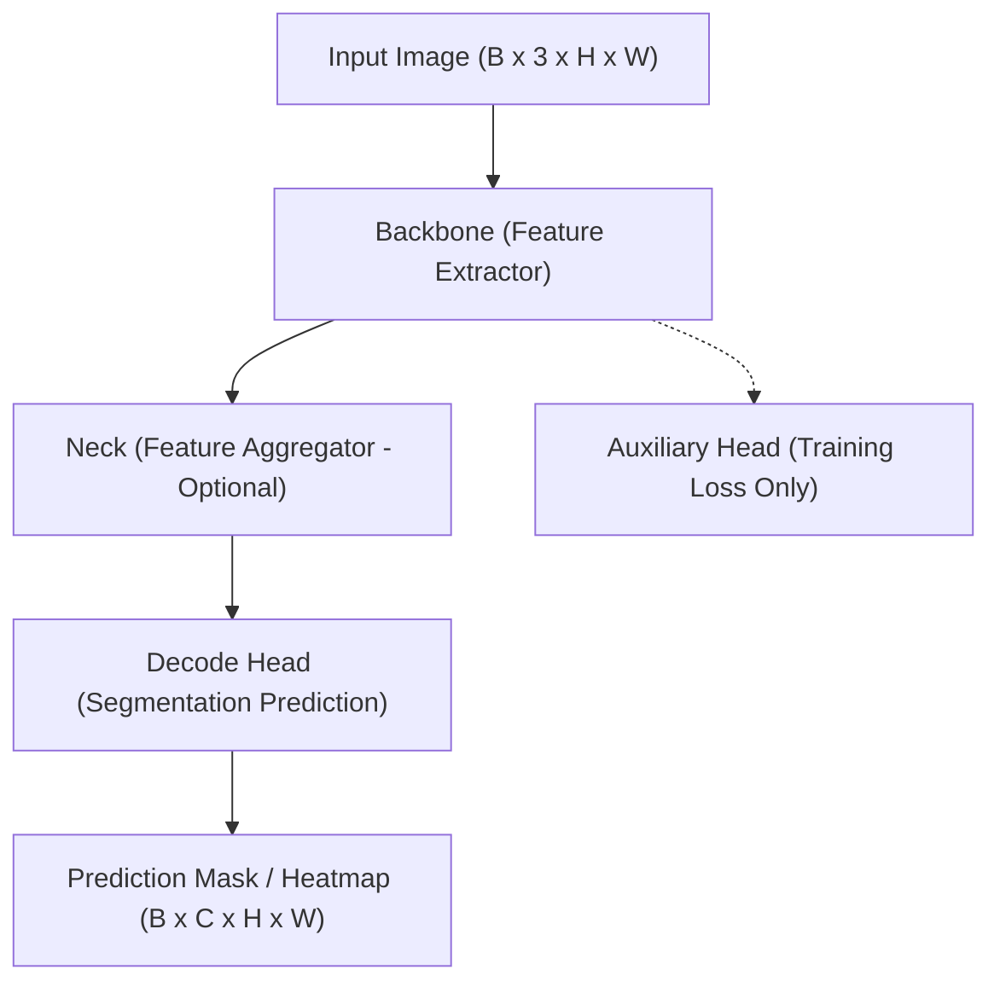

# MMSegmentation Framework และสถาปัตยกรรมแบบโมดูลาร์

เฟรมเวิร์กโอเพนซอร์สบน PyTorch สำหรับงาน Semantic Segmentation ที่ใช้ในการพัฒนา ฝึกสอน และส่งออกโมเดล SegFormer ในระบบ ScamGuard

---

## 1. ภาพรวมของ MMSegmentation

**MMSegmentation** เป็นส่วนหนึ่งของโครงการ OpenMMLab ที่รวบรวมอัลกอริทึมและสถาปัตยกรรมเครือข่ายประสาทเทียมชั้นนำสำหรับงานวิเคราะห์และแบ่งส่วนรูปภาพระดับพิกเซล (Pixel-level Semantic Segmentation) โครงสร้างของเฟรมเวิร์กถูกออกแบบให้เป็นโมดูลาร์ (Modular Architecture) ช่วยให้นักวิจัยและวิศวกร AI สามารถสลับ ปรับเปลี่ยน หรือผสมผสานชิ้นส่วนของโมเดลได้อย่างอิสระโดยไม่ต้องเขียนโค้ดโครงสร้างใหม่ทั้งหมด

---

## 2. โครงสร้างสถาปัตยกรรมแบบโมดูลาร์ (Modular Decomposition)

MMSegmentation แบ่งส่วนประกอบภายในของโมเดลออกเป็น 4 ชั้นหลัก:

1. **Backbone (ส่วนสกัดลักษณะเด่น):** ทำหน้าที่รับภาพนำเข้าและสร้าง Feature Maps หลายระดับความละเอียด (Multi-scale Feature Maps) ในระบบ ScamGuard ใช้ **Mix Vision Transformer (MiT-B0 ถึง MiT-B2)**
2. **Neck (ส่วนเชื่อมประสานลักษณะเด่น):** ทำหน้าที่รวมลักษณะเด่นจากหลายชั้นความลึกของ Backbone เข้าด้วยกัน เช่น Feature Pyramid Network (FPN) เพื่อรวบรวมทั้งรายละเอียดระดับต่ำ (Low-level Details) และความหมายเชิงลึก (High-level Semantics)
3. **Decode Head (ส่วนถอดรหัสและทำนายผล):** ส่วนปลายที่รับ Feature Maps ที่รวมแล้วมาแปลงเป็นหน้ากากการทำนายความน่าจะเป็นของแต่ละพิกเซล (Class Probability Mask) เช่น **SegformerHead** ที่ใช้ All-MLP Decoder น้ำหนักเบา
4. **Auxiliary Head (ส่วนเสริมการเรียนรู้):** ชั้นประมวลผลเสริมที่ใช้เฉพาะช่วงการฝึกสอน (Training Phase) เพื่อช่วยส่งผ่าน Gradient ลึกลงไปยังชั้นต้นๆ ของ Backbone ผ่าน Auxiliary Loss ลดปัญหา Vanishing Gradient

---

## 3. กลุ่มอัลกอริทึมและวิวัฒนาการใน MMSegmentation

| กลุ่มอัลกอริทึม | โมเดลตัวอย่าง | จุดเด่น | ข้อจำกัดสำหรับงานตรวจจับภาพตัดต่อ |
| :--- | :--- | :--- | :--- |
| **CNN-based** | FCN, PSPNet, DeepLabV3+ | ประมวลผลแบบ Local Receptive Field มีความคงทนต่อการเลื่อนตำแหน่ง (Translation Invariance) | ขาดความสามารถในการจับความสัมพันธ์ระยะไกล (Long-range Context) ทำให้พลาดร่องรอยการผสมผสานแสงเงาที่ไม่สอดคล้องกันข้ามบริเวณ |
| **Transformer-based** | SegFormer, Swin Transformer, MaskFormer | ใช้กลไก Self-Attention เพื่อจับความสัมพันธ์ของบริบททั่วทั้งภาพพร้อมกันในทุกระดับความละเอียด | ต้องการการจัดเตรียมข้อมูลและการคำนวณที่เหมาะสม ซึ่งแก้ไขได้ด้วย Overlapping Tiling Inference |

---

## 4. การประยุกต์ใช้ในระบบ ScamGuard

ในระบบ ScamGuard ได้เลือกใช้ MMSegmentation ในการเทรนโมเดล SegFormer ดังนี้:

- **การแก้ปัญหา Class Imbalance:** บริเวณที่ถูกตัดต่อ มักมีสัดส่วนพื้นที่น้อยมากเมื่อเทียบกับพื้นที่ภาพทั้งหมด ระบบจึงกำหนด Loss Function แบบผสมผสานระหว่าง Cross-Entropy Loss และ Dice Loss:
  $$\mathcal{L}_{total} = \alpha \mathcal{L}_{CE} + \beta \mathcal{L}_{Dice}$$
- **การส่งออกไปยัง ONNX Runtime:** โมเดลที่เทรนเสร็จสมบูรณ์จาก MMSegmentation จะถูกส่งออกเป็นไฟล์ `.onnx` ผ่านสคริปต์ `pytorch2onnx` เพื่อนำไปโหลดใช้งานในสภาพแวดล้อมจริง (Inference Engine) บน FastAPI Backend ทำให้สามารถทำนายผลได้รวดเร็วโดยไม่ต้องพึ่งพา PyTorch Runtime ตัวเต็ม

---

## 5. ประเด็นสำคัญ

- MMSegmentation ช่วยให้การทดลองเปรียบเทียบสถาปัตยกรรม (เช่น ResNet vs MiT) ทำได้บนมาตรฐานเดียวกัน
- โครงสร้าง All-MLP Decoder ของ SegFormer บน MMSegmentation ให้ความเร็วในการทำนายระดับมิลลิวินาที
- การฝึกสอนโมเดลรองรับการจำลองภาพตัดต่อ (Copy-Move, Splicing, Inpainting, AI-Gen artifacts) หลากหลายรูปแบบ

---

## หน้าที่เกี่ยวข้อง

- [[concepts/ai-model-segformer|โมเดล AI — SegFormer]]
- [[concepts/semantic-segmentation|การแบ่งส่วนภาพเชิงความหมาย (Semantic Segmentation)]]
- [[concepts/model-training|การออกแบบระบบฝึกสอนโมเดล (Model Training Design)]]
- [[architecture/ai-inference-service|AI Inference Service]]
