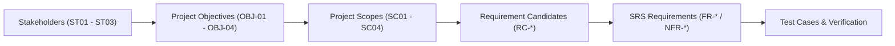

# เมทริกซ์การสืบย้อนความต้องการ (Requirement Traceability Matrix - RTM)

เอกสารตารางการสืบย้อนความต้องการแบบสองทิศทาง (Bidirectional Traceability) เพื่อตรวจสอบความครบถ้วนของระบบตั้งแต่เป้าหมายผู้มีส่วนได้ส่วนเสีย ขอบเขต ข้อกำหนดฟังก์ชัน ไปจนถึงการทดสอบระบบ

---

## 1. ห่วงโซ่การสืบย้อนความต้องการ (Traceability Chain)

ระบบ ScamGuard ใช้กระบวนการวิศวกรรมความต้องการที่เป็นไปตามมาตรฐานสากล โดยเชื่อมโยงข้อกำหนดในแต่ละระดับชั้นเข้าด้วยกัน:

- **Stakeholder (ST):** ผู้มีส่วนได้ส่วนเสียที่กำหนดคุณค่าของระบบ
- **Objective (OBJ):** วัตถุประสงค์เชิงกลยุทธ์ของโครงงาน
- **Scope (SC):** ขอบเขตของระบบที่ตกลงส่งมอบ
- **Requirement Candidate (RC):** ข้อกำหนดเบื้องต้นที่รวบรวมได้จากหลักฐาน
- **Functional / Non-Functional Requirements (FR/NFR):** ข้อกำหนดความต้องการทางซอฟต์แวร์ฉบับสมบูรณ์พร้อม Acceptance Criteria
- **Test Cases (TC):** กรณีทดสอบสำหรับยืนยันความถูกต้องของระบบ

---

## 2. กลุ่มผู้มีส่วนได้ส่วนเสีย (Stakeholders)

| รหัส | ผู้มีส่วนได้ส่วนเสีย | ความต้องการหลัก | วัตถุประสงค์ที่เกี่ยวข้อง |
| :--- | :--- | :--- | :--- |
| **ST01** | ผู้ใช้งานทั่วไป (General Users) | ต้องการเครื่องมือที่ใช้งานง่ายบนมือถือ สามารถตรวจสอบภาพต้องสงสัยได้อย่างรวดเร็วและเข้าใจผลการวิเคราะห์ได้ทันที | [[requirements/objectives-kpis#OBJ-01\|OBJ-01]], [[requirements/objectives-kpis#OBJ-03\|OBJ-03]], [[requirements/objectives-kpis#OBJ-04\|OBJ-04]] |
| **ST02** | ผู้ดูแลระบบและนักวิจัย (Admins / Researchers) | ต้องการระบบควบคุมหลังบ้าน จัดการรายงาน Scam คัดเลือก Dataset และควบคุมการ Deploy โมเดล AI | [[requirements/objectives-kpis#OBJ-02\|OBJ-02]], [[requirements/objectives-kpis#OBJ-03\|OBJ-03]], [[requirements/objectives-kpis#OBJ-04\|OBJ-04]] |
| **ST03** | อาจารย์ที่ปรึกษาและคณะกรรมการ (Advisors & Committee) | ต้องการระบบที่มีความถูกต้องตามหลักวิศวกรรมซอฟต์แวร์ มีกระบวนการทดสอบที่รัดกุม และปฏิบัติตามกฎหมาย PDPA | ทุกวัตถุประสงค์ (OBJ-01 ถึง OBJ-04) |

---

## 3. ตารางเมทริกซ์การสืบย้อนความต้องการ (Requirement Traceability Matrix)

| ลำดับ | ST | OBJ | SC | รหัสความต้องการเบื้องต้น (RC) | รหัสข้อกำหนด (FR / NFR) | NFR ที่เกี่ยวข้อง | ลำดับความสำคัญ | สรุปพฤติกรรมของระบบ |
| :--- | :--- | :--- | :--- | :--- | :--- | :--- | :--- | :--- |
| 1 | ST01 | OBJ-01 | SC01 | RC-AUTH-01 | FR-AUTH-01 | NFR-04 | Must | สมัครด้วย Email/Password พร้อม consent ใน register body |
| 2 | ST01 | OBJ-01 | SC01 | RC-AUTH-02 | FR-AUTH-02 | NFR-04 | Must | เข้าสู่ระบบและรับ JWT |
| 3 | ST01 | OBJ-01 | SC01 | RC-AUTH-03 | FR-AUTH-03 | NFR-04 | Must | ต่ออายุ Access Token ด้วย Refresh Token |
| 4 | ST01 | OBJ-01 | SC01 | RC-AUTH-04 | FR-AUTH-04 | NFR-04 | Must | ออกจากระบบและล้าง session ฝั่ง Mobile |
| 5 | ST01 | OBJ-01 | SC01 | RC-SCAN-01/02 | FR-SCAN-01 | NFR-08 | Must | เลือกและครอบตัดรูปจาก Gallery |
| 6 | ST01 | OBJ-01 | SC01, SC02 | RC-SCAN-03/04 | FR-SCAN-02 | NFR-04, NFR-08 | Must | ตรวจไฟล์และอัปโหลดที่ `POST /api/v1/scan/` |
| 7 | ST01 | OBJ-03, OBJ-04 | SC02 | RC-SCAN-05 | FR-SCAN-03 | NFR-01, NFR-07 | Must | ตรวจ SHA-256/Redis และประมวลผลเมื่อ cache miss |
| 8 | ST01, ST02 | OBJ-03 | SC02 | RC-ANALYSIS-01 | FR-ANALYSIS-01 | NFR-05 | Must | OCR + keyword matching สร้าง Textual Score |
| 9 | ST01, ST02, ST03 | OBJ-02 | SC03 | RC-ANALYSIS-02/03/04 | FR-ANALYSIS-02 | NFR-05 | Must | SegFormer/ONNX สร้าง Visual Score และ AI-generated probability |
| 10 | ST01 | OBJ-03 | SC02 | RC-ANALYSIS-05 | FR-ANALYSIS-03 | NFR-01 | Must | Reverse Image Search พร้อม fallback ที่ไม่สรุปว่าปลอดภัย |
| 11 | ST01 | OBJ-03 | SC02 | RC-ANALYSIS-07/08 | FR-ANALYSIS-04 | NFR-01 | Must | Hybrid max+bonus จาก Visual/Textual/Source; EXIF ไม่ร่วมคำนวณ |
| 12 | ST01, ST03 | OBJ-02, OBJ-04 | SC01, SC03 | RC-XAI-01/02/03 | FR-XAI-01 | NFR-05, NFR-06 | Must | Mask-to-Heatmap, toggle/opacity และคำอธิบาย XAI |
| 13 | ST01 | OBJ-04 | SC01 | RC-HISTORY-01/02/03/04 | FR-HISTORY-01 | NFR-04 | Must | ดูและลบประวัติการสแกนของตน |
| 14 | ST01, ST02 | OBJ-04 | SC01, SC04 | RC-HISTORY-05 | FR-HISTORY-02 | NFR-04 | Must | ส่ง Scam Report ไปยังคิว Admin |
| 15 | ST01, ST03 | OBJ-04 | SC01, SC02 | RC-PDPA-01/02/03 | FR-PDPA-01 | NFR-04 | Must | บันทึกและถอน consent ตาม PDPA |
| 16 | ST02 | OBJ-04 | SC04 | RC-ADMIN-01/02/06 | FR-ADMIN-01 | NFR-03, NFR-04 | Must | Dashboard และ User Management |
| 17 | ST02 | OBJ-04 | SC04 | RC-ADMIN-03 | FR-ADMIN-02 | NFR-04 | Must | Report Queue Moderation |
| 18 | ST02 | OBJ-02, OBJ-04 | SC03, SC04 | RC-ADMIN-04 | FR-ADMIN-03 | NFR-09 | Must | Model Management และ deploy/dry-run |
| 19 | ST02, ST03 | OBJ-04 | SC04 | RC-ADMIN-05 | FR-ADMIN-04 | NFR-04 | Must | Audit Log append-only |

---

## 4. ข้อสังเกตความสอดคล้องทางวิศวกรรม (Engineering Consistency Note)

ระบบใช้เกณฑ์ความเสี่ยง 3 ระดับตาม Document FR-ANALYSIS-04 (ดูนิยามที่ Document ที่เดียว)

---

## 5. ประเด็นสำคัญ

- RTM ช่วยรับประกันว่าทุกฟีเจอร์ใน Mobile App, Backend API, AI Model และ Admin Portal ล้วนตอบสนองต่อเป้าหมายของผู้มีส่วนได้ส่วนเสียโดยตรง
- RTM ฉบับนี้ครอบคลุม ST→OBJ→SC→RC→FR/NFR หลัก; TC mapping และ orphan-scan อัตโนมัติอยู่ระหว่างเติมให้ครบก่อน baseline (ยังไม่ประกาศ No Scope Creep)
- ทุกข้อกำหนดมีชุดการทดสอบรองรับทั้งในระดับ Unit Test, Integration Test และ System E2E Test

---

## หน้าที่เกี่ยวข้อง

- [[requirements/objectives-kpis|วัตถุประสงค์และ KPI ของโครงการ]]
- [[requirements/functional-requirements|ข้อกำหนดความต้องการเชิงฟังก์ชัน (Functional Requirements)]]
- [[requirements/non-functional-requirements|ข้อกำหนดความต้องการที่ไม่ใช่ฟังก์ชัน (Non-Functional Requirements)]]
- [[requirements/srs|Software Requirements Specification (SRS)]]
- [[planning/project-scope|ขอบเขตโครงการ (Project Scope)]]
