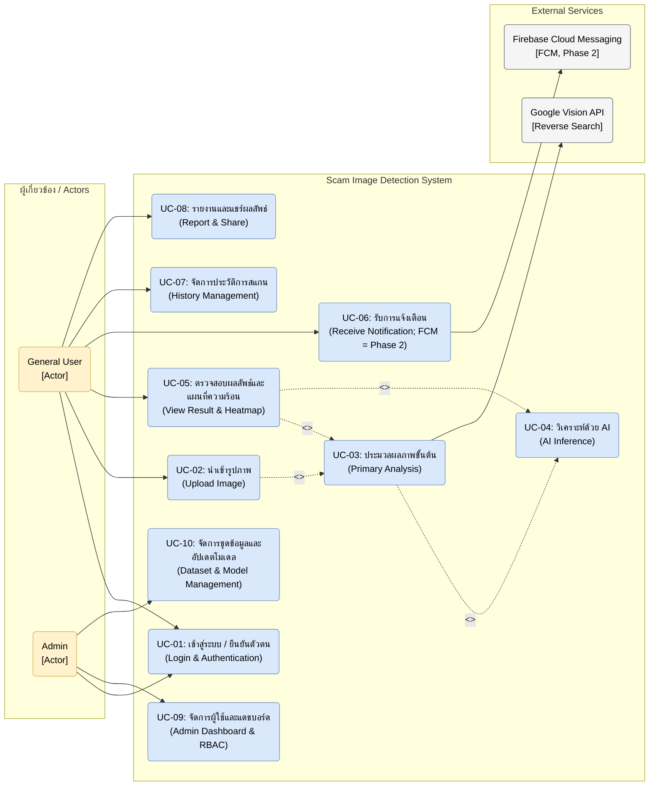

# Use Case Diagram

---

### คำอธิบายรายละเอียดกรณีการใช้งาน (Use Case Details)

* **UC-01: เข้าสู่ระบบ / ยืนยันตัวตน (Login & Authentication):**
  * **ผู้เกี่ยวข้อง (Actors):** General User, Admin
  * **รายละเอียด:** กระบวนการยืนยันตัวตนเพื่อรักษาความปลอดภัยก่อนเข้าใช้งานระบบ โดยเข้าผ่าน Email/Password + JWT เพื่อทำการตรวจสอบและกำหนดสิทธิ์การดูข้อมูลตามบทบาท (Role-Based Access Control; Social Login / Google OAuth = Phase 2 deferred)
  * **ความต้องการทางระบบ (FR):** FR-01 - ระบบเข้าสู่ระบบและยืนยันตัวตน (Authentication): ผู้ใช้และผู้ดูแลระบบเข้าสู่ระบบด้วย Email/Password + JWT (Social Login = Phase 2 deferred)

* **UC-02: นำเข้ารูปภาพ (Upload Image):**
  * **ผู้เกี่ยวข้อง (Actors):** General User
  * **รายละเอียด:** ผู้ใช้งานสามารถอัปโหลดภาพที่ต้องการตรวจสอบ เช่น สลิปโอนเงิน หรือรูปโปรไฟล์บุคคลอื่น โดยเลือกรูปที่มีอยู่แล้วในคลังรูปภาพของอุปกรณ์เคลื่อนที่
  * **ความต้องการทางระบบ (FR):** FR-02 - ระบบนำเข้ารูปภาพ (Image Input): ผู้ใช้เลือกรูปจากคลังภาพ แล้วอัปโหลดไฟล์ภาพเข้าสู่ระบบ

* **UC-03: ประมวลผลภาพขั้นต้น (Primary Analysis):**
  * **ผู้เกี่ยวข้อง (Actors):** General User (ผ่าน <<include>> จาก UC-02)
  * **รายละเอียด:** การดึงข้อมูลเมทาดาตา (Metadata/EXIF) ของภาพ, การสกัดตัวอักษรด้วยเทคนิค OCR เพื่อวิเคราะห์ Keyword อันตรายร่วมกับเทคนิค NLP และการส่งข้อมูลรูปภาพไปสืบค้นหาแหล่งที่มาดั้งเดิมด้วย Google Vision API
  * **ความต้องการทางระบบ (FR):** FR-03 - ระบบวิเคราะห์ข้อมูลชั้นต้น (Primary Analysis): ระบบสามารถดึงข้อมูลแฝง (Metadata/EXIF), สกัดข้อความในภาพ (OCR), และค้นหาแหล่งที่มาของภาพ (Reverse Image Search) ได้โดยอัตโนมัติ

* **UC-04: วิเคราะห์ด้วย AI (AI Inference):**
  * **ผู้เกี่ยวข้อง (Actors):** General User (ผ่าน <<include>> จาก UC-03)
  * **รายละเอียด:** ส่งรูปภาพเพื่อนำเข้าโมเดลปัญญาประดิษฐ์เชิงลึก (Deep Learning) ในการตรวจสอบการแก้ไขระดับพิกเซล (Semantic Segmentation) เพื่อหาร่องรอยการตัดต่อ (Image Forgery) และตรวจสอบลักษณะว่าภาพถูกสังเคราะห์ด้วย Generative AI หรือไม่
  * **ความต้องการทางระบบ (FR):** FR-04 - ระบบวิเคราะห์ด้วยปัญญาประดิษฐ์ (AI Inference): ระบบส่งภาพเข้าสู่โมเดล Deep Learning เพื่อตรวจสอบร่องรอยการตัดต่อ (Image Forgery/Semantic Segmentation) และตรวจสอบภาพที่สร้างด้วยปัญญาประดิษฐ์ (AI-Generated)

* **UC-05: ตรวจสอบผลลัพธ์และแผนที่ความร้อน (View Result & Heatmap):**
  * **ผู้เกี่ยวข้อง (Actors):** General User
  * **รายละเอียด:** หน้าจอแสดงค่าคะแนนความเสี่ยงรวม (Overall Risk Score) พร้อมแสดงผลสรุปเหตุผลความผิดปกติ และแสดงแผนที่ความร้อน (Heatmap) บนจุดที่น่าสงสัยของภาพ เพื่อตอบโจทย์ความโปร่งใสของปัญญาประดิษฐ์ (XAI)
  * **ความต้องการทางระบบ (FR):** FR-05 - ระบบแสดงผลลัพธ์ (Result & Visualization): ระบบคำนวณคะแนนความเสี่ยงรวม (Overall Risk Score) และสร้างแผนที่ความร้อน (Heatmap) เพื่ออธิบายผลลัพธ์ให้ผู้ใช้เข้าใจ

* **UC-06: รับการแจ้งเตือน (Receive Notification; FCM = Phase 2):**
  * **ผู้เกี่ยวข้อง (Actors):** General User
  * **รายละเอียด:** การรับการแจ้งเตือนแบบ in-app/polling ภายใน 60 วินาทีเมื่อระบบตรวจสอบวิเคราะห์รูปภาพบนเซิร์ฟเวอร์เบื้องหลัง (Background Task) เสร็จสิ้นสมบูรณ์ (FCM push = Phase 2)
  * **ความต้องการทางระบบ (FR):** FR-06 - ระบบแจ้งเตือน: v1 ใช้ polling + in-app notification ภายใน 60 วินาทีหลังงานเบื้องหลังเสร็จ (FCM push = Phase 2)

* **UC-07: จัดการประวัติการสแกน (History Management):**
  * **ผู้เกี่ยวข้อง (Actors):** General User
  * **รายละเอียด:** ผู้ใช้งานทั่วไปสามารถเรียกดูประวัติรูปภาพและผลคะแนนความเสี่ยงย้อนหลังที่เคยส่งตรวจสอบ เพื่อเก็บบันทึกข้อมูลหรือเรียกดูใหม่ และผู้ใช้สามารถกดลบข้อมูลการสแกนประวัติตนเองได้ตามนโยบาย PDPA
  * **ความต้องการทางระบบ (FR):** FR-07 - ระบบจัดการประวัติการสแกน (History Management): ระบบบันทึกประวัติการตรวจสอบภาพของผู้ใช้โดยสามารถเรียกดูผลลัพธ์ย้อนหลัง หรือลบประวัติได้

* **UC-08: รายงานและแชร์ผลลัพธ์ (Report & Share):**
  * **ผู้เกี่ยวข้อง (Actors):** General User
  * **รายละเอียด:** การกดรายงาน (Report) ส่งยืนยันภาพหลอกลวงเข้าคลังสแกมเมอร์ส่วนกลางเพื่อเป็นประโยชน์ในอนาคต และสามารถกดแชร์ภาพสรุปความเสี่ยงหรือคำเตือนภัยไปยังสื่อโซเชียลภายนอก (เช่น LINE) เพื่อเตือนภัยบุคคลใกล้ชิด
  * **ความต้องการทางระบบ (FR):** FR-08 - ระบบรายงานและแชร์ข้อมูล (Report & Share): ผู้ใช้สามารถกดรายงาน (Report) ภาพหลอกลวงเข้าสู่ฐานข้อมูลกลาง และสามารถแชร์ภาพผลลัพธ์/คำเตือนไปยังแอปพลิเคชันภายนอกได้

* **UC-09: จัดการผู้ใช้และแดชบอร์ด (Admin Dashboard & RBAC):**
  * **ผู้เกี่ยวข้อง (Actors):** Admin
  * **รายละเอียด:** แอดมินเข้าใช้งานหน้าเว็บแผงควบคุมระบบ (Admin Panel) เพื่อติดตามกราฟสถิติการใช้งาน, จัดการข้อมูลของผู้ใช้งาน (เปลี่ยนสถานะเท่านั้น ห้าม hard-delete), ตรวจสอบสิทธิ์การเข้าถึง และการอนุมัติจัดการรายงานต่าง ๆ
  * **ความต้องการทางระบบ (FR):** FR-09 - ระบบผู้ดูแลและการจัดการสิทธิ์ (Admin & RBAC): มีหน้าแดชบอร์ดให้ผู้ดูแลระบบตรวจสอบสถิติการใช้งาน, จัดการข้อมูลผู้ใช้, และกำหนดสิทธิ์การเข้าถึงระบบตามบทบาท

* **UC-10: จัดการชุดข้อมูลและอัปเดตโมเดล (Dataset & Model Management):**
  * **ผู้เกี่ยวข้อง (Actors):** Admin
  * **รายละเอียด:** แอดมินทำหน้าที่ตรวจสอบรูปภาพสแกมที่ผู้ใช้รายงาน ตรวจจัดหมวดหมู่เพื่อส่งเข้าชุดข้อมูล (Scam Dataset) สำหรับนำไปเทรนและวิเคราะห์เพิ่มเติม พร้อมทำการอัปโหลดไฟล์น้ำหนักโมเดล (Model Weights) เวอร์ชันใหม่ขึ้นระบบ
  * **ความต้องการทางระบบ (FR):** FR-10 - ระบบจัดการข้อมูลและโมเดล (Dataset & Model Management): ผู้ดูแลระบบสามารถตรวจสอบรูปภาพที่ถูกผู้ใช้รายงาน นำไปจัดหมวดหมู่ชุดข้อมูล และอัปโหลดโมเดล AI (Weights) เวอร์ชันใหม่เข้าสู่ระบบได้

### Exception flows (ทุก UC)
* ไฟล์ผิดชนิด/เกินขนาด (FR-02) → ปฏิเสธพร้อมข้อความ ไม่บีบอัดใน v1
* OCR/โมเดล/External ล้มเหลว → คืนผลบางส่วนพร้อม confidence + สถานะชัดเจน
* Reverse search/FCM ไม่พร้อม → แจ้ง "ไม่มีข้อมูล" (optional) ไม่สรุปว่าภาพปลอดภัย
* Token หมดอายุ/สิทธิ์ไม่พอ → 401 + ต่ออายุหรือล็อกอินใหม่; ตรวจ ownership เสมอ
