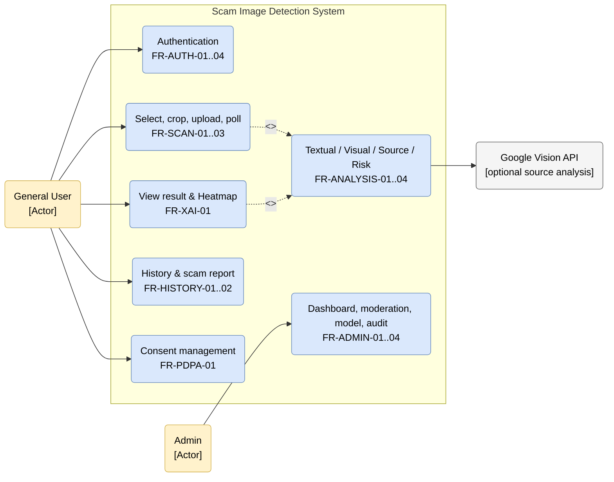

# Use Case Diagram

Use cases ผูกกับ canonical FR IDs จาก SRS โดยตรง

## คำอธิบาย Use Cases

| Use case | Actor | Canonical requirements | พฤติกรรมปัจจุบัน |
| :--- | :--- | :--- | :--- |
| Authentication | General User | FR-AUTH-01..04 | Email/Password + JWT; consent ส่งใน register body; code v1 ไม่มี OAuth |
| Select, crop, upload | General User | FR-SCAN-01..02 | Gallery, crop, `POST /api/v1/scan/` |
| Wait for result | General User | FR-SCAN-03 | Mobile poll `GET /api/v1/scan/{scan_id}` ทุก 3 วินาที; ไม่มี Mobile WebSocket client |
| Analyze image | System | FR-ANALYSIS-01..04 | Textual, Visual และ Source ร่วมคำนวณ; EXIF แสดงผลเท่านั้น |
| View explainable result | General User | FR-XAI-01 | Risk badge เขียว/amber/แดง, Breakdown 3 มิติ และ Heatmap |
| History & report | General User | FR-HISTORY-01..02 | ดู/ลบประวัติและส่ง Scam Report |
| Consent | General User | FR-PDPA-01 | บันทึก `system_consent`/`research_consent` ใน `consent_logs` |
| Admin operations | Admin | FR-ADMIN-01..04 | บัญชี `admins` แยกจาก `users`; Dashboard, Report Queue, Model, Audit |

## ประเด็นสำคัญ

- แผนภาพนี้ไม่ออก requirement IDs ใหม่
- FCM และ Social Login ไม่อยู่ใน implemented v1 use cases
- Admin authentication และ Mobile authentication ใช้คนละตาราง/คนละ session flow

## หน้าที่เกี่ยวข้อง

- [[requirements/functional-requirements]]
- [[requirements/traceability-matrix]]
- [[requirements/srs]]
- [[entities/actors]]
- [[architecture/mobile-app]]
- [[architecture/backend-api]]
