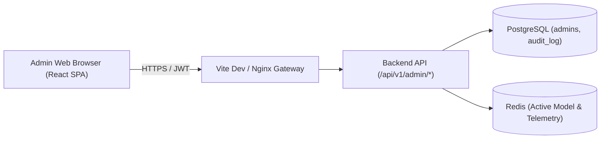

# สถาปัตยกรรมและการออกแบบ Admin Portal

เว็บคอนโซลสำหรับการบริหารจัดการระบบ ScamGuard แบบรวมศูนย์สำหรับผู้ดูแลระบบและนักวิจัย เพื่อควบคุมโมเดล AI ตรวจสอบรายงานการหลอกลวง และติดตามการทำงานของระบบแบบ Real-time

---

## 1. บทบาทและหน้าที่ในระบบ

Admin Portal เป็น 1 ใน 4 คอนเทนเนอร์หลักของระบบ ScamGuard (ตาม [[architecture/c2-container-diagram|C2 Container Diagram]]) ทำหน้าที่เป็นส่วนต่อประสานสำหรับ:
1. **ผู้ดูแลระบบ (Admin / Super Admin):** จัดการบัญชีผู้ใช้ ตรวจสอบ Audit Log และควบคุมความปลอดภัยของระบบ
2. **นักวิจัยและวิศวกร AI (AI Engineers / Researchers):** ควบคุมการปล่อยโมเดล AI (Model Deployment & Rollback) ตรวจสอบค่าเมตริก mIoU และอนุมัติรูปภาพ Scam เข้าสู่ Research Dataset

---

## 2. เทคโนโลยีและสถาปัตยกรรมฟรอนต์เอนด์

- **Framework:** React 18 (Single Page Application - SPA)
- **Build Tool:** Vite สำหรับการ Build และ Hot Module Replacement (HMR) ที่รวดเร็ว
- **Styling:** Vanilla CSS ร่วมกับ Design Tokens และ Utility Classes เพื่อความยืดหยุ่นสูง
- **State Management & Data Fetching:** React Hooks, Context API และ Axios สำหรับ HTTP Client
- **Real-time Telemetry:** Native WebSocket Client เชื่อมต่อกับ Backend WebSocket Endpoint (`/api/v1/ws/telemetry`)
- **Icons & Visuals:** Lucide React และ Recharts สำหรับแสดงกราฟสถิติ
- **Routing:** React Router DOM (v6) พร้อม Protected Route Guards

---

## 3. ระบบการออกแบบ (Design System & Accessibility)

Admin Portal ออกแบบภายใต้มาตรฐานความสามารถในการเข้าถึงระดับ WCAG AA โดยรองรับทั้ง Dark Mode และ Light Mode:

### 3.1 Color Palette

- **Theme Background:**
  - Dark Mode: Surface Dark (`#121826`), Surface Card (`#1E293B`), Surface Hover (`#334155`)
  - Light Mode: Neutral Background (`#F8FAFC`), Surface White (`#FFFFFF`), Border Light (`#E2E8F0`)
- **Brand & Interactive:**
  - Primary Indigo (`#4F46E5` / `#6366F1`) สำหรับปุ่มหลักและสเตตัสแอคทีฟ
  - Secondary Slate (`#64748B`) สำหรับข้อความรองและเส้นแบ่ง
- **Semantic Status (3-Level Risk Scale):**
  - Low Risk: สีเขียวมรกต (`#10B981` / `#059669`)
  - Medium Risk: สีเหลืองอำพัน (`#F59E0B` / `#D97706`)
  - High Risk: สีแดงกุหลาบ (`#EF4444` / `#DC2626`)

### 3.2 Typography & Spacing

- ฟอนต์หลัก: Sarabun และ Inter สำหรับเนื้อหาทั่วไป, JetBrains Mono สำหรับ Hash, IP Address และค่าทางเทคนิค
- Spacing Scale อิงตามระบบ 4px/8px Grid มาตรฐานเพื่อความสมดุลของข้อมูลบนหน้าจอขนาดใหญ่ (Desktop First: 1280px+)

---

## 4. หน้าจอหลักและโมดูลการทำงาน (Core Modules)

### 4.1 Dashboard & Real-time Telemetry
- แสดงผลสรุปสถิติสำคัญ (KPI Summary Cards): จำนวนการสแกนทั้งหมดวันนี้, อัตราส่วนภาพความเสี่ยงสูง, โมเดล AI ที่ทำงานอยู่ (Active Model)
- กราฟแนวโน้มการสแกนย้อนหลังและสัดส่วนระดับความเสี่ยง (Low / Medium / High)
- WebSocket Telemetry Widget แสดงสถานะเชื่อมต่อสดของ Backend Server, ค่าหน่วงเวลา (Latency) และคิวการประมวลผล

### 4.2 การจัดการโมเดล AI (AI Model Registry & Rollback)
- ตรวจสอบรายการโมเดล SegFormer ทั้งหมดในระบบ (`v1.0.0` ถึง `v1.0.4`) ดึงข้อมูลจากตาราง `model_versions`
- แสดงค่าเมตริกการทดสอบ: mIoU (Mean Intersection over Union), aAcc (All Accuracy), mAcc, mDice
- กลไกการ Deployment และ Rollback:
  - ตรวจสอบความสมบูรณ์ของไฟล์น้ำหนักโมเดล (`.onnx`) ก่อนเปลี่ยนสถานะ
  - รัน Dry-run Health Check เพื่อยืนยันว่า Subprocess Worker โหลดโมเดลได้สำเร็จ
  - ทำงานภายใต้ Database Row Locking (`SELECT FOR UPDATE`) เพื่อป้องกัน Race Condition
  - แสดงผลโมเดลที่ Active อยู่ลำดับแรกของตารางเสมอ

### 4.3 ตรวจสอบรายงานข้อร้องเรียน (Scam Reports Moderation)
- รายการแจ้งเตือนจากผู้ใช้ที่ระบุว่าภาพสแกนเป็นการหลอกลวงจริง
- หน้าตรวจสอบเปรียบเทียบแบบ Side-by-Side: รูปภาพต้นฉบับ, รูปภาพ Heatmap Overlay, สรุปข้อความ OCR และคะแนนความเสี่ยงแยกมิติ
- การตัดสินใจของผู้ดูแลระบบ:
  - **Approve (อนุมัติ):** ยืนยันว่าภาพเป็น Scam และบันทึกเข้าสู่คลัง Dataset เพื่อใช้ในการฝึกสอนโมเดลรอบถัดไป
  - **Reject (ปฏิเสธ):** ปัดตกรายงานหากพบว่าเป็นภาพปกติหรือไม่เข้าข่ายหลอกลวง

### 4.4 การจัดการผู้ใช้งานและสิทธิ์ (User & Consent Management)
- ตรวจสอบรายชื่อผู้ใช้งานทั่วไปและนักวิจัย
- การติดตามสถานะความยินยอมตาม พ.ร.บ. คุ้มครองข้อมูลส่วนบุคคล (PDPA): `consent_analysis` และ `consent_research`
- สิทธิ์การระงับการใช้งานชั่วคราว (Ban/Suspend) กรณีตรวจพบบัญชีที่ส่งคำขอผิดปกติ

### 4.5 บันทึกความปลอดภัยและการตรวจสอบ (Audit Logs)
- ตารางบันทึกการกระทำของผู้ดูแลระบบแบบ Append-only ที่ไม่สามารถแก้ไขหรือลบได้
- บันทึกข้อมูลสำคัญ: รหัสแอดมิน (`admin_id`), การกระทำ (`action`), รายละเอียด (`details`), IP Address และเวลา (`created_at`)
- ระบบค้นหาและตัวกรองตามช่วงเวลาและประเภทกิจกรรม

---

## 5. ความปลอดภัยและการเชื่อมต่อ (Security & Integration)

- **แยกการยืนยันตัวตนออกจากผู้ใช้ทั่วไป:** ผู้ดูแลระบบต้องลงชื่อเข้าใช้ผ่าน Endpoint `/api/v1/admin/auth/login` โดยตรวจสอบบัญชีและรหัสผ่านที่เข้ารหัส bcrypt กับตาราง `admins` โดยเฉพาะ
- **Role-Based Access Control (RBAC):** มีการแยกบทบาทระหว่าง `Admin` ทั่วไป และ `Super Admin` (ที่มีสิทธิ์สร้างแอดมินอื่นและจัดการโครงสร้างระบบ)
- **Reverse Proxy Protection:** ในโหมดพัฒนาและ Production มีการซ่อนเบื้องหลังผ่าน Proxy เพื่อควบคุม CORS และป้องกันการเปิดเผย Endpoint ภายใน

---

## 6. ประเด็นสำคัญ

- Admin Portal เป็นระบบควบคุมเบื้องหลังที่มีสิทธิ์สูง การดำเนินการทุกอย่างจึงถูกบันทึกเข้าสู่ตาราง `audit_log` เสมอ
- การเปลี่ยนโมเดล AI ผ่านหน้า Portal มีผลทันทีต่อการประมวลผลรูปภาพของผู้ใช้ Mobile ในการสแกนรอบถัดไป
- UI ปฏิบัติตามมาตรฐาน 3-Level Risk Scale (Low 0-39, Medium 40-69, High 70-100) สอดคล้องกับ Mobile App และ Backend

---

## หน้าที่เกี่ยวข้อง

- [[architecture/system-architecture|สถาปัตยกรรมระบบโดยรวม]]
- [[architecture/backend-api|Backend API — FastAPI Orchestrator]]
- [[architecture/database-schema|โครงสร้างฐานข้อมูลและการจัดเก็บข้อมูล]]
- [[architecture/database-er-diagram|แผนผังความสัมพันธ์ฐานข้อมูล (ER Diagram)]]
- [[concepts/ai-model-segformer|โมเดล AI — SegFormer]]
- [[runbook|คู่มือการรันระบบ (Runbook)]]
