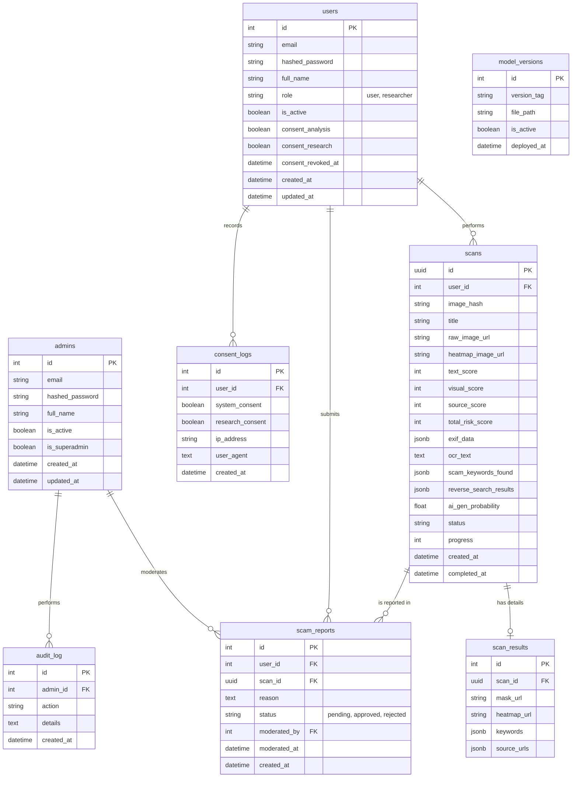

# ER Diagram for ScamGuard

แผนผังแสดงความสัมพันธ์ของฐานข้อมูลหลัก (PostgreSQL) ที่ออกแบบไว้สำหรับระบบ Scam Image Detection

## รายละเอียดแต่ละตาราง

- **users**: เก็บข้อมูลบัญชีผู้ใช้ทั่วไปและนักวิจัย พร้อมสถานะความยินยอม (Consent) และสิทธิ์การใช้งาน
- **admins**: เก็บข้อมูลบัญชีผู้ดูแลระบบ (Admin และ Super Admin) แยกออกจากผู้ใช้ทั่วไปเพื่อความปลอดภัย
- **scans**: เก็บข้อมูลสรุปของการสแกนรูปภาพ พร้อมคะแนนความเสี่ยง สถานะการประมวลผล (`progress`) และหัวข้อภาพ (`title`)
- **scan_results**: (ทางเลือก) เก็บข้อมูลรายละเอียดเพิ่มเติมในกรณีที่มีหลาย Layer ลึกๆ
- **scam_reports**: การรายงานภาพว่าเป็น Scam โดยผู้ใช้ สำหรับให้แอดมินใช้ตรวจสอบและอนุมัติเข้าชุดข้อมูล
- **consent_logs**: ใช้เก็บประวัติการยินยอมเพื่อทำ PDPA Compliance แบบตรวจสอบย้อนหลังได้ (Immutable)
- **model_versions**: ข้อมูลโมเดล AI ที่ Deploy แต่ละเวอร์ชัน พร้อมค่าเมตริกและการควบคุมการ Rollback
- **audit_log**: บันทึกกิจกรรมสำคัญที่กระทำโดย Admin (Append-only) เพื่อความโปร่งใสและตรวจสอบความปลอดภัย

---

## หน้าที่เกี่ยวข้อง

- [[architecture/database-schema|สคีมาฐานข้อมูล (Database Schema)]]
- [[architecture/database-migrations|การจัดการการย้ายฐานข้อมูล (Database Migrations)]]
- [[architecture/admin-portal|สถาปัตยกรรม Admin Portal]]
- [[architecture/backend-api|Backend API]]
