# ER Diagram for ScamGuard

แผนผังแสดงความสัมพันธ์ของฐานข้อมูลหลัก (PostgreSQL) ที่ออกแบบไว้สำหรับระบบ Scam Image Detection

> หมายเหตุ: constraints ตรงกับ `server/app/models/*.py` — ข้อความใน `"..."` ของแต่ละฟิลด์
> ระบุ nullable / default / unique / index / FK ondelete

```mermaid
erDiagram
    users {
        int id PK "index"
        string email "NOT NULL, unique, index"
        string hashed_password "NOT NULL"
        string full_name "nullable"
        string role "NOT NULL, default user; user, researcher, admin"
        boolean is_active "default True"
        datetime created_at "server_default now()"
        datetime updated_at "server_default now(), onupdate now()"
    }

    admins {
        int id PK "index"
        string email "NOT NULL, unique, index"
        string hashed_password "NOT NULL"
        string full_name "nullable"
        boolean is_active "default True"
        boolean is_superadmin "default False"
        datetime created_at "server_default now()"
        datetime updated_at "server_default now(), onupdate now()"
    }

    scans {
        uuid id PK "default uuid4"
        int user_id FK "nullable; FK users.id ON DELETE SET NULL; index"
        string image_hash "NOT NULL, SHA-256 String(64), index"
        string title "nullable"
        string raw_image_url "NOT NULL"
        string heatmap_image_url "nullable"
        int text_score "NOT NULL, default 0"
        int visual_score "NOT NULL, default 0"
        int source_score "NOT NULL, default 0"
        int total_risk_score "NOT NULL, default 0"
        jsonb exif_data "nullable"
        text ocr_text "nullable"
        jsonb scam_keywords_found "nullable"
        jsonb reverse_search_results "nullable"
        float ai_gen_probability "default 0.0"
        text xai_explanation "nullable"
        string status "NOT NULL, default pending"
        int progress "NOT NULL, default 0"
        datetime created_at "server_default now(), index"
        datetime completed_at "nullable"
    }

    scam_reports {
        int id PK
        int user_id FK "nullable; FK users.id ON DELETE SET NULL"
        uuid scan_id FK "nullable; FK scans.id ON DELETE SET NULL"
        string category "NOT NULL, default other, index"
        text reason "NOT NULL"
        string platform "nullable"
        string reference_url "nullable"
        boolean allow_research_use "NOT NULL, default False"
        string status "NOT NULL, default pending; pending, reviewing, approved, rejected; index"
        text admin_note "nullable"
        int moderated_by FK "nullable; FK admins.id (no ondelete)"
        datetime moderated_at "nullable"
        datetime created_at "server_default now(), index"
        int version "NOT NULL, default 1"
    }

    consent_logs {
        int id PK
        int user_id FK "NOT NULL; FK users.id ON DELETE CASCADE"
        boolean system_consent "NOT NULL, default True"
        boolean research_consent "NOT NULL, default False"
        string ip_address "nullable"
        text user_agent "nullable"
        datetime created_at "server_default now()"
    }

    model_versions {
        int id PK
        string version_tag "NOT NULL, unique"
        string file_path "NOT NULL"
        boolean is_active "NOT NULL, default False"
        datetime deployed_at "server_default now()"
        string artifact_checksum "nullable"
        string framework_compatibility "nullable, default onnx"
        float a_acc "nullable; เดิม accuracy (เปลี่ยนโดย 042de00eee1b)"
        float m_iou "nullable; เดิม precision (เปลี่ยนโดย 042de00eee1b)"
        float m_acc "nullable; เพิ่มโดย 042de00eee1b"
        float m_dice "nullable; เพิ่มโดย 042de00eee1b"
        string dataset_reference "nullable"
        int created_by FK "nullable; FK admins.id (no ondelete)"
        string status "NOT NULL, default inactive"
        jsonb deployment_history "nullable"
    }

    admin_sessions {
        string id PK "String(64)"
        int admin_id FK "NOT NULL; FK admins.id ON DELETE CASCADE; index"
        string refresh_hash "NOT NULL, unique, index"
        datetime expires_at "NOT NULL"
        datetime revoked_at "nullable, index"
        string replaced_by "nullable; ไม่มี FK (รหัส session ใหม่แบบ plain text)"
        string user_agent "nullable"
        string ip_address "nullable"
        datetime created_at "server_default now()"
        datetime last_used_at "nullable"
    }

    audit_log {
        int id PK
        int admin_id FK "nullable; FK admins.id ON DELETE SET NULL; index"
        string action "NOT NULL, index"
        string entity_type "nullable, index"
        string entity_id "nullable"
        jsonb before_state "nullable"
        jsonb after_state "nullable"
        text reason "nullable"
        string ip_address "nullable"
        text user_agent "nullable"
        string request_id "nullable"
        text details "nullable"
        datetime created_at "server_default now(), index"
    }

    export_jobs {
        uuid id PK "default uuid4"
        int admin_id FK "NOT NULL; FK admins.id (no ondelete)"
        string status "NOT NULL, default queued"
        float progress "NOT NULL, default 0.0"
        int total_rows "nullable"
        bigint file_size_bytes "nullable"
        string error_message "nullable"
        string file_path "nullable"
        jsonb manifest "nullable"
        jsonb filter_config "NOT NULL"
        datetime expires_at "nullable"
        datetime created_at "NOT NULL, server_default now()"
        datetime completed_at "nullable"
    }

    %% Relationships
    users ||--o{ scans : "performs"
    users ||--o{ scam_reports : "submits"
    users ||--o{ consent_logs : "records"
    admins ||--o{ scam_reports : "moderates"
    admins ||--o{ audit_log : "performs"
    admins ||--o{ admin_sessions : "has"
    admins ||--o{ model_versions : "deploys"
    admins ||--o{ export_jobs : "creates"

    scans ||--o{ scam_reports : "is reported in"
```

## รายละเอียดแต่ละตาราง

- **users**: เก็บข้อมูลบัญชีผู้ใช้ (role: user/researcher/admin); consent เก็บใน consent_logs
- **admins**: เก็บข้อมูลบัญชีผู้ดูแลระบบแยกตาราง (is_superadmin, default False)
- **scans**: เก็บข้อมูลสรุปของการสแกนรูปภาพ พร้อมคะแนนความเสี่ยง สถานะการประมวลผล หัวข้อภาพ และคำอธิบาย XAI (ระดับความเสี่ยงคำนวณตอนแสดงผล)
- **scam_reports**: การรายงานภาพว่าเป็น Scam โดยผู้ใช้ สำหรับให้แอดมินใช้ตรวจสอบและอนุมัติเข้าชุดข้อมูล
- **consent_logs**: ใช้เก็บประวัติการยินยอมเพื่อทำ PDPA Compliance แบบตรวจสอบย้อนหลังได้
- **model_versions**: ข้อมูลโมเดล AI ที่ Deploy แต่ละเวอร์ชัน พร้อม metrics และการควบคุม Rollback
- **admin_sessions**: session/refresh-token rotation ของ admin (replaced_by ไม่มี FK)
- **audit_log**: บันทึกกิจกรรมสำคัญที่กระทำโดย Admin (Append-only ผ่าน trigger `trg_prevent_audit_log_modification` ห้าม UPDATE/DELETE) เพื่อความโปร่งใสและตรวจสอบความปลอดภัย
- **export_jobs**: งาน export dataset ของ admin

## สรุป constraints (ตรงกับ `server/app/models/*.py`)

- **Unique**: users.email, admins.email, model_versions.version_tag, admin_sessions.refresh_hash
- **Index เพิ่มเติม (migration `8b428eff3721`)**: audit_log(action, admin_id, created_at, entity_type),
  scam_reports(category, status, created_at), scans(user_id, created_at)
- **ON DELETE**: consent_logs.user_id → CASCADE; scans.user_id → SET NULL;
  scam_reports.user_id/scan_id → SET NULL; audit_log.admin_id → SET NULL;
  admin_sessions.admin_id → CASCADE; export_jobs.admin_id, model_versions.created_by,
  scam_reports.moderated_by ไม่มี ondelete (NO ACTION)
- **ไม่มี FK**: admin_sessions.replaced_by เป็น String(64) ธรรมดา เก็บ id ของ session ใหม่ตอน rotation

---

## หน้าที่เกี่ยวข้อง

- [[architecture/database-schema|สคีมาฐานข้อมูล (Database Schema)]]
- [[architecture/database-migrations|การจัดการการย้ายฐานข้อมูล (Database Migrations)]]
- [[architecture/admin-portal|สถาปัตยกรรม Admin Portal]]
- [[architecture/backend-api|Backend API]]
