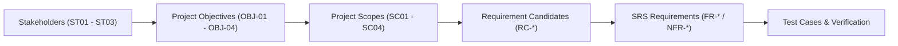

# เมทริกซ์การสืบย้อนความต้องการ (Requirement Traceability Matrix - RTM)

เอกสารตารางการสืบย้อนความต้องการแบบสองทิศทาง (Bidirectional Traceability) เพื่อตรวจสอบความครบถ้วนของระบบตั้งแต่เป้าหมายผู้มีส่วนได้ส่วนเสีย ขอบเขต ข้อกำหนดฟังก์ชัน ไปจนถึงการทดสอบระบบ

---

## 1. ห่วงโซ่การสืบย้อนความต้องการ (Traceability Chain)

ระบบ ScamGuard ใช้กระบวนการวิศวกรรมความต้องการที่เป็นไปตามมาตรฐานสากล โดยเชื่อมโยงข้อกำหนดในแต่ละระดับชั้นเข้าด้วยกัน:

- **Stakeholder (ST):** ผู้มีส่วนได้ส่วนเสียที่กำหนดคุณค่าของระบบ
- **Objective (OBJ):** วัตถุประสงค์เชิงกลยุทธ์ของโครงงาน
- **Scope (SC):** ขอบเขตของระบบที่ตกลงส่งมอบ
- **Requirement Candidate (RC):** ข้อกำหนดเบื้องต้นที่รวบรวมได้จากหลักฐาน
- **Functional / Non-Functional Requirements (FR/NFR):** ข้อกำหนดความต้องการทางซอฟต์แวร์ฉบับสมบูรณ์พร้อม Acceptance Criteria
- **Test Cases (TC):** กรณีทดสอบสำหรับยืนยันความถูกต้องของระบบ

---

## 2. กลุ่มผู้มีส่วนได้ส่วนเสีย (Stakeholders)

| รหัส | ผู้มีส่วนได้ส่วนเสีย | ความต้องการหลัก | วัตถุประสงค์ที่เกี่ยวข้อง |
| :--- | :--- | :--- | :--- |
| **ST01** | ผู้ใช้งานทั่วไป (General Users) | ต้องการเครื่องมือที่ใช้งานง่ายบนมือถือ สามารถตรวจสอบภาพต้องสงสัยได้อย่างรวดเร็วและเข้าใจผลการวิเคราะห์ได้ทันที | [[requirements/objectives-kpis#OBJ-01\|OBJ-01]], [[requirements/objectives-kpis#OBJ-03\|OBJ-03]], [[requirements/objectives-kpis#OBJ-04\|OBJ-04]] |
| **ST02** | ผู้ดูแลระบบและนักวิจัย (Admins / Researchers) | ต้องการระบบควบคุมหลังบ้าน จัดการรายงาน Scam คัดเลือก Dataset และควบคุมการ Deploy โมเดล AI | [[requirements/objectives-kpis#OBJ-02\|OBJ-02]], [[requirements/objectives-kpis#OBJ-03\|OBJ-03]], [[requirements/objectives-kpis#OBJ-04\|OBJ-04]] |
| **ST03** | อาจารย์ที่ปรึกษาและคณะกรรมการ (Advisors & Committee) | ต้องการระบบที่มีความถูกต้องตามหลักวิศวกรรมซอฟต์แวร์ มีกระบวนการทดสอบที่รัดกุม และปฏิบัติตามกฎหมาย PDPA | ทุกวัตถุประสงค์ (OBJ-01 ถึง OBJ-04) |

---

## 3. ตารางเมทริกซ์การสืบย้อนความต้องการ (Requirement Traceability Matrix)

| ลำดับ | ST | OBJ | SC | รหัสความต้องการเบื้องต้น (RC) | รหัสข้อกำหนด (FR / NFR) | NFR ที่เกี่ยวข้อง | ลำดับความสำคัญ | สรุปพฤติกรรมของระบบ |

> [!NOTE] Canonical RC/FR/NFR catalog อยู่ที่ `Document/docs/05_Software_Requirement_Specification.md` / `06_Requirement_Traceability.md` (RC-ADMIN-03 = Report Queue → FR-ADMIN-02, RC-ADMIN-04 = Model Management → FR-ADMIN-03, RC-ADMIN-05 = Audit Logs → FR-ADMIN-04, RC-SCAN-05 = Cache → FR-SCAN-03, RC-ANALYSIS-01 = Textual → FR-ANALYSIS-01, RC-ANALYSIS-02/03/04 = Visual → FR-ANALYSIS-02, RC-ANALYSIS-07/08 = Risk calc/grade → FR-ANALYSIS-04, RC-HISTORY-01/02/03/04 → FR-HISTORY-01, RC-HISTORY-05 → FR-HISTORY-02, RC-XAI-01/02/03 → FR-XAI-01) — ตารางนี้ใช้เลขชุดเดียวกับ Document; สูตร/เกณฑ์ดูนิยามที่ Document FR-ANALYSIS-04 ที่เดียว
> ยกเลิกเลข wiki-local: เดิม **NFR-10** → map ไป Document **NFR-04 + FR-PDPA-01** (+ RC-PDPA-04 deferred สำหรับ retention); เดิม **NFR-11** → map ไป Document **FR-ANALYSIS-03 AC-4** (fallback, มติ DOC-01)
| :--- | :--- | :--- | :--- | :--- | :--- | :--- | :--- |
| 1 | ST01 | OBJ-01 | SC01 | RC-AUTH-01 | FR-AUTH-01 | NFR-04 | Must Have | สมัครสมาชิกผ่าน Mobile App ด้วย Email/Password พร้อมตรวจสอบความปลอดภัย |
| 2 | ST01 | OBJ-01 | SC01 | RC-AUTH-02 | FR-AUTH-02 | NFR-04 | Must Have | เข้าสู่ระบบและรับ JWT Access Token / Refresh Token เพื่อรักษาเซสชั่น |
| 3 | ST01 | OBJ-01 | SC01 | RC-SCAN-01/02 | FR-INPUT-01/02 (→ Document FR-SCAN-01) | NFR-08 | Must Have | เลือกรูปภาพจากแกลเลอรี พร้อมเครื่องมือครอบตัดภาพ (Crop) |
| 4 | ST01 | OBJ-01 | SC02 | RC-SCAN-05 | FR-SYS-09 (→ Document FR-SCAN-03) | NFR-01, NFR-07 | Must Have | คำนวณ SHA-256 Hash และค้นหาผลลัพธ์จาก Redis Cache (< 3 วินาที) |
| 5 | ST01 | OBJ-01 | SC03 | RC-ANALYSIS-01 | FR-SYS-02/FR-SYS-03 (→ Document FR-ANALYSIS-01) | NFR-05 | Must Have | สกัดข้อความภาษาไทยและอังกฤษด้วย Surya OCR v0.5.0 + ตรวจจับคีย์เวิร์ดหลอกลวง (NLP) |
| 6 | ST01 | OBJ-01 | SC03 | RC-ANALYSIS-02 | FR-SYS-05 (→ Document FR-ANALYSIS-02) | NFR-05 | Must Have | ตรวจสอบร่องรอยการตัดต่อระดับพิกเซลด้วย SegFormer AI Model |
| 7 | ST01 | OBJ-01 | SC03 | RC-ANALYSIS-03 | FR-SYS-06 (→ Document FR-ANALYSIS-02) | NFR-05 | Must Have | คัดกรองภาพที่สร้างด้วย Generative AI (AI-Generated Classifier) |
| 8 | ST01 | OBJ-01 | SC03 | RC-ANALYSIS-04 | FR-SYS-05 (→ Document FR-ANALYSIS-02 AC-3) | NFR-05 | Must Have | คะแนน Visual จาก Normalize(Conf×Coverage) เป็นส่วนหนึ่งของ FR-ANALYSIS-02 (สูตรรวมดูนิยามที่ Document FR-ANALYSIS-04 ที่เดียว) |
| 9 | ST01 | OBJ-02 | SC02 | RC-ANALYSIS-05 | FR-SYS-04 (→ Document FR-ANALYSIS-03) | — (fallback → FR-ANALYSIS-03 AC-4) | Should Have | ค้นหาประวัติรูปภาพย้อนกลับผ่าน Google Vision Search API |
| 10 | ST01 | OBJ-03 | SC02 | RC-ANALYSIS-07/08 | FR-SYS-07 (→ Document FR-ANALYSIS-04) | NFR-01 | Must Have | คำนวณ Overall Risk Score (สูตร/เกณฑ์ดูนิยามที่ Document FR-ANALYSIS-04 ที่เดียว) |
| 11 | ST01 | OBJ-03 | SC01 | RC-XAI-02/03 | FR-REPORT-01 (→ Document FR-XAI-01) | NFR-06 | Must Have | แสดงผลรายงานความเสี่ยง (Risk Badge 3 ระดับ, มิติคะแนน, Heatmap Toggle; เกณฑ์ดูนิยามที่ Document FR-ANALYSIS-04 ที่เดียว) |
| 12 | ST01 | OBJ-04 | SC01 | RC-HISTORY-01/02/03/04 | FR-HIST-01 (→ Document FR-HISTORY-01) | NFR-04 | Must Have | บันทึกประวัติการสแกนและเรียกดูย้อนหลังพร้อมภาพตัวอย่าง (Thumbnails) |
| 13 | ST01 | OBJ-04 | SC01 | RC-HISTORY-05 | FR-RPT-01 (→ Document FR-HISTORY-02) | NFR-04 | Should Have | ผู้ใช้แจ้งยืนยันว่าภาพเป็น Scam เพื่อส่งต่อไปยังคิวตรวจสอบของผู้ดูแลระบบ |
| 14 | ST02 | OBJ-04 | SC04 | RC-ADMIN-01/02 | FR-ADM-01/FR-ADM-05 (→ Document FR-ADMIN-01) | NFR-03 | Must Have | แดชบอร์ดสรุปสถิติระบบ (จำนวนสแกน, ความแม่นยำ, ยอดใช้งาน) + จัดการผู้ใช้ (ดู/ค้นหา/เปลี่ยนบทบาท/สถานะ) บน Admin Portal |
| 15 | ST02 | OBJ-04 | SC04 | RC-ADMIN-03 | FR-ADM-02 (→ Document FR-ADMIN-02) | NFR-04 | Must Have | ส่วนตรวจสอบรายงานข้อร้องเรียน (Moderation) เพื่อ Approve เข้า Research Dataset |
| 16 | ST02 | OBJ-04 | SC04 | RC-ADMIN-04 | FR-ADM-04 (→ Document FR-ADMIN-03) | NFR-02, NFR-09 | Must Have | แอดมินอัปโหลดไฟล์น้ำหนัก SegFormer (ONNX) เวอร์ชันใหม่และสั่ง Deploy (มีเพียงเวอร์ชัน active เดียว; ไม่มี Model Registry แยกใน v1) |
| 17 | ST02 | OBJ-04 | SC04 | RC-ADMIN-05 | FR-AUDIT-01 (→ Document FR-ADMIN-04) | NFR-04 | Must Have | บันทึกกิจกรรมของผู้ดูแลระบบลง Audit Log แบบ Append-only |
| 18 | ST03 | OBJ-04 | SC01 | RC-PDPA-01 | FR-PDPA-01/02/03 | NFR-04 | Must Have | ขอความยินยอม (Consent Screen) ก่อนใช้งาน และรองรับการถอนความยินยอม |
| 19 | ST01 | OBJ-04 | SC02 | RC-NFR-08 | — | NFR-04 | Must Have | Rate limiting: Guest 10/min, User 60/min, Admin 300/min; TLS 1.3 + Argon2id/bcrypt |
| 20 | ST01 | OBJ-04 | SC02 | RC-NFR-04 | — | NFR-03 | Must Have | Uptime ≥99.5%/30 วัน + crash-free ≥99.9% (ไม่นับ Planned Maintenance) |
| 21 | ST03 | OBJ-04 | SC01 | RC-PDPA-01 | FR-PDPA-03 | NFR-04 | Must Have | Retention: temp worker 1 ชม. / ยินยอม 1 ปี / ถอน consent 72 ชม.; Audit Log ไม่ลบ |
| 22 | ST01 | OBJ-04 | SC02 | RC-NFR-07 | FR-SYS-09 | NFR-07 | Must Have | Cache Hit ≤3s (P95), hit-rate ≥40%/สัปดาห์ (FR-INPUT-05 ยุบรวมเข้า FR-SYS-09 แล้ว) |
| 23 | ST01, ST03 | OBJ-02, OBJ-04 | SC01, SC03 | RC-XAI-01/02/03 | FR-SYS-08/FR-SYS-11 (+ FR-REPORT-02/03) (→ Document FR-XAI-01) | NFR-05, NFR-06 | Must Have | Mask-to-Heatmap overlay + toggle/opacity + คำอธิบาย Qwen2.5-1.5B |
| 24 | ST01 | OBJ-04 | SC01, SC02 | RC-NOTIFY-01/02 | FR-SYS-10 | — (Phase 2) | Should Have (Phase 2) | FCM push เมื่อ async เสร็จ (v1 = in-app/polling; deferred) |
| 25 | ST01 | OBJ-01 | SC01 | RC-AUTH-06 | FR-AUTH-06 | NFR-04 | Should Have (Phase 2) | Google OAuth (Phase 2 backlog; Document FR-AUTH-03 = ต่ออายุ Token) |
| 26 | ST01 | OBJ-04 | SC01 | — (หลักฐาน 02 SC01 §5 Share) | FR-SHARE-01 | NFR-04 | Must Have (GAP: ยังไม่มี TC) | แชร์ภาพผลลัพธ์/คำเตือนไปยังแอปภายนอก (trace → SRS BR-07/FR-08) |

---

## 4. ข้อสังเกตความสอดคล้องทางวิศวกรรม (Engineering Consistency Note)

ระบบใช้เกณฑ์ความเสี่ยง 3 ระดับตาม Document FR-ANALYSIS-04 (ดูนิยามที่ Document ที่เดียว)

---

## 5. ประเด็นสำคัญ

- RTM ช่วยรับประกันว่าทุกฟีเจอร์ใน Mobile App, Backend API, AI Model และ Admin Portal ล้วนตอบสนองต่อเป้าหมายของผู้มีส่วนได้ส่วนเสียโดยตรง
- RTM ฉบับนี้ครอบคลุม ST→OBJ→SC→RC→FR/NFR หลัก; TC mapping และ orphan-scan อัตโนมัติอยู่ระหว่างเติมให้ครบก่อน baseline (ยังไม่ประกาศ No Scope Creep)
- ทุกข้อกำหนดมีชุดการทดสอบรองรับทั้งในระดับ Unit Test, Integration Test และ System E2E Test

---

## หน้าที่เกี่ยวข้อง

- [[requirements/objectives-kpis|วัตถุประสงค์และ KPI ของโครงการ]]
- [[requirements/functional-requirements|ข้อกำหนดความต้องการเชิงฟังก์ชัน (Functional Requirements)]]
- [[requirements/non-functional-requirements|ข้อกำหนดความต้องการที่ไม่ใช่ฟังก์ชัน (Non-Functional Requirements)]]
- [[requirements/srs|Software Requirements Specification (SRS)]]
- [[planning/project-scope|ขอบเขตโครงการ (Project Scope)]]
