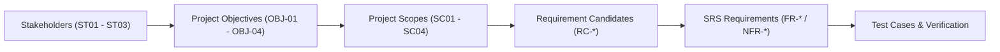

# เมทริกซ์การสืบย้อนความต้องการ (Requirement Traceability Matrix - RTM)

เอกสารตารางการสืบย้อนความต้องการแบบสองทิศทาง (Bidirectional Traceability) เพื่อตรวจสอบความครบถ้วนของระบบตั้งแต่เป้าหมายผู้มีส่วนได้ส่วนเสีย ขอบเขต ข้อกำหนดฟังก์ชัน ไปจนถึงการทดสอบระบบ

---

## 1. ห่วงโซ่การสืบย้อนความต้องการ (Traceability Chain)

ระบบ ScamGuard ใช้กระบวนการวิศวกรรมความต้องการที่เป็นไปตามมาตรฐานสากล โดยเชื่อมโยงข้อกำหนดในแต่ละระดับชั้นเข้าด้วยกัน:

- **Stakeholder (ST):** ผู้มีส่วนได้ส่วนเสียที่กำหนดคุณค่าของระบบ
- **Objective (OBJ):** วัตถุประสงค์เชิงกลยุทธ์ของโครงงาน
- **Scope (SC):** ขอบเขตของระบบที่ตกลงส่งมอบ
- **Requirement Candidate (RC):** ข้อกำหนดเบื้องต้นที่รวบรวมได้จากหลักฐาน
- **Functional / Non-Functional Requirements (FR/NFR):** ข้อกำหนดความต้องการทางซอฟต์แวร์ฉบับสมบูรณ์พร้อม Acceptance Criteria
- **Test Cases (TC):** กรณีทดสอบสำหรับยืนยันความถูกต้องของระบบ

---

## 2. กลุ่มผู้มีส่วนได้ส่วนเสีย (Stakeholders)

| รหัส | ผู้มีส่วนได้ส่วนเสีย | ความต้องการหลัก | วัตถุประสงค์ที่เกี่ยวข้อง |
| :--- | :--- | :--- | :--- |
| **ST01** | ผู้ใช้งานทั่วไป (General Users) | ต้องการเครื่องมือที่ใช้งานง่ายบนมือถือ สามารถตรวจสอบภาพต้องสงสัยได้อย่างรวดเร็วและเข้าใจผลการวิเคราะห์ได้ทันที | [[requirements/objectives-kpis#OBJ-01\|OBJ-01]], [[requirements/objectives-kpis#OBJ-03\|OBJ-03]], [[requirements/objectives-kpis#OBJ-04\|OBJ-04]] |
| **ST02** | ผู้ดูแลระบบและนักวิจัย (Admins / Researchers) | ต้องการระบบควบคุมหลังบ้าน จัดการรายงาน Scam คัดเลือก Dataset และควบคุมการ Deploy โมเดล AI | [[requirements/objectives-kpis#OBJ-02\|OBJ-02]], [[requirements/objectives-kpis#OBJ-03\|OBJ-03]], [[requirements/objectives-kpis#OBJ-04\|OBJ-04]] |
| **ST03** | อาจารย์ที่ปรึกษาและคณะกรรมการ (Advisors & Committee) | ต้องการระบบที่มีความถูกต้องตามหลักวิศวกรรมซอฟต์แวร์ มีกระบวนการทดสอบที่รัดกุม และปฏิบัติตามกฎหมาย PDPA | ทุกวัตถุประสงค์ (OBJ-01 ถึง OBJ-04) |

---

## 3. ตารางเมทริกซ์การสืบย้อนความต้องการ (Requirement Traceability Matrix)

| ลำดับ | ST | OBJ | SC | รหัสความต้องการเบื้องต้น (RC) | รหัสข้อกำหนด (FR / NFR) | ลำดับความสำคัญ | สรุปพฤติกรรมของระบบ |
| :--- | :--- | :--- | :--- | :--- | :--- | :--- | :--- |
| 1 | ST01 | OBJ-04 | SC01 | RC-AUTH-01 | FR-AUTH-01 | Must Have | สมัครสมาชิกผ่าน Mobile App ด้วย Email/Password พร้อมตรวจสอบความปลอดภัย |
| 2 | ST01 | OBJ-04 | SC01 | RC-AUTH-02 | FR-AUTH-02 | Must Have | เข้าสู่ระบบและรับ JWT Access Token / Refresh Token เพื่อรักษาเซสชั่น |
| 3 | ST01 | OBJ-01 | SC01 | RC-SCAN-01 | FR-INPUT-01/03 | Must Have | เลือกรูปภาพจากแกลเลอรีหรือถ่ายภาพ พร้อมเครื่องมือครอบตัดภาพ (Crop) |
| 4 | ST01 | OBJ-01 | SC02 | RC-SCAN-02 | FR-SYS-09 | Must Have | คำนวณ Perceptual Hash และค้นหาผลลัพธ์จาก Redis Cache (< 3 วินาที) |
| 5 | ST01 | OBJ-01 | SC03 | RC-ANALYSIS-01 | FR-SYS-02 | Must Have | สกัดข้อความภาษาไทยและอังกฤษด้วย Surya OCR 2 Engine |
| 6 | ST01 | OBJ-01 | SC03 | RC-ANALYSIS-02 | FR-SYS-03 | Must Have | ตรวจจับคีย์เวิร์ดหลอกลวง (Scam Keywords) และคำนวณ Textual Score |
| 7 | ST01 | OBJ-01 | SC03 | RC-ANALYSIS-03 | FR-SYS-05 | Must Have | ตรวจสอบร่องรอยการตัดต่อระดับพิกเซลด้วย SegFormer AI Model |
| 8 | ST01 | OBJ-01 | SC03 | RC-ANALYSIS-04 | FR-SYS-08 | Must Have | สร้างแผนภาพความร้อน Full-Resolution Heatmap แสดงจุดผิดปกติ |
| 9 | ST01 | OBJ-02 | SC02 | RC-ANALYSIS-05 | FR-SYS-04 | Should Have | ค้นหาประวัติรูปภาพย้อนกลับผ่าน Google Vision Search API |
| 10 | ST01 | OBJ-03 | SC02 | RC-ANALYSIS-07 | FR-SYS-07 | Must Have | คำนวณ Overall Risk Score ด้วยสูตร Hybrid Worst-Case Trigger Approach |
| 11 | ST01 | OBJ-03 | SC01 | RC-REPORT-01 | FR-REPORT-01 | Must Have | แสดงผลรายงานความเสี่ยง (Risk Badge 3 ระดับ, มิติคะแนน, Heatmap Toggle) |
| 12 | ST01 | OBJ-04 | SC01 | RC-HIST-01 | FR-HIST-01 | Must Have | บันทึกประวัติการสแกนและเรียกดูย้อนหลังพร้อมภาพตัวอย่าง (Thumbnails) |
| 13 | ST01 | OBJ-04 | SC01 | RC-REPORT-02 | FR-RPT-01 | Should Have | ผู้ใช้แจ้งยืนยันว่าภาพเป็น Scam เพื่อส่งต่อไปยังคิวตรวจสอบของผู้ดูแลระบบ |
| 14 | ST02 | OBJ-04 | SC04 | RC-ADMIN-01 | FR-ADM-01 | Must Have | แดชบอร์ดสรุปสถิติระบบและ WebSocket Real-time Telemetry บน Admin Portal |
| 15 | ST02 | OBJ-04 | SC04 | RC-ADMIN-02 | FR-ADM-02 | Must Have | ส่วนตรวจสอบรายงานข้อร้องเรียน (Moderation) เพื่อ Approve เข้า Research Dataset |
| 16 | ST02 | OBJ-03 | SC04 | RC-ADMIN-03 | FR-ADM-04 | Must Have | ระบบ Model Registry จัดการเวอร์ชัน SegFormer และสั่ง Deploy/Rollback แบบปลอดภัย |
| 17 | ST02 | OBJ-04 | SC04 | RC-ADMIN-04 | FR-SYS-10 | Must Have | บันทึกกิจกรรมของผู้ดูแลระบบลงตาราง `audit_log` แบบ Append-only |
| 18 | ST03 | OBJ-04 | SC01 | RC-PDPA-01 | FR-PDPA-01/02 | Must Have | ขอความยินยอม (Consent Screen) ก่อนใช้งาน และรองรับการถอนความยินยอม |

---

## 4. ข้อสังเกตความสอดคล้องทางวิศวกรรม (Engineering Consistency Note)

> [!NOTE]
> ในเอกสาร RTM ฉบับร่างเดิม ([Document/docs/06_Requirement_Traceability.md](file:///home/panuwat/project/Document/docs/06_Requirement_Traceability.md)) มีการระบุเกณฑ์ความเสี่ยงเป็น 4 ระดับ (Safe, Low, Medium, High) แต่ในสถาปัตยกรรมและโค้ดปัจจุบันของระบบ ScamGuard ได้ปรับเปลี่ยนเป็น **3 ระดับ** (Low: 0-39, Medium: 40-69, High: 70-100) ตามข้อกำหนดความปลอดภัยเพื่อป้องกัน False Sense of Security ทั้งนี้ ทุกข้อกำหนดในตารางข้างต้นได้รับการปรับให้สอดคล้องกับระบบ 3 ระดับเรียบร้อยแล้ว

---

## 5. ประเด็นสำคัญ

- RTM ช่วยรับประกันว่าทุกฟีเจอร์ใน Mobile App, Backend API, AI Model และ Admin Portal ล้วนตอบสนองต่อเป้าหมายของผู้มีส่วนได้ส่วนเสียโดยตรง
- ไม่พบความต้องการที่หลุดออกนอกขอบเขต (No Scope Creep)
- ทุกข้อกำหนดมีชุดการทดสอบรองรับทั้งในระดับ Unit Test, Integration Test และ System E2E Test

---

## หน้าที่เกี่ยวข้อง

- [[requirements/objectives-kpis|วัตถุประสงค์และ KPI ของโครงการ]]
- [[requirements/functional-requirements|ข้อกำหนดความต้องการเชิงฟังก์ชัน (Functional Requirements)]]
- [[requirements/non-functional-requirements|ข้อกำหนดความต้องการที่ไม่ใช่ฟังก์ชัน (Non-Functional Requirements)]]
- [[requirements/srs|Software Requirements Specification (SRS)]]
- [[planning/project-scope|ขอบเขตโครงการ (Project Scope)]]
